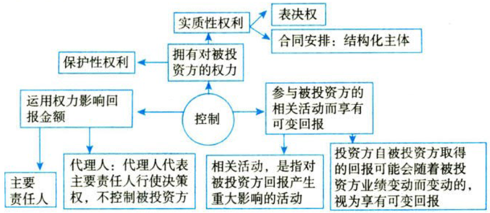
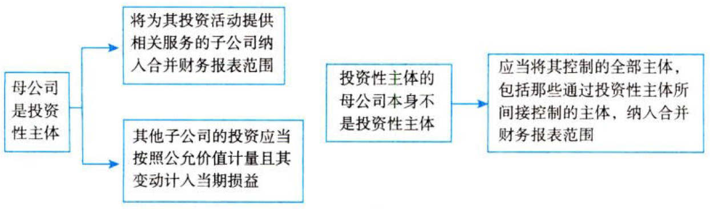
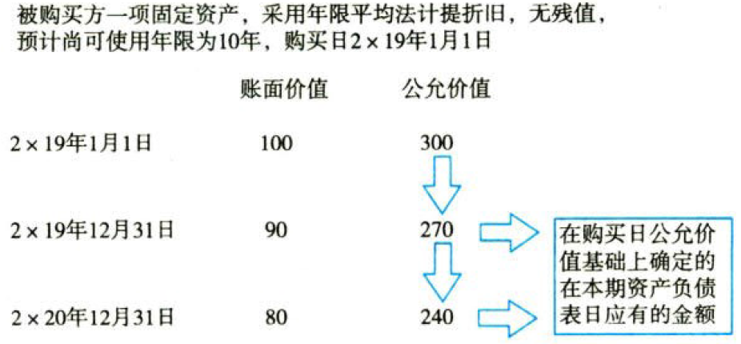

合并财务报表

# 1. 合并财务报表.合并理论

合并财务报表是指反映母公司和其全部子公司形成的`企业集团整体`［财务状况、经营成果、现金流量］的财务报表。

编制合并财务报表的理论，主要有［母公司理论、实体理论、所有权理论］等。

## 1.1. 所有权理论

在采用所有权理论的情况下，对于某拥有所有权的企业的资产、负债和当期实现的净损益，均按照一定的`比例合并`计入合并财务报表，`不涉及`少数股东权益的列报。

## 1.2. 母公司理论

母公司理论所采用的合并处理方法是从`母公司`本身的股东利益来考虑，对于子公司`少数股东`的权益，在合并报表中一般视为`一项负债`。

合并财务报表中确定的`商誉`仅归属于母公司，与少数股东无关。

对公司间未实现内部交易损益，顺销时产生的从合并净利润中`全部抵销`，逆销时产生的依据母公司所占股权`比例抵销`。

## 1.3. 实体理论

实体理论强调的是企业集团中全部成员企业构成的`经济实体`，视同只要是企业集团成员股东，无论拥有多少股权，都是共同组成经济实体的股东。

在实体理论下，少数股东权益通常视为股东权益的一路分，列示于合并资产负债表中的股东权益中。

合并财务报表中确定的`商誉`归属于所有股东。

对公司间未实现内部交易损益，无论是顺销还是逆销，均属于抵销范围。

# 2. 合并范围的确定

## 2.4. 以“控制”为基础，确定合并范围

合并财务报表的合并范围应当以`控制`为基础予以确定。

控制，是指投资方`拥有`对被投资方的`权力`，通过参与被投资方的相关活动而享有`可变回报`，并且有能力运用对被投资方的权力`影响`其回报金额。

控制的理解图示如下：



提示：实质性权利是持有人在对相关活动进行决策时有`实际能力`行使的可执行权利。保护性权利仅为了保护权利持有人利益却没有赋予持有人对相关活动的决策权。

提示：投资方对被投资方的权力通常来自`表决权`，但有时，投资方对一些主体的权力不是来自表决权，而是由一项或多项`合同安排`决定。

提示：可变回报是不固定的并可能随被投资方业绩而变动的回报，可能是正数，也可能是负数，或者有正有负。

## 2.5. 纳入合并范围的特殊情况——对被投资方可分割部分的控制

投资方通常应当对是否`控制`被投资方`整体`进行判断。但在少数情况下，如果有确凿证据表明`同时满足`下列条件并且符合相关法律法规规定的，投资方应当将被投资方的一部分（以下简称“该部分”）视为被投资方可分割部分，进而判断是否控制该部分：{

①该部分的`资产`是偿付该部分负债或该部分其他权益的`唯一来源`，不能用于偿还该部分以外的被投资方的其他负债；【资产专用】

②除与该部分相关的各方外，其他方`不享有`与该部分资产相关的权利，也`不享有`与该部分资产剩余现金流量相关的权利。【利润专享】

}

## 2.6. 合并范围的豁免——投资性主体



提示：投资性主体的定义中包含了三个需要`同时满足`的条件：一是该公司以向投资方提供`投资管理`服务为目的，从一个或多个`投资者`获取资金；【公募私募】二是该公司的唯一经营目的，是通过`资本增值`、`投资收益`或两者兼有而让投资者获得回报；【食利者】三是该公司按照`公允价值`对几乎所有投资的业绩进行计量和评价。【公允价值】

## 2.7. 控制的持续评估

控制的评估是`持续的`，当环境或情况发生变化时，投资方需要评估控制的三项基本要素中的一项或多项是否发生了变化。如果有任何事实或情况表明控制的三项基本要素中的一项或多项发生了变化，投资方应重新评估对被投资方是否具有控制。

# 3. 合并财务报表.编制原则+前期准备事项+程序

## 3.8. 合并财务报表.编制原则

合并财务报表的编制除在遵循财务报表编制的一般原则和要求外，还应遵循以下原则和要求：

①以`个别`财务报表为基础编制

②`一体性`原则

③`重要性`原则

## 3.9. 合并财务报表.构成

合并财务报表至少包括［合并`资产负债表`、合并`利润表`、合并`现金流量表`、合并`所有者权益变动表`（或合并股东权益变动表）、`附注`］。

## 3.10. 合并财务报表.编制的前期准备事项

①统一母子公司的会计`政策`

②统一母子公司的资产负债表日及会计`期间`

③对子公司以外币表示的财务报表进行`折算`

④收集编制合并财务报表的`相关资料`

## 3.11. 合并财务报表.编制程序

①设置合并工作`底稿`。

②将母公司、纳入合并范围的子公司［个别资产负债表、利润表、所有者权益变动表］各项目的数据`过入`合并工作底稿，并在合并工作底稿中对母公司和子公司个别财务报表各项目的数据进行`加总`，计算得出个别资产负债表、个别利润表及个别所有者权益变动表各项目`合计数额`。

③编制`调整`分录和`抵销`分录。

④计算合并财务报表各项目的`合并数额`。

⑤`填列`合并财务报表。

## 3.12. 合并财务报表.需要调整抵销的项目

参见后续内容。

## 3.13. 合并财务报表.格式（略）

# 4. 长期股权投资与所有者权益.合并处理（同控下企业合并）

## 4.14. 同一控制下取得子公司.合并日.合并财务报表的编制

参见第二十六章企业合并章节内容。

## 4.15. 直接投资及同一控制下取得子公司.合并日后.合并财务报表的编制

### 4.15.1. 长期股权投资.成本法核算的结果.调整为.权益法核算的结果

#### 4.15.1.1. 投资当年

:moneybag:【会计分录】调整分录.投资当年.调整子公司盈利【亏损则反转】

```
借：长期股权投资
  贷：投资收益
```

:moneybag:【会计分录】调整分录.投资当年.调整子公司宣告发放现金股利

```
借：投资收益
  贷：长期股权投资
```

:moneybag:【会计分录】调整分录.投资当年.调整子公司其他综合收益变动【减少则反转】

```
借：长期股权投资
  贷：其他综合收益——本年
```

:moneybag:【会计分录】调整分录.投资当年.调整子公司除［净损益、利润分配、其他综合收益］外的其他权益变动【减少则反转】

```
借：长期股权投资
  贷：资本公积——本年
```

#### 4.15.1.2. 连续编制合并财务报表

应说明的是，本期合并财务报表中年初“所有者权益”各项目的金额应与上期合并财务报表中的期末“所有者权益”对应项目的金额一致，因此，上期编制合并财务报表时涉及股本（实收资本）、资本公积、其他综合收益、盈余公积等项目的，在本期编制合并财务报表调整和抵销分录时均应用“股本（实收资本）——`年初`”“资本公积——`年初`”“其他综合收益——`年初`”和“盈余公积——`年初`”项目代替；对于上期编制调整和抵销分录时涉及利润表中的项目及所有者权益变动表“未分配利润”项目，在本期编制合并财务报表调整分录和抵销分录时均用“`年初未分配利润`”项目代替。

:moneybag:【会计分录】调整分录.调整`以前年度`子公司盈利【亏损则反转】

```
借：长期股权投资
  贷：年初未分配利润
```

:moneybag:【会计分录】调整分录.调整子公司`本年`盈利【亏损则反转】

```
借：长期股权投资
  贷：投资收益
```

:moneybag:【会计分录】调整分录.调整子公司`以前年度`分派现金股利

```
借：年初未分配利润
  贷：长期股权投资
```

:moneybag:【会计分录】调整分录.调整子公司`本年`宣告分派现金股利

```
借：投资收益
  贷：长期股权投资
```

:moneybag:【会计分录】调整分录.调整子公司`以前年度`其他综合收益变动【减少则反转】

```
借：长期股权投资
  贷：其他综合收益——年初
```

:moneybag:【会计分录】调整分录.调整子公司`本年`其他综合收益变动【减少则反转】

```
借：长期股权投资
  贷：其他综合收益——本年
```

:moneybag:【会计分录】调整分录.调整子公司`以前年度`除净损益、其他综合收益、利润分配外的所有者权益变动【减少则反转】

```
借：长期股权投资
  贷：资本公积——年初
```

:moneybag:【会计分录】调整分录.调整子公司`本年`除净损益、其他综合收益、利润分配外的所有者权益变动【减少则反转】

```
借：长期股权投资
  贷：资本公积——本年
```

### 4.15.2. 合并抵销处理

在合并工作底稿中，对长期股权投资的金额进行`调整`后，长期股权投资的金额正好反映母公司拥有子公司所有者权益的份额。或者也可以不进行权益法调整，直接`抵销`，本章所有举例都是按照`先调整后抵销`的原则处理的。编制合并财务报表，在此基础上还必须按照编制合并财务报表的要求进行合并抵销处理，将母公司与子公司之间的`内部交易`对合并财务报表的影响予以抵销。

:moneybag:【会计分录】母公司长期股权投资与子公司`所有者权益`的抵销

```
借：股本（实收资本）
    资本公积
    其他综合收益
    盈余公积
    年末未分配利润
  贷：长期股权投资 // 母公司
      少数股东权益 // 子公司所有者权益×少数股东持股比例
```

提示：在合并财务报表中，子公司少数股东分担的当期亏损超过少数股东在该子公司期初所有者权益中所享有的份额的（即发生超额亏损），其余额仍应当冲减少数股东权益，即少数股东权益可以出现`负数`。

:moneybag:【会计分录】母公司对子公司、子公司相互之间持有对方长期股权投资的`投资收益`的抵销

```
借：投资收益
    年初未分配利润
    少数股东损益
  贷：提取盈余公积
      对股东的分配
      年末未分配利润
```

同时，被合并方在企业合并前实现的留存收益中归属于合并方的部分，应自资本公积`转入`留存收益。

:moneybag:【会计分录】转入留存收益

```
借：资本公积
  贷：利润分配
      未分配利润
```

子公司发行`累积优先股`等其他权益工具的，无论当期是否宣告发放其股利，在计算列报母公司合并利润表中的“`归属于母公司股东的净利润`”时，均应`扣除`当期归属于除母公司之外的其他权益工具持有者的可累权分配股利，扣除金额应在`“少数股东损益”`项目列示；子公司发行不可累积优先股等其他权益工具的，在计算列报母公司合并利润表中的“归属于母公司股东的净利润”时，应`扣除`当期宣告发放的归属于除母公司之外的其他权益工具持有者的不可累积分配股利，扣除金额应在`“少数股东损益”`项目列示。

# 5. 长期股权投资与所有者权益.合并处理（非同控下企业合并）

## 5.16. 非同一控制下取得子公司.购买日.合并财务报表的编制

### 5.16.3. 按公允价值对非同一控制下取得子公司的财务报表进行调整

:moneybag:【会计分录】调整分录（以固定资产为例，假定固定资产公允价值大于账面价值）

```
借：固定资产——原价 // 调增固定资产价值
  贷：资本公积
借：资本公积
  贷：递延所得税负债
```

提示：购买日将子公司的资产、负债由账面价值调整到公允价值时，对应项目不是负债，而应是所有者权益，所有者权益中的股本是发行股票的股数和每股面值计算的金额，实收资本是在注册资本中享有的份额，所以不能调整股本（或实收资本），其他综合收益是一种利得或损失，盈余公积和未分配利润是经营过程中实现的未分配的利润，调整这些项目也不合适。因此，购买日将子公司的资产、负债由账面价值调整到公允价值时，对应项目是资本公积。【杂碎都给资本公积】

### 5.16.4. 母公司长期股权投资与子公司所有者权益抵销处理

:moneybag:【会计分录】调整分录

```
借：股本（实收资本）
    资本公积
    其他综合收益
    盈余公积
    未分配利润
    商誉 // 借方差额
  贷：长期股权投资
      少数股东损益
      盈余公积
      未分配利润 // 贷方差额，购买日母公司不编制合并利润表，故不能使用利润表中的“营业外收入”项目，用留存收益项目代替“营业外收入”项目
```

### 5.16.5. 编制合并工作底稿并编制合并财务报表（略）

## 5.17. 非同一控制下取得子公司.购买日后.合并财务报表的编制

### 5.17.6. 对子公司个别财务报表进行调整

对于非同一控制下企业合并中取得的子公司，应当根据母公司在购买日设置的备查簿中登记的该子公司有关可辨认资产、负债的公允价值，对子公司的个别财务报表进行调整，使子公司的个别财务报表反映为在购买日公允价值基础上确定的可辨认资产、负债等在本期资产负债表日应有的金额。



调整分录（以管理用固定资产为例，假定固定资产公允价值大于账面价值）如下：

#### 5.17.6.3. 投资当年

:moneybag:【会计分录】调整分录（以管理用固定资产为例，假定固定资产公允价值大于账面价值）

```
借：固定资产——原价 // 调增固定资产价值
  贷：资本公积
借：资本公积
  贷：递延所得税负债
借：管理费用 // 按当年公允价值补提折旧
  贷：固定资产——累计折旧
借：递延所得税负债
  贷：所得税费用
```

提示：因按公允价值补提折旧会减少应纳税暂时性差异，所以递延所得税负债应转回，由于补提折旧计入管理费用，影响利润总额，因此，递延所得税负债转回时对应所得税费用，而不是资本公积。

#### 5.17.6.4. 连续编制合并财务报表

:moneybag:【会计分录】调整分录（以固定资产为例，假定固定资产公允价值大于账面价值）

```
借：固定资产——原价 // 调增固定资产价值
  贷：资本公积——年初
借：资本公积——年初
  贷：递延所得税负债
借：年初未分配利润 // 年初累计补提折旧
  贷：固定资产——累计折旧
借：递延所得税负债
  贷：年初未分配利润
借：管理费用 // 当年按公允价值补提折旧
  贷：固定资产——累计折旧
借：递延所得税负债
  贷：所得税费用
```

### 5.17.7. 长期股权投资.成本法核算的结果.调整为.权益法核算的结果

长期股权投资由成本法核算的结果调整为权益法核算的结果的会计处理与`同一控制`下企业合并处理原理相同。

### 5.17.8. 合并抵销处理

:moneybag:【会计分录】母公司长期股权投资与子公司`所有者权益`的抵销

```
借：股本（实收资本）
    资本公积
    其他综合收益
    盈余公积
    年末未分配利润
    商誉 // 借方差额
  贷：长期股权投资 // 母公司
      少数股东权益 // 子公司所有者权益×少数股东权益持股比例
      营业外收入 // 投资当年年末抵销分录贷方差额，母公司
      盈余公积
      年初未分配利润 // 非投资当年抵销分录贷方差额，母公司
```

提示：购买日若存在`负商誉`，应当用“盈余公积”和“未分配利润”项目代替。

:moneybag:【会计分录】母公司对子公司、子公司相互之间持有对方长期股权投资的`投资收益`的抵销

```
借：投资收益
    少数股东损益
    年初未分配利润
  贷：提取盈余公积
      对股东的分配
      年末未分配利润
```

# 6. 内部商品交易.合并处理

## 6.18. 不考虑存货跌价准备情况下.内部商品销售业务的抵销

:moneybag:【会计分录】不考虑存货跌价准备情况下内部商品销售业务的抵销

```
借：年初未分配利润 // 年初存货中包含的未实现内部销售利润
    营业收入 // 本期内部销售商品的收入
  贷：存货 // 期末存货中包含的未实现内部销售利润
      营业成本 // 倒挤的差额
```

上述抵销分录的原理：本期发生的未实现内部销售收入－本期内部交易存货中包含的未实现内部销售利润＝本期发生的未实现内部销售成本。

针对考试，将上述抵销分录`分拆`如下：

:moneybag:【会计分录】①将年初存货中包含的未实现内部销售`利润`抵销

```
借：年初未分配利润 // 年初存货中包含的未实现内部销售利润
  贷：营业成本
```

:moneybag:【会计分录】②将本期内部商品销售`收入`抵销

```
借：营业收入 // 本期内部销售商品收入
  贷：营业成本
```

:moneybag:【会计分录】③将期末存货中包含的未实现内部销售`利润`抵销

```
借：营业成本
  贷：存货 // 期末存货中包含的未实现内部销售利润
```

提示：存货中包含的未实现内部销售利润可以应用毛利率计算确定。

毛利率＝（销售收入－销售成本）÷销售收入

存货中未实现内部销售利润＝未实现销售收入－未实现销售成本＝购货方内部交易存货结存价值×销售方毛利率

## 6.19. 存货跌价准备的抵销

:moneybag:【会计分录】①抵销存货跌价准备`期初`数

```
借：存货——存货跌价准备
  贷：年初未分配利润
```

:moneybag:【会计分录】②抵销因本期销售存货`结转`的存货跌价准备

```
借：营业成本
  贷：存货——存货跌价准备
```

:moneybag:【会计分录】③抵销存货跌价准备期末数与上述余额的差额，但存货跌价准备的抵销以存货中未实现内部销售利润为限。

```
借：存货——存货跌价准备 // 抵销个别财务报表中计提减值的处理
  贷：资产减值损失
```

个别财务报表若为减值转回，则作相反会计分录。

### 6.19.9. 关注：少数股东是否承担未实现内部交易损益？

合并财务报表准则第三十六条：母公司向子公司出售资产所发生的未实现内部交易损益，应当全额抵销“归属于母公司所有者的净利润”。子公司向母公司出售资产所发生的未实现内部交易损益，应当按照母公司对该子公司的分配比例在“归属于母公司所有者的净利润”和“少数股东损益”之间分配抵销。子公司之间出售资产所发生的未实现内部交易损益，应当按照母公司对出售方子公司的分配比例在“归属于母公司所有者的净利润”和“少数股东损益”之间分配抵销。

提示：`逆流`交易存货，在计算少数股东权益时`应当`考虑未实现内部交易损益。

提示：`顺流`交易存货，在计算少数股东损益时`不需`考虑未实现内部交易损益。

### 6.19.10. 关注：合并报表中长期股权投资由成本法改为权益法时.是否考虑内部交易？

按照合并财务报表准则讲解做法，合并报表中成本法调整为权益法计算投资收益时，只考虑被购买方购买日资产、负债公允价值和账面价值不一致的差额对当期损益的影响，不考虑内部交易的影响。若内部逆流交易影响少数股东损益和少数股东权益，则单独编制调整分录处理。

若内部逆流交易抵销减少子公司的净利润，相应减少少数股东损益，损益要转入权益，进而减少少数股东权益（少数股东权益属于所有者权益类科目，减少在借方），应编制如下调整分录：

:moneybag:【会计分录】调整分录

```
借：少数股东权益
  贷：少数股东损益
```

若内部逆流交易的抵销增加子公司的净利润，相应增加少数股东损益，损益要转入权益，进而增加少数股东权益（少数股东权益属于所有者权益类科目，增加在贷方），应编制如下调整分录：

:moneybag:【会计分录】调整分录

```
借：少数股东损益
  贷：少数股东权益
```

应说明的是，合并报表中成本法调整为权益法计算投资收益时，可以同时考虑被购买方购买日资产、负债公允价值和账面价值不一致的差额对当期损益的影响及内部交易（逆流交易）的影响，按此处理，内部交易影响少数股东损益和少数股东权益无须单独编制调整分录，两种方法处理结果相同。建议考试时采用准则讲解的做法。

提示：成本法改为权益法时已考虑内部交易影响少数股东权益和少数股东损益，内部交易抵销时不能再调整少数股东权益和少数股东损益。

# 7. 内部债权债务.合并处理

## 7.20. 内部债权债务项目本身的抵销

:moneybag:【会计分录】抵销分录

```
借：债务类项目
  贷：债权类项目
```

## 7.21. 内部投资收益（利息收入）和利息费用的抵销

企业集团内部母公司与子公司、子公司相互之间可能发生持有对方债券等内部交易。编制合并财务报表时，应当在抵销内部发行的应付债券和债权投资等内部债权债务的同时，将内部应付债券和债权投资相关的利息费用与投资收益（利息收入）相互抵销。

:moneybag:【会计分录】抵销分录

```
借：投资收益
  贷：财务费用/在建工程等
```

## 7.22. 内部应收款项计提坏账准备的抵销

在应收账款采用备抵法核算其坏账损失的情况下，某一会计期间坏账准备的数额是以当期应收账款为基础计提的。在编制合并财务报表时，随着内部应收账款的抵销，与此对应的也需将内部应收账款计提的坏账准备抵销。

:moneybag:【会计分录】①抵销坏账准备的期初数

```
借：应收账款——坏账准备
  贷：年初未分配利润
```

:moneybag:【会计分录】②将本期计提（或冲回）的坏账准备数额抵销，抵销分录与计提（或冲回）分录借贷方向相反。【或反转】

```
借：应收账款——坏账准备
  贷：信用减值损失
```

具体做法：先抵销期处数，然后抵销期初数与期末数的差额。即“先抵期初、再抵差额”。

提示：资产负债表中的项目可采用“先抵期初、再抵差额”或“先调期初、再调差额”的方法进行合并处理。

即使个别资产负债表期末无内部应收账款，本期合并工作底稿中也可能存在与内部应收债权及债务相关的抵销分录。

案例解析：购买法的理念是被购买方的资产、负债都是在购买日这一天购入的，既然是新购入的资产，应收款项的初始计量中自然也不应该出现备抵科目，其思路类似于购买一项应收款项。根据金融资产准则，购买一项应收账款应按公允价值进行初始计量，初始计量时不会确认坏账准备。

国际准则中明确指出，对于企业合并中取得的、初始确认按照公允价值计量的资产，购买方不应在购买日确认单独的估价备抵，因为其未来现金流的不确定性已经反映在公允价值中。

因此，在购买日将被购买方的资产、负债纳入购买方的合并财务报表时，被购买方“应收账款——坏账准备”这个备抵项目不应该出现。

后续计量中，当有证据表明被购买方的应收款项能够全额收回，在被购买方自身个别财务报表中需转回坏账准备；但在购买方的合并财务报表中，由于并不存在坏账准备余额，不应体现坏账准备的转回。当最终被购买方全额收回该应收款项时，在购买方的合并财务报表中，其收回金额与应收款项余额的差额直接计入收回当期的损益。

# 8. 内部固定资产交易.合并处理

## 8.23. 未发生变卖或报废的内部交易固定资产的抵销（以高于账面价值的金额出售）

### 8.23.11. 将期初固定资产原价中包含的未实现内部销售利润抵销

:moneybag:【会计分录】抵销分录

```
借：年初未分配利润
  贷：固定资产——原价 // 期初固定资产原价中包含的未实现内部销售利润
```

### 8.23.12. 将期初累计多提折旧抵销

:moneybag:【会计分录】抵销分录

```
借：固定资产——累计折旧 // 期初累计多提折旧
  贷：年初未分配利润
```

### 8.23.13. 将本期购入的固定资产原价中包含的未实现内部销售利润抵销

:moneybag:【会计分录】①一方销售的商品，另一方购入后作为管理用固定资产核算

```
借：营业收入 // 本期内部固定资产交易产生的销售收入
  贷：营业成本 // 本期内部固定资产交易产生的销售成本
      固定资产——原价 // 本期购入的固定资产原价中包含的未实现内部销售利润
```

:moneybag:【会计分录】②一方的固定资产，另一方购入后仍作为管理用固定资产核算

```
借：资产处置收益
  贷：固定资产——原价 // 本期购入的固定资产原价中包含的未实现内部销售利润
```

提示：二者的区别在于出售方持有资产对应处置损益计入利润表的项目不同。

### 8.23.14. 将本期多提折旧抵销

:moneybag:【会计分录】③将本期多提折旧抵销

```
借：固定资产——累计折旧
  贷：管理费用
```

## 8.24. 因己丧失使用功能或因自然灾害发生毁损等原因而报废清理的内部固定资产交易的抵销

将上述抵销分录中的“固定资产——原价”项目和“固定资产——累计折旧”项目用“营业外收入”项目或“营业外支出”项目代替。

### 8.24.15. 将期初固定资产原价中包含的未实现内部销售利润抵销

:moneybag:【会计分录】抵销分录

```
借：年初未分配利润
  贷：营业外收入等 // 期初固定资产原价中包含的未实现内部销售利润
```

### 8.24.16. 将期初累计多提折旧抵销

:moneybag:【会计分录】抵销分录

```
借：营业外收入等 // 期初累计多提折旧
  贷：年初未分配利润
```

### 8.24.17. 将本期多提折旧抵销

:moneybag:【会计分录】抵销分录

```
借：营业外收入等 // 期初累计多提折旧
  贷：管理费用
```

提示：因出售、转让等原因产生的内部固定资产交易的抵销反映在“资产处置收益”项目，将上述分录中的“营业外收入”替换成“资产处置收益”。

# 9. 内部无形资产交易.合并处理

## 9.25. 未发生变卖的内部无形资产交易的抵销

### 9.25.18. 将期初管理用无形资产原价中包含的未实现内部销售利润抵销

:moneybag:【会计分录】抵销分录

```
借：年初未分配利润
  贷：无形资产——原价 // 期初无形资产中包含的未实现内部销售利润
```

### 9.25.19. 将期初累计多提摊销抵销

:moneybag:【会计分录】抵销分录

```
借：无形资产——累计摊销 // 期初累计多提摊销
  贷：年初未分配利润
```

### 9.25.20. 将本期购入的无形资产原价中包含的未实现内部销售利润抵销

:moneybag:【会计分录】抵销分录

```
借：资产处置收益
  贷：无形资产——原价 // 本期购入的无形资产原价中包含的未实现内部销售利润
```

### 9.25.21. 将本期多提摊销抵销

:moneybag:【会计分录】抵销分录

```
借：无形资产——累计摊销 // 本期多提摊销
  贷：管理费用
```

## 9.26. 发生变卖情况下的内部无形资产交易的抵销

将上述抵销分录中的“无形资产——原价”项目和“无形资产——累计摊销”项目用“资产处置收益”项目代替。

### 9.26.22. 将期初管理用无形资产原价中包含的未实现内部销售利润抵销

:moneybag:【会计分录】抵销分录

```
借：年初未分配利润
  贷：资产处置收益 // 期初无形资产中包含的未实现内部销售利润
```

### 9.26.23. 将期初累计多提摊销抵销

:moneybag:【会计分录】抵销分录

```
借：资产处置收益 // 期初累计多提摊销
  贷：年初未分配利润
```

### 9.26.24. 将本期多提摊销抵销

:moneybag:【会计分录】抵销分录

```
借：资产处置收益 // 本期多提摊销
  贷：管理费用
```

# 10. 特殊交易.合并处理

## 10.27. 追加投资.会计处理

### 10.27.25. 母公司购买子公司少数股东股权

母公司购买子公司少数股东拥有的子公司股权的，在母公司个别财务报表中，其自子公司少数股东处新取得的长期股权投资应当按照《企业会计准则第2号——长期股权投资》的规定确定其投资成本；在合并财务报表中，子公司的资产、负债应以购买日或合并日所确定的净资产价值开始持续计算的金额反映，因购买少数股权新取得的长期股权投资与按照新增持股比例计算应享有子公司自购买日或合并日开始持续计算的净资产份额之间的差额，应当调整母公司个别财务报表中的资本公积（资本溢价或股本溢价），资本公积不足冲减的，调整留存收益。

提示：购买子公司少数股东股权在合并财务报表中属于权益性交易。因控制权未发生改变，商誉金额只反映原投资部分，新增持股比例部分在合并财务报表中不确认商誉。

### 10.27.26. 企业因追加投资等原因能够对非同一控制下的被投资方实施控制

企业因追加投资等原因，通过多次交易分步实现非同一控制下企业合并的，在合并财务报表上，首先，应结合分步交易的各个步骤的协议条款，以及各个步骤中所分别取得的股权比例、取得对象、取得方式、取得时点及取得对价等信息来判断分步交易是否属于“一揽子交易”。

各项交易的条款、条件以及经济影响符合以下一种或多种情况的，通常应将多次交易事项作为“一揽子交易”进行会计处理：{

①这些交易是同时或者在考虑了彼此影响的情况下订立的；

②这些交易整体才能达成一项完整的商业结果；

③一项交易的发生取决于至少一项其他交易的发生；

④一项交易单独看是不经济的，但是和其他交易一并考虑时是经济的。

}

如果分步取得对子公司股权投资直至取得控制权的各项交易属于“一揽子交易”，应当将各项交易作为一项取得子公司控制权的交易进行会计处理。

如果不属于“一揽子交易”，个别财务报表和合并财务报表会计处理如下：

#### 10.27.26.5. 个别财务报表

①购买日初始投资成本＝购买日之前所持被购买方的股权投资于购买日的账面价值（如原投资按公允价值计量，即为购买日公允价值）＋购买日新增投资成本。

②购买日之前持有的股权投资因采用权益法核算而确认的其他综合收益，应当在处置该项投资时采用与被投资单位直接处置相关资产或负债相同的基础进行会计处理；确认的除净损益、其他综合收益和利润分配外的其他所有者权益变动，应当在处置该项投资时，转入处置当期投资收益。

③购买日之前持有的股权投资按照《企业会计准则第22号——金融工具确认和计量》的有关规定进行会计处理的，购买日公允价值与其账面价值的差额应当在改按成本法核算时转入投资收益（留存收益），计入其他综合收益的累计公允价值变动应当在改按成本法核算时转入留存收益。

#### 10.27.26.6. 合并财务报表

①购买方对于购买日之前持有的被购买方的股权，按照该股权在购买日的公允价值进行重新计量，公允价值与账面价值的差额计入当期投资收益。

②合并成本＝购买日之前持有的被购买方的股权于购买日的公允价值＋购买日新购入股权所支付对价的公允价值

③比较购买日合并成本与享有的被购买方可辨认净资产公允价值的份额，确定购买日应予确认的商誉，或者应计入营业外收入（用留存收益代替）的金额。

④购买日之前持有的被购买方的股权涉及权益法核算下的其他综合收益，应当在购买日采用与被投资单位直接处置相关资产或负债相同的基础进行会计处理（即转入投资收益或留存收益）；对于购买日之前持有的被购买方的股权涉及权益法核算下除净损益、其他综合收益和利润分配以外的其他所有者权益变动，应当转为购买日所属当期损益（投资收益）。

### 10.27.27. 通过多次交易分步实现同一控制下企业合并

对于分步实现的同一控制下企业合并，在编制合并财务报表时，应视同参与合并的各方在最终控制方开始控制时即以目前的状态存在进行调整，在编制比较报表时，以不早于合并方和被合并方同处于最终控制方的控制之下的时点开始，将被合并方的有关资产、负债并入合并方合并财务报表的比较报表中，并将合并而增加的净资产在比较报表中调整所有者权益下的相关项目。

为避免对被合并方净资产的价值进行重复计算，合并方在取得被合并方控制权之前持有的股权投资，在取得原股权之日与合并方和被合并方同处于同一方最终控制之日孰晚日起至合并日之间已确认有关损益、其他综合收益以及其他净资产变动，应分别冲减比较报表期间的期初留存收益或当期损益等项目。

### 10.27.28. 本期增加子公司时如何编制合并财务报表

#### 10.27.28.7. 同一控制（权益结合法）

①资产负债表：调整年初数

②利润表：从年初算起

③现金流量表：从年初算起

#### 10.27.28.8. 非同一控制（购买法）

①资产负债表：不调整年初数

②利润表：从购买日算起

③现金流量表：从购买日算起

## 10.28. 处置对子公司投资.会计处理

### 10.28.29. 在不丧失控制权的情况下.部分处置对子公司长期股权投资

母公司不丧失控制权的情况下部分处置对子公司的长期股权投资的，在母公司个别财务报表中作为长期股权投资的处置，确认有关处置损益。即出售股权取得的价款或对价的公允价值与所处置投资账面价值的差额，应作为投资收益或损失计入处置投资当期母公司的个别财务报表；在合并财务报表中，因出售部分股权后，母公司仍能够对被投资单位实施控制，被投资单位应当纳入母公司合并财务报表。因此，在合并财务报表中，处置价款与处置长期股权投资相对应享有子公司自购买日或合并日开始持续计算的净资产份额之间的差额，应当调整资本公积（资本溢价或股本溢价），资本公积不足冲减的，调整留存收益。

提示：该交易在合并财务报表角度属于权益性交易，合并财务报表中不确认投资收益。

提示：合并财务报表中的商誉不因持股比例改变而改变。

提示：合并财务报表中确认资本公积的金额＝出售净价－出售日应享有子公司按购买日公允价值持续计算的金额（或按合并日净资产价值持续计算的金额）对应处置比例份额。

### 10.28.30. 母公司因处置对子公司长期股权投资而丧失控制权

#### 10.28.30.9. 一次交易处置子公司

母公司因处置部分股极投资或其他原因丧失了对原有子公司控制的，在合并财务报表中，应当进行如下会计处理：

①终止确认长期股权投资、商誉等的账面价值，并终止确认少数股东权益（包括属于少数股东的其他综合收益）的账面价值。

②按照丧失控制权日的公允价值进行重新计量剩余股权，按剩余股权对被投资方的影响程度，将剩余股权作为长期股权投资或按照公允价值计量的金融资产进行核算。

③处置股权取得的对价与剩余股权的公允价值之和，减去按原持股比例计算应享有原有子公司自购买日开始持续计算的净资产账面价值份额与商誉之和，形成的差额计入丧失控制权当期的投资收益。

④与原有子公司的股权投资相夫的其他综合收益应当采用与被投资单位直接处置相关资产或负债相同的基础处理并全部结转（转入留存收益或投资收益）；与原有子公司的股权投资相关的其他所有者权益变动，应当在丧失控制权时转入当期损益（投资收益）。

#### 10.28.30.10. 多次交易分步处置子公司

企业通过多次交易分步处置对子公司股权投资直至丧失控制权，在合并财务报表中，首先应判断分步交易是否属于“一揽子交易”。

如果分步交易不属于“一揽子交易”，则在丧失对子公司控制权以前的各项交易，应按照本知识点下“（一）在不丧失控制权的情况下部分处置对子公司长期股权投资”的规定进行会计处理。

如果分步交易属于“一揽子交易”，则应将各项交易作为一项处置原有子公司并丧失控制权的交易进行会计处理，其中，对于丧失控制权之前的每一次交易，处置价款与处置投资对应的享有该子公司自购买日开始持续计算的净资产账面价值的份额之间的差额，在合并财务报表中应当计入其他综合收益，在丧失控制权时一并转入丧失控制权当期的损益。

### 10.28.31. 本期减少子公司时.如何编制合并财务报表

在本期处置子公司部分股份或全部股份，丧失对该子公司的控制权的情况下，不再将该子公司纳入合并范围。

在编制合并资产负债表时，不再对该出售转让股份而成为非子公司的资产负债表进行合并。

编制合并利润表时，则应当以该子公司期初至丧失控制权之日止的利润表为基础，将该子公司自期初至丧失控制权之日止的相关项目纳入合并利润表。

编制合并现金流量表时，应将该子公司自期初至丧失控制权之日止的现金流量信息纳入合并现金流量表，并将出售该子公司所收到的现金扣除子公司持有的现金和现金等价物以及相关处置费用后的净额，在有关投资活动类的“处置子公司及其他营业单位所收到的现金”项目反映。

## 10.29. 因子公司少数股东增资导致母公司股权稀释

如果由于子公司的少数股东对子公司进行增资，导致母公司股权稀释，母公司应当按照增资前的股权比例计算其在增资前子公司账面净资产中的份额，该份额与增资后按母公司持股比例计算的在增资后子公司账面净资产份额之间的差额计入资本公职，资本公积不足冲减的，调整留存收益。

提示：该交易在合并财务报表角度属于权益性交易，合并财务报表中不确认投资收益。

提示：合并财务报表中的商誉不因持股比例改变而改变。

## 10.30. 交叉持股的合并处理

交叉持股，是指母公司持有子公司一定比例股份，能够对其实施控制，同时子公司也持有每公司股份，即相互持有对方的股份。

母子公司有交叉持股情形的，在编制合并财务报表时，对于母公司持有的子公司股权，作长期股权投资与子公司权益的合并抵销处理。对于子公司待有的母公司股权，应当将其作为合并财务报表中的库存股，作为所有者权益的减项列示，对于子公司持有母公司股权期间所确认的投资收益（如利润分配或现金股利），应当进行抵销处理。子公司将所持有的母公司股权按照公允价值计量的，应同时冲销子公司累计确认的公允价值变动。

子公司相互之间持有对方股权投资的，应当比照母公司对子公司的股权投资的处理方法，将长期股权投资与其对应的子公司所有者权益中所享有的份额相互抵销。

## 10.31. 逆流交易的合并处理

如果母子公司之间发生逆流交易，即子公司向母公司出售资产，则所发生的未实现内部交易损益，应当按照母公司对该子公司的分配比例在“归属于母公司所有者的净利润”和“少数股东损益”之间分配抵销。

## 10.32. 其他特殊交易

对于企业集团合并财务报表角度确认和计量结果与其所属的母公司或子公司的个别财务报表层面确认和计量结果存在差异的，在编制合并财务报表时，应站在企业集团角度对该交易事项予以调整。例如，母公司将借款作为实收资本投入子公司用于建造长期资产的，母公司应在合并财务报表层面反映借款利息的资本化金额。再如，子公司作为投资性房地产的办公楼，出租给母公司使用，母公司应在合并财务报表层面作为固定资产反映。

# 11. 所得税.合并处理

## 11.33. 所得税会计概述（略）

## 11.34. 内部应收款项相关所得税会计的合并处理（先抵期初、再抵差额）

首先抵销期初坏账准备对递延所得税的影响

:moneybag:【会计分录】抵销分录

```
借：年初未分配利润 // 期初坏账准备余额×所得税税率
  贷：递延所得税资产
```

然后确认个别财务报表中通延所得税资产期初、期末余额的差额（递延所得税资产期末余额＝期末坏账准备余额×所得税税率）

:moneybag:【会计分录】抵销分录【或反转】

```
借：所得税费用
  贷：递延所得税资产
```

## 11.35. 内部交易存货相关所得税会计的合并处理

### 11.35.32. 若内部存货未计提存货跌价准备

递延所得税资产的期末余额＝期末存货中未实现内部销售利润（可抵扣暂时性差异）×所得税税率

### 11.35.33. 若内部存货巳计提存货跌价准备

#### 11.35.33.11. 确认本期合并财务报表中递延所得税资产期末余额（即列报金额）

递延所得税资产的期末余额＝期末合并财务报表中存货可抵扣暂时性差异余额×所得税税率

合并财务报表中存货账面价值为站在合并财务报表角度期末结存存货的价值，即集团内部销售方（不是购货方）存货成本与可变现净值轨低的结果。

合并财务报表中存货计税基础为集团内部交易购货方期末结存存货的成本。

#### 11.35.33.12. 调整合并财务报表中本期递延所得税资产（先调期初、再调差额）

本期期末递延所得税资产的调整金额＝合并财务报表中递延所得税资产的期末余额－购货方个别财务报表中已确认的递延所得税资产期末余额

:moneybag:【会计分录】调整期初数

```
借：递延所得税资产
  贷：年初未分配利润
```

合并财务报表中期初递延所得税资产调整金额即为上期期末合并财务报表中递延所得税资产的调整金额。

:moneybag:【会计分录】调整期初期末差额【或反转】

```
借：递延所得税资产
  贷：所得税费用
```

提示：即使本期期末递延所得税资产的调整金额为零，为了保证合并报表中年初未分配利润合并数与上期期末未分配利润合并数相等，也要按照上述步骤调整。

## 11.36. 内部交易固定资产等相关所得税会计的合并抵销处理

### 11.36.34. 确认本期合并财务报表中递延所得税资产期末余额（即列报金额）

递延所得税资产的期末余额＝期末合并财务报表中因内部交易固定资产形成的可抵扣暂时性差异余额×所得税税率

合并财务报表中固定资产账面价值为集团内部销售方（不是购货方）期末固定资产的账面价值。

合并财务报表中固定资产的计税基础为集团内部购货方期末按税法规定确定的账面价值。

如果考试涉及此项内容，应该假定会计上固定资产折旧方法、年限和残值与税法一致且不考虑减值，在这种情况下，可抵扣暂时性差异余额即为期末固定资产中未实现利润，即交易时存在的未实现利润减去已通过折旧实现的部分。

### 11.36.35. 调整合并财务报表中本期递延所得税资产

本期期末递延所得税资产的调整金额＝合并财务报表中递延所得税资产的期末余额－购货方个别财务报表中已确认的递延所得税资产期末余额

:moneybag:【会计分录】①调整期初数

```
借：递延所得税资产
  贷：年初未分配利润
```

提示：合并财务报表中期初递延所得税资产调整金额即为上期期末合并财务报表中递延所得税资产的调整金额。

:moneybag:【会计分录】②调整期初、期末差额【或反转】

```
借：递延所得税资产
  贷：所得税费用
```

# 12. 合并现金流量表

## 12.37. 合并现金流量表.概述

合并现金流量表是综合反映母公司及其子公司组成的企业集团在一定会计期间现金流入、现金流出数量以及其增减变动情况的财务报表。合并现金流量表以母子公司的现金流量表为基础，在抵销集团内部公司之间发生内部交易对合并现金流量表的影响后，由母公司编制。合并现金流量表也可以根据合并资产负债表和合并利润表进行编制。现金流量表要求按照收付实现制反映企业经济业务所引起的现金流入和现金流出，其编制方法有直接法和间接法两种。我国已经明确规定企业对外报送的现金流量表采用至接法编制。

## 12.38. 编制合并现金流量表.需要抵销的项目

编制合并现金流量表时需要进行抵销处理的项目主要有：{

①母公司与子公司、子公司相互之间当期以现金投资或收购股权增加的投资所产生的现金流量；

②母公司与子公司、子公司相互之间当期取得投资收益收到的现金与分配股利、利润或偿付利息支付的现金；

③母公司与子公司、子公司相互之间以现金结算债权与债务所产生的现金流量；

④母公司与子公司、子公司相互之间当期销售商品所产生的现金流量；

⑤母公司与子公司、子公司相直之间处置固定资产、无形资产和其他长期资产收回的现金净额与购建固定资产、无形资产和其他长期资产支付的现金；

⑥母公司与子公司、子公司相互之间当期发生的其他内部交易所产生的现金流量等。

}

需要说明的是，某些现金流量在进行抵销处理后，需站在企业集团的角度，重新对其进行分类。如用现金购买子公司少数股权，在母公司个别现金流量表中属于投资活动现金流出；但从合并现金流量表角度减少少数股东权益，则属于筹资活动现金流出。再如，不丧失控制权情况下出售部分投资收到的现金，在母公司个别现金流量表中属于投资活动现金流入；但从合并现金流量表角度增加少数股东权益，则属于筹资活动现金流入。

# 13. 总结

End。
