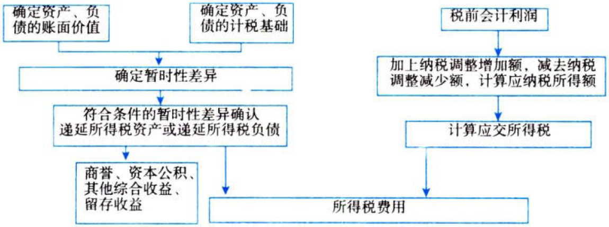
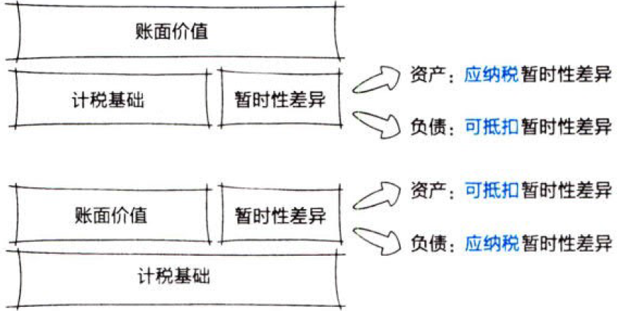
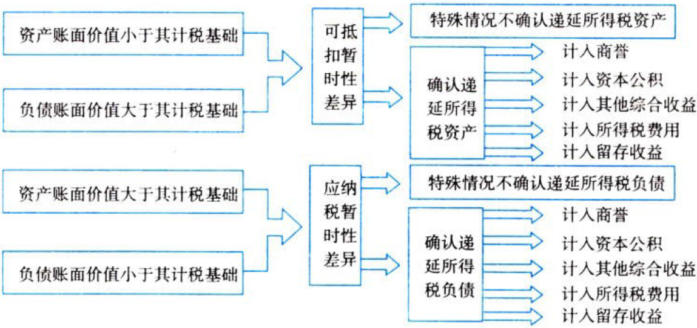

所得税

# 1. 所得税核算.基本原理

所得税会计采用`资产负债表债务法`核算所得税。

资产负债表债务法是从`资产负债表`出发，通过比较资产负债表上列示的资产、负债按照`会计准则`规定确定的`账面价值`与按照`税法规定`确定的`计税基础`，对于两者之间的`差异`区分`应纳税暂时性差异`与`可抵扣暂时性差异`，确认相关的`递延所得税负债`与`递延所得税资产`，并在此基础上确定每一会计期间利润表中的`所得税费用`。

## 1.1. 资产负债表债务法

所得税准则规范的是资产负债表中［递延所得税资产］和［递延所得税负债］的确认和计量。

对于暂时性差异，未来期间由税前会计利润计算应纳税所得额时，纳税调减的属于“发生的`可抵扣`暂时性差异”，符合条件的确认`递延所得税资产`；未来期间由税前会计利润计算应纳税所得额时，纳税调增的属于“发生的`应纳税`暂时性差异”，符合条件的确认`递延所得税负债`。

## 1.2. 所得税会计的一般程序

所得税核算一般程序如下图所示：

# 2. 资产、负债的计税基础

企业在取得资产、负债时，应当确定其`计税基础`。

所得税会计核算的关键在于确定资产、负债的`计税基础`。

资产、负债计税基础的确定，与`税收法规`密切相关。

## 2.3. 资产的计税基础

资产的计税基础，是指企业收回资产账面价值的过程中，计算`应纳税所得额`时按照税法规定可以自应税经济利益中`抵扣`的金额。【将来能抵减多少收入】

### 2.3.1. 固定资产

账面价值＝实际成本－`会计`累计折旧－固定资产减值准备

计税基础＝实际成本－`税法`累计忻旧

### 2.3.2. 无形资产

除内部研究开发形成的无形资产以外，其他方式取得的无形资产，初始确认时按照会计准则规定确定的入账价值与按照税法规定确定的计税基础之间一般不存在差异。

对于内部研究开发形成的无形资产，企业会计准则规定有关研究开发支出区分为两个阶段，研究阶段的支出应当费用化计入当期损益，而开发阶段符合`资本化条件`的支出应当资本化作为无形资产的成本。按财税[2018]99号文件，企业开展研发活动中实际发生的研发费用，未形成无形资产（直接计入当期损益）的，在按规定据实扣除的基础上，在2018年1月1日至2020年12月31日期间，再按照实际发生额的75%在税前加计扣除；形成无形资产的，在上述期间按照无形资产成本的175%在税前摊销。

如果会计摊销方法、摊销年限和净残值均符合税法规定，那么每期纳税调减的金额均为会计计入费用金额（研究阶段的支出、开发阶段不符合资本化条件的支出及形成无形资产后的摊销额）的75%，形成无形资产的计税基础＝账面价值×`175%`。

无形资产在后续计量时，会计与税法的差异主要产生于对无形资产是否需要摊销，无形资产摊销方法、摊销年限、预计净残值的不同、无形资产减值准备的计提。

①使用寿命有限的无形资产

账面价值＝实际成本－`会计`累计摊销－无形资产减值准备

计税基础＝实际成本－`税法`累计摊销

②使用寿命不确定的无形资产

账面价值＝实际成本－无形资产减值准备

计税基础＝实际成本－`税法`累计摊销

### 2.3.3. 其他资产

因企业会计准则规定与税法规定不同，企业持有的其他资产，可能造成其账面价值与计税基础之间存在差异。

#### 2.3.3.1. 采用公允价值模式进行后续计量的投资性房地产

账面价值：期末按公允价值计量

计税基础：以`历史成本`为基础确定（类似固定资产或无形资产）

#### 2.3.3.2. 将债券（通常考察国债）作为“债权投资”

账面价值：期末摊余成本＝期初摊余成本＋本期计提利息（期初账面余额×实际利率）－本期收回本金和利息－本期计提的损失准备

提示：若债券投资已发生减值，本期计提利息＝期初摊余成本×实际利率

计税基础：在不计提`减值准备`的情况下与账面价值相等

#### 2.3.3.3. “其他权益工具投资”

账面价值：期末按公允价值计量，公允价值变动计入其他综合收益

计税基础：`取得`时的成本

#### 2.3.3.4. “交易性金融资产”

账面价值：期末按公允价值计量，公允价值变动计入当期损益（公允价值变动损益）

计税基础：`取得`时的成本

## 2.4. 负债的计税基础

$$负债的计税基础=账面价值-未来期间计算应纳税所得额时按照税法规定可予税前扣除的金额$$

负债的确认与偿还一般不会影响企业的损益，也不会影响其应纳税所得额，未来期间计算应纳税所得额时按照税法规定可予抵扣的金额为0，$计税基础=账面价值$。例如，企业的短期借款、应付账款等。

但是某些情况下，负债的确认可能会影响企业的损益，进而影响不同期间的应纳税所得额，使得其计税基础与账面价值之间产生差额，如按照会计规定确认的某些预计负债。

### 2.4.4. 企业因销售商品提供售后服务等原因确认的预计负债

按照《企业会计准则第13号——或有事项》的规定，企业应将预计提供售后服务发生的支出满足有关确认条件时，在销售当期确认为`费用`，同时确认`预计负债`。如果税法规定，与销售商品有关的支出可于实际发生时税前扣除，那么：

$$该类事项产生的预计负债在期末的计税基础=其账面价值-未来期间可税前扣除的金额=0$$

因其他事项确认的预计负债，应按照税法规定的计税原则确定其计税基础。某些情况下，因有些事项确认的预计负债，如果税法规定无论是否实际发生均不允许税前扣除，即未来期间按照税法规定可予抵扣的金额为0，则其账面价值与计税基础相同。

### 2.4.5. 合同负债

①合同负债计入当期应纳税所得额（如房地产开发企业），计税基础为0。【未来可以抵减】

②合同负债未计入当期应纳税所得额，计税基础与账面价值相等。【未来不能抵减】

### 2.4.6. 应付职工薪酬

会计准则规定，企业为获得职工提供的服务给予的各种形式的报酬以及其他相关支出均应作为企业的成本费用，在未支付之前确认为负债。

税法中对于合理的职工薪酬基本允许税前扣除，但税法中如果规定了税前扣除标准的，按照会计准则规定计入成本费用的金额超过税法规定的税前扣除标准部分，应进行纳税调整。因超过部分在发生当期不允许税前扣除，在以后期间也不允许税前扣除，即该部分差额对未来期间计税不产生影响，所产生应付职工薪酬的账面价值等于计税基础。

### 2.4.7. 递延收益

①对于确认为递延收益的政府补助，如果按税法规定，该政府补助为免税收入，则并不构成收到当期的应纳税所得额，未来期间会计上确认为收益时，也同样不作为应纳税所得额，因此，不会产生递延所得税影响。

②对于确认为递延收益的政府补助，如果按税法规定，应作为收到当期的应纳税所得额计缴企业所得税，则该递延收益的计税基础为0。资产负债表日，该递延收益的账面价值与其计税基础0之间将产生可抵扣暂时性差异。如期末递延收益账面价值为100万元，则产生100万元的可抵扣暂时性差异。

### 2.4.8. 其他负债

如企业应交的罚款和滞纳金等，在尚未支付之前按照会计准则规定确认为费用，同时作为负债反映。税法规定，行政性的罚款和滞纳金不得税前扣除，其计税基础为账面价值减去未来期间计税时可予税前扣除的金额0之间的差额，即计税基础等于账面价值。

## 2.5. 特殊交易或事项中产生资产、负债计税基础的确定

除企业在正常生产经营活动过程中取得的资产和负债以外，对于某些特殊交易中产生的资产、负债，其计税基础的确定应遵从税法规定，如企业合并过程中取得资产、负债计税基础的确定。

由于会计准则与税收法规对企业合并的划分标准不同、处理原则不同，某些情况下，会造成企业合并中取得的有关资产、负债的入账价值与其计税基础的差异。

提示：2013年上市公司年报会计监管报告关于“企业合并中递延所得税的确认”。

企业合并中，购买方按照会计准则规定的原则确认和计量合并中取得的被购买方的资产、负债，在`购买方`财务报表中的价值可能与其计税基础之间存在差异，从而带来递延所得税的确认问题。

常见的情形：{

①以`控股合并`方式完成的非同一控制下企业合并中，购买方取得的被购买方可辨认资产在购买方的合并报在中按照购买日的公允价值确认和计量，但这些资产的计税基础未发生变化。由于通常情况下资产的公允价值`大于`其计税基础，上述差异大多为应纳税暂时性差异，应按照会计准则的规定确认`递延所得税负债`。

②以`吸收合并`方式进行的同一控制下企业合并，在合并不满足税法规定的免税条件时，合并方取得的被合并方资产的计税基础应调整为该等资产的公允价值，与会计上按照同一控制下企业合并原则确认的账面价值之间存在差异。由于通常情况下资产的账面价值小于按照公允价值确定的新的计税基础，上述差异为可抵扣暂时性差异，应按照会计准则的规定确认`递延所得税资产`。

}

# 3. 暂时性差异

暂时性差异，是指资产或负债的账面价值与其计税基础不同产生的`差额`。根据暂时性差异对未来期间应纳税所得额影响的不同，分为`应纳税`暂时性差异和`可抵扣`暂时性差异。

某些不符合资产、负债的确认条件，未作为财务报告中资产、负债列示的`项目`，如果按照税法规定可以确定其`计税基础`，该计税基础与其账面价值之间的`差额`也构成暂时性差异。

## 3.6. 应纳税暂时性差异

应纳税暂时性差异，是指在`确定`未来收回资产或清偿负债期间的`应纳税所得额`时，将导致产生应税金额的暂时性差异。【以后得多交税】

应纳锐暂时性差异通常产生于以下情况：{

①资产的账面价值`大于`其计税基础；【以后能抵减的少了】

②负债的账面价的`小于`其计税基础。【以前抵减的太多】

}

## 3.7. 可抵扣暂时性差异

可抵扣暂时性差异，是指在`确定`未来收回资产或清偿负债期间的应纳税所额时，将导致产生`可抵扣`金额的暂时性差异。

可抵扣暂时性差异通常产生于以下情况：{

①资产的账面价值`小于`其计税基础；【以后还有好多能抵减的】

②负债的账面价值`大于`其计税基础。【以前抵减的太少】

}

## 3.8. 特殊项目产生的暂时性差异

### 3.8.9. 未作为资产、负债确认的项目产生的暂时性差异

某些交易或事项发生以后，因为不符合资产、负债的确认条件而未体现为资产负债表中的资产或负债，但按照税法规定能够确定其计税基础的，其账面价值与计税基础之间的差额也构成暂时性差异。【账上没有资产负债，却可能有暂时性差异】

如企业发生的符合条件的广告费和业务宣传费支出，除另有规定外，不超过当期销售收入15%的部分准予扣除；超过部分准予在以后纳税年度结转扣除。该类费用在发生时按照会计准则规定即计入当期损益，不形成资产负债表中的资产，但按照税法规定可以确定其`计税基础`的，两者之间的`差额`也形成暂时性差异（可抵扣暂时性差异）。

提示：财税〔2018〕51号，企业发生的职工教育经费支出，不超过工资薪金总额8%的部分，准予在计算企业所得税应纳税所得额时扣除；超过部分，准予在以后纳税年度结转扣除。注意这里的工资薪金总额指的是实际发放的工资薪金总额的合理部分。该类费用（职工教育经费支出）与“符合条件的广告费和业务宣传费支出”的会计处理相同，也会产生`可抵扣暂时性差异`。

### 3.8.10. 可抵扣亏损及税款抵减产生的暂时性差异

按照税法规定可以结转以后年度的`未弥补亏损`及`税款抵减`，虽不是因资产、负债的账面价值与计税基础不同产生的，但与可抵扣暂时性差异具有同样的作用，均能减少未来期间的应纳税所得额和应交所得税，会计处理上`视同`可抵扣暂时性差异，在符合确认条件的情况下，应确认与其相关的递延所得税资产。

# 4. 递延所得税资产与负债.确认+计量

## 4.9. 递延所得税负债.确认+计量

### 4.9.11. 递延所得税负债.确认

#### 4.9.11.5. 遵循原则

确认应纳税暂时性差异产生的递延所得税负债时，交易或事项发生时影响到会计利润或应纳税所得额的，相关的所得税影响应作为利润表中`所得税费用`的组成部分；与直接计入所有者权益的交易或事项相关的，其所得税影响应计入`所有者权益`；与企业合并中取得资产、负债相关的，递延所得税影响应调整购买日应确认的`商誉`或是计入合并当期`损益`的金额。

#### 4.9.11.6. 不确认递延所得税负债的特殊情况

有些情况下，虽然资产、负债的账面价值与其计税基础不同，产生了应纳税暂时性差异，但出于各方面考虑，所得税准则中规定不确认相应的递延所得税负债。

##### 4.9.11.6.1. 商誉的初始确认【没看懂】

非同一控制下`吸收`合并，商誉＝合并成本－被购买方可辨认净资产公允价值的份额。在免税合并情况下，被购买方的可辨认资产和负债的计税基础维持原被购买方的账面价值，而账面价值应反映购买日的公允价值，由此产生的暂时性差异`应确认`递延所得税资产或递延所得税负债，其对应科目为`商誉`。在免税和并情况下，商誉的计税基础为0，账面价值和计税基础之间产生`应纳税`暂时性差异，但`不确认`递延所得税负债，因企业合并成本固定，若确认递延所得税负债，则减少考虑递延所得税后被购买方可辨认净资产公允价值，增加商誉，由此进入不断循环状态。

其含义如下图所示：

未考虑递延所得税时可辨认净资产公允价值

＋递延所得税资产

－递延所得税负债↑↑……↑

考虑递延所得税后可辨认净资产公允价值↓↓……↓

商誉↑↑……↑

企业合并成本（固定）

需要说明的是，非同一控制下吸收合并形成的商誉，在应税合并情况下，按照所得税法规定商誉在初始确认时计税基础等于账面价值，不产生暂时性差异；该商誉在后续计量过程中因计提减值准备，使得商誉的账面价值小于计税基础，会产生`可抵扣`暂时性差异，应确认相关的所得税影响。

##### 4.9.11.6.2. 长期股权投资

与子公司、联营企业、合营企业投资等相关的应纳税暂时性差异，一般应确认相应的递延所得税负债，但`同时满足`以下两个条件的除外：一是投资企业能够`控制`暂时性差异转回的时间；二是该暂时性差异在可预见的未来很可能`不会`转回。满足上述条件时，投资企业可以运用自身的影响力决定暂时性差异的转回，如果不希望其转回，则在可预见的未来该项暂时性差异即不会转回，对未来期间计税不产生影响，从而无须确认相应的递延所得税负债。【看起来不会转回了，就没必要确认了】

对于采用权益法核算的长期股权投资，其账面价值与计税基础产生的有关暂时性差异是否应确认相关的所得税影响，应当考虑该项投资的`持有意图`：{

①在准备`长期持有`的情况下，对于采用权益法核算的长期股权投资账面价值与计税基础之间的差异，投资企业一般`不确认`相关的所得税影响。

理由：因`初始投资成本`的调整产生的暂时性差异预计未来期间`不会转回`，对未来期间没有所得税影响；因确认`投资损益`产生的暂时性差异，在未来期间逐期分回现金股利或利润时`免税`，也不存在对未来期间的所得税影响；因确认应享有被投资单位其他综合收益或其他权益变动而产生的暂时性差异，在长期持有的情况下预计未来期间也`不会转回`。

②在持有意图由长期持有转变为`拟近期出售`的情况下，因长期股权投资的账面价值与计税基础不同产生的有关暂时性差异，均`应确认`相关的所得税影响，通常情况下，账面价值大于计税基础，应确认递延所得税负债，借记“所得税费用”、“其他综合收益”、“资本公积”，货记“递延所得税负债”；也可能存在账面价值小于计税基础的情况，符合条件的应确认递延所得税资产。

理由：按照税法规定，企业在转让或者`处置`投资资产时，投资资产的`成本`（不是投资的账面价值）准予扣除。

}

##### 4.9.11.6.3. 其他【很少见的例外】

除企业合并以外的交易或事项，如果发生时既`不影响`会计利润，也`不影响`应纳税所得额，则所产生的资产、负债的初始确认金额与其计税基础不间，形成应纳税暂时性差异的，交易或事项发生时`不确认`相应的递延所得税负债。

因该项交易不是企业合并，递延所得税负债不能对应商誉；因该项交易或事项发生时既不影响会计利润，也不影响应纳税所得额，所以递延所得税负债不能对应“所得税费用”科目，从而不会影响留存收益，交易发生时产生暂时性差异的业务也不会涉及股本（或实收资本）、资本公积和其他综合收益，因此递延所得税负债不能对应所有者权益。若确认递延所得税负债，为使会计等式平衡，则只能增加资产的价值或减少其他负债的价值，这种会计处理违背历史成本计量属性，因此不确认递延所得税负债。

该类交易或事项在我国企业实务中并不多见，一般情况下有关资产、负债的初始确认金额均为税法所认可，两者之间不会产生差异。

提示：若产生暂时性差异影响`利润总额`，则递延所得税资产、递延所得税负债对应科目为`所得税费用`；若产生暂时性差异影响`其他综合收益`，则递延所得税资产、递延所得税负债对应科目为`其他综合收益`；若产生暂时性差异是由于非同一控制下`吸收`合并（免税合并）形成的，则递延所得税资产、递延所得税负债对应科目为`商誉`；若产生暂时性差异是由于会计政策变更、前期重要差错更正形成的，则递延所得税资产、递延所得税负债对应科目为`留存收益`。

### 4.9.12. 递延所得税负债.计量

递延所得税负债应以相关`应纳税暂时性差异转回期间`适用的所得税`税率`计量。在我国，除享受税收优惠政策的情况以外，企业适用的所得税税率在不同年度之间一般不会发生变化，企业在确认递延所得税负债时，可以`现行`适用税率为基础计算确定。无论应纳税暂时性差异的转回期间如何，递延所得税负债的确认`不要求`折现。

## 4.10. 递延所得税资产.确认+计量

### 4.10.13. 递延所得税资产.确认

#### 4.10.13.7. 确认的一般原则

资产、负债的账面价值与其计税基础不同产生`可抵扣`暂时性差异的，在估计未来期间能够取得`足够的`应纳税所得额用以`利用`该可抵扣暂时性差异时，应当以`很可能`取得用来抵扣可抵扣暂时性差异的应纳税所得额为`限`，确认相关的递延所得税资产。【能抵减多少，计多少】

①对与子公司、合营企业、联营企业投资相关的可抵扣暂时性差异，同时满足下列条件的，应当确认相关的递延所得税资产：一是暂时性差异在可预见的未来`很可能`转回；二是未来`很可能`获得用来抵扣可抵扣暂时性差异的`应纳税所得额`。

②按照税法规定可以结转以后年度的`未弥补亏损`和`税款抵减`，应`视同`可抵扣暂时性差异处理。在预计可利用来弥补亏损或税款抵减的未来期间内能够取得足够的应纳税所得额时，除准则中规定不予确认的情况外，应当以很可能取得的应纳税所得额为`限`，确认相应的递延所得税资产，同时减少确认`当期的`所得税费用。

与可抵扣亏损和税款抵减相关的递延所得税资产，其确认条件与可抵扣暂时性差异产生的递延所得税资产相同。

③企业合并中，按照会计准则规定确认的合并中取得各项可辨认资产、负债的入账价值与其计税基础之间形成可抵扣暂时性差异的，应确认相应的递延所得税资产，并调整合并中应予确认的`商誉`等。

④与直接计入所有者权益的交易或事项相关的可抵扣暂时性差异，相应的递延所得税资产应计入所有者权益。

提示：若产生的可抵扣暂时性差异影响其他综合收益，则递延所得税资产对应科目为`其他综合收益`。如因其他债权投资期末公允价值下降而应确认的递延所得税资产。

#### 4.10.13.8. 不确认递延所得税资产的特殊情况

某些情况下，如果企业发生的某项交易或事项不属于企业合并，并且交易发生时既不影响会计利润也不影响应纳税所得额，且该项交易中产生的资产、负债的初始确认金额与其计税基础不同，产生可抵扣暂时性差异的，所得税准则中规定在交易或事项发生时不确认相应的递延所得税资产。其原因在于该项交易不是企业合并，递延所得税资产不能对应商誉；因该项交易或事项发生时既不影响会计利润，也不影响应纳税所得额，所以递延所得税资产不能对应“所得税费用”科目，从而不会影响留存收益，交易发生时产生暂时性差异的业务也不会涉及股本（或实收资本）、资本公积和其他综合收益，因此递延所得税资产不能对应所有者权益。若确认递延所得税资产，为使会计等式平衡，则只能增加负债的价值或减少其他资产的价值，这种会计处理违背历史成本计量属性，因此不确认递延所得税资产。【对应不确认递延所得税负债的极少见情况】

### 4.10.14. 递延所得税资产.计量

#### 4.10.14.9. 适用税率.确定

确认递延所得税资产时，应估计相关可抵扣暂时性差异的转回时间，采用`转回期间`适用的所得税税率为基础计算确定。无论相关的可抵扣暂时性差异转回期间如何，递延所得税资产均不予折现。

#### 4.10.14.10. 递延所得税资产.减值

`资产负债表`日，企业应当对递延所得税资产的账面价值进行`复核`。如果未来期间很可能无法取得足够的应纳税所得额用以利用可抵扣暂时性差异带来的利益，应当`减记`递延所得税资产的账面价值。递延所得税资产的账面价值减记以后，以后期间根据新的环境和情况判断能够产生足够的应纳税所得额用以利用可抵扣暂时性差异，使得递延所得税资产包含的经济利益能够实现的，应相应`恢复`递延所得税资产的账而价值。

## 4.11. 特殊交易或事项

### 4.11.15. 直接计入所有者权益的交易或事项

与当期及以前期间直接计入所有者权益的交易或事项相关的当期所得税及递延所得税应当计入所有者权益。

直接计入所有者权益的交易或事项主要有：会计政策变更采用追溯调整法或对前期差错更正采用追溯重述法调整期初留存收益、以公允价值计量且其变动计入其他综合收益的金融资产其公允价值变动计入所有者权益（其他综合收益）、同时包含负债及权益成分的金融工具在初始确认时计入所有者权益等。

### 4.11.16. 企业合并

在企业合并中，购买方取得的`可抵扣`暂时性差异，按照税法规定可以用于抵减以后年度应纳税所得额，但在`购买日`不符合递延所得税资产确认条件而不予以确认。购买日后`12个月`内，如取得新的或进一步信息表明购买日的相关情况已经存在，预期被购买方在购买日可抵扣暂时性差异带来的经济利益能够实现的，应当确认相关的递延所得税资产，同时减少`商誉`，商誉不足冲减的，差额部分确认为`当期损益`；除上述情况以外，确认与企业合并相关的递延所得税资产，应当计入当期损益。【1年内确认，视同当时确认】

提示：此处指的是购买日不符合递延所得税资产确认条件的可抵扣暂时性差异，购买日后符合条件确认递延所得税资产的会计处理。对购买日符合递延所得税资产确认条件的可抵扣暂时性差异，应确认递延所得税资产，同时减少商誉。【当时符合，当时确认】

### 4.11.17. 股份支付

与股份支付相关的支出在按照会计准则规定确认为成本费用时，其相关的所得税影响应区别于税法的规定进行处理：如果税法规定与股份支付相关的支出`不允许`税前扣除，则不形成暂时性差异；如果税法规定与股份支付相关的支出`允许`税前扣除，在按照会计准则规定确认成本费用的期间内，企业应当根据会计`期末`取得的信息估计可税前扣除的金额计算确定其计税基础及由此产生的暂时性差异，符合确认条件的情况下，应当确认相关递延所得税。

# 5. 适用税率变化的影响

因税收法规的变化，导致企业在某一会计期间适用的所得税`税率`发生变化的，企业应对已确认的递延所得税资产和递延所得税负债按照新的税率`重新计量`。

递延所得税资产和递延所得税负债的确认和计量如下图所示：

# 6. 所得税费用.确认+计量

在采用资产负债表`债务法`核算所得税的情况下，利润表中的`所得税费用`由两部分组成：`当期`所得税和`递延`所得税。

## 6.12. 当期所得税

当期所得税，是指企业按照税法规定计算确定的针对`当期`发生的交易和事项，应交纳给税务部门的所得税金额，即`当期应交`所得税。

企业在确定当期应交所得税时，对于当期发生的交易或事项，会计处理与税法处理不同的，应在会计利润的基础上，按照适用税收法规的规定进行`调整`，计算出当期`应纳税所得额`，按照应纳税所得额与适用所得税`税率`计算确定当期应交所得税。

应交所得税＝应纳税所得额×所得税税率

应纳税所得额＝税前会计利润＋纳税调整增加额－纳税调整减少额

### 6.12.18. 纳税调整增加额

①按会计准则规定核算时不作为收益计入财务报表，但在计算应纳税所得额时作为收益需要缴纳所得税。【会计：我没赚；税法：你赚了】

②按会计准则规定核算时确认为费用或损失计入财务报表，但在计算应纳税所得额时不允许扣减。【会计：我赔了；税法：你没赔】

### 6.12.19. 纳税调整减少额

①按会计准则规定核算时作为收益计入财务报表，但在计算应纳税所得额时不确认为收益。【会计：我赚了；税法：你没赚】

②按会计准则规定核算时不确认为费用或损失，但在计算应纳税所得额时允许扣减。【会计：我没赔；税法：你赔了】

提示：暂时性差异对应纳税所得额的调整（不考虑永久性差异）

应纳税所得额＝税前会计利润＋`本期发生`的影响损益的`可抵扣`暂时性差异－`本期转回`的影响损益的`可抵扣`暂时性差异－`本期发生`的影响损益的`应纳税`暂时性差异＋`本期转回`的影响极益的`应纳税`暂时性差异

若暂时性差异`不影响损益`，如以公允价值计量且其变动计入其他综合收益的金融资产公允价值变动产生的其他综合收益，则`不需要`纳税`调整`。

## 6.13. 递延所得税

递延所得税，是指按照所得税准则规定`当期`应予确认的递延所得税资产和递延所得税负债，即递延所得税资产及递延所得税负债当期发生额的`综合结果`，但不包括计入所有者权益的交易或事项的所得税影响。【递延所得税(费用/收益)】

递延所得税资产、递延所得税负债的发生额对应所得税费用的，属于`递延所得税费用`。

递延所得税费用＝当期递延所得税`负债`的增加额＋当期递延所得税`资产`的减少额－当期递延所得税`负债`的减少额－当期递延所得税`资产`的增加额【Δ负债-Δ资产】

如果某项交易或事项按照企业会计准则规定应计入所有者权益，由该交易或事项产生的递延所得税资产或递延所得税负债及其变化亦应计入所有者权益，不构成利润表中的递延所得税费用（或收益）。【直接计入股东权益，不影响递延所得税】

## 6.14. 所得税费用

计算确定了`当期`所得税及`递延`所得税以后，利润表中应予确认的所得税费用为两者之和，即：

`所得税费用`＝`当期`所得税＋`递延`所得税费用【本期应交+下期应交】

提示：影响损益的暂时性差异，在计算`应交所得税`时应当进行调整，同时确认`递延所得税`，两者对所得税费用的影响为一增一减，最终不影响所得税费用的总额。因此，在`税率不变`的情况下，计算所得税费用时，可以采用简化做法，即所得税费用＝不考虑暂时性差异的`应纳税所得额`×适用的所得税`税率`。【所得税费用=应纳税所得额×税率】

# 7. 所得税的列报

## 7.15. 列报的基本原则

企业对所得税的核算结果，除利润表中列示的所得税费用以外，在资产负债表中形成的应交税费（应交所得税）以及递延所得税资产和递延所得税负债应当遵循准则规定`列报`。其中，递延所得税资产和递延所得税负债一般应当分别作为`非流动资产`和`非流动负债`在资产负债表中列示，`所得税费用`应当在`利润表`中单独列示，同时还应在附注中`披露`与所得税有关的信息。【递延所得税资产/负债，难以流动】

一般情况下，在个别财务报表中，`当期`所得税资产与负债及`递延`所得税资产及递延所得税负债可以以抵销后的`净额`列示。【个表可以抵销】

在合并财务报表中，纳入合并范围的企业中，`一方`的当期所得税资产或递延所得税资产与`另一方`的当期所得税负债或递延所得税负债一般`不能`予以抵销，除非所涉及的企业具有以净额结算的`法定权利`并且`意图`以净额结算。【合表一般不应抵销，因为不是同一企业产生的东西】

## 7.16. 所得税费用（收益）与会计利润关系的说明

会计准则要求企业应当就所得税费用（或收益）与会计利润的关系在`附注`中进行说明，该说明目的是在利润表中已列示所得税费用的基础上，以当期`会计利润`为起点，考虑`税会差异`，计算所得税费用的过程。自会计利润到所得税费用之间的调整有两个方面：①未包括在利润总额的计算中，但包含在当期或递延所得税计算中项目；②未包括在当期或递延所得税计算中，但包含在利润总额中的项目。调整项目一般包括：{

①与税率相关的调整；

②税法规定的非应税收入，不得税前扣除的成本费用及损失等永久性差异；

③本期末确认递延所得税资产的可抵扣暂时性差异或可抵扣亏损的影响、使用前期未确认递延所得税资产的可抵扣亏损影响；

④对以前期间所得税进行汇算清缴的结果与以前期间确认金额不同调整报告期间所得税费用等。

}

# 8. 总结

End。
