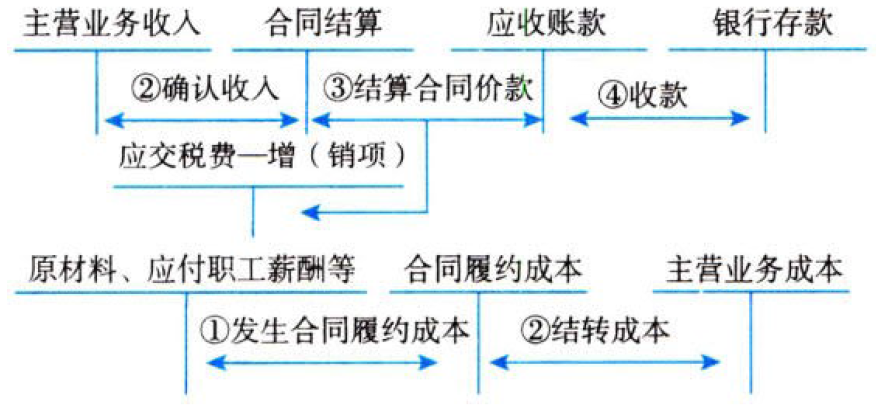

收入

# 1. 收入.定义+分类

收入，是指企业在`日常活动`中形成的、会导致所有者权益`增加`的、与所有者投入资本`无关`的经济利益的`总`流入。【本+利】

收入准则适用于所有与`客户`之间的合同，但下列各项除外：长期股权投资、金融工具确认和计量、金融资产转移、套期会计、合并财务报表、合营安排、租赁、保险合同。

与收入相关的主要会计科目如下：

## 1.1. “主营业务收入”

本科目核算企业确认的`销售商品`、`提供服务`等主营业务的收入。【干本行】

本科目可按主营业务的种类进行明细核算。

企业在履行了合同中的`单项履约义务`时，做下述会计分录。

:moneybag:【会计分录】本行收入

```
借：银行存款/应收账款/应收票据/合同资产 // 价款+增值税额
  贷：主营业务收入 // 合同价款
      应交税费——应交增值税（销项税额） // 增值税额
```

合同中存在企业为客户提供`重大融资`利益的，企业应按照应收合同价款，借记“`长期应收款`”等科目，按照假定客户在取得商品控制权时即以现金支付而需支付的金额（即`现销价格`）确定的交易价格，贷记本科目，按其差额，贷记“`未实现融资收益`”科目：【分期付款购买我的商品】

:moneybag:【会计分录】本行收入+为客户提供融资利益

```
借：长期应收款等 // 合同价款
  贷：主营业务收入 // 合同价款的现值
      未实现融资收益 // 倒挤的差额，我赚的利息
```

合同中存在客户为企业提供`重大融资`利益的，企业应按照已收合同价款，借记“`银行存款`”等科目，按照假定客户在取得商品控制权时即以现金支付的应付金额（即`现销价格`）确定的交易价格，贷记“`合同负债`”等科目，按其差额，借记“`未确认融资费用`”科目。涉及增值税的，还应进行相应的处理：【分期交付我的商品】

:moneybag:【会计分录】本行收入+客户为我提供融资利益

```
借：银行存款等 // 合同价款
    未确认融资费用 // 倒挤的差额，我支付的利息
  贷：合同负债等 // 合同价款的现值
```

企业收到的对价为非现金资产时，应借记“库存商品”“固定资产”“无形资产”等有关科目，按该非现金资产在合同开始日的`公允价值`【视同销售】，贷记本科目。涉及增值税的，还应进行相应的处理。

`期末`，应将本科目的余额转入“`本年利润`”科目，结转后本科目应`无余额`。【期末清零】

## 1.2. “其他业务收入”

本科目核算企业确认的除主营业务活动以外的`其他经营活动`实现的收入，包括`出租`固定资产、出租无形资产、出租包装物和商品、`销售`材料、用材料进行`非货币性交换`（非货币性资产交换具有商业实质且公允价值能够可靠计量）等实现的收入。【做周边】

本科目可按其他业务的种类进行明细核算。

企业确认其他业务收入的主要账务处理参见“主营业务收入”科目。【类似本行的处理】

`期末`，应将本科目的余额转入“`本年利润`”科目，结转后本科目应`无余额`。【期末清零】

## 1.3. “主营业务成本”

本科目核算企业确认`销售`商品、`提供服务`等主营业务收入时应`结转的成本`。【与收入对应的成本】

本科目可按主营业务的种类进行明细核算。

`期末`，企业应根据本期销售各种商品、提供各种服务等实际成本，计算`应结转的主营业务成本`，借记本科目，贷记“库存商品”“合同履约成本”等科目。【只结转与收入对应的成本】

`期末`，应将本科目的余额转入“`本年利润`”科目，结转后本科目`无余额`。【期末清零】

## 1.4. “其他业务成本”

本科目核算企业确认的除主营业务活动以外的`其他经营活动`所发生的支出，包括`销售`材料的成本、`出租`固定资产的折旧额、出租无形资产的摊销额、出租包装物的成本或摊销额等。采用`成本模式`计量投资性房地产的，其投资性房地产计提的`折旧额`或`摊销额`，也通过本科目核算。【对应“其他业务收入”】

本科目可按其他业务成本的种类进行明细核算。

企业发生的其他业务成本，借记本科目，贷记“原材料”“周转材料”等科目。

`期末`，应将本科目的余额转入“`本年利润`”科目，结转后本科目`无余额`。【期末清零】

## 1.5. “合同履约成本”

本科目核算企业为履行当前或预期取得的合同所发生的、不属于其他企业会计准则规范范围且按照收入准则应当确认为一项`资产`的成本。【履约，未必立即计入主营业务成本，因为可能未确认相应的收入。成本的结转是与收入的确认相对应的】

本科目可按合同，分别“`服务成本`”“`工程施工`”等进行明细核算。

企业`发生`上述合同履约成本时，借记本科目，贷记“银行存款”“应付职工薪酬”“原材料”等科目；对合同履约成本进行`摊销`时，借记“主营业务成本”“其他业务成本”等科目，贷记本科目。涉及增值税的，还应进行相应的处理。

:moneybag:【会计分录】干活不等于计入成本

```
借：合同履约成本 // 我干的活
  贷：银行存款/应付职工薪酬/原材料等
借：主营业务成本/其他业务成本等
  贷：合同履约成本 // 该结转的部分
```

本科目期末借方余额，反映企业`尚未结转的`合同履约成本。【活干了，还不到确认收入的时候】

【细化了对结转成本的管理】

## 1.6. “合同履约成本减值准备”

本科目核算与合同履约成本有关的资产的减值准备。【类似存货跌价准备】

本科目可按合同进行明细核算。

与合同履约成本有关的资产发生减值的，按应减记的金额，借记“`资产减值损失`”科目，贷记本科目；`转回`已计提的资产减值准备时，做相反的会计分录。【可转回】

:moneybag:【会计分录】确认减值，转回减值

```
///计提减值准备
借：资产减值损失
  贷：合同履约成本减值准备 // 我干的活不值钱了
///转回
借：合同履约成本减值准备 // 我干的活又值钱了
  贷：资产减值损失
```

本科目期末贷方余额，反映企业`已计提`但`尚未转销`的合同履约成本减值准备。

## 1.7. “合同取得成本”

本科目核算企业取得合同发生的、预计能够收回的`增量成本`。【谈判沟通成本】

本科目可按合同进行明细核算。

:moneybag:【会计分录】取得成本的发生和摊销

```
///发生
借：合同取得成本
  贷：银行存款/其他应付款等
///摊销
借：销售费用等 // 结转费用
  贷：合同取得成本
```

【如果一下子计入销售费用，就显得不合理。借助“合同取得成本”来摊销，就比较平滑】

【细化了对销售费用的管理】

本科目期末借方余额，反映企业`尚未结转的`合同取得成本。

## 1.8. “合同取得成本减值准备”

本科目核算与合同取得成本有关的资产的减值准备。【类似存货跌价准备】

本科目可按合同进行明细核算。

与合同取得成本有关的资产发生减值的，按应减记的金额，借记“`资产减值损失`”科目，贷记本科目；`转回`已计提的资产减值准备时，做相反的会计分录。【可转回】

:moneybag:【会计分录】确认减值，转回减值

```
///计提减值准备
借：资产减值损失
  贷：合同取得成本减值准备 // 我的谈判不值钱了
///转回
借：合同取得成本减值准备 // 我的谈判又值钱了
  贷：资产减值损失
```

本科目期末贷方余额，反映企业已计提但`尚未转销的`合同取得成本减值准备。

## 1.9.  “合同资产”

本科目核算企业已向客户转让商品而`有权收取对价`的权利。【“应收账款”的前一阶段】

仅取决于`时间流逝因素`的权利不在本科目核算。【在“应收账款”科目核算】

本科目应按合同进行明细核算。

企业在客户`实际`支付合同对价或在该对价`到期`应付之前，已经向客户转让了商品的，应当按因已转让商品而有权收取的对价金额，借记本科目或“应收账款”科目，贷记“主营业务收入”“其他业务收入”等科目；

:moneybag:【会计分录】出货了，就应当有收入

```
借：合同资产/应收账款
  贷：主营业务收入/其他业务收入
```

企业取得`无条件收款权`时，就成为了真正的应收账款。涉及增值税的，还应进行相应的处理。

:moneybag:【会计分录】成为应收账款

```
借：应收账款
  贷：合同资产
```

【合同资产，虽然发货了，有权收钱了，但是还需要等（某因素+时间流逝因素）。待到（某因素）消失而（时间流逝因素）未消失时，才算是应收账款】

【细化了对应收账款的管理】

## 1.10. “合同资产减值准备”

本科目核算合同资产的减值准备。

本科目应按合同进行明细核算。

:moneybag:【会计分录】合同资产发生减值【赊销，是一种`信用`】，可转回

```
借：信用减值损失
  贷：合同资产减值准备
```

本科目`期末`贷方余额，反映企业已计提但尚未转销的合同资产减值准备。

## 1.11. “合同负债”

本科目核算企业已收或应收客户对价而`应向客户转让商品的义务`。【先收了钱，还没发货】

本科目应按合同进行明细核算。

企业在向客户转让商品之前，客户已经支付了合同对价或企业已经取得了`无条件收取`合同对价权利的，企业应当在客户`实际`支付款项与`到期`应支付款项`孰早`时点，按照该已收或应收的金额，借记“银行存款”“应收账款”“应收票据”等科目，贷记本科目；企业向客户转让相关商品时，借记本科目，贷记“主营业务收入”“其他业务收入”等科目。涉及增值税的，还应进行相应的处理。

:moneybag:【会计分录】先收钱后发货

```
借：银行存款/应收账款/应收票据
  贷：合同负债
```

:moneybag:【会计分录】后来，就发货了

```
借：合同负债
  贷：主营业务收入/其他业务收入
```

企业因转让商品收到的`预收款`适用收入准则进行会计处理时，`不再`使用“预收账款”科目及“递延收益”科目。【成为历史】

本科目`期末`贷方余额，反映企业在向客户转让商品之前，已经收到的合同对价或已经取得的无条件收取合同对价权利的金额。【收到或应当收到的预收款】

## 1.12. “应收退货成本”

当发生附有销售退回条款的销售时，本科目核算销售商品时`预期`将退回商品的账面价值，扣除收回该商品`预计`发生的成本（包括退回商品的价值减损）后的余额。【新货-磨损】

本科目可按合同进行明细核算。

每一`资产负债表`日，企业应当`重新估计`未来销售退回情况，如有变化，应当作为`会计估计变更`进行会计处理。

:moneybag:【会计分录】附有销售退回条款的销售，发生了

```
借：银行存款/应收账款/应收票据/合同资产
  贷：主营业务收入/其他业务收入 // 少计点收入，谨慎性
      预计负债——应付退货款等
```

:moneybag:【会计分录】结转成本

```
借：应收退货成本 // 新货-磨损
    主营业务成本/其他业务成本 //磨损
  贷：库存商品等 //新货
```

本科目`期末`借方余额，`反映`企业预期将退回商品转让时的账面价值，扣除收回该商品预计发生的成本（包括退回商品的价值减损）后的`余额`，在`资产负债表`中按其流动性计入“其他流动资产”或“其他非流动资产”项目。【意犹未尽。。】

# 2. 收入.确认+计量

收入准则确认收入的五步法模型：①识别合同；②识别履约义务；③确定交易价格；④分配交易价格；⑤确认收入。【将合同拆分为实质上各自独立的活儿，以活儿为中心，分别定价，分别确认收入】

## 2.13. 步骤一：识别与客户订立的合同

### 2.13.1. 收入确认的原则

企业应当在履行了合同中的`履约义务`，即在客户取得相关商品`控制权`时确认收入。【干活了，才能有收入】

取得相关商品控制权，是指能够`主导`该商品的使用并从中获得几乎全部的`经济利益`。

### 2.13.2. 收入确认的前提条件

当企业与客户之间的合同`同时满足`下列条件时，企业应当在客户取得相关商品`控制权`时确认收入：{

①合同各方已`批准`该合同并`承诺`将履行各自义务。【定了】

②该合同明确了合同各方与所转让商品或服务相关的`权利和义务`。【明了】

③该合同有明确的与所转让商品或服务相关的`支付条款`。【钱了】

④该合同具有`商业实质`，即履行该合同将改变企业未来现金流量的风险、时间分布或金额。【真干】

⑤企业因向客户转让商品而有权取得的对价`很可能`收回。【靠谱】

}

在合同`开始日`即满足上述条件的合同，企业在后续期间无须对其进行重新评估，除非有迹象表明相关事实和情况发生`重大变化`。合同开始日通常是指合同`生效日`。

在合同开始日不满足图中条件的合同，企业应当在后续期间对其进行`持续评估`，以判断其能否满足这些条件。企业如果在合同满足相关条件之前已经向客户转移了部分商品，当该合同在后续期间满足相关条件时，企业应当将在此之前已经转移的商品所分摊交易价格确认为收入。

没有`商业实质`的非货币性资产交换，无论何时，均`不应`确认收入。例如，两家石油公司之间相互交换石油，以便及时满足各自不同地点客户的需求，不具有商业实质，不应确认收入。

对于不符合规定的合同，企业只有在`不再`负有向客户转让商品的剩余`义务`，且已向客户收取的对价`无需退回`时，才能将已收取的对价确认为收入；否则，应当将已收取的对价作为`负债`进行会计处理。

企业与同一客户（或该客户的关联方）同时订立或在相近时间内先后订立的两份或多份合同，在满足下列`条件之一`时，应当`合并`为一份合同进行会计处理：{

A.该两份或多份合同基于同一商业目的而订立并构成`一揽子`交易。【连着的】

B.该两份或多份合同中的一份合同的对价金额`取决于`其他合同的定价或履行情况。【连着的】

C.该两份或多份合同中所承诺的商品（或每份合同中所承诺的部分商品）构成收入准则规定的`单项履约义务`。【本质上是一个东西】

}

### 2.13.3. 合同变更

企业应当区分下列三种情形对合同变更`分别`进行会计处理：{

①合同变更增加了`可明确区分的`商品及合同价款，且新增合同`价款`反映了新增`商品`单独售价的，应当将该合同`变更部分`作为一份`单独的`合同进行会计处理。【就是新合同】

②合同变更不属于上述①规定的情形，且在合同变更日已转让的商品或已提供的服务（以下简称“已转让的商品”）与未转让的商品或未提供的服务（以下简称“未转让的商品”）之间`可明确区分`的，应当视为原合同`终止`，同时，将原合同未履约部分与合同变更部分`合并`为新合同进行会计处理。【旧合同部分解决，另一部分进入新合同】

③合同变更不属于上述①规定的情形，且在合同变更日已转让的商品与未转让的商品之间`不可明确区分`的，应当将该合同`变更`部分作为原合同的`组成部分`进行会计处理，由此产生的对己确认收入的影响，应当在合同变更日`调整`当期收入。【连着的，仍是旧合同】

}

## 2.14. 步骤二：识别合同中的单项履约义务

合同开始日，企业应当对合同进行评估，识别该合同所包含的各`单项履约义务`，并确定各单项履约义务是在某一`时段`内履行，还是在某一`时点`履行，然后，在履行了各单项履约义务时分别确认收入。【识别各个活儿，是慢慢干的，还是一锤子搞定的】

履约义务，是指合同中企业向客户转让`可明确区分商品`的承诺。履约义务既包括合同中明确的承诺，也包括由于企业已公开宣布的政策、特定声明或以往的习惯做法等导致合同订立时客户合理预期企业将履行的承诺。【关键：可明确区分的商品】

### 2.14.4. 企业向客户转让可明确区分商品（或者商品或服务的组合）的承诺

企业向客户承诺的商品`同时满足`下列条件的，应当作为`可明确区分商品`：{

①客户能够从该商品本身或从该商品与其他易于获得的资源一起使用中受益；【你可以受益】

②企业向客户转让该商品的承诺与合同中其他承诺可单独区分。【物理上，我可以只给这个】

}

商品本身的特征是否可区分，主要考虑商品`本身`的性质，而非客户使用该商品的方式。因此，企止在进行评估时，不需考虑任何可能妨碍客户从该企业以外获取易于取得的资源的合同限制。例如，如果主体向客户转让一部机器，而该机器仅能在安装完成后（只有主体能够实施安装）才能使客户获益，则该机器不能够明确区分。

合同特定背景下判断是否可明确区分，关注“重大整合服务”“重大修改或定制化”以及“高度关联性”的特征。

下列情形通常表明企业向客户转让该商品的承诺与合同中其他承诺`不可`单独区分：{

①企业常提供重大的服务以将该商品与合同中承诺的`其他`商品`整合`成合同约定的组合产出转让给客户。【都整合组合了】

②该商品将对合同中承诺的`其他`商品予以重大`修改`或`定制`。【连着的】

③该商品与合同中承诺的`其他`商品具有高度`关联性`。【总结关键：关联性】

}

### 2.14.5. 企业向客户转让一系列实质相同且转让模式相同的、可明确区分商品的承诺

应当作为`单项履约义务`。如酒店管理服务、保洁服务等。【本质就是一个东西】

企业为履行合同而应开展的`初始活动`，通常`不构成`履约义务，除非该活动向客户`转让了`承诺的商品。【给东西，算客户看见活儿了，不然不算】

## 2.15. 步骤三：确定交易价格

企业应当按照分摊至各单项履约义务的`交易价格`计量收入。【分摊价格】

交易价格是指企业因向客户转让商品而预期`有权收取`的对价金额。

企业`代`第三方收取的款项以及企业预期将`退还`给客户的款项，应当作为`负债`进行会计处理，不计入交易价格。【代收的，当然不是收入，是负债】

交易价格包括下述内容：①可变对价；②重大融资成分；③非现金对价；④应付客户对价。

### 2.15.6. 可变对价

企业与客户的合同中约定的`对价`金额可能会因折扣、价格折让、返利、退款、奖励积分、激励措施、业绩奖金、索赔等因素而`变化`。此外，根据一项或多项`或有事项`的发生而收取不同对价金额的合同，也属于可变对价的情形。【不确定最后能收多少钱】

企业在确定将多少可变对价计入交易价格时，应考虑`收入转回`的风险。

#### 2.15.6.1. 可变对价最佳估计数的确定

企业应当按照`期望值`或`最可能`发生金额确定可变对价的最佳估计数。【期望值or最大可能值】

#### 2.15.6.2. 计入交易价格的可变对价金额的限制

企业按照期望值或最可能发生金额确定可变对价金额之后，计入交易价格的可变对价金额还应该满足`限制条件`，即包含可变对价的`交易价格`，应当`不超过`在相关不确定性消除时，累计已确认的收入极可能不会发生重大转回的金额。【不超过合理预期的金额】

需要说明的是，将可变对价计入交易价格的限制条件不适用于企业向客户授予`知识产权许可`并约定按客户`实际销售`或`使用情况`收取特许权使用费的情况。【这是例外】

每一`资产负债表`日，企业应当`重新估计`应计入交易价格的可变对价金额，包括重新评估将估计的可变对价计入交易价格`是否`受到限制，以如实反映报告期末存在的情况以及报告期内发生的情况变化。【年末再看一眼】

### 2.15.7. 重大的融资成分

合同中存在`重大融资成分`的，企业应当按照假定客户在取得商品控制权时即以现金支付的应付金额确定交易价格。该交易价格与合同对价之间的`差额`，应当在合同期间内采用`实际利率法`摊销。【企业应当调整承诺的对价金额，以反映货币时间价值。】

合同开始日，企业预计客户取得商品控制权与客户支付价款间隔不超过`一年`的，可以不考虑合同中存在的重大融资成分。

企业向客户转让商品与客户支付相关款项之间虽然存在时间间隔，但两者之间的合同`没有`包含重大融资成分的情形有：{

A.客户就商品支付了`预付款`，且可以`自行决定`这些商品的转让时间。例如，企业向客户出售其发行的储值卡，客户可随时到该企业持卡购物：再如，企业向客户授予奖励积分，客户可随时到该企业兑换这些积分等。【超市卡】

B.客户承诺支付的对价中有相当大的部分是`可变`的，该对价金额或付款时间取决于某一未来事项是否发生，且该事项实质上`不受`客户或企业`控制`。例如，按照实际销售量收取的特许权使用费。【按比例收取的特许权使用费】

C.合同承诺的对价金额与现销价格之间的差额是由于向客户或企业提供融资利益以外的`其他原因`所导致的，且这一差额与产生该差额的原因是`相称`的。例如，合同约定的支付条款是为了向企业或客户提供保护，以防止另一方未能依照合同充分履行其部分或全部义务。【其他】

}

### 2.15.8. 非现金对价

客户支付非现金对价的，企业应当按照非现金对价的`公允价值`确定交易价格。非现金对价的公允价值不能合理估计的，企业应当参照其承诺向客户转让`商品的单独售价`间接确定交易价格。非现金对价的公允价值因`对价形式以外`的原因而发生变动的，应当作为`可变对价`进行会计处理。【公允价值or代价】

### 2.15.9. 应付客户对价

企业应付客户（或向客户购买本企业商品的第三方）对价的，应当将该应付对价`冲减`交易价格，并在确认相关收入与支付（或承诺支付）客户对价二者`孰晚`的时点冲减当期收入，【该减就减】但应付客户对价是为了向客户取得`其他可明确区分商品`的除外。【这是买东西，不抵收入】

企业应付客户对价是为了向客户取得其他可明确区分商品的，应当采用与本企业其他`采购`相一致的方式确认所购买的商品。企业应付客户对价超过向客户取得可明确区分商品公允价值的，超过金额应当`冲减`交易价格。【超过金额就不是买东西了】向客户取得的可明确区分商品公允价值不能合理估计的，企业应当将应付客户对价`全额冲减`交易价格。【算不清，就不算了】

## 2.16. 步骤四：将交易价格分摊至各单项履约义务

### 2.16.10. 基本原则

合同中包含`两项`或`多项`履约义务的，企业应当在合同`开始日`，按照各单项履约义务所承诺商品的单独售价的相对`比例`，将交易价格`分摊`至各单项履约义务。【按比例分摊】企业`不得`因合同开始日`之后`单独售价的`变动`而重新分摊交易价格。【以后变是以后的事，不影响当初的分摊】

### 2.16.11. 单独售价无法直接观察

企业在`类似`环境下向`类似`客户`单独`销售商品的价格，应作为确定该商品单独售价的`最佳证据`。单独售价无法直接观察的，企业应当综合考虑其能够合理取得的全部`相关信息`，采用市场调整法、成本加成法、余值法等方法合理估计单独售价。在估计单独售价时，企业应当最大限度地采用可观察的输入值，并对类似的情况采用一致的估计方法。【尽可能靠谱】

企业在商品近期售价波动幅度巨大，或者因未定价且未曾单独销售而使售价无法可靠确定时，可采用`余值法`估计其单独售价。【余值法】

### 2.16.12. 合同折扣的分摊

合同折扣，是指合同中各单项履约义务所承诺商品的单独售价之和`高于`合同交易价格的金额。

对于合同折扣，企业应当在各单项履约义务之间按`比例`分摊。【大家按比例分摊功劳】

有确凿证据表明合同折扣仅与合同中一项或多项（而非全部）履约义务相关的，企业应当将该合同折扣分摊至`相关`一项或多项履约义务。【人家真不相干，就不分摊】

合同折扣仅与合同中一项或多项（而非全部）履约义务相关，且企业采用`余值法`估计单独售价的，应当首先按照前款规定在该一项或多项（而非全部）履约义务之间`分摊`合同折扣，然后采用`余值法`估计单独售价。【余值法】

### 2.16.13. 可变对价及可变对价的后续变动

对于可变对价及可变对价的后续变动额，企业应当按照准则规定，将其分摊至与之相关的一项或多项履约义务，或者分摊至构成单项履约义务的一系列可明确区分商品中的一项或多项商品。

对于`已履行`的履约义务，其分摊的可变对价`后续变动额`应当调整`变动当期的收入`。

### 2.16.14. 合同变更之后发生可变对价的后续变动

`合同变更`之后发生可变对价后续变动的，企业应当区分下列三种情形`分别`进行会计处理：{

A.合同变更属于本节合同变更第①规定情形【就是新合同】的，企业应当判断可变对价后续变动与`哪一项`合同相关，并按照分摊可变对价的相关规定进行会计处理。

B.合同变更属于本节合同变更第②规定情形【旧合同部分解决，另一部分进入新合同】，且可变对价后续变动与合同变更前已承诺可变对价相关的，企业应当首先将该可变对价后续变动额以`原合同开始日`确定的单独售价为基础进行分摊，然后再将分摊至`合同变更日`尚未履行履约义务的该可变对价后续变动额以`新合同开始日`确定的基础进行二次分摊。

C.合同变更之后发生除上述第①和②种情形以外【连着的，仍是旧合同】的可变对价后续变动的，企业应当将该可变对价后续变动额分摊至`合同变更日`尚未履行（或部分未履行）的履约义务。

}【与谁相关，分摊到谁；联姻之后，二次分摊】

## 2.17. 步骤五：履行每一单项履约义务时确认收入

企业应当在`履行了`合同中的履约义务，即客户取得相关商品`控制权`时确认收入。企业应当根据实际情况，首先判断履约义务是否满足在某一`时段`内履行的条件，如不满足，则该履约义务属于在某一`时点`履行的履约义务。【活儿都是慢慢做的，所以理应是时段】

### 2.17.15. 在某一时段内履行的履约义务的收入确认条件

满足下列`条件之一`的，属于在某一`时段`内履行履约义务；否则，属于在某一时点履行履约义务：{

A.客户在企业履约的`同时`即取得并消耗企业履约所带来的经济，例如，常规或经常性的服务。【妈边做饭儿子边吃饭】

B.客户能够`控制`企业履约过程中`在建的商品`，例如，在客户场地上建造资产。【做的瞬间就交货，比A还快】

C.企业履约过程中所产出的商品具有`不可替代`用途，且该企业在整个合同期间内有权就累计至今已完成的履约部分`收取款项`，例如，建造只有客户能够使用的专项资产，或按照客户的指示建造资产。【命中注定就是你的，你也说了给我生活费】

}

具有不可替代用途，是指因`合同限制`或`实际可行性限制`，企业不能轻易地将商品用于`其他用途`。

有权就累计至今已完成的履约部分收取款项，是指在由于客户或其他方原因终止合同的情况下，企业有权就累计至今已完成的履约部分收取能够`补偿`其已发生成本和合理利润的款项，并且该权利具有`法律约束力`。【领证】

### 2.17.16. 在某一时段内履行的履约义务的收入确认方法

企业应当考虑商品的性质，采用`产出法`或`投入法`确定恰当的履约进度，并且在确定履约进度时，应当`扣除`那些控制权尚未转移给客户的商品和服务。【交货才算数，闷葫芦就得吃亏】

#### 2.17.16.3. 产出法

产出法主要是根据已`转移`给客户的商品对于`客户`的价值确定履约进度，主要包括按照实际测量的完工进度、评估已实现的结果、已达到的里程碑、时间进度、已完工或交付的产品等确定履约进度的方法。【交货多少，收入就是多少】

产出法是直接计量已完成的产出，一般能够客观的反映履约进度。当产出法所需要的信息可能无法直接通过观察获得，或者为获得这些信息需要花费很高的成本时，可采用投入法。【退而求其次，才找闷葫芦】

#### 2.17.16.4. 投入法

投入法主要是根据企业履行履约义务的`投入`确定履约进度，主要包括以投入的材料数量、花费的人工工时或机器工时、发生的成本和时间进度等投入指标确定履约进度。【代价意味着收入】

企业在采用成本法确定履约进度时，可能需要对已发生的`成本`进行适当`调整`的情形有：①已发生的成本`并未反映`企业履行其履约义务的进度；②已发生的成本与企业履行其履约义务的进度`不成比例`。

### 2.17.17. 在某一时点履行的履约义务

当一项履约义务不属于在某一时段内履行的履约义务时，应当属于在某一时点履行的履约义务。在判断客户是否已取得商品`控制权`时，企业应当考虑下列`迹象`：{

①企业就该商品享有现时收款`权利`，即客户就该商品负有现时付款`义务`。【你得给钱】

②企业已将该商品的法定`所有权`转移给客户，即客户已拥有该商品的法定所有权。【所有权】

③企业已将该商品实物`转移`给客户，即客户己实物`占有`该商品。【占有】

④企业已将该商品所有权上的主要风险和报酬`转移`给客户，即客户已`取得`该商品所有权上的主要风险和报酬。【转移】

⑤客户已`接受`该商品。【接受】

⑥`其他`表明客户已取得商品控制权的迹象。【其他】

}

# 3. 关于合同成本

## 3.18. 合同履约成本

企业为履行合同发生的成本，不属于其他企业会计准则规范范围且`同时满足`下列条件的，应当作为`合同履约成本`确认为一项资产：{

①该成本与一份当前或预期取得的`合同`直接相关，包括直接人工、直接材料、制造费用（或类似费用）、明确由客户承担的成本以及仅因该合同而发生的其他成本；【按合同干活】

②该成本`增加`了企业未来用于履行履约义务的`资源`；【有价值的代价】

③该成本预期能够`收回`。【有收入】

}

企业应当在下列支出发生时，将其计入当期`损益`：{

①管理费用；【摩擦生废热】

②`非正常`消耗的直接材料、直接人工和制造费用（或类似费用），这些支出为履行合同发生，但未反映在合同价格中；【有代价，无价值】

③与履约义务中已履行部分相关的支出；【白干】

④无法在尚未履行的与已履行的履约义务之间`区分`的相关支出。【说不清】

}

## 3.19. 合同取得成本

企业为取得合同发生的`增量成本`预期能够收回的，应当作为合同取得成本确认为一项资产；但是该资产摊销期限不超过一年的，可以在发生时计入当期损益。【销售提成】

增量成本，是指企业不取得合同就不会发生的成本。

企业为取得合同发生的、除预期能够收回的增量成本之外的其他支出（如无论是否取得合同均会发生的差旅费等），应当在发生时计入当期损益，但是明确由客户承担的除外。

## 3.20. 与合同履约成本和合同取得成本有关的资产的摊销和减值

### 3.20.18. 摊销

对于确认为资产的合同履约成本和合同取得成本，企业应当采用与该资产相关的商品`收入`确认相同的基础（即，在履约义务履行的时点或按照履约义务的履约进度）进行摊销，计入当期损益。【与收入同步，细化会计管理】

### 3.20.19. 减值

合同履约成本和合同取得成本的账面价值高于下列两项的差额的，超出部分应当计提减值准备，并确认为`资产减值损失`：{

①企业因转让与该资产相关的商品预期能够取得的剩余`对价`；【收入】

②为转让该相关商品估计将要发生的`成本`。【未来成本】

}【过去成本+未来成本+利润=收入，若过去成本\>收入-未来成本，说明收入萎缩了，视为过去成本减值了】

以前期间减值的因素之后发生变化，使得上述中①减②的差额高于该资产账面价值的，应当转回原已计提的资产减值准备，并计入当期损益，但转回后的资产账面价值`不应超过`假定不计提减值准备情况下该资产在转回日的账面价值。【可转回】

在确定合同履约成本和合同取得成本的减值损失时，企业应当首先确定`其他`资产减值损失；然后，按照本节的要求确定合同履约成本和合同取得成本的减值损失。企业按照资产减值准则规范测试相关`资产组`的减值情况时，应当将按照上述规定确定上述资产减值后的新账面价值计入相关资产组的账面价值。【先算别的资产减值，再算这个不靠谱的】

建筑施工企业会计核算图示如下：【道义上的收入-\>结算时的收入-\>应收账款-\>银行存款】



# 4. 关于特定交易的会计处理

## 4.21. 附有销售退回条款的销售

参见前文章节“应收退货成本”。

## 4.22. 附有质量保证条款的销售

对于附有质量保证条款的销售，企业应当评估该质量保证是否在向客户保证所销售商品符合`既定标准`之外提供了一项`单独的服务`。企业提供额外服务的，应当作为单项履约义务，按照收入准则规定进行会计处理；否则，质量保证责任应当按照《企业会计准则第13号——或有事项》规定进行会计处理。【单独履约义务，要单独处理】

在评估质量保证是否在向客户保证所销售商品符合既定标准之外提供了一项单独的服务时，企业应当考虑(该质量保证是否为`法定`要求)、(质量保证`期限`)、(企业承诺履行义务的`性质`)等因素。

客户能够选择单独购买质量保证的，该质量保证构成单项履约义务。【可有可无，那就是独立的】

## 4.23. 主要责任人和代理人

企业应当根据其在向客户转让商品前是否拥有对该商品的`控制权`，来判断其从事交易时的身份是`主要责任人`还是`代理人`。企业在向客户转让商品前能够控制该商品的，该企业为主要责任人，应当按照已收或应收对价`总额`确认收入；【我卖我的东西】否则，该企业为代理人，应当按照预期有权收取的`佣金`或`手续费`的金额确认收入，该金额应当按照巳收或应收对价总额扣除应支付给其他相关方的价款后的净额，或者按照既定的佣金金额或比例等确定。【我帮别人卖东西】

企业向客户转让商品前能够控制该商品的情形包括：{

①企业自第三方取得商品或其他资产`控制权`后，再转让给客户；【我先买来，再卖】

②企业能够`主导`第三方代表本企业向客户提供服务；【我说了算】

③企业自第三方取得商品控制权后，通过提供重大的服务将该商品与其他商品`整合`成某组合产出转让给客户。【买零件卖手机】

}

在具体判断向客户转让商品前是否拥有对该商品的`控制权`时，企业不应仅局限于合同的法律形式，而应当综合考虑所有相关事实和情况，这些事实和情况包括：{

①企业承担向客户转让商品的`主要责任`；【责任】

②企业在转让商品之前或之后承担了该商品的`存货风险`；【】风险

③企业有权`自主`决定所交易商品的`价格`；【定价】

④`其他`相关事实和情况。【其他】

}

## 4.24. 附有客户额外购买选择权的销售

对于附有客户额外购买选择权的销售，企业应当评估该选择权是否向客户提供了一项`重大权利`。企业提供重大权利的，应当作为`单项履约义务`，【还得再干活】按照相关规定将交易价格分摊至该履约义务，在客户未来`行使`购买选择权取得相关商品控制权时，或者该选择权`失效`时，确认相应的`收入`。

客户额外购买选择权的单独售价无法直接观察的，企业应当综合考虑客户行使和不行使该选择权所能获得的折扣的`差异`、客户行使该选择权的`可能性`等全部相关信息后，予以合理`估计`。

客户虽然有额外购买商品选择权，但客户行使该选择权购买商品时的价格反映了这些商品单独售价的，不应被视为企业向该客户提供了一项重大权利。【没有额外干活】

## 4.25. 授予知识产权许可

企业向客户授予知识产权许可的，应当按照相关规定评估该知识产权许可`是否`构成单项履约义务，构成单项履约义务的，应当进一步确定其是在某一`时段`内履行还是在某一`时点`履行。【是否干活，慢慢干还是一锤子？】

企业向客户授予知识产权许可，`同时满足`下列条件时，应当作为在某一`时段`内履行的履约义务确认相关收入；否则，应当作为在某一时点履行的履约义务确认相关收入：{

①合同要求或客户能够合理预期企业将`从事`对该项知识产权有重大影响的`活动`；【慢慢干】

②该活动对客户将产生有利或不利`影响`；【有价值】

③该活动`不会`导致向客户`转让`某项商品。【不牵涉其他商品，即干的是真属于此知识产权的活】

}

企业向客户授予知识产权许可，并约定按客户实际销售或使用情况收取特许权使用费的，应当在下列两项`孰晚`的时点确认收入：{

①客户后续销售或使用行为`实际发生`；【你用上了】

②企业`履行`相关履约义务。【我干活了】

}

## 4.26. 售后回购

对于售后回购交易，企业应当区分下列两种情形分别进行会计处理：

①企业因存在与客户的远期安排而负有回购义务或企业享有回购权利的，表明客户在销售时点`并未`取得相关商品`控制权`，企业应当作为租赁交易或融资交易进行相应的会计处理。

其中，回购价格低于原售价的，应当视为`租赁`交易，按照租赁相关准则进行会计处理。【本质上是出租】

其中，回购价格不低于原售价的，应当视为`融资`交易，在收到客户款项时确认金融负债，并将该款项和回购价格的`差额`在回购期间内确认为`利息`费用等。【本质上是贷款】企业到期`未行使`回购权利的，应当在该回购权利到期时终止确认金融负债，同时确认`收入`。【最终变成了收入】

②企业负有应客户要求回购商品义务的，应当在合同`开始日`评估客户是否具有行使该要求权的`重大经济动因`，客户具有行使该要求权重大经济动因的，企业应当将售后回购作为`租赁`交易或融资交易，按照上述第1种情形进行会计处理；否则，企业应当将其作为`附有销售退回条款`的销售进行会计处理。【有的赚，当然会退回】

在判断客户是否具有行权的重大经济动因时，企业应当综合考虑各种相关因素，包括回购价格与预计回购时市场价格之间的比较，以及权利的到期日等。例如，如果回购价格明显高于该资产回购时的市场价值，则表明客户有行权的重大经济动因。

## 4.27. 客户未行使的权利

企业向客户预收销售商品款项的，应首先将该款项确认为`负债`，待履行了相关履约义务时再转为`收入`。

当企业预收款项`无需退回`，且客户可能会`放弃`其全部或部分合同权利时，例如，放弃储值卡的使用等，企业预期将有权获得与客户所放弃的合同权利相关的金额的，应当按照客户行使合同权利的模式按比例将上述金额确认为`收入`；否则，企业只有在客户要求其履行剩余履约义务的可能性`极低`时，才能将上述负债的相关余额转为`收入`。

企业在确定其是否预期将有权获得与客户所放弃的合同权利相关的金额时，应当考虑将估计的可变对价计入交易价格的`限制`要求。

如果有相关法律规定，企业所收取的与客户未行使权利相关的款项须`转交`给其他方的（例如，法律规定无人认领的财产需上交政府），企业`不应`将其确认为收入。

## 4.28. 无需退回的初始费

如果该初始费与合同中已承诺的某项商品P相关，企业应判断其是否构成单项履约义务：{

①P构成单项履约义务，在转让P时按照`分摊`至P的交易价格确认收入；

②P不构成单项履约义务，企业应在包含P的单项履约义务履行时，按照`分摊`至该单项履约义务的交易价格确认收入。

}【转让商品P时确认收入】

如果该笔无需退回的初始费与合同中承诺的商品不相关，该初始费应当作为未来将转让商品的`预收款`，在未来`转让`该商品时确认为收入。【转让某商品时确认收入】

为开展初始活动而收取的初始费：企业收取了无需退回的初始费且为履行合同应开展初始活动，但这些活动本身并没有向客户转让已承诺的商品的，该初始费与未来将转让的已承诺商品相关，应当在未来`转让`该商品时确认为收入，企业在确定履约进度时`不应`考虑这些初始活动；企业为该`初始活动`发生的支出应当按照收入准则规定确认为一项`资产`或计入当期`损益`。

# 5. 总结

End。
