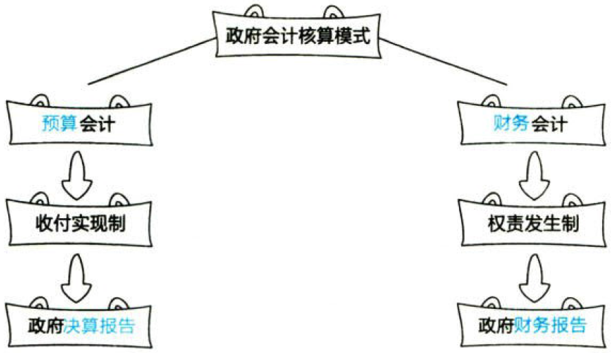
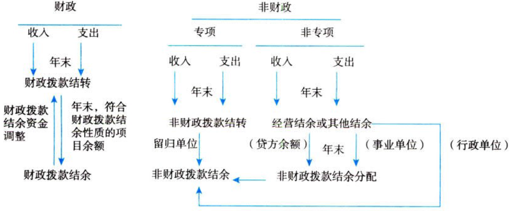

政府及民间非营利组织会计

# 1. 政府会计.概述

政府会计，是运用会计专门方法对其主体的`财务状况`、`现金流量`、`运行情况`（含`运行成本`，下同）、`预算执行`等情况进行`核算`、`监督`和`报告`。它是会计体系的重要分支。

## 1.1. 政府会计标准体系

我国的政府会计标准体系由政府会计`基本准则`、`具体准则`及其`应用指南`和政府`会计制度`组成。

## 1.2. 政府会计核算模式

政府会计由`预算`会计和`财务`会计构成。

### 1.2.1. 政府预算会计和财务会计的“适度分离”

#### 1.2.1.1. “双功能”

政府会计核算应当实现预算会计和财务会计`双重功能`。预算会计应准确完整反映政府预算收入、预算支出和预算结余等`预算执行`信息，财务会计应全面准确反映政府的资产、负债、净资产、收入、费用等`财务`信息。

#### 1.2.1.2. “双基础”

预算会计实行`收付实现制`，国务院另有规定的，从其规定：财务会计实行`权责发生制`。

#### 1.2.1.3. “双报告”

政府会计主体应当编制`决算报告`和`财务报告`。政府决算报告的编制主要以收付实现制为基础，以预算会计核算生成的数据为准；政府财务报告的编制主要以权责发生制为基础，以财务会计核算生成的数据为准。

### 1.2.2. 政府预算会汁和财务会计的“相互衔接”

在同一会计核算系统中，政府预算会计要素和财务会计要素相互协调，决算报告和财务报告`相互补充`，共同反映政府会计主体的预算执行信息和财务信息。

## 1.3. 政府会计要素及其确认和计量

### 1.3.3. 政府预算会计.要素

政府预算会计要素包括`预算收入`、`预算支出`、`预算结余`。

#### 1.3.3.4. 预算收入

顶算收入是指政府会计主体在预算年度内依法取得的并纳入预算管理的`现金流入`。预算收入一般在`实际收到`时予以确认，以实际收到的金额计量。

#### 1.3.3.5. 预算支出

预算支出是指政府会计主体在预算年度内依法发生并纳入预算管理的`现金流出`。预算支出一般在`实际支付`时予以确认，以实际支付的金额计量。

#### 1.3.3.6. 预算结余

预算结余是指政府会计主体预算年度内预算收入扣除预算支出后的资金`余额`，以及历年滚存的资金余额。

预算结余包括`结余`资金和`结转`资金。结余资金是指年度预算执行终了.预算收入实际完成数扣除预算支出和结转资金后剩余的资金。结转资金是指预算安排项目的支出年终尚未执行完毕或者因故未执行，且下年需要按原用途继续使用的资金。

### 1.3.4. 政府财务会计.要素

政府财务会计要素包括`资产`、`负债`、`净资产`、`收入`和`费用`。

#### 1.3.4.7. 资产

资产是指政府会计主体`过去`的经济业务或者事项形成的，由政府会计主体`控制`的，预期能够产生服务潜力或者带来经济利益流入的经济`资源`。

政府资产的计量属性主要包括`历史成本`、`重置成本`、`现值`、`公允价值`和`名义金额`。政府会计主体在对资产进行计量时，一般应当采用`历史成本`。采用重置成本、现值、公允价值计量的，应当保证所确定的资产金额能够持续、可靠计量。无法采用历史成本、重置戚本、现值和公允价值计量属性的，采用名义金额（即人民币`1元`）计量。

#### 1.3.4.8. 负债

负债是指政府会计主体`过去`的经济业务或者事项形成的，预期会导致经济资源流出政府会计主体的`现时义务`。

政府负债的计量属性主要包括`历史成本`、`现值`和`公允价值`。

#### 1.3.4.9. 净资产

净资产是指政府会计主体资产扣除负债后的`净额`：其金额取决于资产和负债的计量。

#### 1.3.4.10. 收入

收入是指报告期内导致政府会计主体净资产增加的、含有服务潜力或者经济利益的经济资源的`流入`。

#### 1.3.4.11. 费用

费用是指报告期内导致政府会计主体净资产减少的、含有服务潜力或者经济利益的经济资源的`流出`。

## 1.4. 政府财务报告vs决算报告

政府财务报告是反映政府会计主体某一特定日期的`财务状况`和某一会计期间的`运行情况`和`现金流量`等信息的文件。

政府决算报告是综合反映政府会计主体年度`预算收支执行结果`的文件。



# 2. 政府单位特定业务.会计核算

## 2.5. 单位会计核算.一般原则

行政事业单位（以下简称“单位”）应当根据政府会计准则规定的原则和《政府会计制度》的要求，对其发生的各项经济业务或事项进行会计核算。

### 2.5.5. 单位预算会计

单位预算会计采用收付实现制，国务院另有规定的从其规定。

预算会计恒等式：预算`收入`－预算`支出`＝预算`结余`

单位在日常核算时，为了保证预算会计要素能够单独循环，单位应当设置`“资金结存”`科目，核算纳入部门预算管理的资金的流入、流出、调整和滚存等情况。“资金结存”科目根据资金支付方式及资金形态，应设置“`零余额账户用款额度`”“`货币资金`”“`财政应返还额度`”三个明细科目。

提示：年末预算收支结转后“资金结存”科目`借方余额`与预算结转类和结余类等科目`贷方余额`相等。

### 2.5.6. 单位财务会计

单位财务会计实行权责发生制。

反映单位财务状况的等式：`资产`－`负债`＝`净资产`

反映运行情况的等式：`收入`－`费用`＝`本期盈余`

`年末`，本期盈余应无余额，经分配后最终`转入`净资产。

单位对于纳入部门`预算管理`的现金收支业务，在采用`财务会计核算`的`同时`应当进行`预算会计核算`；对于其他业务，`仅`需进行财务会计核算。上述部门预算指的是部门`综合`预算，由财政拨款收支和非财政拨款收支构成；对于纳入`决算报表编制范围`但未纳入年初批复预算的非财政收支，也应当进行预算会计处理。

对于单位受托代理的现金以及不纳入部门预算管理的暂收暂付款项（如应上缴、应转拨或应退回的资金），仅需要进行财务会计处理，`不需要`进行预算会计处理。

此外，关于应交增值税的会计处理单位财务会计与企业会计基本相间，但是在预算会计中，实际缴纳增值税时计入`预算支出`，

即增值税销项税额和进项税额已经`包含在`预算收入和预算支出中。

## 2.6. 国库集中支付业务

单位实行国库集中支付的，财政资金的支付方式有两种：财政`直接`支付和财政`授权`支付。

### 2.6.7. 财政直接支付.程序

单位先提出支付`申请`，财政部门收到申请后发出`支付令`，最后由代理`银行`经办资金支付。单位应在收到“财政直接支付入账`通知书`”时，根据入账通知书中注明的金额确认财政拨款`收入`，同时确认相关`支出`或相关`资产`。【每次都伸手要钱】

年末，单位依据本年度财政直接支付预算`指标数`与当年财政直接支付实际支出数的`差额`，增记财政应返还额度并确认财政拨款收入；财政直接支付额度下年度恢复后，单位在实际发生支出时，需冲减财政应返还额度。【没给够的，来年再给】

### 2.6.8. 财政授权支付.程序

财政授权支付，单位申请到的是用款`限额`（并不是存入单位账户的实有资金），在用款限额内单位可以自行开具`支付令`，再由代理`银行`向收款人支付款项。单位应在收到“授权支付到账`通知书`”时，根据通知书注明的金额确认财政拨款`收入`，并增记`零余额账户用款额度`，支用额度时需冲减零余额账户用款额度。【给你一大笔，慢慢花】

年末，单位注销额度时依据代理银行提供的对账单，冲减零余额账户用款额度，并增记财政应返还额度。【暂时没收，来年再给】

年末，若单位本年度财政授权支付预算`指标数`大于零余额账户用款额度下达数，按其`差额`，确认财政拨款收入并增记财政应返还额度。下年年初恢复额度或下年度收到财政部门批复的上年末未下达零余额账户用款额度时，冲减财政应返还额度。【没给够的，来年再给】

### 2.6.9. 国库集中支付业务.账务处理

单位应当对国库集中支付业务进行预算会计核算的`同时`进行财务会计核算。

#### 2.6.9.12. 直接支付业务

:moneybag:【会计分录】①收到“财政直接支付入账通知书”时

```
///预算会计
借：行政支出/事业支出等
  贷：财政拨款预算收入
///财务会计
借：库存物品/固定资产/应付职工薪酬/业务活动费用/单位管理费用等
  贷：财政拨款收入
```

:moneybag:【会计分录】②年末，根据本年度财政直接支付预算指标数与当年财政直接支付实际支出数的差额

```
///预算会计
借：资金结存——财政应返还额度
  贷：财政拨款预算收入
///财务会计
借：财政应返还额度
  贷：财政拨款预算收入
```

:moneybag:【会计分录】③下年使用以前年度财政直接支付额度支付款项时

```
///预算会计
借：行政支出/事业支出等
  贷：资金结存——财政应返还额度
///财务会计
借：库存物品/固定资产/应付职工薪酬/业务活动费用/单位管理费用等
  贷：财政应返还额度
```

#### 2.6.9.13. 权支付业务

:moneybag:【会计分录】①收到代理银行盖章的“授权支付到账通知书”时

```
///预算会计
借：资金结存——零余额账户用款额度
  贷：财政拨款预算收入
///财务会计
借：零余额账户用款额度
  贷：财政拨款收入
```

:moneybag:【会计分录】②按规定支用额度时，按照实际支用的额度

```
///预算会计
借：行政支出/事业支出等
  贷：资金结存——零余额账户用款额度
///财务会计
借：库存物品/固定资产/应付职工薪酬/业务活动费用/单位管理费用等
  贷：零余额账户用款额度
```

:moneybag:【会计分录】③年末，依据代理银行提供的对账单作注销额度

```
///预算会计
借：资金结存——财政应返还额度
  贷：资金结存——零余额账户用款额度
///财务会计
借：财政应返还额度
  贷：零余额账户用款额度
```

:moneybag:【会计分录】④下年年初恢复额度时

```
///预算会计
借：资金结存——零余额账户用款额度
  贷：资金结存——财政应返还额度
///财务会计
借：零余额账户用款额度
  贷：财政应返还额度——财政授权支付
```

:moneybag:【会计分录】⑤年末，单位本年度财政授权支付预算指标数＞零余额账户用款额度下达数的，根据未下达的用款额度

```
///预算会计
借：资金结存——财政应返还额度
  贷：财政拨款预算收入
///财务会计
借：财政应返还额度
  贷：财政拨款收入
```

:moneybag:【会计分录】⑥下年度收到财政部门批复的上年末未下达零余额账户用款额度时

```
///预算会计
借：资金结存——零余额账户用款额度
  贷：资金结存——财政应返还额度
///财务会计
借：零余额账户用款额度
  贷：财政应返还额度
```

## 2.7. 非财政拨款收支业务

单位的收支业务除了国库集中收付业务之外，还包括事业活动、经营活动等形成的收支。

### 2.7.10. 事业（预算）收入

事业收入是指事业单位开展专业业务活动及其辅助活动实现的收入，不包括从同级政府财政部门取得的各类财政拨款。

科目设置：

①预算会计（收付实现制）：事业预算收入

②财务会计（权责发生制）：事业收入

#### 2.7.10.14. 采用.财政专户返还方式

:moneybag:【会计分录】①实际收到或应收应上缴财政专户的事业收入时

```
///预算会计：无
///财务会计
借：银行存款/应收账款等
  贷：应缴财政款
```

:moneybag:【会计分录】②向财政专户上缴款项时

```
///预算会计：无
///财务会计
借：应缴财政款
  贷：银行存款等
```

:moneybag:【会计分录】③收到从财政专户返还的款项时

```
///预算会计：
借：资金结存——货币资金
  贷：事业预算收入
///财务会计
借：银行存款等
  贷：预算收入
```

#### 2.7.10.15. 采用.预收款方式

:moneybag:【会计分录】①实际收到款项时

```
///预算会计：
借：资金结存——货币资金
  贷：事业预算收入
///财务会计
借：银行存款等
  贷：预收账款
```

:moneybag:【会计分录】②按合同完成进度确认事业收入时

```
///预算会计：无
///财务会计
借：预收账款
  贷：事业收入
```

#### 2.7.10.16. 采用.应收款方式

:moneybag:【会计分录】①根据合同完成进度计算本期应收的款项

```
///预算会计：无
///财务会计
借：应收账款
  贷：事业收入
```

:moneybag:【会计分录】②实际收到款项时

```
///预算会计：
借：资金结存——货币资金
  贷：事业预算收入
///财务会计
借：银行存款等
  贷：应收账款
```

#### 2.7.10.17. 其他方式下

:moneybag:【会计分录】其他方式

```
///预算会计：
借：资金结存——货币资金
  贷：事业预算收入
///财务会计
借：银行存款/库存现金等
  贷：事业收入
```

提示：单位根据合同完成进度确认事业收入时，应当依据业务实质，选择相应的方法合理确定合同完成进度。{

①累计实际发生的合同成本占合同预计总成本的比例；

②已经完成的合同工作量占合同预计总工作量的比例；

③已经完成的时间占合同期限的比例；

④实际测定的完工进度。

}

提示：事业活动中涉及增值税业务的，事业收入的入账金额为实际收到的金额扣除增值税销项税，事业预算收入的入账金额为实际收到的全额。

提示：事业单位对于取得的非同级财政拨款收入（因开展专业业务活动及其辅助活动），应当在“事业收入”和“事业预算收入”下设置“非同级财政拨款”明细科目核算；对于其他非同级财政拨款收入，直接在“非同级财政拨款收入”科目核算。

### 2.7.11. 捐赠（预算）收入和支出

单位接受的现金资产属于捐赠预算收入。

:moneybag:【会计分录】接受捐赠的货币资金，按实际收到的金额

```
///预算会计：
借：资金结存——货币资金
  贷：其他预算收入——捐赠预算收入
///财务会计
借：银行存款/库存现金等
  贷：捐赠收入
```

:moneybag:【会计分录】接受捐赠的存货、固定资产，按确定的成本

```
///预算会计：
借：其他支出//相关税费等
  贷：资金结存——货币资金
///财务会计
借：库存物品/固定资产等
  贷：银行存款等//相关税费等
      捐赠收入
```

:moneybag:【会计分录】接受捐赠的存货、固定资产，按名义金额入账

```
///预算会计：
借：其他支出//相关税费等
  贷：资金结存——货币资金
///财务会计
借：库存物品/固定资产等//名义金额
  贷：捐赠收入
借：其他费用
  贷：银行存款等//相关税费等
```

提示：单位对外捐赠非现金资产（库存物品、固定资产等），财务会计通过“资产处置费用”科目核算，将账面价值转入其中；如未支付相关费用，预算会计则不做账务处理。

### 2.7.12. 债务预算收入和债务还本支出

债务预算收入是指事业单位接照规定从银行和其他金融机构等借入的、纳入部门预算管理的、不以财政资金作为偿还来源的债务本金，债务还本支出是指事业单位偿还自身承担的纳入预算管理的从金融机构举借的债务本金的现金流出。

事业单位科目设置：

①预算会计：债务预算收入、债务还本支出

②财务会计：短期借款、长期借款、应付利息等

:moneybag:【会计分录】①取得借款

```
///预算会计：
借：资金结存——货币资金
  贷：债务预算收入
///财务会计
借：银行存款
  贷：短期借款/长期借款——本金
```

:moneybag:【会计分录】②计提利息

```
///预算会计：无
///财务会计
借：在建工程等//资本化的借款利息
    其他费用//费用化利息
  贷：应付利息//短期借款、分期付息
      长期借款——应计利息//到期一次还本付息
```

:moneybag:【会计分录】③支付利息

```
///预算会计：
借：其他支出
  贷：资金结存——货币资金
///财务会计
借：应付利息
  贷：银行存款
```

:moneybag:【会计分录】④偿还借款

```
///预算会计：
借：债务还本支出//支付的本金
    其他支出//支付的利息
  贷：资金结存——货币资金
///财务会计
借：短期借款/长期借款——本金
  贷：银行存款
```

### 2.7.13. 投资支出

投资支出指事业单位以货币资金对外投资发生的现金流出。

事业单位科目设置：

①预算会计：投资支出

②财务会计：短期投资、长期股权投资、长期债券投资等

:moneybag:【会计分录】①以货币资金对外投资

```
///预算会计：
借：投资支出
  贷：资金结存——货币资金
///财务会计
借：短期投资/长期股权投资/长期债券投资等
  贷：银行存款等
```

:moneybag:【会计分录】②收到价款中包含的利息或股利

```
///预算会计：
借：资金结存——货币资金
  贷：投资支出
///财务会计
借：银行存款
  贷：短期投资/应收股利/应收利息等
```

:moneybag:【会计分录】③持有股权投资期间的利息或股利

```
///预算会计：
借：资金结存——货币资金
  贷：投资预算收益
///财务会计
借：银行存款
  贷：应收股利/应收利息
```

:moneybag:【会计分录】④出售/对外转让/到期收回（按规定将投资收益留归本单位的）

```
///预算会计：
借：资金结存——货币资金
  贷：投资收益//当年
      其他结余//取得投资时“投资支出”科目的发生额
      投资预算收益//倒挤的差额
///财务会计
借：银行存款
  贷：短期投资/长期股权投资/长期债券投资//对外投资的账面余额
      应收股利/应收利息//尚未领取的
      银行存款//相关税费
      投资收益//倒挤的差额
```

## 2.8. 预算.结转结余+分配业务

对于财政拨款结转结余和非财政拨款结转结余单位应当严格区分。财政拨款结转结余应单独设置“财政拨款结转”和“财政拨款结余”科目核算，不参与事业单位的结余分配。非财政拨款结转结余则设置“非财政拨款结转”“非财政拨款结余”“专用结余”“经营结余”“非财政拨款结余分配”等科目进行核算。



### 2.8.14. 财政拨款.结转+结余.核算

#### 2.8.14.18. 财政拨款结转.核算

在预算会计中事业单位应当设置“财政拨款结转”科目，核算滚存的财政拨款结转资金的调整、结转和滚存情况。年末结转后，本科目除“累计结转”明细科目外，其他明细科目应无余额。

:moneybag:【会计分录】①年末

```
///预算会计：
借：财政拨款预算收入//本年发生额
  贷：财政拨款结转——本年收支结转
借：财政拨款结转——本年收支结转
  贷：各项支出//财政拨款支出，各项支出中的财政拨款支出本年发生额
///财务会计：无
```

:moneybag:【会计分录】②从其他单位调入财政拨款结转资金

```
///预算会计：
借：资金结存——财政应返还额度/零余额账户用款额度/货币资金
  贷：财政拨款结转——归集调入
///财务会计：
借：财政应返还额度/零余额账户用款额度等
  贷：累计盈余
```

:moneybag:【会计分录】③按规定上缴或注销/调出财政拨款结转资金

```
///预算会计：
借：财政拨款结转——归集上缴/归集调出
  贷：资金结存——财政应返还额度/零余额账户用款额度/货币资金
///财务会计：
借：累计盈余
  贷：财政应返还额度/零余额账户用款额度等
```

:moneybag:【会计分录】④差错调整

```
///预算会计：【或反转】
借：资金结存——财政应返还额度/零余额账户用款额度/货币资金
  贷：财政拨款结转——年初余额调整
///财务会计：【或反转】
借：零余额账户用款额度/银行存款等
  贷：以前年度盈余调整
```

:moneybag:【会计分录】⑤财政拨款结余资金改变用途

```
///预算会计：
借：财政拨款结余——单位内部调剂
  贷：财政拨款结转——单位内部调剂
///财务会计：无
```

:moneybag:【会计分录】⑥年末，冲销有关明细科目余额

```
///预算会计：
    将“财政拨款结转——本年收支结转／年初余额调整／归集调入／归集调出／归集上缴／单位内部调剂”余额转入“财政拨款绪转——累计结转”
///财务会计：无
```

:moneybag:【会计分录】⑦年末，将符合财政拨款结余性质的项目余额转入财政拨款结余

```
///预算会计：
借：财政拨款结转——累计结转
  贷：财政拨款结余——结转转入
///财务会计：无
```

#### 2.8.14.19. 财政拨款结余.核算

在预算会计中单位应当设置“财政拨款结余”科目，核算单位滚存的财政拨款项目支出结余资金的调整、结转和滚存情况。年末结转后，本科目除“累计结余”明细科目外，其他明细科目应无余额。

:moneybag:【会计分录】①年末，将符合财政拨款结余性质的项目余额转入财政拨款结余

```
///预算会计：
借：财政拨款结转——累计结转
  贷：财政拨款结余——结转转入
///财务会计：无
```

:moneybag:【会计分录】②财政拨款结余资金改变用途

```
///预算会计：
借：财政拨款结余——单位内部调剂
  贷：财政拨款结转——单位内部调剂
///财务会计：无
```

:moneybag:【会计分录】③上缴或注销

```
///预算会计：
借：财政拨款结余——归集上缴
  贷：资金结存——财政应返还额度/零余额账户用款额度/货币资金
///财务会计：
借：累计盈余
  贷：财政应返还额度/零余额账户用款额度等
```

:moneybag:【会计分录】④差错调整

```
///预算会计：【或反转】
借：资金结存——财政应返还额度/零余额账户用款额度/货币资金
  贷：财政拨款结余——年初余额调整
///财务会计：【或反转】
借：零余额账户用款额度/银行存款等
  贷：以前年度盈余调整
```

:moneybag:【会计分录】⑤年末，冲销有关明细科目余额

```
///预算会计：
    将本科目（年初余额调整／归集上缴／单位内部调剂／结转转入）余额转入本科目（累计结余）
///财务会计：无
```

### 2.8.15. 非财政拨款结转.核算

非财政拨款结转资金是指事业单位除财政拨款收支、经营收支以外的各非同级财政拨款专项资金收入与其相关支出相抵后剩余滚存的、须按规定用途使用的结转资金。在预算会计中单位应当设置“非财政拨款结转”科目，核算单位除财政拨款收支、经营收支以外各非同级财政拨款专项资金的调整、结转和滚存情况。

:moneybag:【会计分录】①年末

```
///预算会计：
借：事业预算收入/上级补助预算收入/附属单位上缴预算收入/非同级财政拨款预算收入/债务预算收入/其他预算收入//各专项资金收入
  贷：非财政拨款结转——本年收支结转
借：非财政拨款结转——本年收支结转
  贷：行政支出/事业支出/其他支出//各非财政拨款专项资金支出
///财务会计：无
```

:moneybag:【会计分录】②从科研项目预算收入中提取项目管理费或间接费时

```
///预算会计：
借：非财政拨款结转——项目间接费用或管理费
  贷：非财政拨款结余——项目间接费用或管理费
///财务会计：
借：单位管理费用
  贷：预提费用——项目间接费用或管理费
```

:moneybag:【会计分录】③差错更正

```
///预算会计：【或反转】
借：资金结存——货币资金
  贷：非财政拨款结转——年初余额调整
///财务会计：【或反转】
借：银行存款等
  贷：以前年度盈余调整
```

:moneybag:【会计分录】④按照规定缴回

```
///预算会计：
借：非财政拨款结转——缴回资金
  贷：资金结存——货币资金
///财务会计：
借：累计盈余
  贷：银行存款等
```

:moneybag:【会计分录】⑤年末，冲销有关明细科目余额

```
///预算会计：
    将“非财政拨款结转——年初余额调整／项目间接费用或管理费／缴回资金／本年收支结转”科目余额转入“非财政拨款结转——累计结转”科目
    提示：始转后，“非财政拨款结转”科目除“累计结转”明细科目外，其他明细科目应无余额
///财务会计：无
```

:moneybag:【会计分录】⑥年末，留归本单位使用的非财政拨款专项（项目已完成）剩余资金转入非财政拨款结余

```
///预算会计：
借：非财政拨款结转——累计结转
  贷：非财政拨款结余——结转转入
///财务会计：无
```

### 2.8.16. 非财政拨款结余.核算

非财政拨款结余指单位历年滚存的非限定用途的非同级财政拨款结余资金，主要为非财政拨款结余扣除结余分配后滚存的金额。单位应当在预算会计中设置“非财政拨款结余”科目，核算单位历年滚存的非限定用途的非同级财政拨款结余资金。

:moneybag:【会计分录】①年末，将留归本单位使用的非财政拨款专项（项目已完成）剩余资金转入非财政拨款结余

```
///预算会计：
借：非财政拨款结转——累计结转
  贷：非财政拨款结余——结转转入
///财务会计：无
```

:moneybag:【会计分录】②按照规定从科研项目预算收入中提取项目管理费或间接费时

```
///预算会计：
借：非财政拨款结转——项目间接费用或管理费
  贷：非财政拨款结余——项目间接费用或管理费
///财务会计：
借：单位管理费用
  贷：预提费用——项目间接费用或管理费
```

:moneybag:【会计分录】③实际缴纳企业所得税

```
///预算会计：
借：非财政拨款结余——累计结余
  贷：资金结存——货币资金
///财务会计：
借：其他应交税费——单位应交所得税
  贷：银行存款等
```

:moneybag:【会计分录】④差错更正

```
///预算会计：【或反转】
借：资金结存——货币资金
  贷：非财政拨款结余——年初余额调整
///财务会计：【或反转】
借：银行存款等
  贷：以前年度盈余调整
```

:moneybag:【会计分录】⑤年末，冲销有关明细科目余额

```
///预算会计：
    将“非财政拨款结余——年初余额调整／项目间接费用或管理费／结转转入”科目余额结转入“非财政拨款结余——累计结余”科目
    提示：给转后，本科目除“累计结余”明细科目外，其他明知科目应无余额
///财务会计：无
```

:moneybag:【会计分录】⑥年末，事业单位将“非财政拨款结余分配”科目余额转入非财政拨款结余

```
///预算会计：【或反转】
借：非财政拨款结余——累计结余
  贷：非财政拨款结余分配
///财务会计：无
```

:moneybag:【会计分录】⑦年末，行政单位将“其他结余”科目余额转入非财政拨款结余

```
///预算会计：【或反转】
借：非财政拨款结余——累计结余
  贷：其他结余
///财务会计：无
```

### 2.8.17. 经营结余+其他结余+非财政拨款结余分配

#### 2.8.17.20. 经营结余.核算

在预算会计中事业单位应当设置“经营结余”科目。事业单位应当在期末结转本期经营收支。根据经营预算收入本期发生额，借记“经营预算收入”科目，贷记“经营结余”科目；根据经营支出本期发生额，借记“经营结余”科目，贷记“经营支出”科目。年末，如“经营结余”科目为贷方余额，将余额结转入“非财政拨款结余分配”科目，借记“经营结余”科目，贷记“非财政拨款结余分配”科目；如为借方余额，为经营亏损，不予结转。

#### 2.8.17.21. 其他结余.核算

在预算会计中单位应当设置“其他结余”科目，核算单位本年度除财政拨款收支、非同级财政专项资金收支和经营收支以外各项收支相抵后的余额。

:moneybag:【会计分录】年末在预算会计中：

```
借：事业预算收入、上级补助预算收入、附属单位上缴预算收入、非同级财政拨款预算收入、债务预算收入、其他预算收入//各非专项资金收入
    投资预算收益//倒挤的差额
  贷：其他结余
借：其他结余
  贷：行政支出、事业支出、其他支出（各非同级财政、非专项资金支出）、上缴上级支出、对附属单位补助支出、投资支出、债务还本支出
```

年末，完成上述结转后，行政单位将本科目余额转入“非财政拨款结余——累计结余”科目；事业单位将本科目余额转入“非财政拨款结余分配”科目。

#### 2.8.17.22. 非财政拨款结余分配.核算

在预算会计中事业单位应当设置“非财政拨款结余分配”科目，核算事业单位本年度非财政拨款结余分配的情况和结果。年末，事业单位应将“其他结余”科目余额和“经营结余”科目贷方余额转入“非财政拨款结余分配”科目。根据有关规定提取专用基金的，按照提取的金额，借记“非财政拨款结余分配”科目，贷记“专用结余”科目；同时在财务会计中按照相同金额，借记“本年盈余分配”科目，贷记“专用基金”科目。然后，将“非财政拨款结余分配”科目余额转入非财政拨款结余。

## 2.9. 净资产业务

在财务会计中单位净资产的来源主要由累计实现的盈余和无偿调拨的净资产构成。在财务会计的日常核算中，单位应当设置以下科目：累计盈余、专用基金、无偿调拨净资产、权益法调整、本期盈余、本年盈余分配和以前年度盈余调整等。

### 2.9.18. 本期盈余

本期盈余反映单位本期各项收入、费用相抵后的余额。

:moneybag:【会计分录】期末，单位应当将各类收入科目的本期发生额转入本期盈余

```
借：财政拨款收入
    事业收入
    上级补助收入
    附属单位上缴收入
    经营收入
    非同级财政拨款收入
    投资收益
    捐赠收入
    利息收入
    租金收入
    其他收入
  贷：本期盈余
```

:moneybag:【会计分录】将各类费用科目本期发生额转入本期盈余：

```
借：本期盈余
  贷：业务活动费用
      单位管理费用
      经营费用
      所得税费用
      资产处置费用
      上缴上级费用
      对附属单位补助费用
      其他费用
```

年末，单位应当将“本期盈余”科目余额转入“本年盈余分配”科目。

### 2.9.19. 本年盈余分配

单位设置“本年盈余分配”科目，反映单位本年度盈余分配的情况和结果。年末，单位应当将“本期盈余”科目余额转入本科目，借记或贷记“本期盈余”科目，贷记或借记“本年盈余分配”科目。根据有关规定从本年度非财政拨款结余或经营结余中提取专用基金的，按照预算会计下计算的提取金额，借记“本年盈余分配”科日，货记“专用基金”科目。然后，将“本年盈余分配”科目余额转入“累计盈余”科目。

### 2.9.20. 专用基金

专用基金是指事业单位按照规定提取或设置的具有专门用途的净资产，主要包括职工福利基金、科技成果转换基金等。在财务会计下事业单位应当设置“专用基金”科目，对专用基金的取得和使用情况进行核算。在预算会计中设置“专用结余”科目进行核算。

#### 2.9.20.23. 专用基金.取得

:moneybag:【会计分录】事业单位根据有关规定从预算收入中提取专用基金并计入费用的，一般按照预算会计下基于预算收入计算提取的金额：

```
借：业务活动费用等
  贷：专用基金
```

:moneybag:【会计分录】事业单位根据有关规定设置的其他专用基金，按照实际收到的基金金额：

```
借：银行存款等
  贷：专用基金
```

:moneybag:【会计分录】年末，事业单位根据有关规定从本年度非财政拨款结余或经营结余中提取专用基金的，按照预算会计下计算的提取金额，在财务会计中：

```
借：本年盈余分配
  贷：专用基金
```

:moneybag:【会计分录】同时在预算会计中：

```
借：非财政拨款结余分配
  贷：专用结余
```

#### 2.9.20.24. 专用基金.使用

:moneybag:【会计分录】事业单位按照规定使用提取的专用基金时，在财务会计中：

```
借：专用基金
  贷：银行存款等
```

:moneybag:【会计分录】同时在预算会计中：

```
借：专用结余//使用从非财政拨款结余或经营结余中提取的专用基金
    事业支出//使用从预算收入中提取并计入费用的专用基金
  贷：资金结存——货币资金
```

:moneybag:【会计分录】单位使用提取的专用基金购置固定资产、无形资产的，按照固定资产、无形资产成本金额：

```
借：固定资产、无形资产
  贷：银行存款等
///预算会计处理同上
```

:moneybag:【会计分录】同时，按照专用基金使用金额：

```
借：专用基金
  贷：累计盈余
```

### 2.9.21. 无偿调拨净资产

无偿调拨非现金资产一般不涉及资金业务，除非以现金支付相关费用，否则不需要进行预算会计核算。无偿调拨资产业务本质上属于政府间净资产的变化，调入调出方不确认相应的收入和费用。单位应当设置“无偿调拨净资产”科目，核算无偿调入或调出非现金资产所引起的净资产变动金额。

:moneybag:【会计分录】单位按照规定取得无偿调入的非现金资产

```
///预算会计：
借：其他支出//调入方实际方式的费用金额
  贷：资金结存
///财务会计：
借：库存物品／长期股权投资／固定资产／无形资产／公共基础设施／政府储备物资／文物文化资产／保障性住房等//［相关资产在测出方的账面价值加相关税费、运输费等（资产账面价值为零或该资产以名义金额计量的除外）］
  贷：零余额账户用款额度／银行存款等（调入过程中发生的归属于调入方的相关费用）
      无偿调拨净资产//倒挤的差额
```

提示：无偿调入资产在调出方的账面价值为零（即已经按制度规定提足折旧）或者账面余额为名义金额的，单位｛调入方）应当将调入过程中共承担的相关税费计入当期费用，不计入调入资产的初始入账成本。

:moneybag:【会计分录】单位按照规定经批准无偿调出非现金资产

```
///预算会计：
借：其他支出
  贷：资金结存
///财务会计：
借：无偿调拨净资产（调出资产的账面余额或账面价值）
    固定资产累计折旧／无形资产累计摊销／公共基础设施累计折旧（摊销）／保障性住房累计折旧（相关资产已计提的累计折旧或摊销）
  贷：库存物品／长期股权投资／固定资产／无形资产／公共基础设施／政府储备物资／文物文化资产／保障性住房等（调出资产的账面余额）
借：资产处置费用（调出过程中发生的归属于调出方的相关费用）
  贷：零余额账户用款额度／银行存款等
```

:moneybag:【会计分录】年末，单位应将“无偿调拨净资产”科目余额转入累计盈余

```
///财务会计：【或反转】
借：无偿调拨净资产
  贷：累计盈余
```

### 2.9.22. 权益法调整

“权益法调整”科目核算事业单位持有的长期股仅投资采用权益法核算时，按照被投资单位除净损益和利润分配以外的所有者权益变动份额调整长期股权投资账面余额而计入净资产的金额。年末，按照被投资单位除净损益和利润分配以外的所有者权益变动应享有（或应分担）的份额，借记或贷记“长期股权投资——其他权益变动”科目，贷记或借记“权益法调整”科目。处置长期股权投资时，按照原计入净资产的相应部分金额，借记或贷记“权益法调整”科目，贷记或借记“投资收益”科目。

### 2.9.23. 以前年度盈余调整

“以前年度盈余调整”科目核算单位本年度发生的调整以前年度盈余的事项，包括本年度发生的重要前期差错更正涉及调整以前年度盈余的事项。调整后，单位应当及时结转“以前年度盈余调整”科目余额，借记或贷记“累计盈余”科目，贷记或借记“以前年度盈余调整”科目。

### 2.9.24. 累计盈余

累计盈余反映单位历年实现的盈余扣除盈余分配后滚存的金额，以及因无偿调入调出资产产生的净资产变动额。年末，将“本年盈余分配”科目的余额转入累计盈余，借记或贷记“本年盈余分配”科目，贷记或借记“累计盈余”科目；将“无偿调拨净资产”科目的余额转入累计盈余，借记或贷记“无偿调拨净资产”科目，贷记或借记“累计盈余”科目。

按照规定上缴、缴回、单位间调剂结转结余资金产生的净资产变动额，以及对以前年度盈余的调整金额，也通过“累计盈余”科目核算。

## 2.10. 资产业务

单位资产依据流动性划分为两类：流动资产和非流动资产。

流动资产：库存现金、银行存款、其他货币资金、零余额账户用款额度、财政应返还额度、短期投资、应收及预付款项、存货等。

非流动资产：固定资产、在建工程、无形资产、长期投资、公共基础设施、政府储备资产、文物文化资产、保障性住房等。

### 2.10.25. 资产业务.共性内容

#### 2.10.25.25. 资产.取得

单位可以采用外购、自行加工或自行建造、接受捐赠、无偿调入、置换换入、租赁等方式取得资产。资产在取得时应当按照成本进行初始计量。

①外购资产的成本通常包括购买价款、相关税费（除按规定可抵扣的增值税进项税额）、以及使资产达到目前场所和状态或交付使用前所发生的可归属于该项资产的其他支出。

②自行加工或自行建造资产的成本包括使该项资产达到目前场所和状态或交付使用前所发生的全部必要支出。

③对于接受捐赠的存货、固定资产、无形资产等非现金资产，其成本按照有关凭据注明的金额加上相关税费、运输费等确定；没有相关凭据可供取得，但按规定经过资产评估的，其成本按照评估价值加上相关税费、运输费等确定；没有相关凭据可供取得、也未经资产评估的，其成本比照同类或类似资产的市场价格加上相关税费、运输费等确定；没有相关凭据且未经资产评估、同类或类似资产的市场价格也无法可撑取得的，按照名义金额（人民币1元）入账，相关税费、运输费等计入当期费用。对于接受捐赠的投资和公共基础设施、政府储备物资、保障性住房、文物文化资产等资产，其初始成本不能采用名义金额计量，仅能按照前三个层次进行计量。盘盈资产参照上述规定确定其入账成本。对于接受捐赠的资产，单位应当按照确定的成本减去相关税费后的净额确认捐赠收入。不能确定资产成本的，单独设置备查簿进行登记，相关税费等计入当期费用。

④无偿调入资产的成本按照调出方账面价值加上相关税费、运输费等确定。但是，无偿调入资产在调出方的账面价值为零（即已经接制度规定提足折旧）或者账面余额为名义金额的，单位（调入方）应当将调入过程中其承担的相关税费计入当期费用，不计入调入资产的初始入账成本。

⑤置换取得资产的成本按照换出资产的评估价值，加上支付的补价或减去收到的补价，加上为换入资产发生的其他相关支出确定。

#### 2.10.25.26. 资产.处置

资产处置包括无偿调拨、出售、出让、转让、置换、对外捐赠、报废、毁损以及货币性资产损失核销等形式。单位对资产进行处置时，先按规定报经批准，然后将被处置资产账面价值转销计入资产处置费用，同时将处置净收益上缴财政。对于按规定纳入单位预算管理的资产处置净收益，应将净收益计入当期收入。对于盘盈、盘亏、报废或毁损的资产，应当在报经批准前将相关资产账面价值转入“待处理财产损溢”，待报经批准后再进行会计处理。

对于无偿调出的资产，单位应当将资产账面价值予以转销，同时冲减无偿调拨净资产。对于置换换出的资产，其相关会计处理应当与换入资产一同进行。

### 2.10.26. 应收账款

单位的应收账款是指单位因出租资产、出售物资等应收取的款项以及事业单位提供服务、销售产品等应收取的歌项。主要包括收回后需上缴财政的应收账款和收回后不需上缴财政的应收账款两类。目前，我国政府会计核算仅考虑对收回后不需上缴财政的应收账款及其他应收款进行减值处理，对于其他资产均未考虑减值。

:moneybag:【会计分录】收回后不需上缴财政的应收账款和其他应收款提取坏账准备时：

```
借：其他费用
  贷：坏账准备
```

:moneybag:【会计分录】①发生应收账款.收回后不需上缴财政

```
///财务会计：
借：应收账款
  贷：事业收入/经营收入/其他收入等
```

:moneybag:【会计分录】①发生应收账款.收回后需要上缴财政

```
///财务会计：
借：应收账款
  贷：应缴财政款
```

:moneybag:【会计分录】②收回应收账款.收回后不需上缴财政

```
///预算会计：
借：资金结存——货币资金等
  贷：事业预算收入/经营预算收入/其他预算收入等
///财务会计：
借：银行存款等
  贷：应收账款
```

:moneybag:【会计分录】②收回应收账款.收回后需要上缴财政

```
///财务会计：
借：银行存款等
  贷：应收账款
```

:moneybag:【会计分录】③逾期无法收回的应收账款（报批后予以核销）.收回后不需上缴财政

```
///财务会计：
借：坏账准备
  贷：应收账款
```

:moneybag:【会计分录】③逾期无法收回的应收账款（报批后予以核销）.收回后需要上缴财政

```
///财务会计：
借：应缴财政款
  贷：应收账款
```

:moneybag:【会计分录】④已核销的应收账款在以后期间又收回.收回后不需上缴财政

```
///预算会计：
借：资金结存——货币资金
  贷：非财政拨款结余等
///财务会计：
借：应收账款
  贷：坏账准备
借：银行存款
  贷：应收账款
```

:moneybag:【会计分录】④已核销的应收账款在以后期间又收回.收回后需要上缴财政

```
///财务会计：
借：银行存款等
  贷：应缴财政款
```

### 2.10.27. 库存物品

库存物品是指单位在开展业务活动及其他活动中为耗用或出售而储存的各种材料、产品、包装物、低值易耗品，以及达不到固定资产标准的用具、装具、动植物等的成本。

单位应当设置“库存物品”科目对其库存物品进行核算。已完成的测绘、地质勘察、设计成果等的成本，也通过本科目核算。单位随买随用的零星办公用品，可以在购进时直接列作费用，不通过本科目核算。单位控制的政府储备物资，应当通过“政府储备物资”科目核算，不通过本科目核算。单位受托存储保管的物资和受托转赠的物资，应当通过“受托代理资产”科目核算，不通过本科目核算。单位为在建工程购买和使用的材料物资，应当通过“工程物资”科目核算，不通过本科目核算。

:moneybag:【会计分录】①单位外购的库存物品验收入库

```
///预算会计：
借：行政支出/事业支出/经营支出等
  贷：财政拨款预算收入/资金结存
///财务会计：
借：库存物品//按确定的成本
  贷：财政拨款收入/零余额账户用款额度/银行存款/应付账款/在途物品等
```

:moneybag:【会计分录】②单位自行加工或委托加工的库存物品

```
///预算会计：无
///财务会计：
借：库存物品//按确定的成本
  贷：加工物品——自制物品/委托加工物品
```

:moneybag:【会计分录】③单位接收捐赠的库存物品验收入库

```
///预算会计：
借：其他支出//相关税费
  贷：资金结存
///财务会计：
借：库存物品//按确定的成本
  贷：银行存款等//相关税费
      捐赠收入//差额
///接收捐赠的物品按名义金额入账的：
借：库存物品//名义金额
  贷：捐赠收入
借：其他费用//相关税费
  贷：银行存款等
```

:moneybag:【会计分录】④单位无偿调入的库存物品验收入库（资产账面价值为零或名义金额入账的除外）

```
///预算会计：
借：其他支出//相关税费
  贷：资金结存
///财务会计：
借：库存物品//按确定的成本
  贷：银行存款//相关税费
      无偿调拨净资产//差额
```

:moneybag:【会计分录】⑤单位置换换入的库存物品验收入库

```
///预算会计：
借：其他支出//相关税费
  贷：资金结存
///财务会计：
借：库存物品//按确定的成本
    固定资产累计折旧/无形资产累计摊销
    资产处置费用//借方差额
  贷：固定资产/无形资产等//换出资产账面余额
      银行存款//置换过程的其他支出
      其他收入//贷方差额
```

:moneybag:【会计分录】⑥单位开展业务活动等领用/按规定自主出售发出或加工发出库存物品

```
///预算会计：无
///财务会计：
借：业务活动费用/单位管理费用/经营费用/加工物品等//按照领用/出售等发出物品的实际成本
  贷：库存物品
```

:moneybag:【会计分录】⑦经批准对外出售的库存物品（不含可自主出售的库存物品）发出时

```
///预算会计：无
///财务会计：
借：资产处置费用//按库存物品的账面余额
  贷：库存物品
借：银行存款等//按收到的价款
  贷：银行存款等//处置过程中发生的相关费用
      应缴财政狂//差额
```

:moneybag:【会计分录】⑧经批准对外捐赠的库存物品发出时

```
///预算会计：
借：其他支出//相关税费
  贷：资金结存
///财务会计：
借：资产处置费用//库存物品的账面余额+对外捐赠过程中归属于捐出方的相关费用
  贷：库存物品//库存物品账面余额
      银行存款等//对外捐赠过程中归属于捐出方的相关费用
```

:moneybag:【会计分录】⑨经批准无偿调出的库存物品发出时

```
///预算会计：
借：其他支出//相关税费
  贷：资金结存
///财务会计：
借：无偿调拨净资产
  贷：库存物品//库存物品账面余额
借：资产处置费用//无偿调拨过程中发生的归属于调出方的相关费用
  贷：银行存款等
```

### 2.10.28. 固定资产

固定资产，是指单位为满足自身开展业务活动或其他活动需要而控制的，使用年限超过1年（不含1年）、单位价值在规定标准以上，并在使用过程中基本保持原有物质形态的资产。

单位核算固定资产，应当设置“固定资产”“固定资产累计折旧”等科目。购入需要安装的固定资产，应当先通过“在建工程”科目核算，安装完毕交付使用时再转入“固定资产”科目核算。以借入、经营租赁租人方式取得的困定资产，不通过“固定资产”科目核算，应当设置备查簿进行登记。采用融资租入方式取得的固定资产，通过本科目核算，并在“固定资产”科目下设置“融资租入固定资产”明细科目。经批准在境外购买具有所有权的土地，作为固定资产，通过“固定资产”科目核算；单位应当在“固定资产”科目下设置“境外土地”明细科目，进行相应明细核算。

#### 2.10.28.27. 取得.固定资产

:moneybag:【会计分录】①购入不需要安装的固定资产验收合格时

```
///预算会计：
借：行政支出/事业支出/经营支出等//实际支付的款项
  贷：财政拨款预算收入/资金结存
///财务会计：
借：固定资产//按照确定的固定资产成本
  贷：财政拨款收入/零余额账户用款额度/应付账款/银行存款等//库存物品账面余额
```

提示：购入需要安装的固定资产，在安装完毕交付使用前通过“在建工程”科目核算，安装完毕交付使用时再转入“固定资产”科目。

:moneybag:【会计分录】②自行建造的固定资产交付使用时

```
///预算会计：无
///财务会计：
借：固定资产//按照在建工程成本
  贷：在建工程
```

提示：己交付使用但尚未办理竣工决算手续的固定资产，按估计价值入账，待办理竣工决算后再按照实际成本调整原来的暂估价值。

:moneybag:【会计分录】③融资租赁取得的固定资产

```
///预算会计：
借：行政支出/事业支出/经营支出等//实际支付的税费
  贷：财政拨款预算收入/资金结存
///财务会计：
借：固定资产（不需安装）/在建工程（需安装）//租赁协议确定的租赁价款+相关税费
  贷：长期应付款//租赁协议上的租赁付款额
      财政拨款收入/零余额账户用款额度/银行存款等//相关税费
```

:moneybag:【会计分录】④接受捐赠的固定资产

```
///预算会计：
借：其他支出//实际支付的税费
  贷：资金结存
///财务会计：
借：固定资产（不需安装）/在建工程（需安装）//确定的固定资产成本
  贷：零余额账户用款额度/银行存款等//相关税费
      捐赠收入//差额
```

提示：接受损赠的以名义金额计量的固定资产，其会计处理参照库存物品。

:moneybag:【会计分录】⑤无偿调入的固定资产（资产账面价值为零或名义金额的除外）

```
///预算会计：
借：其他支出//实际支付的税费
  贷：资金结存
///财务会计：
借：固定资产（不需安装）/在建工程（需安装）//确定的固定资产成本
  贷：零余额账户用款额度/银行存款等//相关税费
      无偿调拨净资产//差额
```

提示：元偿调入资产在调出方的账面价值为零或账面余额为名义金额的，支付的相关税费，记入“其他费用”科目。

#### 2.10.28.28. 固定资产.后续支出

:moneybag:【会计分录】①通常情况下，将固定资产转入改建、扩建时

```
借：在建工程
    固定资产累计折旧
  贷：固定资产
```

为增加固定资产使用效能或延长其使用年限而发生的改建、扩建等后续支出，计入在建工程；为保证固定资产正常使用发生的日常维修等支出，计入当期费用。

#### 2.10.28.29. 固定资产.计提折旧

下列固定资产不计提折旧：（l）文物和陈列品；②动植物；③图书、档案；④单独计价入账的土地；（5）以名义金额计量的固定资产。单位应当根据相关规定以及固定资产的性质和使用情况，合理确定固定资产的使用年限。因改建、扩建等原因而延长固定资产使用年限的，应当重新确定固定资产的折旧年限。单位盘盈、无偿调入、接受捐赠以及置换的固定资产，应当考虑该项资产的新旧程度，按照其尚可使用的年限计提折旧。

固定资产应当按月计提折旧，当月增加的固定资产，当月开始计提折旧；当月减少的固定资产，当月不再计提折旧。固定资产提足折旧后，无论能否继续使用，均不再计提折旧；提前报废的固定资产，也不再补提折旧。己提足折旧的固定资产，可以继续使用的，应当继续使用，规范实物管理。

:moneybag:【会计分录】单位按月计提固定资产折旧时，按照应计提折旧金额：

```
借：业务活动费用/单位管理费用/经营费用/加工物品/在建工程等
  贷：固定资产累计折旧
```

#### 2.10.28.30. 处置.固定资产

:moneybag:【会计分录】①报经批准出售、转让固定资产

```
///财务会计：
借：资产处置费用//被出售、转让固定资产账面价值
    固定资产累计折旧
  贷：固定资产
借：银行存款//收到的价款
  贷：银行存款//相关税费
      应缴财政款//差额
```

:moneybag:【会计分录】②报经批准对外捐赠固定资产

```
///预算会计：
借：其他支出
  贷：资金结存//相关费用
///财务会计：
借：资产处置费用//差额
    固定资产累计折旧
  贷：固定资产
      银行存款//捐赠过程中归属于捐出方的相关费用
```

:moneybag:【会计分录】③报经批准无偿调出固定资产

```
///预算会计：
借：其他支出
  贷：资金结存//相关费用
///财务会计：
借：无偿调拨净资产//差额
    固定资产累计折旧
  贷：固定资产
借：资产处置费用
  贷：银行存款等//调出过程中归属于调出方的相关费用
```

:moneybag:【会计分录】④盘亏、毁损、报废的固定资产

```
///预算会计：无
///财务会计：
///转入待处置资产时：
借：待处理财产损溢——待处理财产价值
    固定资产累计折旧
  贷：固定资产
///报经批准予以处置
借：资产处置费用
  贷：待处理财产损溢——待处理财产价值
///支付清理费用
借：待处理财产损溢——处理净收入
  贷：银行存款
///收到残料变价收入或赔款
借：银行存款
  贷：待处理财产损溢——处理净收入
///结转处置固定资产净收入
借：待处理财产损溢——处理净收入
  贷：应缴财政款
```

### 2.10.29. 自行研发取得的无形资产

单位自行研究开发项目的支出，包括研究阶段支出与开发阶段支出，单位应当严格进行区分。研究阶段的支出，应当于发生时计入当期费用；开发阶段的支出，先按合理方法进行归集，如果最终形成无形资产的，应当确认为无形资产；如果最终未形成无形资产的，应当计入当期费用。自行研究开发项目尚未进入开发阶段、或者确实无法区分研究阶段支出和开发阶段支出，但按法律程序已申请取得无形资产的，应当将依法取得时发生的注册费、聘请律师费等费用确认为无形资产。

单位应当设置“研发支出”科目，核算自行研究开发项目研究阶段和开发阶段发生的各项支出。对于研究阶段的支出，应当先在“研发支出”科目归集。期（月）末，应当将本科目归集的研究阶段的支出金额转入当期费用，借记“业务活动费用”等科目，贷记“研发支出——研究支出”科目。

对于开发阶段的支出，先通过本科目进行归集，待自行研究开发项目完成，达到预定用途形成无形资产的，按照本科目归集的开发阶段的支出金额，借记“无形资产”科目，贷记“研发支出——开发支出”科目。单位应于每年年度终了评估研究开发项目是否能达到预定用途，如预计不能达到预定用途（如无法最终完成开发项目并形成无形资产的），应当将已发生的开发支出金额全部转入当期费用。

:moneybag:【会计分录】①自行研究开发项目.研究阶段的支出.先归集

```
///预算会计：
借：事业支出/经营支出等//实际支付的款项
  贷：财政拨款预算收入/资金结存
///财务会计：
借：研发支出——研究支出
  贷：应付职工薪酬/库存物品/财政拨款收入/零余额账户用款额度/银行存款等
```

:moneybag:【会计分录】①自行研究开发项目.研究阶段的支出.期（月）末转入当期费用

```
///预算会计：无
///财务会计：
借：业务活动费用等
  贷：研发支出——研究支出
```

:moneybag:【会计分录】②(自行研究开发无形资产尚未进入开发阶段or无法区分)，但已按法律程序申请取得无形资产的

```
///预算会计：
借：行政支出/事业支出/经营支出等
  贷：财政拨款预算收入/资金结存
///财务会计：
借：无形资产//注册费、律师费等
  贷：财政拨款收入/零余额账户用款额度/银行存款等
```

:moneybag:【会计分录】③自行研究开发项目.开发阶段的支出.发生支出

```
///预算会计：
借：事业支出/经营支出等//实际支出的款项
  贷：财政拨款预算收入/资金结存
///财务会计：
借：研发支出——开发支出
  贷：应付职工薪酬/库存物品/财政拨款收入/零余额账户用款额度/银行存款等
```

:moneybag:【会计分录】③自行研究开发项目.开发阶段的支出.项目完成达到预定用途形成无形资产

```
///预算会计：无
///财务会计：
借：无形资产
  贷：研发支出——开发支出
```

:moneybag:【会计分录】③自行研究开发项目.开发阶段的支出.年末评估，研发项目预计达到预定用途

```
///预算会计：无
///财务会计：
借：业务活动费用等
  贷：研发支出——开发支出
```

### 2.10.30. 公共基础设施和政府储备物资

特殊的行政事业性资产是由政府会计主体控制的，供社会公众使用的经济资源，如公共基础设施、政府储备物资、文物文化资产、保障性住房等。

#### 2.10.30.31. 公共基础设施

单位应当设置“公共基础设施”和“公共基础设施累计折旧（摊销）”科目。

公共基础设施在取得时，应当按照其成本入账，其账务处理与固定资产基本相同。

:moneybag:【会计分录】按月计提公共基础设施折旧时：

```
借：业务活动费用等
  贷：公共基础设施累计折旧（摊销）
```

:moneybag:【会计分录】处置公共基础设施时：

```
借：资产处置费用、无偿调拨净资产、待处理财产损溢等//按照所处置公共基础设施的账面价值
    公共基础设施累计折旧（摊销）
  贷：公共基础设施
```

#### 2.10.30.32. 政府储备物资

单位应当设置“政府储备物资”科目。

政府储备物资在取得时，应当按照其成本入账，会计处理与库存物品基本一致。

:moneybag:【会计分录】①取得政府储备物资.购入的政府储备物资

```
///预算会计：
借：行政支出/事业支出
  贷：财政拨款预算收入/资金结存
///财务会计：
借：政府储备物资
  贷：财政拨款收入/零余额账户用款额度/应付账款/银行存款等
```

:moneybag:【会计分录】①取得政府储备物资.接受捐赠的政府储备物资

```
///预算会计：
借：其他支出//捐入方实际发生的相关税费
  贷：财政拨款预算收入/资金结存
///财务会计：
借：政府储备物资
  贷：财政拨款收入/零余额账户用款额度/应付账款/银行存款等//捐入方实际发生的相关税费
      捐赠收入
```

:moneybag:【会计分录】①取得政府储备物资.无偿调入的政府储备物资

```
///预算会计：
借：其他支出//调入方实际发生的相关税费
  贷：财政拨款预算收入/资金结存
///财务会计：
借：政府储备物资
  贷：财政拨款收入/零余额账户用款额度/应付账款/银行存款等//调入方实际发生的相关税费
      无偿调拨净资产
```

:moneybag:【会计分录】②发出政府储备物资.动用发出无需收回的政府储备物资

```
///预算会计：无
///财务会计：
借：业务活动费用
  贷：政府储备物资//账面余额
```

:moneybag:【会计分录】②发出政府储备物资.动用发出需要收回或预期可能收回的政府储备物资

```
///预算会计：无
///财务会计：
///发出物资时：
借：政府储备物资——发出
  贷：政府储备物资——在库
///收回物资时：
借：政府储备物资——在库//收回物资的账面余额
    业务活动费用//未收回物资的账面余额
  贷：政府储备物资——发出
```

:moneybag:【会计分录】②发出政府储备物资.因行政管理主体变动等原因而将政府储备物资调拨给其他主体

```
///预算会计：无
///财务会计：
借：无偿调拨净资产
  贷：政府储备物资//账面余额
```

:moneybag:【会计分录】③对外销售政府储备物资.按规定物资销售收入纳入本单位预算的

```
///预算会计：
借：资金结存//收到的销售款
  贷：事业预算收入等
借：行政支出/事业支出
  贷：资金结存//支付的相关税费
///财务会计：
借：业务活动费用
  贷：政府储备物资
借：银行存款/应收账款等
  贷：事业收入等
借：业务活动费用
  贷：银行存款等//发生的相关税费
```

:moneybag:【会计分录】③对外销售政府储备物资.按规定物资销售收入扣除相关税费后上缴财政的

```
///预算会计：无
///财务会计：
借：资产处置费用
  贷：政府储备物资
借：银行存款等//收到的销售价款
  贷：银行存款//发生的相关税费
      应缴财政款
```

### 2.10.31. 受托代理资产

受托代理资产是指单位接受委托方委托管理的各项资产，包括受托指定转赠的物资、受托存储保管的物资等。单位应当设置“受托代理资产”科目。单位管理的罚没物资也应当通过本科目核算。单位收到的受托代理资产为现金和银行存款的，不通过本科目核算，应当通过“库存现金”“银行存款”科目进行核算。

#### 2.10.31.33. 受托转赠物资

:moneybag:【会计分录】①接受委托人委托需要转赠给受赠人的物资

```
///预算会计：无
///财务会计：
借：受托代理资产
  贷：受托代理负债
```

:moneybag:【会计分录】②受托协议约定由受托方承担相关税费

```
///预算会计：
借：其他支出//实际支付的相关税费
  贷：财政拨款预算收入/资金结存
///财务会计：
借：其他费用
  贷：财政拨款收入/零余额账户用款额度/银行存款等
```

:moneybag:【会计分录】③将受托转增物资交付受赠人时

```
///预算会计：无
///财务会计：
借：受托代理负债
  贷：受托代理资产
```

:moneybag:【会计分录】④转增物资的委托人取消了对捐赠物资的转增要求，且不再收回捐赠物资

```
///预算会计：无
///财务会计：
借：受托代理负债
  贷：受托代理资产
借：库存物品/固定资产等
  贷：其他收入
```

#### 2.10.31.34. 罚没物资

:moneybag:【会计分录】①取得罚没物资时

```
///预算会计：无
///财务会计：
借：受托代理资产
  贷：受托代理负债
```

:moneybag:【会计分录】②按规定处置罚没物资时

```
///预算会计：无
///财务会计：
借：受托代理负债
  贷：受托代理资产
///处置时取得款项的
借：银行存款等
  贷：应缴财政款
```

## 2.11. 负债业务

单位的负债按照流动性，分为流动负债和非流动负债。流动负债包括应付及预收款项、短期借款、应缴款项等，非流动负债包括长期应付款、长期借款等。

### 2.11.32. 应缴财政款

应缴财政款是报单位取得或应收的按照规定应当上缴财政的款项，包括应缴国库的款项和应缴财政专户的款项。单位应当设置“应缴财政款”科目。单位按照国家税法等有关规定应当缴纳的各种税费，通过“应交增值税”“其他应交税费”科目核算，不通过本科目核算。

:moneybag:【会计分录】单位取得或应收按照规定应缴财政的款项时：

```
借：应收账款/银行存款等
  贷：应缴财政款
```

:moneybag:【会计分录】单位上缴应缴财政的款项时：

```
借：应缴财政款//实际上缴的金额
  贷：银行存款
```

由于应缴财政的款项不属于纳入部门预算管理的现金收支，因此不进行预算会计处理。

### 2.11.33. 应付职工薪酬

单位的应付职工薪酬是指按照有关规定应付给职工（含长期聘用人员）及为职工支付的各种薪酬，包括基本工资、国家统一规定的津贴补贴、规范津贴补贴（绩效工资）、改革性补贴、社会保险费（如职工基本养老保险费、职业年金、基本医疗保险费等）、住房公积金等。

:moneybag:【会计分录】①计算确认当期应付职工薪酬.从事专业及辅助活动人员的职工薪酬

```
///预算会计：无
///财务会计：
借：业务活动费用/单位管理费用
  贷：应付职工薪酬
```

:moneybag:【会计分录】①计算确认当期应付职工薪酬.应由在建工程、加工物品、自行研发无形资产负担的职工薪酬

```
///预算会计：无
///财务会计：
借：在建工程/加工物品/研发支出等
  贷：应付职工薪酬
```

:moneybag:【会计分录】①计算确认当期应付职工薪酬.从事专业及辅助活动以外的经营活动人员的职工薪酬

```
///预算会计：无
///财务会计：
借：经营费用
  贷：应付职工薪酬
```

:moneybag:【会计分录】①计算确认当期应付职工薪酬.因解除与职工的劳动关系而给予的补偿

```
///预算会计：无
///财务会计：
借：单位管理费用
  贷：应付职工薪酬
```

:moneybag:【会计分录】②从职工薪酬中代扣各种款项.代扣代缴个人所得税

```
///预算会计：无
///财务会计：
借：应付职工薪酬——基本工资
  贷：其他应交税费——应交个人所得税
```

:moneybag:【会计分录】②从职工薪酬中代扣各种款项.代扣社会保险费和住房公积金

```
///预算会计：无
///财务会计：
借：应付职工薪酬——基本工资
  贷：其他应交税费——社会保险费/住房公积金
```

:moneybag:【会计分录】②从职工薪酬中代扣各种款项.代扣为职工垫付的水电费、房租等费用时

```
///预算会计：无
///财务会计：
借：应付职工薪酬——基本工资
  贷：其他应收款等
```

:moneybag:【会计分录】③向职工支付工资、津贴补助等薪酬

```
///预算会计：无
借：行政支出/事业支出/经营支出等
  贷：财政拨款预算收入/资金结存
///财务会计：
借：应付职工薪酬
  贷：财政拨款收入/零余额账户用款额度/银行存款等
```

:moneybag:【会计分录】④按规定缴纳职工社会保险费和住房公积金

```
///预算会计：无
借：行政支出/事业支出/经营支出等
  贷：财政拨款预算收入/资金结存
///财务会计：
借：应付职工薪酬——社会保险费/住房公积金
  贷：财政拨款收入/零余额账户用款额度/银行存款等
```

:moneybag:【会计分录】⑤从应付职工薪酬中支付的其他款项

```
///预算会计：无
借：行政支出/事业支出/经营支出等
  贷：资金结存等
///财务会计：
借：应付职工薪酬
  贷：零余额账户用款额度/银行存款等
```

# 3. 民间非营利组织会计

## 3.12. 民间非营利组织会计.概述

### 3.12.34. 民间非营利组织.概念+特征（略）

### 3.12.35. 民间非营利组织会计.特点

民间非营利组织会计的主要特点如下：

①以权责发生制为会计核算基础。

②在采用历史成本计价的基础上，引人公允价的计制基础。

③民间非营利组织会计要素不应包括所有者权益和利润，这是因为其资源提供者既不享有组织的所有权，也不取得经济回报，所以要单独设置净资产这一要素。

### 3.12.36. 民间非营利组织.会计要素

反映财务状况的会计要素：资产、负债和净破产

会计等式：资产－负债＝净资产

反映业务活动情况的会计要素：收入和费用

会计等式：收入－费用＝净资产变动额

### 3.12.37. 民间非营利组织.财务会计报告

民间非营利组织的财务会计报告由会计报表、会计报表附注和财务情况说明书组成。会计报表至少应当包括资产负债表、业务目动表和现金流量表三张基本报表，附注侧重披露编制会计报表所采用的会计政策、已经在会计报表中得到反映的重要项目的具体说明和未在会计报表中得到反映的重要信息的说明等内容。

民间非营利组织的财务会计报告分为年度财务会计报告和中期财务会计报告。民间非营利组织在编制中期财务会计报告时，应当采用与年度会计报表相一致的确认与计量原则。中期财务会计报告的内容相对于年度财务会计报告而言可以适当简化，但仍应保证包括与理解中期期末财务状况和中期业务活动情况及其现金流量相关的重要财务信息。

## 3.13. 民间非营利组织.特定业务.会计核算

### 3.13.38. 捐赠业务

#### 3.13.38.35. 捐赠.概念+特征

捐赠通常是指捐赠人自愿地将现金或其他资产无偿地转让给受赠人，或者无偿地消偿或取消受赠人的负债。

提示：梢赠属于非交换交易。

提示：捐赠人和受赠人可以是单位，也可以是个人。

特征：①无偿性②自愿性③捐赠交易中转让资产或劳务不属于所有者的投入或向所有者的分配。

关注：{

①应当区分捐赠与受托代理交易等类似交易；

②可能某项交易中仅有一部分属于捐赠交易；

③应当区分政府补助收入与捐赠收入；

④捐赠收入分为限定性收入和非限定性收入；

⑤由于捐赠承诺不满足非交换交易收入的确认条件，所以民间非营利组织对于捐赠承诺，不应予以确认捐赠收入，但可以在会计报表附注中作相关披露。

}

#### 3.13.38.36. 捐赠收入.核算

:moneybag:【会计分录】①接受捐赠时

```
借：银行存款等
  贷：捐赠收入——限定性收入
      捐赠收入——非限定性用途
```

提示：对于接受的附条件捐赠，如果存在需要偿还全部或部分捐赠资产或者相应金额的现时义务时（如因无法满足捐赠所附条件而必须将部分捐赠款退还给捐赠人时），按照需要偿还的金额，借记“管理费用”科目，贷记“其他应付款”等科目。

:moneybag:【会计分录】②如果限定性捐赠收入的限制在确认收入的当期得以解除

```
借：捐赠收入——限定性收入
  贷：捐赠收入——非限定性用途
```

:moneybag:【会计分录】③期末

```
借：捐赠收入——限定性收入
  贷：限定性净资产
借：捐赠收入——非限定性收入
  贷：非限定性净资产
```

### 3.13.39. 受托代理业务

#### 3.13.39.37. 受托代理业务.概念

受托代理业务是指民间非营利组织从委托方收到受托资产，并按照委托人的意愿将资产转赠给指定的其他组织或者个人的受托代理过程。

#### 3.13.39.38. 受托代理业务.界定

民间非营利组织在受托代理业务中，只是起到中介人的作用。民间非营利组织的受托代理业务与其通常从事的捐赠活动存在本质上的差异。

#### 3.13.39.39. 受托代理业务.核算

:moneybag:【会计分录】①收到受托代理资产时

```
借：受托代理资产
  贷：受托代理负债
```

:moneybag:【会计分录】②在转赠（或转出）受托代理资产时

```
借：受托代理负债
  贷：受托代理资产//账面余额
```

:moneybag:【会计分录】③收到的受托代理资产如果为货币性资产（现金、银行存款、其他货币资金）.收到时

```
借：银行存款——受托代理资产等
  贷：受托代理负债
```

:moneybag:【会计分录】③收到的受托代理资产如果为货币性资产（现金、银行存款、其他货币资金）.转增或转出时

```
借：受托代理负债
  贷：银行存款——受托代理资产等
```

### 3.13.40. 会费收入

一般情况下，民间非营利组织的会费收入为非限定性收入，除非相关资产提供者对资产的使用设置了限制。民间非营利组织的会费收入通常属于非交换交易收入。

:moneybag:【会计分录】①收到时.当期会费

```
借：银行存款等
  贷：会费收入——非限定性收入
      会费收入——限定性收入
```

:moneybag:【会计分录】①收到时.本年收到以后年度会费

```
借：银行存款等
  贷：预收账款
```

:moneybag:【会计分录】②期末

```
借：会费收入——限定性收入
  贷：限定性资产
借：会费收入——非限定性收入
  贷：非限定性资产
```

### 3.13.41. 业务活动成本

业务活动成本是指民间非营利组织为了实现其业务活动目标、开展某项目活动或者提供服务所发生的费用。

民间非营利组织可以在“政府补助收入——限定性收入”科目下设置“专项补助收入”核算所接受政府提供的专项资金补助；同时，对当期为专项资金补助项目发生的所有费用进行归集，在“业务活动成本”科目下设置“专项补助成本”进行核算。

:moneybag:【会计分录】①发生的业务活动成本

```
借：业务活动成本
  贷：银行存款等
```

:moneybag:【会计分录】②期末

```
借：非限定性净资产
  贷：业务活动成本
```

### 3.13.42. 净资产

#### 3.13.42.40. 净资产.分类

按照是否受到限制，民间非营利组织的净资产分为限定性净资产和非限定性净资产。

#### 3.13.42.41. 限定性净资产.核算

民间非营利组织为了核算本单位的限定性净资产应当设置“限定性净资产”科目，并可根据本单位的具体情况和实际需要，设置相应的二级科目和明细科目。

:moneybag:【会计分录】期末结转限定性收入

```
借：捐赠收入——限定性收入
    政府补助收入——限定性收入等
  贷：限定性净资产
```

如果限定性净资产的限制已经解除，应当对净资产进行重新分类，将限定性净资产转为非限定性净资产。

:moneybag:【会计分录】限定性净资产的重分类

```
借：限定性净资产
  贷：非限定性净资产
```

#### 3.13.42.42. 非限定性净资产.核算

##### 3.13.42.42.1. 期末.结转.非限定性收入+成本费用

:moneybag:【会计分录】期末结转非限定性收入和成本费用项目

```
借：捐赠收入——非限定性收入
    会费收入——非限定性收入
    提供服务收入——非限定性收入
    政府补助收入——非限定性收入
    商品销售收入——非限定性收入
    投资收益——非限定性收入
    其他收入——非限定性收入
  贷：非限定性净资产
借：非限定性净资产
  贷：业务活动成本
      管理费用
      筹资费用
      其他费用
```

##### 3.13.42.42.2. 非限定性净资产.重分类

以前期间未设置限制的资产，在有些情况下，资源提供者或国家法律、行政法规会对其增加时间或用途限制，此时应将非限定性净资产转入限定性净资产。

:moneybag:【会计分录】非限定性净资产的重分类

```
借：非限定性净资产
  贷：限定性净资产
```

##### 3.13.42.42.3. 调整.以前期间.非限定性收入+费用

如果涉及调整非限定性净资产的（由于调整以前期间非限定性收入、费用项目导致的），按其调整金额，借记或贷记有关科目，贷记或借记“非限定性净资产”科目。

会计期末，“非限定性净资产”科目的贷方余额，反映民间非营利组织历年积存的非限定性净资产的金额。

# 4. 总结

End。
