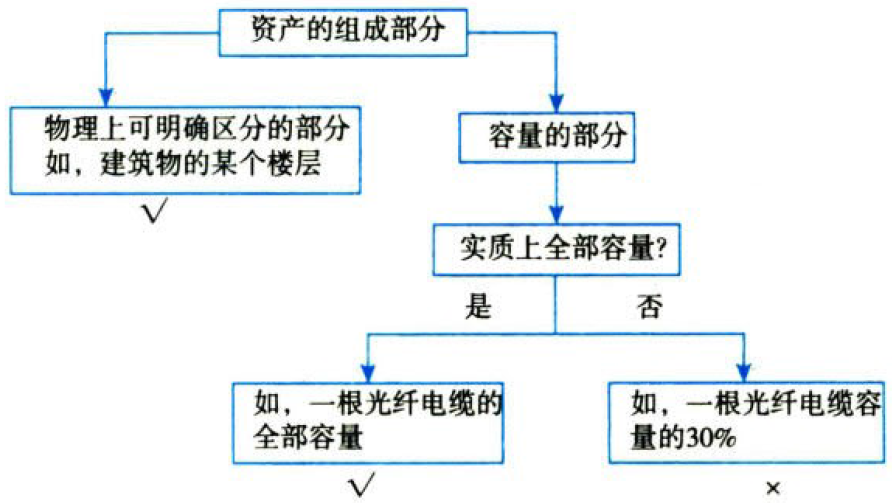
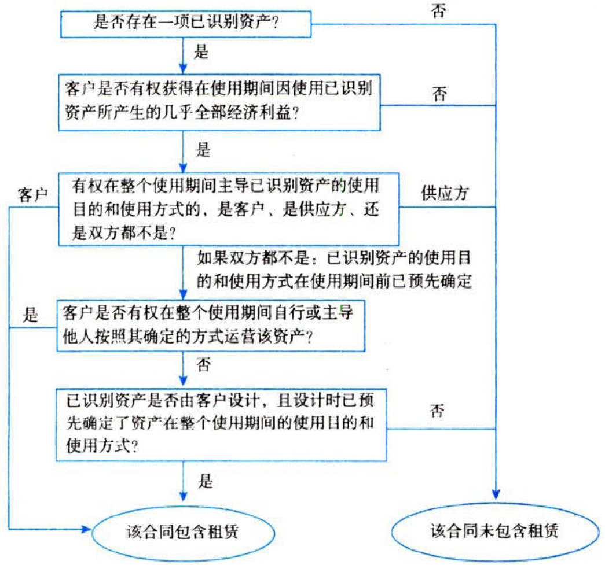
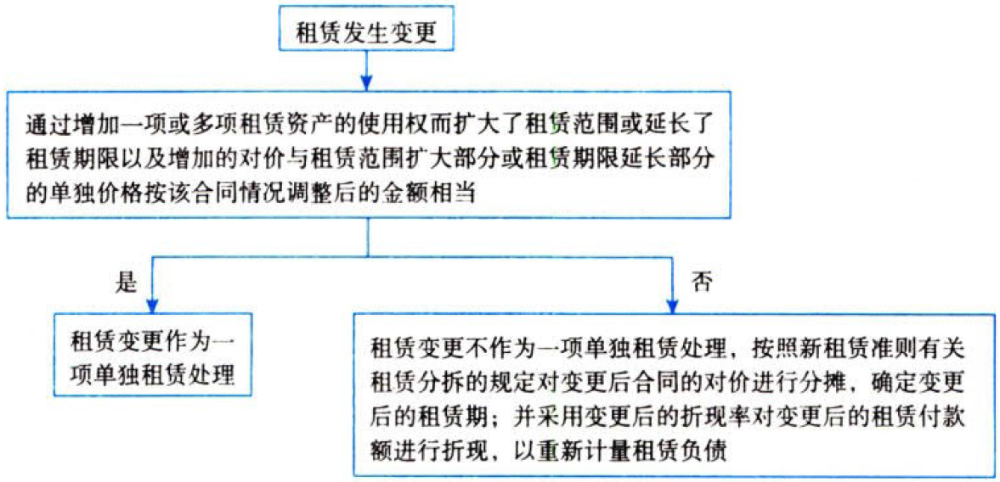

特殊.租赁

# 1. 租赁概述

## 1.1. 租赁的识别

### 1.1.1. 租赁的定义

在合同开始日，企业应当评估合同是否为租赁或者包含租赁。

租赁，是指在一定`期间`内，出租人将资产的`使用权`让与承租人以获取`对价`的`合同`。

如果合同一方让渡了在一定`期间`内`控制`一项或多项`已识别资产`使用的权利以换取对价，则该合同为租赁或者包含租赁。

一项合同要被分类为租赁，必须要满足三要素：一是存在一定`期间`；二是存在`已识别资产`；三是资产供应方向客户`转移`对己识别资产使用权的`控制`。

### 1.1.2. 己识别资产【就是那小子】

#### 1.1.2.1. 对资产的指定

按照租赁准则规定，已识别资产通常由`合同`明确指定，也可以在资产可供客户使用日时`隐性`指定。

#### 1.1.2.2. 物理可区分

如果资产的部分产能在`物理`上可区分（例如，建筑物的一层），则该部分产能属于已识别资产。如果资产的某部分产能与其他部分在物理上不可区分（例如，光缆的部分容量），则该部分不属于已识别资产，除非其实质上代表该资产的全部产能，从而使客户获得因使用该资产所产生的几乎全部经济利益的权利。



#### 1.1.2.3. 实质性替换权

即使合同已对资产进行指定，如果资产供应方在整个使用期间拥有对该资产的实质性替换权，则该资产不属于已识别资产。【哎？不是那小子了】

`同时符合`下列条件时，表明资产供应方拥有资产的实质性`替换`权：{

①资产供应方拥有在整个使用期间替换资产的实际`能力`；【客观条件】

②资产供应方通过行使替换资产的权利将获得经济`利益`。【主观动机】

}

企业难以确定资产供应方是否拥有实质性替换权的，应`视为`资产供应方`没有`对该资产的实质性替换权。【换人哪有那么容易】

### 1.1.3. 客户是否控制已识别资产使用权？

租赁准则规定，为确定合同是否让渡了在一定期间内控制已识别资产使用的权利，企业应当`评估`合同中的客户是否有权`获得`在使用期间因使用已识别资产所产生的几乎全部经济`利益`，并有权在该使用期间`主导`已识别资产的`使用`。【控制=听我指挥+给我赚钱】

#### 1.1.3.4. 客户是否有权主导资产的使用【听我指挥？】

存在下列情形`之一`的，可视为客户有权主导对已识别资产在整个使用期间的使用：

①客户有权在整个使用期间主导已识别资产的`使用目的`和`使用方式`；【干什么的】

②已识别资产的使用目的和使用方式在使用期间前已`预先确定`，并且客户有权在整个使用期间自行或主导他人按照其确定的方式`运营`该资产，或者客户`设计`了已识别资产（或资产的特定方面）并在设计时已预先确定了该资产在整个使用期间的使用目的和使用方式。

#### 1.1.3.5. 客户是否有权获得因使用资产所产生的几乎全部经济利益

在评估客户是否有权获得因使用己识别资产所产生的几乎全部经济利益时，企业应当在`约定的客户权利范围`内考虑其所产生的经济利益。

例①：如果合同规定汽车在使用期间仅限在某一`特定区域`使用，则企业应当仅考虑在该区域内使用汽车所产生的经济利益，而不包括在该区域外使用汽车所产生的经济利益。

例②：如果合同规定客户在使用期间仅能在`特定里程`范围内驾驶汽车，则企业应当仅考虑在允许的里程范围内使用汽车所产生的经济利益，而不包括超出该里程范围使用汽车所产生的经济利益。

### 1.1.4. 评估流程

综上，合同开始日，企业评估合同是否为租赁或是否包括租赁可参考下图。



## 1.2. 租赁期

租赁期是指承租人有权使用租赁资产且`不可撤销`的期间；承租人有续租选择权，即有权选择续租该资产，且合理确定`将行使`该选择权的，租赁期还应当包含`续租选择权`涵盖的期间；承租人有终止租赁选择权，即有权选择终止租赁该资产，但合理确定将不会行使该选择权的租赁期应当包含终止租赁选择权涵盖的期间。【预计的租赁时期】

### 1.2.5. 租赁期开始日

租赁期自租赁期`开始日`起计算。租赁期开始日，是指出租人提供租赁资产使其可供承租人`使用`的起始日期。如果承租人在租赁协议约定的起租日或租金起付日之前，已获得对租赁资产使用权的`控制`，则表明租赁期已经`开始`。租赁协议中对起租日或租金支付时间的约定，并不影响租赁期开始日的判断。【以“用”为准】

### 1.2.6. 不可撤销期间

在确定租赁期和评估不可撤销租赁期间时，企业应根据租赁条款约定确定可强制执行合同的期间。

如果承租人和出租人双方均有权在未经另一方许可的情况下终止租赁，且罚款金额不重大，则该租赁不再可强制执行。【不靠谱】

如果只有承租人有权终止租赁，则在确定租赁期时，企业应将该项权利视为承租人可行使的终止租赁选择权予以考虑。【他会不会干活那么久？】

如果只有出租人有权终止租赁，则不可撤销的租赁期包括终止租赁选择权所涵盖的期间。【站在干活的承租人角度】

### 1.2.7. 续租选择权和终止租赁选择权

在租赁期开始日，企业应当评估承租人是否合理确定将行使续租或购买标的资产的选择权，或者将不行使终止租赁选择权。【租赁期能不能很长？】

在评估时，企业应当考虑对承租人行使续租选择权或不行使终止租赁选择权带来经济利益的所有相关事实和情况，包括自租赁期开始日至选择权行使日之间的事实和情况的预期变化。【随时评估】

### 1.2.8. 对租赁期和购买选择权的重新评估

租赁准则规定，发生承租人可控范围内的重大事件或变化，且影响承租人是否合理确定将行使相应选择权的，承租人应当对其是否合理确定将行使续租选择权、购买选择权或不行使终止租赁选择权进行重新评估，并根据重新评估结果修改租赁期。【重定租赁期】

## 1.3. 租赁的分拆与合并

### 1.3.9. 租赁的分拆

准则规定，合同中同时包含多项单独租赁的，承租人和出租人应当将合同予以`分拆`，并分别各项`单独租赁`进行会计处理。

合同中同时包含租赁和非租赁部分的，承租人和出租人应当将租赁和非租赁部分进行`分拆`，`除非`企业适用新租赁准则的`简化`处理。

`同时符合`下列条件，使用已识别资产的权利构成合同中的一项`单独租赁`：{

①承租人可从`单独`使用该资产或将其与易于获得的其他资源一起使用中`获利`。易于获得的资源是指出租人或其他供应方单独销售或出租的商品或服务，或者承租人已从出租人或其他交易中获得的资源。【独立生活】

②该资产与合同中的其他资产`不存在`高度依赖或高度关联关系。例如，若承租人租入资产的决定`不会`对承租人使用合同中的其他资产的权利产生`重大影响`，则表明该项资产与合同中的其他资产不存在高度依赖或高度关联关系。【汝奈我何】

}

出租人可能要求承租人承担某些款项，却并未向承租人转移商品或服务。例如，出租人可能将`管理费`或与租赁相关的其他成本计人应付金额，而并未向承租人转移商品或服务。此类应付金额不构成合同中单独的组成部分，而应视为总对价的一部分`分摊`至单独识别的合同组成部分。

#### 1.3.9.6. 承租人的处理

在分拆合同包含的租赁和非租赁部分时，承租人应当按照各项租赁部分单独价格及非租赁部分的单独价格之和的相对`比例分摊`合同对价。租赁和非租赁部分的相对单独价格，应当根据出租人或类似资产供应方就该部分或类似部分向企业单独收取的价格确定。如果可观察的大度价格不易于获得，承租人应当最大限度地利用可观察的信息估计单独价格。

#### 1.3.9.7. 出租人的处理

出租人应当分拆租赁部分和非租赁部分，根据《企业会计准则第14号——收入》准则规定的关于交易价格分摊的规定`分摊`合同对价。

### 1.3.10. 租赁的合并（略）

# 2. 承租人.会计处理

在租赁期开始日，承租人应当对租赁确认`使用权资产`和`租赁负债`，应用短期租赁和低价值资产租赁`简化`处理的`除外`。

## 2.4. 承租人.会计科目+主要账务处理

### 2.4.11. “使用权资产”

本科目核算承租人持有的使用权资产的`原价`。

本科目可按租赁资产的类别和项目进行明细核算。

本科目期末借方余额，反映承租人使用权资产的`原价`。

承租人应当在`资产负债表`中单独列示`“使用权资产”`项目。

:moneybag:【会计分录】承租人.租赁期开始日

```
借：使用权资产 // 成本
    租赁负债——未确认融资费用
  贷：租赁负债——租赁付款额 // 尚未支付的租赁付款额
      预付款项 // 此前支付的租赁付款额－租赁激励
      银行存款 // 初始直接费用
      预计负债 // 恢复原状.现值
```

:moneybag:【会计分录】承租人.租赁期开始日后.租赁付款额的现值增加

```
借：使用权资产 // 变动额.现值
    租赁负债——未确认融资费用 // 倒挤的差额
  贷：租赁负债——租赁付款额 // 变动额
```

:moneybag:【会计分录】承租人.租赁期开始日后.租赁付款额的现值减少

```
借：租赁负债——租赁付款额 // 现值.变动额
  贷：使用权资产 // 现值.变动额，减至借方为0为止。
      制造费用/销售费用/管理费用/研发支出等 // 冲减相关成本
      租赁负债——未确认融资费用 // 倒挤的差额
```

:moneybag:【会计分录】承租人.租赁期开始日后.租赁范围缩小or租赁期缩短【卖掉一部分】

```
借：租赁负债——租赁付款额 // 按缩小的比例
    使用权资产累计折旧
    使用权资产减值准备
  贷：使用权资产
      租赁负债——未确认融资费用
      资产处置损益 // 倒挤的差额
```

:moneybag:【会计分录】承租人.租赁期开始日后.转租形成融资租赁【视同卖掉】

```
借：应收融资租赁款
    使用权资产累计折旧
    使用权资产减值准备
  贷：使用权资产
      资产处置损益 // 倒挤的差额
```

### 2.4.12.  “使用权资产累计折旧”

本科目核算使用权资产的`累计折旧`。

本科目可按租赁资产的类别和项目进行明细核算。

本科目期末贷方余额，反映使用权资产的`累计折旧额`。

:moneybag:【会计分录】承租人.租赁期开始日起.按月计提折旧

```
借：营业成本/制造费用/销售费用/管理费用/研发支出等
  贷：使用权资产累计折旧
```

提示：当月计提确有困难的，也可从下月起计提折旧，并在附注中予以披露。

### 2.4.13. “使用权资产减值准备”

本科目核算使用权资产的减值准备。

本科目可按租赁资产的类别和项目进行明细核算。

使用权资产减值准备一旦计提，`不得转回`。【类似固定资产】

本科目期末贷方余额，反映使用权资产的累计减值准备金额。

:moneybag:【会计分录】承租人.租赁期开始日后.发生减值

```
借：资产减值损失
  贷：使用权资产减值准备
```

### 2.4.14. “租赁负债”

本科目核算承租人尚未支付的租赁付款额的`现值`。

本科目可分别设置“租赁付款额”“未确认融资费用”等进行明细核算。【现值＝租赁付款额－未确认融资费用】

本科目的期末贷方余额，反映承租人尚未支付的租赁付款额的现值。

:moneybag:【会计分录】承租人.租赁期开始日后.确认利息

```
借：财务费用/在建工程等
  贷：租赁负债——未确认融资费用
```

:moneybag:【会计分录】承租人.租赁期开始日后.支付租金

```
借：租赁负债——租赁付款额
  贷：银行存款
```

## 2.5. 初始计量

### 2.5.15. 租赁负债的初始计量

租赁负债应当按照租赁期开始日尚未支付的租赁付款额的`现值`进行初始计量。识别应纳入租赁负债的`相关付款项目`是计量租赁负债的关键。

#### 2.5.15.8. 租赁付款额

租赁付款额，是指承租人向出租人支付的与在租赁期内使用租赁资产的`权利`相关的款项。

租赁付款额包括以下五项内容：

##### 2.5.15.8.1. 固定付款额及实质固定付款额，存在租赁激励的，扣除租赁激励相关金额

实质固定付款额是指在形式上可能包含变量但实质上`无法避免`的付款额。例如：{

①付款额设定为可变租赁付款额，但该可变条款`几乎不可能`发生，没有真正的`经济实质`。例如，付款额仅需在租赁资产经证实能够在租赁期间正常运行时支付，或者仅需在不可能不发生的事件发生时支付。又如，付款额初始设定为与租赁资产使用情况相关的可变付款额，但其潜在可变性将于租赁期开始日之后的某个时点消除，在可变性消除时，该类付款额成为实质固定付款额。

②承租人有多套付款额方案，但其中仅有一套是`可行`的。在此情况下，承租人应采用该可行的付款额方案作为租赁付款额。

③承租人有多套可行的付款额方案，但必须选择其中一套。在此情况下，承租人应采用总折现金额`最低`的一套作为租赁付款额。

}

##### 2.5.15.8.2. 取决于指数或比率的可变租赁付款额

可变租赁付款额，是指承租人为取得在租赁期内使用租赁资产的权利，而向出租人支付的因租赁期开始`日后`的事实或情况发生变化（而非时间推移）而变动的款项。可变租赁付款额可能与下列各项指标或情况`挂钩`：{

①由于`市场比率`或`指数`数值变动导致的价格变动。例如，`基准利率`或消费者`价格指数`变动可能导致租赁付款额调整。

②承租人源自租赁资产的`绩效`。例如，零售业不动产租赁可能会要求基于使用该不动产取得的销售收入的一定比例确定租赁付款额。

③租赁资产的`使用`。例如，车辆租赁可能要求承租人在超过特定里程数时支付额外的租赁付款额。

}

需要注意的是，可变租赁付款额中，仅取决于指数或比率的可变租赁付款额纳入租赁负债的初始计量中，包括与消费者价格指数挂钩的款项、与基准利率挂钩的款项和为反映市场租金费率变化而变动的款项等。此类可变租赁付款额应当根据租赁期`开始日`的指数或比率确定。【随比率指数变动，本质上其价值没变】

除了取决于指数或比率的可变租赁付款额之外，其他可变租赁付款额均不纳入租赁负债的初始计量中。【额外收益，不是初始成本】

##### 2.5.15.8.3. 购买选择权的行权价格，前提是承租人合理确定将行使该选择权

在租赁期`开始日`，承租人应评估是否合理确定将行使`购买`标的资产的选择权。在评估时，承租人应考虑对其行使或不行使购买选择权产生`经济激励`的所有相关事实和情况。如果承租人合理确定将行使购买标的资产的选择权，则租赁付款额中应`包含`购买选择权的行权价格。【租+买】

##### 2.5.15.8.4. 行使终止租赁选择权需支付的款项，前提是租赁期反映出承租人将行使终止租赁选择权

在租赁期`开始日`，承租人应评估是否合理确定将行使终止租赁的选择权。在评估时，承租人应考虑对其行使或不行使终止租赁选择权产生`经济激励`的所有相关事实和情况。如果承租人合理确定将行使终止租赁选择权，则租赁付款额中应包含`行使`终止租赁选择权需`支付`的款项，并且租赁期`不应包含`终止租赁选择权涵盖的期间。【不租的代价】

##### 2.5.15.8.5. 根据承租人提供的担保余值预计应支付的款项

`担保余值`，是指与出租人无关的一方向出租人提供担保，保证在租赁结束时租赁资产的价值至少为某指定的金额。

如果承租人提供了对余值的担保，则租赁付款额应包含该担保下预计应`支付`的款项，它反映了承租人预计将支付的金额，而不是承租人担保余值下的最大敞口。【弥补出租人的亏空】

#### 2.5.15.9. 折现率

租赁负债应当按照租赁期开始日尚未支付的租赁付款额的`现值`进行初始计量。在计算租赁付款额的现值时，承租人应当采用`租赁内含利率`作为折现率；无法确定租赁内含利率的，应当采用承租人`增量借款利率`作为折现率。

租赁内含利率r，是指使(出租人的租赁收款额＋未担保余值).现值＝(租赁资产公允价值＋出租人的初始直接费用)
×r的利率r。【收入.折现＝代价×r】

其中，[未担保余值](../../../../CPA6in1/CPA6in1/1会计/特殊.租赁.未担保余值.md)，是指租赁资产余值中，出租人无法保证能够实现或仅由与出租人有关的一方予以担保的部分。

初始直接费用，是指为达成租赁所发生的`增量成本`。增量成本是指若企业不取得该租赁，则不会发生的成本，如佣金、印花税等。无论是否实际取得租赁都会发生的支出，不属于初始直接费用，例如；为评估是否签订租赁而发生的差旅费、法律费用等，此类费用应当在发生时计入当期损益。

承租人增量借款利率，是指承租人在`类似`经济环境下为获得与使用权资产价值`接近`的资产，在`类似期间`以`类似抵押条件`借入资金须支付的`利率`。

### 2.5.16. 使用权资产的初始计量

使用权资产，是指承租人可在租赁期内使用租赁资产的`权利`。在租赁期`开始日`，承租人应当按照`成本`对使用权资产进行初始计量。该成本包括下列四项：{

①`租赁负债`的初始计量金额。

②在租赁期`开始日或之前`支付的租赁付款额；存在租赁激励的，应`扣除`已享受的`租赁激励`相关金额。

③承租人发生的`初始直接费用`。

④承租人为拆卸及移除租赁资产、复原租赁资产所在场地或将租赁资产恢复至租赁条款约定状态`预计`将发生的`成本`。前述成本属于为生产存货而发生的，适用《企业会汁准则第1号——存货》。

}

关于上述第4项成本，承租人有可能在租赁期`开始日`就承担了上述成本的支付义务，也可能在特定期间内因使用标的资产而承担了相关义务。承租人应在其`有义务`承担上述成本时，将这些成本`确认`为使用权资产`成本`的一部分。但是，承租人由于在特定期间内将使用权资产用于生产`存货`而发生的上述成本，应按照《企业会计准则第1号——存货》进行会计处理。承租人应当按照《企业会计准则第13号——`或有事项`》对上述成本的`支付义务`进行确认和计量。

## 2.6. 后续计量

### 2.6.17. 租赁负债的后续计量

#### 2.6.17.10. 计量基础

在租赁期`开始日`后，承租人应当按以下原则对租赁负债进行后续计量：

①确认租赁负债的`利息`时，`增加`租赁负债的账面金额；

②`支付`租赁付款额时，`减少`租赁负债的账面金额；

③因`重估`或租赁`变更`等原因导致租赁付款额发生变动时，`重新计量`租赁负债的账面价值。

承租人应当按照固定的周期性和利率计算租赁负债在租赁期内各期间的利息费用，并计入当期损益，但按照《企业会计准则第17号——借款费用》等其他准则规定应当计入相关资产成本的，从其规定。

此处的周期性利率，是指承租人对租赁负债进行`初始计量`时所采用的`折现率`，或者因(租赁付款额发生变动或因租赁变更)而需按照`修订后的折现率`对租赁负债进行重新计量时，承租人所采用的修订后的折现率。

#### 2.6.17.11. 租赁负债的重新计量

在租赁期`开始日`后，当发生下列四种情形时，承租人应当按照`变动后`的租赁付款额的`现值`重新计量租赁负债，并相应调整使用权资产的账面价值。使用权资产的账面价值已调减至零，但租赁负债仍需进一步调减的，承租人应当将剩余金额计入当期损益。

##### 2.6.17.11.6. 实质固定付款额发生变动

如果租赁付款额最初是可变的，但在租赁期开始日后的某一时点转为固定，那么，在潜在可变性消除时，该付款额成为实质固定付款额，应纳入租赁负债的计量中。承租人应当按照`变动后`租赁付款额的`现值`重新计量租赁负债。在该情形下，承租人采用的折现率`不变`，即，采用租赁期开始日确定的折现率。【不懂】

##### 2.6.17.11.7. 用于确定租赁付款额的指数或比率发生变动

在租赁期开始日后，因`浮动利率`的变动而导致未来租赁付款额发生变动的，承租人应当按照`变动后`租赁付款额的`现值`重新计量租赁负债。在该情形下，承租人应采用反映利率变动的`修订后`的折现率进行折现。【不懂】

在租赁期开始日后，因用于确定租赁付款额的`指数`或`比率`（浮动利率除外）的变动而导致未来租赁付款额发生变动的，承租人应当按照`变动后`租赁付款额的`现值`重新计量租赁负债。在该情形下，承租人采用的折现率`不变`。【不懂】

需要注意的是，仅当现金流量发生变动时，即租赁付款额的变动`生效`时，承租人才应重新计量租赁负债，以反映变动后的租赁付款额。承租人应基于变动后的合同付款额，确定剩余租赁期内的租赁付款额。【敌不动我不动】

##### 2.6.17.11.8. 购买选得权、续租选得权、终止租赁选择权的评估结果或实际行使情况发生变化

租赁期开始日后，发生下列情形的，承租人应采用`修订后的折现率`对变动后的租赁付款额进行折现，以重新计量租赁负债：{

①发生承租人可控范围内的重大事件或变化，且影响承租人是否合理确定将行使续租选择权或终止租赁选择权的，承租人应当对其是否合理确定将行使相应选择权进行`重新评估`。上述选择权的评估结果发生变化的，承租人应当根据新的评估结果重新确定`租赁期`和`租赁付款额`。前述选择权的实际行使情况与原评估结果不一致等导致租赁期变化的，也应当根据新的租赁期重新确定`租赁付款额`。

②发生承租人可控范围内的重大事件或变化，且影响承租人是否合理确定将行使购买选择权的，承租人应当对其是否合理确定将行使购买选得权进行`重新评估`。评估结果发生变化的，承租人应根据新的评价结果重新确定`租赁付款额`。

}

上述两种情形下，承租人在计算变动后租赁付款额的`现值`时，应当采用`剩余租赁期间`的内含利率作为折现率；无法确定剩余租赁期间的租赁内含利率的，应当采用`重估日`的承租人`增量借款利率`作为折现率。【重新做人】

##### 2.6.17.11.9. 担保余值预计的应付金额发生变动

在租赁期开始日后，承租人应对其在担保余值下预计支付的金额进行估计。该金额发生变动的，承租人应当按照`变动后`租赁付款额的`现值`重新计量租赁负债。在该情形下，承租人采用的折现率`不变`。

### 2.6.18. 使用权资产的后续计量

#### 2.6.18.12. 计量基础

在租赁期开始日后，承租人应当采用`成本模式`对使用权资产进行后续计量，即，以(成本－累计折旧－累计减值损失)计量使用权资产。

承租人按照新租赁准则有关规定重新计量租赁负债的，应当`相应`调整使用权资产的账面价值。

#### 2.6.18.13. 使用权资产的折旧

承租人应当参照《企业会计准则第4号——`固定资产`》有关折旧规定，自租赁期`开始日`起对使用权资产计提折旧。使用权资产通常应自租赁期开始的`当月`计提折旧，当月计提确有困难的，为便于实务操作，企业也可以选择自租赁期开始的`下月`计提折旧，但应对同类使用权资产采取`相同的折旧政策`。计提的折旧金额应根据使用权资产的用途，计入相关资产的成本或者当期损益。

承租人在确定使用权资产的折旧方法时，应当根据与使用权资产有关的经济利益的预期`消耗方式`做出决定。通常，承租人按`直线法`对使用权资产计提折旧，其他折旧方法更能反映使用权资产有关经济利益预期消耗方式的，应采用其他折旧方法。

承租人在确定使用权资产的`折旧年限`时，应遵循以下原则：承租人能够合理确定租赁期届满时取得租赁资产所有权的，应均在租赁资产剩余`使用寿命`内计提折旧；承租人无法合理确定租赁期届满时能够取得租赁资产所有权的，应当在租赁期与租赁资产剩余使用寿命两者`孰短`的期间内计提折旧。如果使用权资产的剩余使用寿命短于前两者，则应在使用权资产的剩余使用寿命内计提折旧。

#### 2.6.18.14. 使用权资产的减值

在租赁期开始日后，承租人向当按照《企业会计准则第8号——资产减值》的规定，确定使用权资产是否发生减值，并对已识别的减值损失进行会计处理。使用权资产发生减值的，按应减记的金额，借记“资产减值损失”科目，贷记“使用权资产减值准备”科目。使用权资产减值准备一旦计提，不得转回。承租人应当按照扣除减值损失之后的使用权资产的账面价值，进行`后续折旧`。

### 2.6.19. 租赁变更的会计处理

租赁变更，是指原合同条款之外的租赁`范围`、租赁`对价`、租赁`期限`的变更，包括增加或终止一项或多项租赁资产的使用权，延长或缩短合同规定的租赁期等。租赁变更`生效日`是指双方就租赁变更`达成一致`的日期。



变更扩大了范围，相应调整使用权资产。

变更缩小了范围，减少使用权资产以反映因租赁范围减少而应`终止`的租赁部分，并确认与租赁终止相关的利得或损失。

## 2.7. 短期租赁和低价值资产租赁

### 2.7.20. 短期租赁

短期租赁，是指在租赁期开始日，租赁期不超过`12个月`的租赁。【1年内】

包含购买选择权的租赁不属于短期租赁。【都买下来了，还短期个鬼】

对于短期租赁，承租人可以按照租赁资产的类别作出采用`简化会计处理`的选择。如果承租人对某类租赁资产作出了简化会计处理的选择，未来该类资产下所有的短期租赁都应采用简化会计处理。某类租赁资产是指企业运营中具有`类似性质和用途`的一组租赁资产。【要简化全简化】

按照`简化`会计处理的短期租赁发生租赁变更或者其他原因导致租赁期发生变化的，承租人应当将其视为一项`新租赁`，重新按照上述原则判断该项新租赁是否可以选择简化会计处理。【变就是新】

### 2.7.21. 低价值资产租赁

低价值资产租赁，是指单项租赁资产为`全新资产`时价值较低的租赁。

承租人在判断是否是低价值资产租赁时，应基于租赁资产的全新状态下的价值进行评估，不应考虑资产已被使用的年限。

对于低价值资产租赁，承租人可根据`每项租赁`的具体情况作出`简化会计处理`选择。【灵活】

低价值资产同时还应满足以下规定，即，只有承租人能够从单独使用该低价值资产或将其与承租人易于获得的其他资源一起使用中获利，且该项资产与其他租赁资产没有高度依赖或高度关联关系时，才能对该资产租赁选择进行简化会计处理。【独立性】

低价值资产租赁的标准应该是一个`绝对金额`，即仅与资产全新状态下的绝对价值有关，不受承租人规模、性质等影响，也不考虑该资产对于承租人或相关租赁交易的重要性。常见的低价值资产的例子包括`平板电脑`、普通办公`家具`、`电话`等小型资产。【绝对金额】

但是，如果承租人已经或者预期要把相关资产进行`转租赁`，则`不能`将原租赁按照低价值资产租赁进行简化会计处理。【转租赁不能简化】

值得注意的是，符合低价值资产租赁的，也并`不代表`承租人若采取购入方式取得该资产时该资产`不符合`固定资产确认条件。【仍旧可以是固定资产】

# 3. 出租人.会计处理

## 3.8. 出租人的租赁分类

### 3.8.22. 融资租赁和经营租赁

出租人应当在`租赁开始日`将租赁分为`融资租赁`和`经营租赁`。

租赁开始日，是指租赁合同`签署日`与租赁各方就主要租赁条款作出`承诺日`中的`较早者`。租赁开始日可能早于租赁期开始日，也可能与租赁期开始日重合。【事情定了，租赁就开始了】

一项租赁属于融资租赁还是经营租赁取决于交易的实质，而不是合同的形式。如果一项租赁实质上转移了与租赁资产`所有权`有关的`几乎全部风险和报酬`，出租人应当将该项租赁分类为融资租赁。出租人应当将除融资租赁以外的`其他`租赁分类为经营租赁。

租赁开始日后，除非发生`租赁变更`，出租人`无需`对租赁的分类进行`重新评估`。租赁资产预计使用寿命、预计余值等会计估计变更或发生承租人违约等情况变化的，出租人不对租赁进行重分类。【没新人，就不改】

### 3.8.23. 融资租赁的分类标准

一项租赁存在下列一种或多种情形的，通常分类为融资租赁：{

①在租赁期届满时，租赁资产的`所有权`转移给承租人。【卖了】

②承租人有`购买租赁资产`的选择权，所订立的购买价款预计将远低于行使选择权时租赁资产的公允价值，因而在租赁开始日就可以合理确定承租人将`行使`该选择权。【肯定买】

③资产的所有权虽然不转移，但租赁期占租赁资产使用寿命的`大部分`。实务中，这里的“大部分”一徽指租赁期占租赁开始日租赁资产使用寿命的`75%`以上（含75%）。【用了3/4】

④在租赁开始日，租赁收款额的`现值`几乎相当于租赁资产的`公允价值`。实务中，这里的“几乎相当于”，通常掌握在`90%`以上。【买了九成】

⑤租赁资产性质特殊，如果不作较大改造，`只有`承租人才能使用。【注定】

}

## 3.9. 出租人使用的相关会计分录

### 3.9.24. 会计分录

:moneybag:【会计分录】出租人.取得融资租赁资产【原材料】

```
借：融资租赁资产 // 准备用于出租的资产.成本
  贷：银行存款等
```

:moneybag:【会计分录】出租人.融资租赁期开始日【视同出售】

```
借：应收融资租赁款——租赁收款额 // 尚未收到的租赁款
    银行存款 // 已经收取的租赁款
    应收融资租赁款——未担保余值 // 预计租赁期结束时的未担保余值
  贷：融资租赁资产 // 账面价值，终止确认它
      资产处置损益 // 公允价值－账面价值
      银行存款 // 初始直接费用，冲减了融资租赁的收益
      应收融资租赁款——未实现融资收益 // 倒挤的差额，利润所在
```

:moneybag:【会计分录】出租人.融资租赁期开始日.初始直接费用进行单独核算【视同出售】

```
借：应收融资租赁款——初始直接费用
  贷：银行存款
借：应收融资租赁款——未实现融资收益
  贷：应收融资租赁款——初始直接费用 // 冲减融资租赁的收益
```

:moneybag:【会计分录】出租人.融资租赁期开始日后.确认利息

```
借：应收融资租赁款——未实现融资收益
  贷：租赁收入——利息收入 // 租赁企业
      利息收入 // 金融企业
      其他业务收入等 // 一般企业
```

:moneybag:【会计分录】出租人.融资租赁期开始日后.收到租金

```
借：银行存款
  贷：应收融资租赁款——租赁收款额
```

:moneybag:【会计分录】出租人.融资租赁期开始日后.计提减值准备【转回时则反转】

```
借：信用减值准备
  贷：应收融资租赁款减值准备
```

:moneybag:【会计分录】出租人.经营租赁期开始日后.收取租金

```
借：银行存款/应收账款等
  贷：租赁收入——经营租赁收入
```

②出租人确认未计入租赁收款额的可变租赁付款额时，应当借记”银行存款”“应收账款”等科目，贷记“租赁收入——可变租赁付款额”科目。

:moneybag:【会计分录】出租人.租赁期开始日后.得到可变租赁付款额时【意外之财】

```
借：银行存款/应收账款等
  贷：租赁收入——可变租赁付款额
```

### 3.9.25. “融资租赁资产”

本科目核算租赁企业作为出租人为开展融资租赁业务取得资产的`成本`。租赁业务不多的企业，也可通过“`固定资产`”等科目核算。

租赁企业和其他企业对于融资租赁资产在未融资租赁期间的会计处理遵循固定资产准则或其他适用的会计准则。

本科目可按租赁资产类别和项目进行明细核算。

本科目期末借方余额，反映企业融资租赁资产的`成本`。

### 3.9.26. “应收融资租赁款——”

本科目核算出租人融资租赁产生的`租赁投资净额`。

本科目可分别设置“租赁收款额”“未实现融资收益”“未担保余值”等进行明细核算。租赁业务较多的，出租人还可以在“租赁收款额”明细科目下进一步设置明细科目核算。

本科目的期末借方余额，反映未担保余值和尚未收到的租赁收款额的`现值`之和。

本科目余额在`“长期应收款”`项目中填列，其中，自`资产负债表`日起一年内（含一年）到期的，在“`一年内到期`的非流动资产”中填列。出租业务较多的出租人，也可在“长期应收款”项目下`单独列示`为“其中：应收融资租赁款”。

### 3.9.27.  “应收融资租赁款减值准备”

本科目核算应收融资租赁款的减值准备。

本科目期末贷方余额，反映应收融资粗赁款的`累计减值准备`金额。

### 3.9.28. “租赁收入”

本科目核算`租赁企业`作为出租人确认的融资租赁和经营租赁的`租赁收入`。【与主营业务收入并列】

`一般企业`根据自身业务特点确定租赁收入的核算科目，例如“其他业务收入”等。

本科目可按租赁资产类别和项目进行明细核算。

期末，应将本科目余额转入`“本年利润”`科目，结转后本科目无余额。

对于日常经营活动为租赁的企业，其利息收入和租赁收入可以作为`营业收入`列报。

## 3.10. 出租人对融资租赁的会计处理

### 3.10.29. 初始计量

若某融资租赁合同必须以收到租赁保证金为生效条件，出租人收到承租人交来的租赁保证金，

:moneybag:【会计分录】出租人.融资租赁合同. 收到保证金

```
借：银行存款
  贷：其他应收款——租赁保证金
```

:moneybag:【会计分录】承租人到期不交租金，以保证金`抵作`租金时

```
借：其他应收款——租赁保证金
  贷：应收融资租赁款——租赁收款额
```

:moneybag:【会计分录】承租人违约，我`没收`保证金时

```
借：其他应收款——租赁保证金
  贷：营业外收入等
```

### 3.10.30. 融资租赁的后续计量

出租人应当按照固定的周期性利率计算并`确认`租赁期内各个期间的`利息收入`。

纳入出租人租赁投资净额的可变租赁付款额只包含取决于`指数`或`比率`的可变租赁付款额。在初始计量时，应当采用租赁期`开始日`的指数或比率进行初始计量。出租人应定期`复核`计算租赁投资总额时所使用的`未担保余值`。若预计未担保余值降低，出租人应修改租赁期内的收益分配，并`立即确认`预计的减少额。

### 3.10.31. 融资租赁变更的会计处理

融资租赁发生变更且`同时符合`下列条件的，出租人应当将该变更作为一项`单独租赁`进行会计处理：{

①该变更通过增加一项或多项租赁资产的使用权而扩大了租赁`范围`或延长了租赁`期限`；【新增】

②增加的对价与租赁范围扩大部分或租赁期限延长部分的`单独价格`按该合同情况调整后的金额`相当`。【新增部分独立】

}

如果融资租赁的变更未作为一项单独租赁进行会计处理，且满足`假如`变更在租赁开始日生效，该租赁会被分类为经营租赁`条件`的，出租人应当自租赁`变更生效日`开始将其作为一项`新租赁`进行会计处理，并以租赁变更生效日前的`租赁投资净额`作为租赁资产的账面价值。【登时变性】

## 3.11. 出租人对经营租赁的会计处理

#### 3.11.31.15. 租金的处理

在租赁期内各个`期间`，出租人应采用直线法或者其他系统合理的方法将经营租赁的租赁收款额`确认`为租金`收入`。如果其他系统合理的方法能够更好地反映因使用租赁资产所产生经济利益的消耗模式的，则出租人应采用该方法。

#### 3.11.31.16. 出租人对经营租赁提供激励措施

出租人提供免租期的，出租人应将租金总额在不扣除免租期的整个租赁期内，按直线法或其他系统合理的方法进行`分配`，免租期内应当确认租金收入。出租人承担了承租人某些`费用`的，出租人应将费用自租金收入总额中`扣除`，按扣除后的租金收入余额在租赁期内进行`分配`。【先扣费用，后分期确认收入】

#### 3.11.31.17. 初始直接费用

出租人发生的与经营租赁有关的`初始直接费用`应当资本化至租赁标的资产的`成本`，在租赁期内按照与租金收入相同的确认基础`分期`计入当期损益。【进成本，慢慢分摊】

#### 3.11.31.18. 折旧和减值

对于经营租赁资产中的固定资产，出租人应当采用类似资产的`折旧政策`计提折旧；对于其他经营租赁资产，应当根据该资产适用的企业会计准则，采用系统合理的方法进行摊销。出租人应当按照《企业会计准则第8号——资产减值》的规定，确定经营租赁资产是否发生`减值`，并对已识别的减值损失进行会计处理。【照旧】

#### 3.11.31.19. 可变租赁付款额

出租人取得的与经营租赁有关的可变租赁付款额，如果是与`指数`或`比率`挂钩的，应在租赁期开始日计入`租赁收款额`；除此之外的，应当在实际发生时计入`当期损益`。【指数利率，价值之中】

#### 3.11.31.20. 经营租赁的变更

经营租赁发生变更的，出租人应自变更生效日开始，将其作为一项`新的租赁`进行会计处理，与变更前租赁有关的预收或应收租赁收款额视为新租赁的收款额。【没有变更，只有新业务】

# 4. 特殊租赁业务.会计处理

## 4.12. 转租赁

转租情况下，原租赁合同和转租赁合同通常都是单独协商的，交易对象也是不同的企业，准则要求转租出租人对原租赁合同和转租赁合同`分别`根据承租人和出租人会计处理要求，进行会计处理。

承租人在对转租赁进行分类时，转租出租人应基于原租赁中产生的`使用权资产`，而不是租赁资产（如作为租赁对象的不动产或设备）进行分类。原租赁资产不归转租出租人所有，原租赁资产也未计入其资产负债表。因此，转租出租人应基于其控制的资产（即使用权资产）进行会计处理。【手里有什么，才转租什么】

原租赁为`短期租赁`，且转租出租人作为承租人已按照准则采用`简化`会计处理方法的，应将转租赁分类为`经营租赁`。【小简，谈不上融资】

## 4.13. 生产商或经销商出租人的融资租赁会计处理

生产商或经销商通常为客户提供购买或租赁其产品或商品的选择。如果生产商或经销商出租其产品或商品构成`融资租赁`，则该交易产生的损益应相当于按照考虑适用的交易最或商业折扣后的`正常售价`直接销售标的资产所产生的损益。

构成融资租赁的，生产商或经销商出租人在租赁期`开始日`应当按照(租赁资产`公允价值`)与(租赁收款额(按市场利率折现).`现值`)两者`孰低`确认`收入`，【卖了多少】并按照(租赁资产账面价值－未担保余值.现值)结转销售`成本`，【代价多少】收入和销售成本的差额作为销售`损益`。

由于取得融资租赁所发生的成本主要与生产商或经销商赚取的销售利得相关，生产商或经销商出租人应当在租赁期开始日将其计入损益。即，与其他融资租赁出租人不同，生产商或经销商出租人取得融资租赁所发生的成本不属于初始直接费用，不计入租赁投资净额。【不摊销，直接费用化】

## 4.14. 售后租回交易的会计处理

若企业（卖方兼承租人）将资产转让给其他企业（买方兼出租人），并从买方兼出租人租回该项资产，则卖方兼承租人和买方兼出租人均应按照`售后租回`交易的规定进行会计处理。企业应当按照《企业会计准则第14号——收入》的规定，评估确定售后租回交易中的资产转让`是否`属于销售，并区别进行会计处理。

在标的资产的法定所有权转移给出租人并将资产租赁给承租人之前，承租人可能会先获得标的资产的`法定所有权`。但是，是否具有标的资产的法定所有权本身并非会计处理的决定性因素。如果承租人在资产转移给出租人之前已经取得对标的资产的`控制`，则该交易属于售后租回交易。然而，如果承租人未能在资产转移给出租人之前取得对标的资产的控制，那么即使承租人在资产转移给出租人之前先获得标的资产的法定所有权，该交易也不属于售后租回交易。【事前控制&事后控制】【不看所有权】

售后租回交易会计处理如下。

### 4.14.32. 售后租回交易中的资产转让属于销售时：【租金很少】

#### 4.14.32.21. 卖方兼承租人

应当按原资产账面价值中与租回获得的使用权有关的部分，计量售后租回所形成的使用权资产，并仅就转让至买方兼出租人的权利确认相关利得或损失。【只卖了一部分】

#### 4.14.32.22. 买方兼出租人

根据其他适用的企业会计准则对资产购买进行会计处理，并根据新租赁准则对资产出租进行会计处理。【什么售后回租，我不知道】

### 4.14.33. 售后租回交易中的资产转让不属于销售时：【抵押借款】

#### 4.14.33.23. 卖方兼承租人

不终止确认所转让的资产，而应当将`收到的现金`作为金融负债，并按照《企业会计准则第22号——金融工具确认和计量》进行会计处理。【就是在借钱】

#### 4.14.33.24. 买方兼出租人

不确认被转让资产，而应当将`支付的现金`作为金融资产，并按照《企业会计准则第22号——金融工具确认和计量》进行会计处理。【就是在放贷】

### 4.14.34. 提示

对售后租回交易中的资产转让属于销售的交易，如果销售对价的公允价值与资产的公允价值不同【价偏】，或者出租人未按市场价格收取租金【价偏2】，企业应当进行以下调整：{

①销售对价低于市场价格的款项作为`预付租金`进行会计处理；【还是租金】

②销售对价高于市场价格的款项作为买方兼出租人向卖方兼承租人提供的`额外融资`进行会汁处理。

}

同时，承租人接照`公允价值`调整相关销售利得或损失，出租人按`市场价格`调整租金收入。

在进行上述调整时，企业应当接以下二者中`较易确定者`进行：{

①销售对价的公允价值与资产的公允价值的`差异`；【价偏】

②合同付款额的现值与按市场租金计算的付款额的现值的`差异`。【价偏2】

}

# 5. 总结

End。
