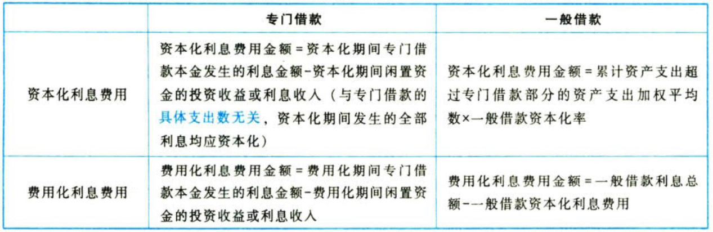

负债.借款费用

# 1. 借款费用.概述

## 1.1. 借款的范围

借款费用的借款范围既包括`专门借款`，也包括`一般借款`。【专为你用的钱+大家都能用的钱】

## 1.2. 借款费用的范围

借款费用是企业因借入资金所付出的`代价`，它包括借款`利息`费用（包括借款折价或者溢价的`摊销`和相关`辅助`费用）以及因外币借款而发生的`汇兑差额`等。【利息+其他】

因辅助费用计入负债的初始确认金额，所以按`实际利率法`计算确定的`利息`费用中反映的是`辅助费用`的`摊销数`，不是辅助费用的`发生额`，但以前考题均将发生的辅助费用作为借款费用。【？】

借款费用不应包括权益性融资费用。【债，不是股】

## 1.3. 符合资本化条件的资产

企业发生的借款费用，可直接归属于符合`资本化条件`的资产的购建或者生产的，应当予以资本化，计人符合资本化条件的资产`成本`。其他借款费用，应当在发生时根据其发生额确认为`财务费用`，计人当期损益。【想资本化，是有要求的】

符合资本化条件的资产，是指需要经过相当长时间（通常为`一年`或一年以上）的购建或者生产活动才能达到预定可使用或者可销售状态的固定资产、投资性房地产、存货等资产。【长期资产】

在实务中，如果由于人为或者故意等`非正常因素`导致资产的购建或生产时间相当长的，该资产不属于符合资本化条件的资产。【非价值，无资产】

# 2. 借款费用.确认

借款费用的确认主要解决的是将每期发生的借款费用`资本化`、计入相关资产的成本，还是将有关借款费用`费用化`、计人当期损益的问题。【资本化，还是费用化？】

企业只有发生在`资本化期间`内的有关借款费用，才允许资本化，资本化期间的确定是借款费用确认和计量的重要前提。【资本化期间】

## 2.4. 借款费用开始资本化的时点

①资产`支出`已经发生。包括支付现金、转移非现金资产或者承担带息债务形式发生的支出，赊购但承担的是不带息债务形式发生的支出不属于资产支出。【钱花了】

②借款`费用`已经发生。是指已经`发生`了专门借款费用或者`占用`了一般借款的借款费用。【利息滋生了】

③为使资产达到预定可使用或者可销售状态所必要的`构建`或者`生产活动`已经开始。是指符合资本化条件的资产的实体建造或者生产工作已经开始。【设备开造了】

## 2.5. 借款费用暂停资本化的时间

符合资本化条件的资产在购建或者生产过程中发生`非正常中断`、且中断时间`连续`超过`3个月`的，应当`暂停`借款费用的资本化。在中断期间所发生的借款费用，
应当计入当期损益，直至购建或者生产活动重新开始。但是，
如果中断是使所购建或者生产的符合资本化条件的资产达到预定可使用或者可销售状态所`必要`的程序，所发生的借款费用应当`继续`资本化。【3个月没干事，暂停资本化】

正常中断，是使资产达到预定可使用或者可销售状态所`必要`的程序、或者事先`可预见的不可抗力`因素导致的中断。例如：①正常测试、调试导致的停工；②东北因冬季无法施工导致的停工等。【有价值，资本化】

非正常中断，是指`企业管理决策`上的原因或者其他`不可预见`的原因等所导致的中断。例如：①企业因与施工方发生了质最纠纷；②工程、生产用料没有及时供应；③资金周转发生了困难；④施工、生产发生了安全事故；⑤发生了劳动纠纷；等。【无价值，费用化】

## 2.6. 借款费用停止资本化的时点

购建或者生产符合资本化条件的资产`达到`预定可使用或者可销售`状态`时，借款费用应当停止资本化。【设备造好了，停止资本化】

停止资本化时点的判断：{

①实体建造已经`完成`；②基本`符合`设计要求：③后续支出金额`很少`（或几乎不再发生）；④试生产出`合格`产品；⑤分别建造、分别完工的资产，如果完工部分能够`独立`使用或销售，完工部分借款费用应当停止资本化；⑥分别建造、分别完工的资产，必须等到整体完工后才可使用或者可对外销售的，应当在该资产`整体`完工时停止借款费用的资本化。

}

# 3. 借款费用.计量

## 3.7. 借款利息资本化金额的确定

在借款费用资本化期间内，每一会计期间的利息（包括折价或溢价的摊销）资本化金额，应当按照下列方法确定：{

①为购建或者生产符合资本化条件的资产而借入`专门借款`的，应当以专门借款当期实际发生的`利息费用`，
减去将尚未动用的借款资金存入银行取得的`利息收入`或进行暂时性投资取得的`投资收益`后的金额确定。【真利息=利息支出-利息收入】

对专门借款而言，
资本化期间的借款费用`全部`资本化，费用化期间的借款费用`全部`费用化。对费用化金额的计算可比照资本化金额的计算方式处理，即费用化期间的利息费用减去费用化期间尚未动用的借款资金存入银行取得的利息收入或进行暂时性投资取得的投资收益后的金额确定。【专一的专门借款，资本化期间则资本化，费用化期间则费用化】

②为购建或者生产符合资本化条件的资产而占用了`一般借款`的，企业应当根据累计资产支出超过专门借款部分的资产支出加权平均数乘以所占用一般借款的资本化率，计算确定一般借款应予资本化的利息金额。资本化率应当根据一般借款`加权平均利率`计算确定。【用多少则资本化多少，其他的都是费用化】

有关计算公式如下：

一般借款利息费用资本化金额＝累计资产支出超过专门借款部分的资产支出加权平均数×所占用一般借款的资本化率。

累计资产支出加权平均数＝Σ（每笔资产支出金额×该笔资产支出在当期所占用的天数／当期天数）。

所占用一般借款的资本化率＝所占用一般借款加权平均利率＝所占用一般借款利息之和÷所占用一般借款本金之和。

注意事项：一般借款费用化金额＝全部利息费用－资本化金额。

借款利息费用的计算如下表所示：

③每一会计期间的利息资本化金额，不应当超过当期相关借款实际发生的利息金额。【超过就见鬼了】

借款辅助费用摊销数资本化金额的确定，可以按《企业会计准则第22号——金融工具确认和计量》的规定执行，通常将辅助费用计入负债的初始确认金额，资产负债表日采用实际利率法计算确定各期利息费用。【辅助费用计入初始金额】

}

## 3.8. 外币专门借款汇兑差额资本化金额的确定

在资本化期间内，`外币专门借款`本金及利息的汇兑差额，应当予以资本化，计入符合资本化条件的资产成本。而除外币专门借款之外的`其他`外币借款本金及其利息所产生的汇兑差额应当作为`财务费用`，计人当期损益。【外币专门借款的汇兑差额，资本化。其他全部费用化。】

`外币一般借款`的汇兑差额计入当期损益，`不予`资本化。

# 4. 总结

End。
