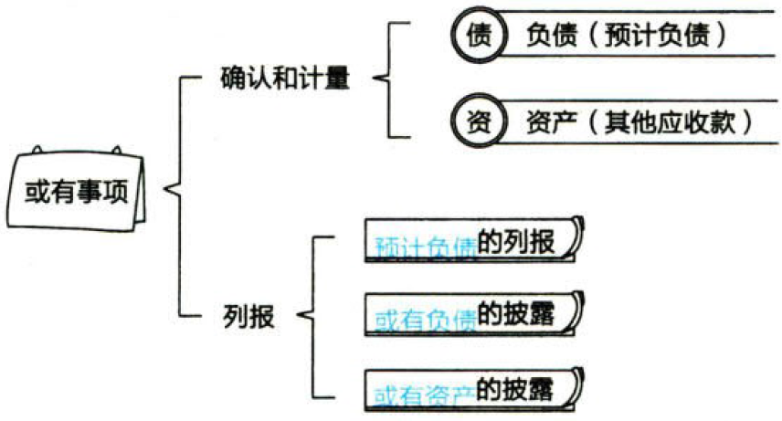
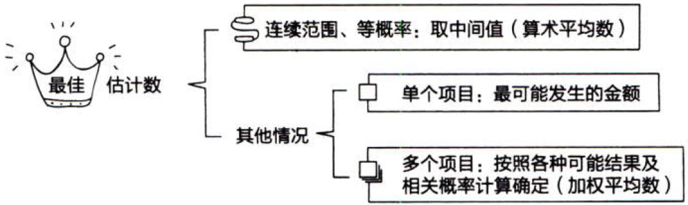

负债.或有事项

# 1. 或有事项.概述

## 1.1. 概念和特征

或有事项，是指`过去的`交易或者事项形成的，其结果须由某些`未来事项`的发生或不发生才能决定的`不确定事项`。【生于过去，死于将来】

或有事项具有以下特征：{

①由`过去的`交易或事项形成。即或有事项的现存状况是过去交易或事项引起的客观存在。【生于过去】

`未来`可能发生的自然灾害、交通事故、经营亏损等事项，`不属于`企业会计准则规范的或有事项。

②`结果`具有`不确定性`。即或有事项的结果是否发生具有不确定性，或者或有事项的结果预计将会发生，但发生的具体时间或金额具有不确定性。【天知道会怎么死】

③结果由`未来事项`决定。即或有事项的结果只能由未来不确定事项的发生或不发生才能决定。【天知道哪天死】

}

常见的或有事项：`未决诉讼`、`未决仲裁`、`债务担保`、`产品质量保证`（含产品安全保证）、`环境污染整治`、`承诺`、`亏损合同`、`重组义务`等。

## 1.2. 或有负债、或有资产

或有负债，是指：`过去`的交易或者事项形成的`潜在义务`，其存在须通过未来不确定事项的发生或不发生予以证实【可能产生义务】or过去的交易或者事项形成的`现时义务`，履行该义务`不是`很可能导致经济利益流出企业或该义务的金额`不能`可靠计量。【不知道义务大小】

或有资产，是指`过去`的交易或者事项形成的`潜在资产`，其存在须通过未来不确定事项的发生或不发生予以证实。【可能产生资产】

或有负债和或有资产`不符合`负债或资产的定义和确认条件，企业不应当确认或有负债和或有资产，在符合条件时进行相应的`披露`。【不确认，只披露】

或有事项的内容如下图所示：



# 2. 或有负债.确认+计量

## 2.3. 或有事项.确认

与或有事项相关的义务`同时满足`以下条件的，应当确认为`预计负债`：【升级了】{

①该义务是企业承担的`现时义务`。【当下的】

②履行该义务`很可能`导致经济利益流出企业。【义务】即：企业履行与或有事项相关的现时义务将导致经济利益流出企业的可能性应超过50%。

③该义务的金额能够`可靠地计量`。【能数】

}

如果或有事项确认负债的三个条件没有同时满足，则属于`或有负债`。

履行或有事项相关义务导致经济利益流出的可能性，通常按照下列情况判断：

`基本确定`：95%＜发生的可能性＜100%；

`很可能`： 50%＜发生的可能性≤95%；

`可能`： 5%＜发生的可能性≤50%；

`极小可能`： 0%＜发生的可能性≤5%；

## 2.4. 预计负债的计量

或有事项的计量主要涉及两方面：一是对`最佳估计数`的确定；二是对`预期`可获得补偿的处理。【估计支出-估计收入】

### 2.4.1. 最佳估计数的确定

预计负债应当按照履行相关现时义务所需支出的最佳估计数进行初始计量，图示如下：



在产品质量保证中，企业销售的商品，有些没有质量问题，有些有较小质量问趟，有些有较大质量问题，这几个事项同时存在，属于多个项目，要用`加权平均数`计算最佳估计数。

### 2.4.2. 对预期可获得补偿的处理

企业清偿预计负债所需支出全部或部分支出`预期`由第三方补偿的，补偿金额只有在`基本确定`能够收到时才能作为`资产`单独确认。【资产要求基本确定】确认的补偿金额`不应超过`所确认的负债的账面价值。【超过就见鬼了】

或有事项确认为资产的`前提条件`是或有事项已经确认为负债。【有负债，才能有资产】

或有事项确认为资产通过“`其他应收款`”科目核算，但不能冲减预计负债的账面价值。

:moneybag:【会计分录】或有事项确认`负债`

```
借：营业外支出等
  贷：预计负债
```

:moneybag:【会计分录】或有事项确认`资产`

```
借：其他应收款
  贷：营业外支出等
```

### 2.4.3. 预计负债的计量需要考虑的其他因素

企业在确定最佳估计数时，应当综合考虑与或有事项有关的`风险`、`不确定性`、`货币时间价值`和`未来事项`等因素。

## 2.5. 对预计负债账面价值的复核

企业应当在`资产负债表`日对预计负债的账面价值进行`复核`。有确凿证据表明该账面价值不能真实反映当前最佳估计数的，应当按照当前最佳估计数对该账面价值进行`调整`。

企业`不应当`确认或有负债和或有资产。

# 3. 或有事项会计的具体应用

## 3.6. 未决诉讼或未决仲裁

对于未决诉讼（或未决仲裁），企业当期`实际发生`的诉讼（或仲裁）损失金额与已计提的相关`预计负债`之间的`差额`，应分别以下不同情况进行处理：{

①前期`已`合理计提的，差额应直接计入或冲减当期`营业外支出`；

②因前期`无法`合理预计而未计提的，在该损失实际发生的当期，直接计入`营业外支出`；

③前期`未`合理计提的，差额应按照`重大差错更正`的有关规定进行会计处理；

④`资产负债表日后事项`期间发生的需要调整或说明的未决诉讼的，按照资产负债表日后事项的`有关规定`进行处理；

}

## 3.7. 债务担保

企业对外提供债务担保（成为`担保企业`）常常会涉及诉讼，这时可以分别按照以下不同情况进行处理：{

①被担保企业已被判决`败诉`的，担保企业应当按照法院`判决的`应承担的损失金额确认为`负债`；【已成定局，是为负债】

②一审判决败诉，但被担保企业又`上诉`的，担保企业通常应在`资产负债表`日根据已有判决结果合理`估计`损失金额，并确认为`预计负债`；【估计】

③法院尚未判决，若`败诉`的可能性`大于`胜诉的可能性，且损失金额`能够`合理估计的，担保企业应在`资产负债表`日根据预计损失金额确认为`预计负债`；【估计】

}

## 3.8. 产品质量保证

:moneybag:【会计分录】`计提`保修费

```
借：销售费用
  贷：预计负债
```

:moneybag:【会计分录】实际`发生`时

```
借：预计负债
  贷：银行存款等
```

在对产品质量保证确认预计负债时，需注意的是：{

①如果发现产品质量保证费用的实际发生额与预计数`相差较大`，应及时对预计比例进行`调整`；

②如果企业针对`特定`批次产品确认预计负债，则在保修期结束时，应将“预计负债——产品质量保证”余额`冲销`，不留余额；【理应如此】

③己对其确认预计负债的产品，若企业不再生产了，那么应在相应的产品质量保证`期满`后，将“预计负债——产品质量保证”余额`冲销`，不留余额。【理应如此】

}

## 3.9. 亏损合同

亏损合同存在`标的资产`的，应当对标的资产进行`减值测试`并按规定确认减值损失，如果预计亏损超过该减值损失，应将超过部分确认为`预计负债`；【先减值，后预计负债】

合同不存在标的资产的，亏损合同相关义务满足`预计负债`确认条件时，应当确认为预计负债。预计负债的金额应是`执行`合同发生的损失和`撤销`合同发生的损失的`较低者`。【哪个亏的少，选哪个】

## 3.10. 重组义务

重组，是指企业制定和控制的，将`显著改变`企业组织形式、经营范围或经营方式的计划实施行为。

属于重组的事项主要包括：{

①`出售`或`终止`企业的部分业务；

②对企业的`组织结构`进行较大调整；

③`关闭`企业的部分营业场所，或将营业活动由一个国家或地区`迁移`到其他国家或地区。

}【卖，转，关，迁】

企业承担的重组义务`满足`或有事项确认负债`条件`的，应当确认为`预计负债`。企业应当按照与重组有关的`直接支出`确定该预计负债金额。直接支出`不包括`留用职工岗前培训、市场推广、新系统和营销网络投入等支出。【直接支出，直接支出】

下列情况`同时存在`时，表明企业承担了重组义务：{

①有详细、正式的`重组计划`，包括重组涉及的业务、主要地点、需要补偿的职工人数及其岗位性质、预计重组支出、计划实施时间等；【计划好了】

②该重组计划已`对外公告`。重组计划已经开始实施，或已向受其影响的各方通告了该计划的主要内容，从而使各方形成了对该企业将实施重组的`合理预期`。【广而告之了】

}

注意事项：因`辞退福利`确认的预计负债通过“`应付职工薪酬`”科目核算。【辞退福利】

:moneybag:【会计分录】预计负债的会计处理

```
借：管理费用//诉讼费
    营业外支出//赔偿及担保支出
    销售费用//不构成收入准则规定的单项履约义务的产品质量保证费用
    固定资产//弃置费用现值
  贷：预计负债
```

# 4. 或有事项.列报

## 4.11. 预计负债的列报

企业因或有事项而确认的负债（预计负债）应`单独`反映，不与其他负债一起反映。如果企业确认的预计负债是由多项或有事项引起的，在报表上则通过“`预计负债`”项目进行总括反映。

## 4.12. 或有负债的披露

或有负债（潜在义务和现时义务）不符合负债的确认条件，不确认负债。企业应当在附注中`披露`有关信息（`不包括`极小可能导致经济利益流出企业的或有负债）。【不确认，只披露】

在涉及未决诉讼、未决仲裁的情况下，按相关规定披露全部或部分信息预期对企业造成`重大不利影响`的，企业`无须披露`这些信息，但应当披露该未决诉讼、未决仲裁的`性质`，以及没有披露这些信息的`事实`和`原因`。【不明示，只暗示】

## 4.13. 或有资产的披露

企业通常`不应当`披露或有资产。但或有资产`很可能`会给企业带来经济利益的，应当`披露`其形成的原因、预计产生的财务影响等。【不明示，最多暗示】

# 5. 总结

End。
