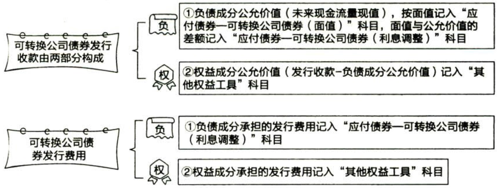

负债.流动负债+非流动负债

# 1. 流动负债

## 1.1. 简单科目

“`短期借款`”科目核算的是短期借款的`本金`增减变动的情况，短期借款的`利息`可以在发生时直接计入`财务费用`，如果按季支付，可以`按月预提`，预提时通过“`应付利息`”科目核算。

“`应付票据`”是由出票人出票，付款人在特定日期无条件支付指定的金额给收款人或者持票人的票据。应付票据按带息与否分为`不带息`应付票据和`带息`应付票据两种。对于带息应付票据，通常应在`期末`对尚未支付的应付票据`计提利息`，计入当期财务费用；票据到期支付票款时，`尚未计提的利息部分`直接计入当期`财务费用`。

“`应付账款`”一般按应付金额入账，而不按到期应付金额的现值入账。

“`预收账款`”不多的，可以不设置“预收账款”科目，直接记入“`应收账款`”科目的`贷方`。

注意事项：与收入准则相关的预收款项通过“`合同负债`”科目核算。

## 1.2. 应交税费

应交税费，包括企业依法应交纳的`增值税`、`所得税`、`消费税`、`城市维护建设税`、`教育费附加`、`房产税`、`土地使用税`、`土地增值税`、`车船税`、`资源税`等税费，以及在上缴国家之前，由企业代扣代缴的`个人所得税`等。

### 1.2.1. 增值税.一般纳税人

#### 1.2.1.1. 基本项目

应交税费——应交增值税（进项税额）：记录一般纳税人购进货物、加工修理修配劳务、服务、无形资产、不动产而`支付或负担`的、准予从当期销项税额中`抵扣`的增值税额。

应交税费——应交增值税（销项税额）：记录一般纳税人`销售`货物、加工修理修配劳务、服务、无形资产、不动产`应收取`的增值税额。

#### 1.2.1.2. 进项

应交税费——应交增值税（进项税额转出）：记录一般纳税人购进货物、加工修理修配劳务、服务、无形资产、不动产等发生`非正常损失`以及其他原因而`不应`从销项税额中`抵扣`、按规定转出的进项税额。

应交税费——待认证进项税额：核算一般纳税人由于未经税务机关认证而不得从当期销项税额中抵扣的进项税额。包括：一般纳税人已取得增值税扣税凭证、按照现行增值税制度规定准予从销项税额中抵扣，但尚未经税务机关认证的进项税额；一般纳税人已申请稽核但尚未取得稽核相符结果的海关缴款书进项税额。

#### 1.2.1.3. 销项

应交税费——应交增值税（销项税额抵减）：记录一般纳税人接照现行增值税制度规定因`扣减销售额`而减少的销项税额。

应交税费——待转销项税额：核算一般纳税人销售货物、加工修理修配劳务、服务、无形资产或不动产，已确认相关收入（或利得）但尚未发生增值税纳税义务而需于以后期间确认为销项税额的增值税额。

#### 1.2.1.4. 预交

应交税费——预交增值税：核算一般纳税人转让不动产、提供建筑服务、采用预收款方式销售自行开发的房地产项目等，以及其他按现行增值税制度规定`应预交的`增值税额。

#### 1.2.1.5. 月末

应交税费——应交增值税（已交税金）：记录一般纳税人`当月已交纳`的应交增值税额。

应交税费——应交增值税（转出未交增值税）：记录一般纳税人`月度终了`转出当月应交未交的增值税额。

应交税费——应交增值税（转出多交增值税）：记录一般纳税人`月度终了`转出当月多交的增值税额。

应交税费——未交增值税：核算一般纳税人`月度终了`从“应交增值税”或“预交增值税”明细科目`转入`当月应交未交、多交或预交的增值税额，以及当月交纳`以前期间`未交的增值税额。

#### 1.2.1.6. 减免

应交税费——应交增值税（减免税款）：记录一般纳税人按现行增值税制度规定准予`减免`的增值税额。

应交税费——应交增值税（出口抵减内销产品应纳税额）：记录实行“`免、抵、退`”办法的一般纳税人按规定计算的出口货物的进项税`抵减`内销产品的应纳税额。

应交税费——应交增值税（出口退税）：记录一般纳税人`出口`货物、加工修理修配劳务、服务、无形资产按规定`退回的`增值税额。

#### 1.2.1.7. 其他

应交税费——简易计税：核算一般纳税人采用简易计税方法发生的增值税计提、扣减、预缴、缴纳等业务。

应交税费——转让金融商品应交增值税：核算增值税纳税人转让金融商品发生的增值税额。

应交税费——代扣代交增值税：核算纳税人购进在境内未设经营机构的境外单位或个人在境内的应税行为代扣代缴的增值税。

#### 1.2.1.8. 举例

##### 1.2.1.8.1. 采购

:moneybag:【会计分录】`采购`等业务进项税额允许抵扣的

```
借：库存商品等
    应交税费——应交增值税（进项税额） // 当月以认证的可抵扣增值税额
    应交税费——待认证进项税额 // 当月未认证的可抵扣增值税额
  贷：银行存款等
```

##### 1.2.1.8.2. 销售

:moneybag:【会计分录】`销售`业务

```
借：应收账款等
  贷：主营业务收入
      A.应交税费——应交增值税（销项税额）
      B.应交税费——简易计税 // 采用简易计税方法计税的应纳增值税额
```

##### 1.2.1.8.3. 纳税义务发生时点较晚

按照国家统一的会计制度确认收入或利得的时点`早于`按照增值税制度确认增值税纳税义务发生时点：

:moneybag:【会计分录】确认收入或利得的时点`早于`纳税义务发生时点

```
借：应收账款等
  贷：主营业务收入
      应交税费——应交增值税（待转销项税额）
```

:moneybag:【会计分录】待实际发生纳税义务时

```
借：应交税费——应交增值税（待转销项税额）
  贷：A.应交税费——应交增值税（销项税额）
      B.应交税费——简易计税 // 采用简易计税方法计税的应纳增值税额
```

##### 1.2.1.8.4. 纳税义务发生时点较早

按照增值税制度确认增值税纳税义务发生时点`早于`按照国家统一的会计制度确认收入或利得的时点：

:moneybag:【会计分录】确认收入或利得的时点`早于`纳税义务发生时点

```
借：应收账款等
  贷：A.应交税费——应交增值税（销项税额）
      B.应交税费——简易计税 // 采用简易计税方法计税的应纳增值税额
```

按照国家统一的会计制度确认收入或利得时，应按扣除增值税销项税额后的金额确认收入。【会计分录】确认收入或利得时

| 借：应收账款等 贷：主营业务收入 |
|---------------------------------|


### 1.2.2. 增值税.小规模纳税人

小规模纳税人应在“`应交税费`”科目下，设置三个二级明细科目：“`应交增值税`”“`转让金融商品应交增值税`”“`代扣代交增值税`”。

小规模纳税企业发生的应税行为适用`简易计税`方法计税。

在购买商品时，其支付的增值税税额均不计入进项税额，不得由销项税额抵扣，应计入`相关成本费用`。

销售商品时按照`销售额`和`增值税征收率`计算增值税额，`不得抵扣`进项税额。

简易计税方法的销售额不包括其应纳税额，纳税人采用销售额和应纳税额合并定价方法的，按照公式$销售额=含税销售额/(1+征收率)$还原为不含税销售额计算。

### 1.2.3. 增值税.视同销售的账务处理

企业发生税法上`视同销售`的行为，应当按照企业会计准则制度相关规定进行相应的会计处理，并按照现行增值税制度规定计算的销项税额（或采用简易计税方法计算的应纳增值税额），作如下会计分录：

:moneybag:【会计分录】视同销售

```
借：应付职工薪酬/利润分配等
  贷：应交税费——应交增值税（销项税额）
      应交税费——简易计税 // 采用简易计税方法计税的应纳增值税额
      应交税费——应交增值税 // 小规模纳税人
```

### 1.2.4. 增值税.进项税额不予抵扣的情况及抵扣情况发生变化的会计处理

按照增值税有关规定，一般纳税人购进货物、加工修理修配劳务、服务、无形资产、不动产，用于简易计税方法的计税项目、免征增值税项目、集体福利、个人消费等，其进项税额不得从销项税额中抵扣的，应当计入`相关成本费用`，不通过“应交税费——应交增值税（进项税额）”科目核算。

因发生`非正常损失`或`改变用途`等，导致原已计入进项税额但按现行增值税制度规定不得从销项税额中抵扣的，应当将进项税额`转出`，借记“`待处理财产损溢`”、“`应付职工薪酬`”等科目，贷记“`应交税费——应交增值税（进项税额转出）`”科目。

:moneybag:【会计分录】视同销售

```
借：应付职工薪酬/待处理财产损溢等
  贷：应交税费——应交增值税（进项税额转出）
```

### 1.2.5. 增值税.差额征税的会计处理

一般纳税企业提供应税服务的，按照营业税改征增值税相关规定允许从销售额中扣除其应支付给其他单位或个人价款的，若采用`总额法`确认收入，减少的销项税额应借记“`应交税费——应交增值税（销项税额抵减）`”科目，小规模纳税企业应借记“`应交税费——应交增值税`”科目；若采用`净额法`确认收入，按照增值税相关规定确定的销售额计算增值税销项税额同时计入“`应交税费——应交增值税（销项税额）`”。

### 1.2.6. 增值税.转出多交增值税和未交增值税的会计处理

:moneybag:【会计分录】月末，应交未交的增值税

```
借：应交税费——应交增值税（转出未交增值税） // 当月应交未交的增值税
  贷：应交税费——未交增值税
```

:moneybag:【会计分录】月末，多交的增值税

```
借：应交税费——未交增值税 // 当月多交的增值税
  贷：应交税费——应交增值税（转出多交增值税）
```

### 1.2.7. 增值税.交纳增值税的会计处理

:moneybag:【会计分录】当月交纳当月的增值税

```
借：A.应交税费——应交增值税（已交税金）
    B.应交税费——应交增值税 // 小规模纳税人
  贷：银行存款
```

:moneybag:【会计分录】当月交纳以前各期的增值税

```
借：应交税费——未交增值税
  贷：银行存款
```

:moneybag:【会计分录】预交增值税

```
借：应交税费——预交增值税
  贷：银行存款
```

:moneybag:【会计分录】月末，预交抵未交

```
借：应交税费——未交增值税
  贷：应交税费——预交增值税
```

### 1.2.8. 增值税.税控系统专用设备及技术维护费用抵减增值税额的会计处理

按增值税有关规定，`首次购买`增值税税控系统专用设备支付的`费用`和缴纳的技术`维护费`允许在增值税应纳税额中`全额抵减`。

企业购入增值税税控系统专用设备，记入“`固定资产`”科目。按规定抵减的增值税应纳税额，会计处理如下：

:moneybag:【会计分录】税控系统费用抵税

```
借：A.应交税费——应交增值税（减免税款） // 一般纳税人
    B.应交税费——应交增值税 // 小规模纳税人
  贷：管理费用
```

企业发生技术维护费，按实际支付或应付的金额，借记“管理费用”等科目，贷记“银行存款”等科目。

### 1.2.9. 消费税.产品销售的会计处理

企业对外销售产品应交纳的消费税，记入“`税金及附加`”科目；在建工程领用自产产品（应税消费品），应交纳的消费税计入`在建工程`成本。

:moneybag:【会计分录】应交消费税

```
借：税金及附加/在建工程
  贷：应交税费——应交消费税
```

### 1.2.10. 消费税.企业委托加工的应税消费品的会计处理

企业`委托加工的`应税消费品，委托方收回后以`不高于`受托方的`计税价格`出售的，为直接出售，`不再`缴纳消费税；委托方收回后以`高于`受托方的`计税价格`出售的，不属于直接出售，需按照规定`申报缴纳`消费税，在计税时`准予扣除`受托方已代收代缴的消费税；委托加工的应税消费品收回后用于连续生产应税消费品，按规定准予抵扣的，记入“`应交税费——应交消费税`”科目的`借方`。

委托外单位加工完成的存货，计入`存货成本`的包括：{

①实际能用的原材料或者半成品成本；②加工费；③运杂费；④支付的收回后，以不高于受托方的计税价格出售的，受托方代收代缴的应税消费品的`消费税`。

}

支付的用于连续生产应税消费品按规定准予抵扣的消费税，不计入存货成本，应记入“`应交税费——应交消费税`”科目的借方，用以抵减最终完工产品销售时缴纳的消费税。

### 1.2.11. 城建税、教育费附加、房产税、土地使用税、车船税

:moneybag:【会计分录】城教房地车

```
借：税金及附加
  贷：应交税费——应交城市维护建设税、
      应交税费——应交教育费附加
      应交税费——应交房产税
      应交税费——应交土地使用税
      应交税费——应交车船税
```

### 1.2.12. 耕地占用税

:moneybag:【会计分录】耕地占用税

```
借：在建工程
  贷：银行存款
```

### 1.2.13. 土地增值税

转让国有土地使用权、地上建筑物及其附属物一并通过“固定资产清理”或“在建工程”科目核算的：

:moneybag:【会计分录】土地增值税

```
借：固定资产清理/在建工程
  贷：应交税费——应交土地增值税
```

转让的土地使用权通过“无形资产”科目核算的：

:moneybag:【会计分录】土地增值税

```
借：银行存款
    无形资产减值准备
    累计摊销
  贷：无形资产
      应交税费——应交土地增值税
      资产处置损益 // 倒挤的差额
```

### 1.2.14. 资源税

:moneybag:【会计分录】`销售`资源税应税产品

```
借：税金及附加
  贷：应交税费——应交资源税
```

收购未税矿产品代扣代徽的资源税计入相关资产成本。

### 1.2.15. 印花税

:moneybag:【会计分录】印花税

```
借：税金及附加
  贷：银行存款 // 印花税
```

### 1.2.16. 问题：补缴税款

中国证监会会计部《上市公司执行企业会计准则监管问题解答》（2010年第1期）上市公司按照税法规定需补缴以前年度税款或由上市公司主要股东或实际控制人无偿代为承担或缴纳税款及相应罚金、滞纳金的，应该如何进行会计处理？

解答：上市公司应当按照企业会计准则的规定，进行所得税及其他税费的核算。对于上市公司按照税法规定需补缴以前年度税款的，如果属于`前期差错`，应按照《企业会计准则第28号——会计政策、会计估计变更和差错更正》的规定处理，调整`以前年度`会计报表相关项目；否则，应计入补缴税款`当期损益`。因补缴税款应支付的罚金和滞纳金，应计入`当期损益`。对于主要股东或实际控制人无偿代上市公司缴纳或承担的税款，上市公司取得股东代缴或承担的税款、罚金、滞纳金等应计入`所有者权益`。

## 1.3. 应付股利

应付股利，是指企业经股东大会或类似机构审议`批准分配`的现金股利或利润。企业股东大会或类似机构审议批准的利润分配方案、宣告分派的现金股利或利润，在实际支付前，形成企业的`负债`。

:moneybag:【会计分录】审议批准时：

```
借：利润分配
  贷：应付股利
```

:moneybag:【会计分录】实际支付现金股利或利润时：

```
借：应付股利
  贷：银行存款
```

企业董事会或类似机构通过的利润分配方案中拟分配的现金股利或利润，不应确认为负债，但应在`附注`中披露。

## 1.4. 其他应付款

其他应付款，是指企业除［应付账款、应付票据、预收账款、应付职工薪酬、应付利息、应付股利、应交税费、长期应付款］等以外的其他各项`应付`、`暂收`款项，如`应付租入包装物租金`、`存入保证金`等。

企业采用`售后回购`方式融入资金的，应按实际收到的金额，借记“`银行存款`”科目，贷记“`其他应付款`”“`应交税费`”等科目。回购价格与原销售价格之间的`差额`，应在售后回购期间内按期`计提利息`费用，借记“`财务费用`”科目，贷记“`其他应付款`”科目。按照合同约定购回该项商品时，借记“其他应付款”“应交税费”等科目，应按实际支付的金额，贷记“银行存款”科目。

# 2. 非流动负债

## 2.5. 长期借款

:moneybag:【会计分录】企业借入长期借款

```
借：银行存款
    长期借款——利息调整
  贷：长期借款——本金
```

:moneybag:【会计分录】资产负债表日

```
借：在建工程\\制造费用\\财务费用\\研发支出等
  贷：应付利息
      长期借款——利息调整
```

到期一次还本付息的长期借款，其利息通过“`长期借款——应计利息`”科目核算。

:moneybag:【会计分录】归还长期借款

```
借：长期借款——本金
  贷：银行存款
      长期借款——利息调整
      在建工程\\制造费用\\财务费用\\研发支出等 // 倒挤的差额
```

## 2.6. 公司债券

### 2.6.17. 一般公司债券

:moneybag:【会计分录】发行债券

```
借：银行存款
  贷：应付债券——面值 // 债券面值
      应付债券——利息调整 // 倒挤的差额
```

发行债券的发行费用应计入发行债券的初始成本，反映在“`应付债券——利息调整`”明细科目中。

:moneybag:【会计分录】期末计提利息

```
借：财务费用/在建工程/制造费用等
    应付债券——利息调整 // 倒挤的差额
  贷：A.应付利息 // 分期付息债券，按票面利率支付利息
      B.应付债券——应计利息 // 到期一次还本付息债券，按票面利率计算利息
```

:moneybag:【会计分录】到期归还本金和利息

```
借：应付债券——面值
    A.应付利息 // 分期付息债券，按票面利率支付最后一次利息
    B.应付债券——应计利息 // 到期一次还本付息债券，按票面利率计算利息
  贷：银行存款
```

### 2.6.18. 可转换公司债券

#### 2.6.18.9. 发行可转债

:moneybag:【会计分录】发行可转债

```
借：银行存款
  贷：应付债券——可转换公司债券（面值）
      应付债券——可转换公司债券（利息调整） // 或借方
      其他权益工具 // 权益成分的公允价值
```



#### 2.6.18.10. 转换股份前

可转换公司债券的负债成分，在转换为股份前，其会计处理与一般公司债券相同，即按照`实际利率`和`摊余成本`确认`利息费用`，按面值和票面利率确认`应付利息`，差额作为`利息调整`进行`摊销`。

#### 2.6.18.11. 转换股份时

:moneybag:【会计分录】转换股份时

```
借：应付债券——可转换公司债券（面值、利息调整、应计利息） // 账面余额
    其他权益工具 // 转换部分权益成分的公允价值
    应付利息 // 分期付息可转债转股时尚未支付的利息
  贷：股本 // 股票面值\*转股数
      资本公积——股本溢价 // 倒挤的差额
```

企业发行附有`赎回选择权`的可转换公司债券，其在赎回日可能支付的利息补偿金，即债券约定赎回期届满日应当支付的利息减去应付债券票面利息的差额，应当在债券发行日至债券约定赎回届满日期间`计提`应付利息，计提的应付利息，分别计入相关资产成本或财务费用。

## 2.7. 长期应付款

长期应付款，是指企业除［长期借款、应付债券］以外的真他各种长期应付款项，包括`以分期付款方式购入固定资产`发生的应付款项等。

企业延期付款购买资产，如果延期支付的购买价款超过`正常信用条件`，实质上具有`融资性质`的，所购资产的成本应当以延期支付购买价款的`现值`为基础确定。实际支付的价款与购买价款的现值之间的差额（`未确认融资费用`），应当在信用期间内采用`实际利率法`进行摊销，计入相关资产成本或当期损益。

# 3. 总结

End。
