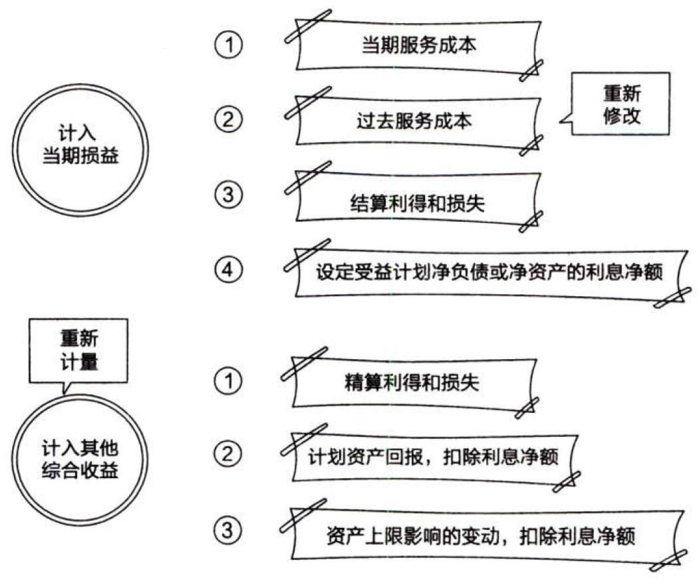

负债.职工薪酬.设定受益计划

## 0.1. 设定受益计划

设定受益计划是指除设定提存计划以外的离职后福利计划。

在设定提存计划下，风险实质上要由`职工`来承担。在设定受益计划下，风险实质上由`企业`来承担。【职工有保障了】

设定受益计划的核算涉及四个步骤：

### 0.1.1. 步骤一：确定设定受益义务现值和当期服务成本。

设定受益义务的现值，是指企业在不扣除任何`计划资产`的情况下，为履行当期和以前期间职工服务产生的义务所需的`预期未来支付额`的现值。

### 0.1.2. 步骤二：确定设定受益计划净负债或净资产。

设定受益计划存在资产的，企业应当将设定受益计划义务`现值`减去设定受益计划`资产`公允价值所形成的赤字或盈余确认为一项设定受益计划`净负债或净资产`。

设定受益计划存在盈余的，企业应当以设定受益计划的`盈余`和资产`上限`两项的孰低者计量设定受益计划净资产。其中，资产上限，是指企业可从设定受益计划`退款`或`减少`未来对设定受益计划`缴存资金`而获得的经济利益的`现值`。

计划资产包括`长期职工福利基金`持有的`资产`以及符合条件的`保险单`，不包括企业应付但未付给基金的提存金以及由企业发行并由基金持有的任何不可转换的金融工具。

### 0.1.3. 步骤三：确定应当计入当期损益的金额。

设定受益计划中应确认的计入当期损益的金额=`服务成本`+设定受益净负债或净资产的`利息`净额。

服务成本包括［当期服务成本、过去服务成本、结算利得或损失］。

#### 0.1.3.1. 当期服务成本

当期服务成本，是指因职工`当期服务`导致的设定受益义务现值的增加额。

#### 0.1.3.2. 过去服务成本

过去服务成本，是指设定受益计划`修改`所导致的与以前期间职工服务相关的设定受益计划义务`现值的增加或减少`。

过去服务成本`不包括`下列各项：{

①以前`假定`的薪金增长金额与`实际`发生金额之间的差额，对支付以前年度服务产生的福利义务的影响；

②企业对支付养老金增长金额具有`推定义务`的，对可`自行决定`养老金增加金额的高估和低估；

③财务报表中己确认的精算利得或计划资产回报导致的福利改进的估计；

④在没有新的福利或福利改进的情况下，职工达到既定要求之后导致既定福利（即并不取决于未来雇佣的福利）的增加。

}

#### 0.1.3.3. 结算利得和损失

企业应当在设定受益计划`结算`时，确认一项结算利得或损失。

设定受益计划结算利得或损失是下列两项的`差额`：{

①在结算日确定的设定受益计划义务`现值`。

②结算`价格`，包括转移的计划资产的公允价值和企业直接发生的与结算相关的支付。

}

#### 0.1.3.4. 设定受益计划净负债或净资产的利息净额

设定受益计划净负债或净资产的`利息`净额，是指设定受益净负债或净资产在所处期间由于时间流逝产生的变动。包括计划资产的利息收益、设定受益计划义务的利息费用以及资产上限影响的利息。

### 0.1.4. 步骤四：确定应当计入其他综合收益的金额

设定受益净负债或净资产的重新计量应当计入`其他综合收益`，且在后续期间`不应`重分类计入损益，但是企业可以在`权益范围`内转移这些在其他综合收益中确认的金额。

重新计量设定受益计划净负债或净资产所产生的变动包括下列部分：【精算+回报+上限】{

①`精算`利得和损失。

即由于`精算假设和经验`调整导致之前所计量的设定受益计划义务现值的增加或减少。产生精算利得和损失的原因包括：企业`未能预计`的过高或过低的职工流动率、提前退休率、死亡率、过高或过低的薪金、福利或医疗费用的增长以及折现率变化等因素。精算利得和损失`不包括`因引入、修改、缩减或结算设定受益计划所导致的设定受益义务现值的变动，或者设定受益计划下应付福利的变动。这些变动产生了过去服务成本或结算利得或损失。

②计划资产`回报`，扣除包含在设定受益净负债或净资产的`利息`净额中的金额。

计划资产的回报，指计划资产产生的利息、股利和其他收入，以及计划资产己实现和未实现的利得或损失。企业在确定计划资产回报时，应当扣除管理该计划资产的成本以及计划本身的应付税款，但计量设定受益义务时所采用的精算假设所包括的税款除外。管理该计划资产以外的其他管理费用不需从计划资产回报中扣减。

③`资产上限`影响的变动，扣除包括在设定受益净负债或净资产的`利息`净额中的金额。

}

注意区分应当计入当期损益的金额和应当计入其他综合收益的金额。

