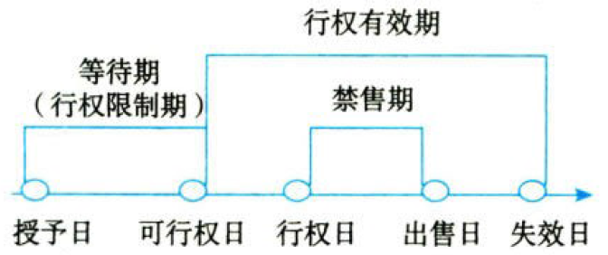
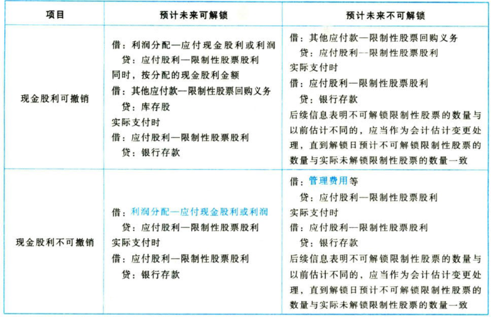

负债.股份支付

# 1. 股份支付概述

股份支付，是指企业为获取职工和其他方提供服务而`授予权益工具`或者承担以权益工具为基础确定的负债的交易。【不给固定报酬，给股权了】

## 1.1. 股份支付的四个主要环节



`授予日`是指股份支付协议获得`批准`的日期。【这事定了】

`可行权日`是指可行权条件得到满足、职工或其他方`具有`从企业取得权益工具或现金`权利`的日期。【尽在掌握】

`行权日`是指职工和其他方行使权利、`获取`现金或权益工具的日期。【尘埃落定】

`出售日`是指股票的持有人将行使期权所取得的期权股票`出售`的日期。【卖钱】

## 1.2. 股份支付工具的主要类型

股份支付分为［`以权益结算`的股份支付］和［`以现金结算`的股份支付］。

①以权益结算的股份支付，是指企业为获取服务而以`股份`（如限制性股票）或其他权益工具（如股票期权）作为对价进行结算的交易。【给股票】

②以现金结算的股份支付，是指企业为获取服务而承担的以`股份`或其他权益工具为`基础`计算的交付`现金`或其他资产义务的交易。如模拟股票和现金股票增值权等。【给现金】

# 2. 股份支付.确认+计量

## 2.3. 股份支付.确认+计量原则

### 2.3.1. 权益结算的股份支付.确认+计量原则

#### 2.3.1.1. 换取职工服务的股份支付.确认+计量原则

应按`授予日`权益工具的`公允价值`计量，不确认其后续公允价值变动。【肉割下来就不长了】【每股价值不变】

对于换取职工服务的股份支付，企业应当以股份支付所授予的权益工具的公允价值计量。企业应在等待期内的每个`资产负债表日`，以对可行权权益工具数量的`最佳估计数`为基础，按照权益工具在授予日的公允价值，将当期取得的服务计入相关资产成本或当期费用，同时计入`资本公积——其他资本公积`。【每股价值\*估计股数\*期间占比】

对于授予后立即可行权的换取职工提供服务的权益结算的股份支付，应在`授予日`按照权益工具的公允价值，将取得的服务计入相关资产成本或当期费用，同时计入`资本公积——股本溢价`。【瞬间走完全程，省事了】

#### 2.3.1.2. 换取其他方服务的股份支付的确认和计量原则

对于换取其他方服务的股份支付，企业应当以股份支付`所换取的服务`的公允价值计量。【市场交易，看对价】

#### 2.3.1.3. 权益工具公允价值无法可靠确定时的处理

在`极少数`情况下，授予`权益工具的公允价值`无法可靠计量。在这种情况下，企业应当在获取对方提供服务的`时点`、后续的每个`资产负债表日`、`结算日`，以`内在价值`计量该权益工具，内在价值的`变动`计入当期损益。同时，企业应当以`最终`可行权或`实际`行权的权益工具数量为基础，确认取得服务的金额。【内在价值】

内在价值是指交易对方有权认购或取得的`股份的公允价值`，与其按照股份支付协议应当支付的价格间的`差额`。【股价-对方代价】

企业对上述以内在价值计量的已授予权益工具进行结算，应当遵循以下要求：{

①结算发生在等待期内的，企业应当将结算作为`加速可行权`处理，即立即确认本应于剩余等待期内确认的服务金额。【视为到期】

②结算时支付的款项应当作为`回购`该权益工具处理，即`减少`所有者权益。结算支付的款项高于该权益工具在回购日内在价值的部分，计入当期损益。【现金支付？】

}

### 2.3.2. 现金结算的股份支付.确认+计量原则

①企业应当在等待期的每个`资产负债表日`，以对可行权情况的`最佳估计`为基础，按照企业承担负债的`公允价值`，将当期取得的`服务`计入相关资产成本或当期费用，同时计入负债，并在结算前的每个`资产负债表日`和`结算日`对负债的公允价值`重新计量`，将其变动计入损益。【每年末，先算服务成本，再调整负债的公允价值】

②对于授予后`立即可行权`的现金结算的股份支付，企业应当在`授予日`按照企业承担的负债的公允价值计入相关资产`成本`或费用，同时计入负债，并在结算前的每个`资产负债表日`和`结算日`对负债的公允价值`重新计量`，将其变动计入损益。【立即算成本，每年末调整负债的公允价值】

## 2.4. 可行权条件的种类、处理、修改


可行权条件是指能够确定企业是否得到职工或其他方提供的服务，且该服务使职工或其他方`具有`获取股份支付协议规定的权益工具或现金等`权利`的条件。【在什么条件下，职工/其他方就有权利了】反之，为非可行权条件。【是条件，不过无所谓】

### 2.4.3. 可行权条件的种类

可行权条件包括［`服务期限`条件］和［`业绩`条件］。

①服务期限条件是指职工或其他方完成规定`服务期限`才可行权的条件。【干满5年才有】

②业绩条件是指职工或其他方完成规定服务期限且企业已经达到`特定业绩目标`才可行权的条件，具体包括［`市场`条件］和［`非市场`条件］。【绩效合格才有】

市场条件是指［行权价格、可行权条件、行权可能性］与权益工具的`市场价格`相关的业绩条件，如股份支付协议中关于股价上升至何种水平职工或其他方可相应取得多少股份的规定。

非市场条件是指除市场条件之外的`其他`业绩条件，如股份支付协议中关于达到最低`盈利目标`或`销售目标`才可行权的规定。

对于行权条件为业绩条件的股份支付，只要职工满足`非市场条件`，企业就予以确认相关成本费用，`无须`考虑市场条件的影响，因市场条件在确认`授予日`权益工具的公允价值时已考虑。【市场条件早就算过了】

③权益结算股份支付每期`成本`费用的计算。

资产负债表日累计确认成本费用总额＝`预计`可行权股票期权`数量`×`授予日`权益工具的`公允价值`×（授予日至资产负债表日`期间`／`等待期`）。【估计股数\*每股价值\*期间占比】

某一期间确认成本费用＝`期末`累计数－`期初`累计数。

### 2.4.4. 可行权条件的修改

①条款和条件的`有利`修改

有利修改或不利修改是对`激励对象`而言的，如股票价格每股10元，行权价每股6元，则权益工具的公允价值＝10-6=4（元），当行权价修改为4元（即行权价减少2元，对激励对象是有利修改），则权益工具的公允价值＝10-4=6（元），即权益工具的公允价值增加2元。

企业应考虑修改后的可行权条件，将`增加的`权益工具的公允价值相应地确认为取得`服务的增加`。【多劳多得】

②条款和条件的`不利`修改

`如同`该变更从未发生，`除非`企业取消了部分或全部已授予的权益工具。【视而不见】

③取消或结算

将取消或结算作为`加速可行权`处理，`立即确认`原本应在剩余等待期内确认的金额。【瞬间完事】

## 2.5. 权益工具公允价值的确定

### 2.5.5. 股份

对于授予职工的股份，其公允价值应按企业股份的`市场价格`计量。如果企业股份未公开交易，则应按估计的市场价格，并考虑授予股份所依据的条款和条件进行调整。

### 2.5.6. 股票期权

对于授予职工的股票期权，因其通常受到一些不同于交易期权的条款和条件的限制，因而在许多情况下难以获得其市场价格。如果不存在条款和条件相似的交易期权，就应通过`期权定价模型`来估计所授予的期权的公允价值。

估计授予职工期权的定价模型至少应考虑以下因素：{

①期权的行权价格；②期权期限；③基础股份的现行价格；④股价的预计波动率；⑤股份的预计股利；⑥期权期限内的无风险利率。

}

## 2.6. 股份支付的会计处理

### 2.6.7. 授予日

除了立即可行权的股份支付外，无论权益结算的股份支付还是现金结算的股份支付，企业在`授予日`均`不作会计处理`。【敲定这事，只是一纸协议】

### 2.6.8. 等待期内每个资产负债表日

企业应当在等待期内的每个`资产负债表日`，将取得职工或其他方提供的服务计入`成本`费用，同时确认`所有者权益`或`负债`。【成本与费用见增，权益和负债得涨】

①对于`权益结算`的涉及`职工`的股份支付，应当按照`授予日`权益工具的公允价值计入成本费用和资本公积——其他资本公积，`不确认`其后续公允价值变动。【当年就给了，以后的变动是职工的，不关企业的事】

:moneybag:【会计分录】计入成本费用

```
借：管理费用等
  贷：资本公积——其他资本公积
```

②对于`现金结算`的涉及`职工`的股份支付，应当按照每个`资产负债表日`权益工具的公允价值`重新计量`，确定成本费用和应付职工薪酬。【钱还没给出去，将来要给多少，得算清楚】

:moneybag:【会计分录】计入成本费用

```
借：管理费用等
  贷：应付职工薪酬
```

### 2.6.9. 可行权日之后

①对于`权益结算`的股份支付，在`可行权日`之后`不再`对已确认的成本费用和所有者权益总额进行调整。【大事已定，不需再动】

②对于`现金结算`的股份支付，企业在`可行权日`之后`不再`确认成本费用，负债（应付职工薪酬）公允价值的`变动`应当计入当期`损益`（公允价值变动损益）。【钱还没给出去，将来要给多少，得算清楚】

:moneybag:【会计分录】计入成本费用【或反转】

```
借：公允价值变动损益
  贷：应付职工薪酬
```

### 2.6.10. 回购股份进行职工期权激励

#### 2.6.10.4. 回购股份

按照回购股份的全部支出，借记“`库存股`”科目，贷记“`银行存款`”科目。【库存股是股票形式的资产】

#### 2.6.10.5. 确认成本费用

按照《企业会计准则第11号——股份支付》对职工权益结算股份支付的规定，企业应当在等待期内每个`资产负债表日`按照`授予日`权益工具的公允价值计算确定的金额，借记成本费用，贷记“`资本公积——其他资本公积`”科目。

#### 2.6.10.6. 职工行权

:moneybag:【会计分录】职工行权

```
借：银行存款 // 企业收到的股票价款
    资本公积——其他资本公积 // 等待期内资本公积累计确认的金额
  贷：库存股 // 实际交付给职工的库存股成本
      资本公积——股本溢价 // 倒挤的差额
```

## 2.7. 限制性股票的会计处理

实务中，上市公司实施限制性股票的股权激励安排中，常见做法是上市公司以非公开发行的方式向激励对象授予一定数量的公司股票，并规定`锁定期`和`解锁期`，在锁定期和解锁期内，不得上市流通及转让。达到解锁条件，可以解锁；如果全部或部分股票未被解锁而失效或作废，通常由上市公司按照事先约定的价格立即进行`回购`。

### 2.7.11. 授予日的会计处理

:moneybag:【会计分录】收到认股款

```
借：银行存款 // 企业有关限制性股票按规定履行了增资手续
  贷：股本
      资本公积——股本溢价
```

:moneybag:【会计分录】就回购义务确认负债

```
借：库存股 // 按照发行限制性股票的数量以及相应的回购价格计算确定的金额
  贷：其他应付款——限制性股票回购义务
```

### 2.7.12. 等待期内的会计处理

（1）与股份支付有关的会计处理，按权益结算股份支付确认与计量原则处理。

①在等待期内的每个`资产负债表日`，后续信息表明可解锁限制性股票的数量与以前估计不同的，应当进行`调整`，并在解锁日调整至`实际`可解锁的限制性股票数量；

②限制性股票分批解锁的，实际上相当于授予了若干个`子计划`，应当`分别`根据各子计划的可解锁数量的`最佳估计`在相应的等待期内确认与股份支付有关的成本费用。

（2）分配现金股利的会计处理

现金股利`可撤销`与现金股利`不可撤销`的限制性股票在会计处理上有其`共同点`：{

①都要求对未来解锁条件的满足情况进行合理估计，并且这一估计与上述进行股份支付会计处理时在等待期内每个`资产负债表`日对可行权权益工具数量进行的估计应当保持一致。

②对于预计未来`可解锁限制性股票`持有者应分配的现金股利，都视为对`股东`的利润分配。

}

不满足解锁条件的情况下，被回购限制性股票持有者是否有权享有其在等待期内应收或已收的`现金股利`？有权享有现金股利的，为现金股利不可撤销的限制性股票，否则为现金股利可撤销的限制性股票。

这一区别直接导致两者在会计处理上存在以下两方面差异：{

α.对于预计未来不可解锁限制性股票持有者应分配的现金股利，如果现金股利可撤销，意味着今后在回购这部分限制性股票时，其激励对象需`退还`原已收到的现金股利，或者上市公司可`抵减`应支付的回购价款，也就是说上市公司就未来回购义务而承担的负债随之下降，因此应当冲减相关已确认的负债金额；如果现金股利不可撤销，意味着这部分应分配的现金股利将成为上市公司不可避免的`成本`费用，应当在分派现金股利时，将相关的现金股利计入当期成本费用。

β.对于预计未来可解锁限制性股票持有者应分配的现金股利，今后上市公司将`无须回购`这部分限制性股票，如果现金股利可撤销，同样意味着上市公司就未来回购义务而承担的负债随之下降。因此，在进行利润分配会计处理的同时，还应当冲减相关已确认的负债和库持股的金额。

}



关键点：预计未来可解锁，现金股利通过“`利润分配`”科目核算；现金股利`可撤销`，应`减少`其他应付款。

### 2.7.13. 解锁日的会计处理

:moneybag:【会计分录】对未达到限制性股票解锁条件而需回购的股票

```
借：其他应付款——限制性股票回购义务 // 应支付的金额
  贷：银行存款
借：股本
    资本公积——股本溢价 // 差额
  贷：库存股 // 按照`注销的`限制性股票数量相对应的库存股的账面价值
```

:moneybag:【会计分录】对达到限制性股票解锁条件而无须回购的股票

```
借：其他应付款——限制性股票回购义务 // 按照解锁股票相对应的负债的账面价值
  贷：库存股 // 按照解锁股票相对应的库存股的账而价值
```

## 2.8. 集团股份支付的处理

### 2.8.14. 基本规定

企业集团（由母公司和其全部子公司构成）内发生的股份支付交易，应当按照以下规定进行会计处理：

①结算企业以其`本身`权益工具结算的，应当将该股份支付交易作为`权益结算`的股份支付处理；除此之外，应当作为`现金结算`的股份支付处理。【给自己的股票，不算给钱】

结算企业是接受服务企业的投资者的，应当按照`授予日`权益工具的公允价值或应承担负债的公允价值确认为对`接受服务企业`的长期股权投资，同时确认`资本公积——其他资本公积`或`负债`。【妈给保姆的钱，是对儿子的长期股权投资】

②(接受服务企业`没有`结算义务)或(授予本企业职工的是其`本身`权益工具)的，应当将该股份支付交易作为`权益结算`的股份支付处理；【我不管的or用自己的白条给的，都是权益支付】

(接受服务企业具有结算义务)且(授予本企业职工的是企业集团内`其他企业`权益工具)的，应当将该股份支付交易作为`现金结算`的股份支付处理。【自己给别人的东西，要花钱】

上述规定图示如下：


基本的原则是“谁受益，谁确认成本费用”。

### 2.8.15. 等待期内具体账务处理

#### 2.8.15.7. 结算企业（母公司）以其本身权益工具结算，接受服务企业（子公司）没有结算义务的情况

:moneybag:【会计分录】结算企业【妈打白条】

```
借：长期股权投资
  贷：资本公积——其他资本公积 // 按[权益结算]股份支付计量原则确认资本公积
```

:moneybag:【会计分录】接受服务企业【儿子白拿】

```
借：管理费用等
  贷：资本公积——其他资本公积 // 按[权益结算]股份支付计量原则确认资本公积
```

:moneybag:【会计分录】合并财务报表中应编制如下抵销分录

```
借：资本公积
  贷：长期股权投资
```

合并财务报表中相当于`集团会计主体`授予集团会计主体`职工`权益结算股份支付的结果。

#### 2.8.15.8. 结算企业（母公司）不是以其本身权益工具结算，接受服务企业（子公司）没有结算义务的

:moneybag:【会计分录】结算企业【妈给的是钱】

```
借：长期股权投资
  贷：应付职工薪酬 // 按[现金结算]股份支付计量原则确认应付职工薪酬
```

:moneybag:【会计分录】接受服务企业【儿子白拿】

```
借：管理费用等
  贷：资本公积——其他资本公积 // 按[权益结算]股份支付计量原则确认资本公积
```

:moneybag:【会计分录】合并财务报表中应编制如下抵销分录

```
借：资本公积
    管理费用等
  贷：长期股权投资
```

合并财务报表中相当于`集团会计主体`授予集团会计主体`职工`现金结算股份支付的结果，合并财务报表中最终体现的是按`现金结算`股份支付计量原则确认的应付职工薪酬和管理费用等。因接受服务企业确认的管理费用等是按`权益结算`股份支付计量原则确定的，所以合并财务报表抵销分录中会出现`差额`，该差额计入管理费用等。

#### 2.8.15.9. 结算企业和接受服务企业均为母公司，且授予本公司职工的是其本身权益工具的

:moneybag:【会计分录】妈给自己的白条

```
借：管理费用等
  贷：资本公积——其他资本公积 // 按[权益结算]股份支付计量原则确认资本公积
```

#### 2.8.15.10. 结算企业和接受服务企业均为母公司，且不是以其本身权益工具结算

:moneybag:【会计分录】妈花钱买一家子的用品

```
借：管理费用等
  贷：应付职工薪酬 // 按[现金结算]股份支付计量原则确认应付职工薪酬
```

集团股份支付可能同时涉及`母公司`职工和`子公司`职工，因此结算企业一般是母公司，而接受服务企业可能是子公司，也可能是母公司和子公司。

# 3. 总结

End。
