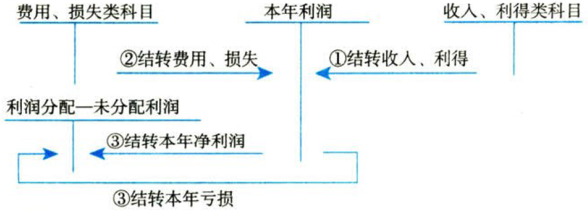

费用+利润

# 1. 费用

## 1.1. 费用的确认

费用是指企业在`日常活动`中发生的、会导致所有者权益`减少`的、与向所有者分配利润`无关`的经济利益的`总流出`。

## 1.2. 期间费用

期间费用包括`管理费用`、`销售费用`和`财务费用`。【销管财】

### 1.2.1. 管理费用

管理费用是指企业为`组织`和`管理`企业生产经营所发生的管理费用。

企业在筹建期间内发生的`开办费`、`行政管理部门`等发生的固定资产`日常修理费`等应计入管理费用。

### 1.2.2. 销售费用

销售费用是指企业在`销售`商品和材料、`提供`劳务的过程中发生的各种费用。

### 1.2.3. 财务费用

财务费用是指企业为筹集生产经营所需资金等而发生的`筹资费用`。

# 2. 利润

## 2.3. 利润的构成

利润是指企业在一定会计期间的`经营成果`。利润包括收入减去费用后的`净额`、直接计入当期利润的`利得和损失`等。

直接计入当期利润的利得和损失，是指应当计入当期`损益`、会导致所有者权益发生`增减`变动的、与所有者投入资本或者向所有者分配利润`无关`的利得或者损失。

利润相关计算公式如下：

营业利润＝营业收入－营业成本－税金及附加－销售费用－管理费用－研发费用－财务费用－资产减值损失－信用减值损失＋其他收益＋投资收益（－投资损失）＋净敞口套期收益（－净敞口套期损失）＋公允价值变动收益（－公允价值变动损失）＋资产处置收益（－资产处置损失）。

利润总额＝营业利润＋营业外收入－营业外支出。

其中：营业外收入是指企业发生的与其`日常活动`无直接关系的各项利得。营业外支出是指企业发生的与其`日常活动`无直接关系的各项损失。

净利润＝利润总额－所得税费用。

其中，所得税费用是指企业确认的应从当期利润总额中`扣除`的所得税费用。

## 2.4. 营业外收支的会计处理

### 2.4.4. 营业外收入

营业外收入是指企业发生的营业利润以外的收益。主要包括非流动资产`毁损报废`利得、与企业日常活动无关的政府`补助`、`盘盈`利得、`捐赠`利得等。

盘盈利得一般指的是`现金盘盈`。

企业接受控股股东（或控股股东的子公司）或非控股股东（或非控股股东的子公司）直接或间接`代为偿债`、`债务豁免`或`捐赠`，经济`实质`表明属于控股股东或非控股股东对企业的`资本性投入`，应当将相关的利得计入所有者权益（`资本公积`）。【实质上是投资】

企业发生破产重整，其`非控股股东`因执行人民法院批准的破产重整计划，通过`让渡`所持有的该企业部分股份向企业债权人偿债的，企业应将非控股股东所让渡股份按照其在让渡之日的`公允价值`计入所有者权益（资本公积），减少所豁免债务的`账面价值`，并将让渡股份公允价值与被豁免的债务账面价值之间的`差额`计入`当期损益`。【卖股得钱，用以还债】

### 2.4.5. 营业外支出

营业外支出是指企业发生的营业利润以外的支出，主要包括非流动资产`毁损报废`损失、公益性`捐赠`支出、`非常`损失、固定资产`盘亏`损失等。

## 2.5. 本年利润的会计处理

## 2.6. 综合收益总额

`净利润`加上其他综合收益扣除所得税影响后的`净额`为综合收益总额。

# 3. 总结

End。
