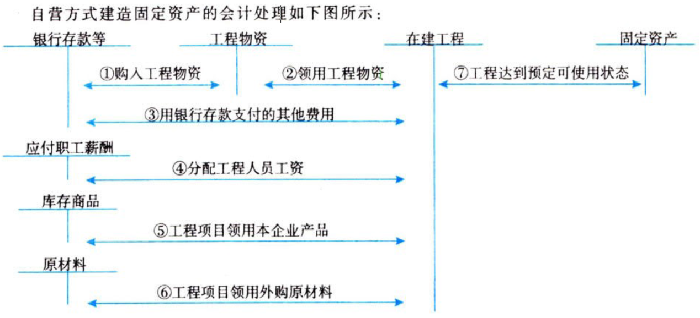
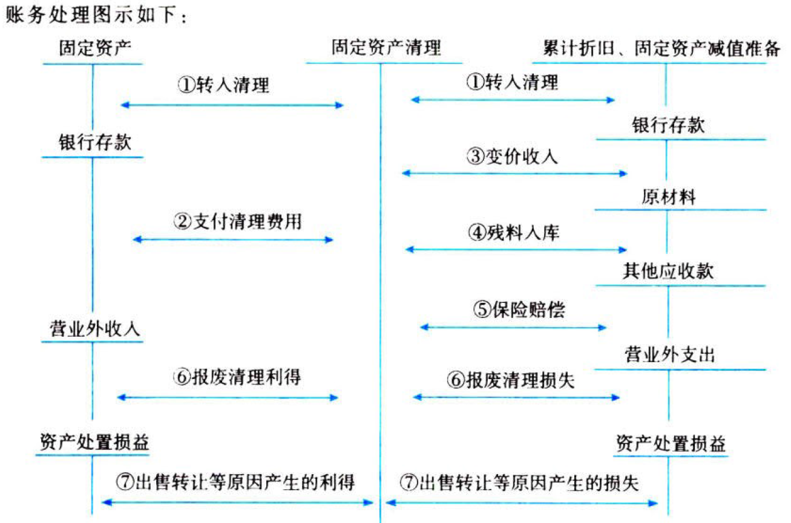

资产.固定资产

# 1. 固定资产.确认+初始计量

## 1.1. 定义

为［生产商品、提供劳务、出租、经营管理］而持有的；【为了用】

`使用寿命`超过一个会计年度；【超过1年】

## 1.2. 确认条件

与该固定资产有关的经济利益`很可能`流入企业；

该固定资产的成本能够`可靠计量`；

## 1.3. 初始计量

固定资产应当按照`取得成本`进行初始计量。【类似存货，长期存货】

固定资产的成本，是指企业为购建某项固定资产，使其达到`预定可使用状态`前所发生的可归属于该项固定资产的一切合理必要的支出。

举例：{

购买`价`款；运杂费；保险费；包装费；安装成本；

应承担的借款利息`资本化部分`；

满足资本化条件的外币专门借款`汇兑差额`；

应`分摊`的其他间接费用；

}

### 1.3.1. 外购固定资产

企业外购固定资产的成本，包括［购买价款、相关税费、运输费、装卸费、安装费、专业人员服务费］等。

`不包括`员工培训费。

:moneybag:【会计分录】购入`不需要安装`的固定资产

```
借：固定资产
    应交税费——应交增值税（进项税额）
  贷：银行存款等
```

:moneybag:【会计分录】购入`需要安装`的固定资产

```
///购入时
借：在建工程
    应交税费——应交增值税（进项税额）
  贷：银行存款等
///安装时
借：在建工程
  贷：应付职工薪酬等
///达到预定可使用状态
借：固定资产
  贷：在建工程
```

企业以一笔款项同时购入多项没有单独标价的固定资产，应当按照各项固定资产的公允价值占总成本的`比例`进行分配，分别确定各项固定资产的成本。【按公允价值比例分配】

企业购买固定资产的价款超过`正常信用条件`延期支付，实质上具有融资性质的，固定资产的成本以`购买价款的现值`为基础确定。实际支付的价款与现值之间的差额，应在信用期间内采用`实际利率法`进行摊销，摊销金额除满足借款费用`资本化条件`的应当计入固定资产成本外，其余均应当在借用期间内确认为财务费用，计入当期损益。【融资性质，现值为准，利息-\>资本化or费用化】

### 1.3.2. 自行建造固定资产

#### 1.3.2.1. 自营方式建造



`建设期间`发生的［(工程物资盘亏、报废及毁损) - (残料价值) -
(保险公司或过失人赔款)］后的(净损失)，计入在建工程的成本；盘盈的工程物资或处置`净`收益，冲减在建工程的成本。【附属物，都算到在建工程头上】

`工程完工后`发生的工程物资盘盈、盘亏、报废、毁损，计入当期损益。【跟我在建工程无关了】

建造固定资产领用工程物资、原材料、库存商品，应按其`成本`转入在建工程的成本。

自营方式建造固定资产应负担的职工薪酬、辅助生产部门提供的(水电修理运输等)劳务、(其他必要支出)也应计入在建工程的成本。【成本转成本，不增不减】

符合`资本化条件`，应计入所建造固定资产成本的借款费用，按照《企业会计准则第17号——借款费用》的有关规定处理。

固定资产已达到预定可使用状态，但尚未办理竣工决算的，应当从达到`预定可使用状态`之日起，根据(工程预算、造价、工程实际成本)等，按`暂估价值`转入固定资产，计提折旧。待办理竣工决算手续后再调整原来的暂估价值，但不需要调整原已计提的折旧额。【未来适用法】

#### 1.3.2.2. 出包方式建造


企业以`出包`方式建造固定资产，其成本由建造该项固定资产达到`预定可使用状态`前所发生的`必要支出`构成，包括［建筑工程支出、安装工程支出、待摊支出］。

待摊支出是指在建设期间发生的，不能单独计入某项固定资产价值，应由所有固定资产`共同负担`的相关费用，包括［管理费、可行性研究费、临时设施费、公证费、监理费、税金、符合资本化条件的借款费用、工程物资盘亏报废毁损净损失（自然灾害原因导致除外）、负荷联合试车费］。

### 1.3.3. 存在安全生产费的固定资产

高危行业企业按照国家规定提取`安全生产费`。

:moneybag:【会计分录】`提取`安全生产费时【一下子计入成本了】

```
借：生产成本/制造费用/当期损益
  贷：专项储备
```

:moneybag:【会计分录】`使用`提取的安全生产费（费用性支出）时

```
借：专项储备
  贷：银行存款
```

:moneybag:【会计分录】使用提取的安全生产费（形成固定资产）时

```
借：固定资产
  贷：在建工程
借：专项储备
  贷：累计折旧 // 按固定资产入账金额`一次性`计提100%折旧
```

【link】“专项储备”科目期末余额在［资产负债表.所有者权益］项目下“`其他综合收益`”和“`盈余公积`”之间增设“`专项储备`”项目反映。

### 1.3.4. 存在弃置费用的固定资产

:moneybag:【会计分录】存在弃置费用的固定资产

```
///取得一项固定资产
借：固定资产
  贷：在建工程 // 实际发生的建造成本
      预计负债 // 弃置费用的`现值`
///每年发生财务费用
借：财务费用 // ＝预计负债.摊余成本×实际利率
  贷：预计负债
///支出弃置费用时
借：预计负债
  贷：银行存款
```

`一般`工商企业的固定资产发生的报废清理费用`不属于`弃置费用，应当在发生时作为固定资产的处置费用处理。

解释公告第6号：由于技术进步、法律要求、市场环境变化等原因，特定固定资产履行弃置义务可能会发生(支出金额、预计弃置时点、折现率等)的变动，从而引起原确认的预计负债的变动。此时，应按照以下原则调整该固定资产的成本：

①若预计负债减少，则以固定资产账面价值为限，扣减固定资产支出成本；超出部分确认为当期损益。

②若预计负债增加，则增加固定资产的成本。

【`相应增减`固定资产成本，若溢出则计入当期损益】

按照上述原则调整的固定资产，在资产剩余使用年限内计提折旧。

一旦该固定资产的使用寿命结束，预计负债的所有后续变动应在`发生时`确认为损益。

# 2. 固定资产.后续计量

## 2.4. 固定资产折旧

### 2.4.5. 折旧.定义

在固定资产`使用寿命`内，按照`确定的方法`对［应计折旧额］进行的系统分摊。

$$应计折旧额=固定资产原价-预计净残值-固定资产减值准备$$

企业应当对`所有的`固定资产计提折旧，除了［已`提足`折旧后仍继续使用的固定资产、单独计价入账的`土地`］之外。

### 2.4.6. 注意事项

固定资产应当`按月`计提折旧。固定资产应从达到`预定可使用状态`时开始计提折旧，［终止确认or划分为持有待售非流动资产］时停止计提折旧。

当月增加的固定资产，从下月起计提折旧；当月减少的固定资产，从下月起不计提折旧。【视为在月初0点0分0秒时刻执行计提工作】

固定资产提足折旧后，不论能否继续使用，均不再计提折旧。所谓提足折旧是指已经提足该项固定资产的应计折旧额。

提前`报废的`固定资产也不再补提折旧。

已达到预定可使用状态但尚未办理竣工决算的固定资产，应当按照`暂估价值`确定其成本，并计提折旧；待办理竣工决算后再按实际成本调整原来的暂估价值，但`不需要`调整原已计提的折旧额。

处于`更新改造`过程中的固定资产，应将其账面价值转入在建工程，停止计提折旧。更新改造项目达到预定可使用状态转为固定资产后，再按重新确定的折旧方法、预计净残值、尚可使用寿命计提折旧。【旧变新】

固定资产在定期`大修理`期间，照提折旧。【还是旧的】

### 2.4.7. 固定资产折旧方法

企业可选用的折旧方法包括［年限平均法、工作量法、双倍余额递减法、年数总和法］等。固定资产的折旧方法一经确定，`不得`随意变更。

企业在选择固定资产折旧方法时，应当根据与固定资产有关的经济利益的`预期消耗方式`做出决定。

由于收入可能受到投入、生产过程、销售等因素的影响，这些因素与固定资产有关经济利益的预期消耗方式无关，因此，企业不应以包括使用固定资产在内的经济活动所产生的收入为基础进行折旧。

#### 2.4.7.3. 年限平均法

```
年折旧额 = (原价 - 预计净残值) / 预计使用年限
= 原价 \* (1 - 预计净残值 / 原价) / 预计使用年限
= 原价 \* 年折旧率
```
#### 2.4.7.4. 工作量法

```
单位工作量折旧额 = (固定资产原价 - 预计净残值) / 预计总工作量
月折旧额 = 当月工作量 \* 单位工作量折旧额
```
#### 2.4.7.5. 双倍余额递减法

```
年折旧额 = 期初固定资产净值 / 预计使用年限 \* 2
固定资产净值（折余价值） = 固定资产原值 - 累计折旧。
```
`最后两年`改为年限平均法计算。

#### 2.4.7.6. 年数总和法

```
年折旧额 = (原价 - 预计净残值) \* 年折旧率
```
年折旧率用一组递减分数来表示。

例如预计使用年限为5年，1 + 2 + 3 + 4 + 5=15，则折旧率分别为5 / 15、4 / 15、3 /
15、2 / 15、1 / 15。

:moneybag:【会计分录】固定资产折旧

```
借：制造费用 // 生产车间
    管理费用 // 管理部门or闲置的固定资产
    销售费用 // 销售部门
    其他业务成本 // 固定资产出租了
    研发支出 // 研发无形资产时使用的固定资产
    在建工程 // 在建工程中使用的固定资产
  贷：累计折旧
```

## 2.5. 固定资产(预计使用寿命、预计净残值、折旧方法)的复核

企业至少应当于`每年年末`，对固定资产的使用寿命、预计净残值、折旧方法进行复核：{

使用寿命与原先估计数有`差异`的，应当调整固定资产使用寿命；

预计净残值与原先估计数有`差异`的，应当调整预计净残值；

与固定资产有关的经济利益`预期消耗方式`发生重大改变，应当改变折旧方法；

}【年末看看是不是要修改】

固定资产［使用寿命、预计净残值、折旧方法］的改变应当作为`会计估计变更`，按照《企业会计准则第28号——会计政策、会计估计变更和差错更正》处理。

# 3. 固定资产.后续支出

固定资产后续支出，是指固定资产在使用过程中发生的［`更新改造`支出、`修理费用`］等。

## 3.6. 后续支出.资本化

后续支出，符合固定资产确认条件的，应当计入固定资产成本，同时扣除［被替换部分的账面价值］。

企业对固定资产进行`更新改造`的，应将固定资产的(原价、已计提的累计折旧、减值准备)转销，将固定资产的账面价值转入`在建工程`，并`停止`计提折旧。

固定资产的可资本化的后续支出，通过“`在建工程`”科目核算。待固定资产发生的后续支出完工并达到预定可使用状态时，再从在建工程转为固定资产，并按重新确定的固定资产入账价值、使用寿命、预计净残值和折旧方法计提折旧。【添置的加上，扔掉的减去】

:moneybag:【会计分录】将固定资产账面价值转入在建工程

```
借：在建工程
    累计折旧
    固定资产减值准备
  贷：固定资产
```

:moneybag:【会计分录】扣除被替换部分的账面价值

```
借：银行存款 // 被替换部分的售价
    营业外支出 // 倒挤的差额
  贷：在建工程 // 被替换部分的账面价值
```

:moneybag:【会计分录】发生资本化的后续支出时

```
借：在建工程
  贷：应付职工薪酬/原材料等
```

:moneybag:【会计分录】达到预定可使用状态时

```
借：固定资产
  贷：在建工程
```

## 3.7. 后续支出. 费用化

固定资产的`修理费用`等后续支出，不符合固定资产确认条件的，应当根据不同情况分别在发生时计入当期`管理费用`或`销售费用`等。

与`存货`的生产和加工相关的固定资产的修理费用按照存货成本确定原则处理。

企业`行政管理部门`的固定资产发生的修理费用计入管理费用。

企业专设销售机构的，其发生的与`专设销售机构`相关的固定资产修理费用等后续支出，计入销售费用。【谁用，算谁头上】

对固定资产进行定期检查发生的`大修理费用`，符合资本化条件的，可以计入固定资产成本或其他相关资产的成本；不符合资本化条件的，应当费用化，计入当期损益。【大修理费用，视情况而定】

$$账面余额 = 原价$$

$$账面净值 = 原价 - 累计折旧$$

$$账面价值 = 原价 - 累计折旧 - 减值准备$$

# 4. 固定资产.处置

固定资产处置，包括［出售、转让、报废、毁损、对外投资、非货币性资产交换、债务重组］等。

## 4.8. 固定资产.终止确认的条件

固定资产满足下列条件之一的，应当予以`终止确认`：

①该固定资产处于`处置状态`；【我要废了他】

②该固定资产预期通过使用或处置`不能`产生经济利益。【他自己废了】

## 4.9. 固定资产处置.账务处理【卖掉】

企业出售、转让、报废、毁损的固定资产，应当将处置收入扣除(账面价值+相关税费)后的金额计入`当期损益`。



固定资产清理完成后产生的清理净损益，依据处置方式的不同，分别适用不同的处理方法。

因［丧失使用功能或因自然灾害发生毁损］等原因而`报废清理`产生的利得或损失应计入`营业外收支`。

属于生产经营期间正常报废清理产生的处理净损失，借记“`营业外支出——非流动资产报废`”科目，贷记“`固定资产清理`”科目。

属于生产经营期间由于自然灾害等非正常原因造成的，借记“`营业外支出——非常损失`”科目，贷记“`固定资产清理`”科目；如为净收益，借记“`固定资产清理`”科目，贷记“`营业外收入`”科目。【固定资产已经死亡，归为营业外收支】

因出售、转让等原因产生的固定资产处置利得或损失应计入“`资产处置损益`”。【倒挤的差额】

:moneybag:【会计分录】出售、转让固定资产

```
借：固定资产清理
    固定资产减值准备
    累计折旧
  贷：固定资产
借：银行存款
  贷：固定资产清理
      应交税费——应交增值税（销项税额）
      资产处置损益 // 倒挤的差额
```

# 5. 固定资产.清查

盘盈的固定资产，作为`前期会计差错`处理。在报经批准处理前，应先通过“`以前年度损益调整`”科目核算。【固定资产盘盈，肯定是前期工作出错了。那么大机器会看不见？】

:moneybag:【会计分录】固定资产盘盈

```
///作为前期差错处理
借：固定资产
  贷：`以前年度损益调整`
```

:moneybag:【会计分录】固定资产盘亏

```
借：营业外支出
  贷：固定资产
```

# 6. 总结

End。
