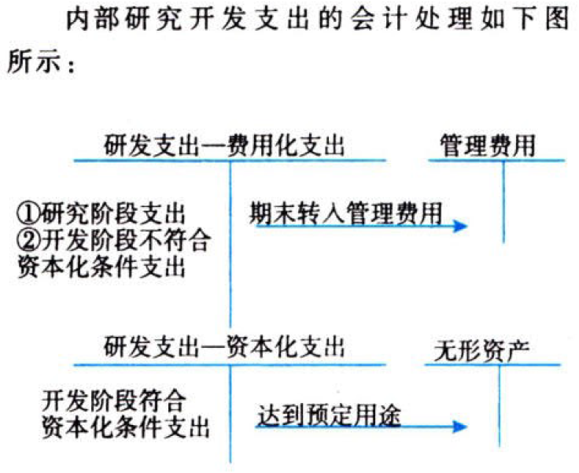
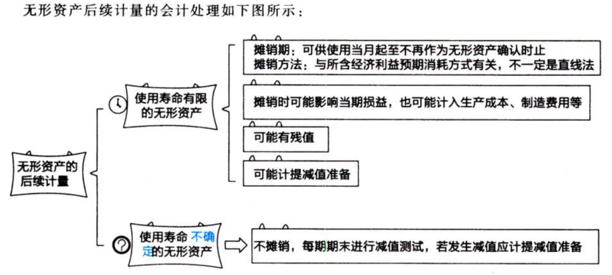

资产.无形资产

# 1. 无形资产.确认

## 1.1. 无形资产是什么

无形资产，是指企业［拥有或控制、`可辨认`、没有实物形态、非货币］的资产。

注意事项：计算机控制的机械工具，如果必须有(特定计算机软件)才能运行，就说明该软件是构成相关硬件不可缺少的组成部分，该软件应作为固定资产处理；若该计算机软件`不是`相关硬件不可缺少的组成部分，则该软件应作为无形资产核算。

注意事项：`商誉`的存在无法与企业自身分离，不具有可辨认性，`不属于`无形资产。

举例：A
公司支付对价820万元取得B公司80%股权，能够对B公司实施控制，B公司可辨认净资产公允价值为1000万元。A公司(个别报表)中不确认商誉，在(`合并财务报表`)中确认商誉=
820 - 1000×80% = 20（万元）

无形资产主要包括［专利权、非专利技术、商标权、著作权、特许权、土地使用权］等。

## 1.2. 无形资产.确认条件

无形资产在符合定义的前提下，同时满足下列条件的，才能予以确认：

①与该无形资产有关的经济利益`很可能`流入企业；

②该无形资产的成本能够`可靠地计量`；

# 2. 无形资产.初始计量

无形资产应当按照`实际成本`进行初始计量。

## 2.3. 外购的无形资产成本

外购的无形资产，其成本包括［购买价款、相关税费、直接归属于使该项资产达到`预定用途`所发生的其他支出］。

其中，［直接归属于使该项资产达到预定用途所发生的其他支出］包括使无形资产达到预定用途所发生的［`专业服务费用`、`测试`无形资产是否能够正常发挥作用的费用］等。

下列各项`不包括`在无形资产初始成本中：

①为引入新产品进行`宣传`发生的广告费、管理费用及其他间接费用；

②无形资产已经达到预定用途`以后`发生的费用。

注意事项：购买无形资产的价款超过`正常信用条件`的延期支付，实质上具有`融资性质`的，无形资产的成本应以`购买价款的现值`为基础确定。合同约定价款与现值之间的差额，除按照本书“借款费用”的有关规定应予资本化的以外，应当在信用期间内采用`实际利率法`进行摊销，计入`当期损益`。

## 2.4. 投资者投入的无形资产成本

投资者投入无形资产的成本，应当按照投资合同或协议约定的价值确定，但合同或协议约定价值不公允的除外。【总之要公允】

## 2.5. 通过(非货币性资产交换、债务重组)等方式取得的无形资产成本

企业通过非货币性资产交换、债务重组等方式取得的无形资产，其成本应当分别按照《企业会计准则第7号——非货币性资产交换》和《企业会计准则第12号——债务重组》等的规定确定。【参考其他准则】

## 2.6. 通过政府补助取得的无形资产成本

通过政府补助取得的无形资产成本，应当按照`公允价值`计量；公允价值不能可靠取得的，按照`名义金额`计量。【先公允价值，后名义金额】

## 2.7. 土地使用权的处理

企业取得的土地使用权`通常`应按［取得价款+相关税费］确认为`无形资产`。

土地使用权用于自行开发建造厂房等地上建筑物时，土地使用权与地上建筑物`分别`进行摊销和计提折旧。但下列情况除外：

①`房地产开发企业`取得的土地使用权用于建造`对外出售的`房屋建筑物，相关的土地使用权应当计人所建造的`房屋建筑物`成本。【开发商建造商品房，土地计入建筑物成本】

②企业外购房屋建筑物所支付的价款应当按照合理的方法在地上建筑物与土地使用权之间进行`分配`；难以合理分配的，应当全部作为`固定资产`处理。【先分配，后固定资产】

③企业改变土地使用权的用途，停止自用并将土地使用权用于`赚取租金`或`资本增值`时，将其转为`投资性房地产`。【出租的土地】

注意事项：土地使用权在厂房等建筑物`建设期间的摊销额`应计入`在建工程`成本。

# 3. 内部研发支出.确认+计量



注意事项：如果确实`无法区分`研究阶段和开发阶段的支出，应当将其所发生的研发支出`全部费用化`，计入当期损益“`管理费用`”。

注意事项：内部研发活动形成的无形资产，其成本由(可`直接归属于`该资产的创造、生产)并(使该资产能够以管理层预定的方式运作的所有`必要支出`)组成。

可直接归属于该资产的成本包括：开发该无形资产时(耗费的材料、劳务成本、注册费)、(在开发该无形资产过程中使用的其他专利权和特许权的摊销)、(按照《企业会计准则第17
号一一借款费用》的规定资本化的利息支出)、(为使该无形资产达到`预定用途`前所发生的其他费用)。

在开发无形资产过程中发生的除(上述可直接归属于无形资产开发活动)之外的其他`间接费用`(销售费用、管理费用等)、(无形资产达到预定用途前发生的可辨认的`无效和初始运作损失`)、(为运行该无形资产发生的`培训支出`)等，`不构成`无形资产的开发成本。

注意事项：对于同一项无形资产在开发过程中达到资本化条件之前已经费用化计入当期损益的支出不再进行调整。

“`研发支出——资本化支出`”科目余额列示在资产负债表中的“`开发支出`”项目。

“`研发支出——费用化支出`”科目余额期末转入“`管理费用`”科目，但其列示于利润表的“`研发费用`”项目中。

# 4. 无形资产.后续计量



企业选择无形资产摊销方法时，应根据与无形资产有关的经济利益的`预期消耗方式`做出决定。收入可能受到投入、生产过程和销售等因素的影响，这些因素与无形资产有关经济利益的预期消耗方式无关。因此，企业通常不应以包括使用无形资产在内的经济活动所产生的收入为基础进行摊销。但是，下列极其有限的情况除外：{

企业根据合同约定确定无形资产固有的`根本性限制条款`（如无形资产的使用时间、使用无形资产生产产品的数量或因使用无形资产而应取得固定的收入总额）的，当该条款为(因使用无形资产而应取得的固定的)收入总额时，取得的收入可以成为摊销的合理基础。例如企业获得勘探开采黄金的特许权，且合同明确规定该特许权在销售黄金的收入总额达到某固定的金额时失效。

有`确凿证据`表明收入的金额和无形资产经济利益的消耗是`高度相关`的。

}

企业至少应当于`每年年末`，对`使用寿命有限的`无形资产的(使用寿命、摊销方法)进行复核。如果有证据表明无形资产的使用寿命及摊销方法与以前估计不同的，应当改变其摊销期限和摊销方法，并按照`会计估计变更`进行处理。

企业应当在每个会计期间对`使用寿命不确定的`无形资产的(使用寿命)进行复核。如果有证据表明无形资产的使用寿命是有限的，视为`会计估计变更`，应当估计其使用寿命，并接使用寿命有限的无形资产的处理原则进行处理。

无形资产的摊销金额一般应当计入`当期损益`（管理费用、其他业务成本等）。

如果某项无形资产包含的经济利益是通过转入到所生产的产品或其他资产实现的，其摊销金额应当计入`相关资产的成本`。

若无形资产用于生产产品，应将无形资产摊销额计入产品成本，其会计处理与成本核算一致。即若属于直接费用（只生产一种产品），则直接记入“`生产成本`”科目；若属于间接费用，则先通过“`制造费用`”科目归集，然后分配记入“`生产成本`”科目。

$$无形资产账面价值=无形资产原价 - 累计摊销 - 无形资产减值准备$$

# 5. 无形资产.处置【卖】

## 5.8. 无形资产.出售

企业出售无形资产，应当将取得的价款与该无形资产账面价值及相关税费的差额计入“`资产处置损益`”。

:moneybag:【会计分录】出售无形资产

```
借：银行存款
    无形资产减值准备
    累计摊销
  贷：无形资产 // 账面价值
      应交税费——应交增值税（销项税额）
      资产处置损益 // 倒挤的差额
```

## 5.9. 无形资产.出租

:moneybag:【会计分录】出租无形资产

```
///确认收入
借：银行存款
  贷：其他业务收入
      应交税费——应交增值税（销项税额）
///结转成本
借：其他业务成本
  贷：累计摊销
      银行存款等
```

## 5.10. 无形资产.报废

无形资产预期不能为企业带来经济利益的，应当将该无形资产的账面价值予以`转销`，其账面价值转作当期损益“`营业外支出`”。

:moneybag:【会计分录】无形资产的报废

```
借：营业外支出
    无形资产减值准备
    累计摊销
  贷：无形资产
```

# 6. 总结

End。
