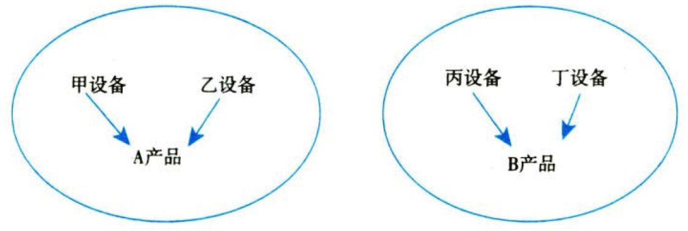

资产.资产减值

# 1. 资产减值概述

## 1.1. 资产减值.范围

资产减值，是指资产的`可收回金额`低于其`账面价值`。

本章所指资产，除特别说明外，包括`单项资产`和`资产组`。本章涉及的资产减值对象主要包括以下资产：【大块头资产】

固定资产；无形资产；采用`成本模式`进行后续计量的投资性房地产；长期股权投资；`商誉`；生产性生物资产；探明石油天然气`矿区`权益和并及相关设施；等。

## 1.2. 资产减值.迹象

资产减值迹象的判断原则：公允价值`下降`；未来现金流量现值`下降`。【貌似要亏钱了】

## 1.3. 资产减值.测试【不确定的东西，要测试】

［因企业合并所形成的`商誉`］和［使用寿命不确定的`无形资产`］在后续计量中不再进行摊销，但是考虑到这两类资产的价值和产生的未来经济利益有`较大的不确定性`，为了避免资产价值高估，如实反映企业财务状况和经营成果，企业至少应当于每年`年度终了`进行减值测试，确认它们的减值损失。

对于［尚未达到可使用状态的无形资产］，由于其价值通常具有`较大的不确定性`，也应当每年进行减值测试。

# 2. 资产可收回金额.计量

估计资产可收回金额的基本方法：【哪个高按哪个来，划算】

$$资产的可收回金额=max(净额=公允价值-处置费用, 预计未来现金流量.现值)$$

资产的［公允价值减去处置费用后的净额］，通常反映的是资产如果被`出售或者处置`时可以收回的净现金收入。【卖】

如果企业无法可靠估计资产的［公允价值减去处置费用后的净额］的，应当以该资产［预计未来现金流量的`现值`］作为其可收回金额。【卖的最可靠，其次是用的】

## 2.4. 资产未来现金流量.现值

预计资产未来现金流量的`现值`，主要应当综合考虑以下三个方面的`因素`：

①资产的预计未来现金流量；

②资产的使用寿命；

③折现率。

其中，资产`使用寿命`的预计与`固定资产、无形资产准则`等规定的使用寿命预计方法相同。

资产预计未来现金流量现值的估计如下图所示：


### 2.4.1. 资产未来现金流量.预计

为了预计资产未来现金流量，企业管理层应当在合理和有依据的基础上对资产剩余使用寿命内整个经济状况进行`最佳估计`，并将资产未来现金流量的预计建立在经企业管理层批准的最近财务预算或者预测数据之上。

预计的资产未来现金流量应当包括下列各项：{

①资产持续使用过程中预计产生的`现金流入`。

②为实现资产持续使用过程中产生的现金流入所必需的预计`现金流出`（包括为使资产达到预定可使用状态所发生的现金流出）。

对于在建工程、开发过程中的无形资产等，企业在预计其未来现金流量时，应当包括预期为使该类资产达到预定可使用（或者可销售）状态而发生的全部现金流出数。

③资产使用寿命结束时，`处置`资产所收到或者支付的净现金流量。

每期净现金流量＝该期现金流入－该期现金流出。

}【总流入-总流出】

企业预计资产`未来现金流量`时，应当综合考虑下列`因素`：{

①以资产的`当前状况`为基础预计资产未来现金流量。

`不应当包括`与将来可能会发生的、尚未作出承诺的重组事项或与资产改良有关的预计未来现金流量。【将来谁说的准】

②预计资产未来现金流量`不应当包括`筹资活动和所得税收付产生的现金流量。【不算利息税费】

③对`通货膨胀`因素的考虑应当和折现率相一致。

④涉及`内部转移价格`的需要作调整。

}

预计资产未来现金流量的方法：{

①传统法。

预计资产未来现金流量，通常应当根据资产未来每期`最有可能`产生的现金流量进行预测。它使用的是单一的未来每期预计现金流量和单一的折现率计算资产未来现金流量的现值。【最可能的】

②期望现金流量法。

资产未来每期现金流量应当根据每期可能发生情况的`概率`及其相应的现金流量`加权`计算确定。【概率加权平均的】

}

### 2.4.2. 折现率.预计

为了达到资产减值测试的目的，计算资产未来现金流量现值时所使用的折现率应当是反映`当前市场`货币时间价值和资产`特定风险`的`税前`利率。【当前折现率】

企业在估计资产未来现金流量现值时，通常应当使用`单一的`折现率。但是，如果资产未来现金流量的现值对未来不同期间的风险差异或者利率的期间结构`反应敏感的`，企业应当在未来各不同期间采用`不同的`折现率。【具体情况具体分析】

### 2.4.3. 资产未来现金流量现值.预计

在预计资产的未来现金流量和折现率的基础上，企业将该资产的预计未来现金流量按照预计折现率在预计使用寿命内予以折现后，即可确定该资产未来现金流量的现值。

计算公式如下：【财务管理折现公式】

$$资产未来现金流量的现值PV=\sum_{t=1}^{n}[\frac{第t年预计资产未来现金流量NCF_t}{(1+折现率r)^t}]$$

$$PV=\sum_{t=1}^{n}[\frac{NCF_t}{(1+r)^t}]$$

### 2.4.4. 外币.未来现金流量现值.预计

企业使用的资产所收到的未来现金流量为`外币`时，应按以下顺序确定资产未来现金流量的现值：{

①以外币（结算货币）表示的未来现金流量现值=[该资产所产生的未来现金流量（结算货币）\*该结算货币适用的折现率的折现系数]。【用外币折现】

②以记账本位币表示的资产未来现金流量的现值=以外币（结算货币）表示的未来现金流量现值\`*计算`资产未来现金流量现值`当日`的`即期汇率`。【外币折为当天的人民币】

}

# 3. 资产减值损失.确认+计量

## 3.5. 资产减值损失.确认+计量.一般原则

### 3.5.5. 资产减值损失.确认

资产可收回金额确定后，如果可收回金额低于其账面价值的，企业应当将资产的账面价值减记至可收回金额，减记的金额确认为`资产减值损失`，计入当期损益，同时计提相应的`资产减值准备`。

资产的账面价值是指资产成本扣减累计折旧（或累计摊销）和减值准备后的金额。

### 3.5.6. 确认减值损失后.折旧摊销.会计处理

资产减值损失确认后，减值资产的折旧或者摊销费用应当在`未来期间`作相应调整，以使该资产在剩余使用寿命内，系统地分摊`调整后的`资产账面价值（扣除预计净残值）。【以后期间用减值了的资产的账面价值】

### 3.5.7. 减值准备转回.处理原则

资产减值损失一经确认，在以后会计期间`不得转回`。

如果资产处置（如出售、对外投资、以非货币性资产交换方式换出、在债务重组中抵偿债务等），同时符合资产终止确认条件的，企业应当将相关资产减值准备予以`转销`。【大块头不得转回】

`资产减值准则`中规范的资产，其减值损失一经确认，在以后持有期间不得转回，但其他准则中规范的有些资产的减值是可以转回的。

资产计提减值比较基础以及资产减值是否可以转回情况如下表所示：【小东西可以转回，大块头不得转回】

| 资产                                                                              | 计提减值的比较基础 | 减值可否转回 |
|-----------------------------------------------------------------------------------|--------------------|--------------|
| 存货                                                                              | 可变现净值         | 可以         |
| 固定资产/在建工程<br/>无形资产/开发支出<br/>投资性房地产.成本模式<br/>长期股权投资/商誉 | 可收回金额         | 不可以       |
| 投资性房地产.公允价值模式                                                         | 不计提减值         | 无           |
| “债权投资”                                                                        | 预期信用损失       | 可以         |
| “其他债权投资”                                                                    | 预期信用损失       | 可以         |
| “其他权益工具投资”                                                                | 不计提减值         | 无           |
| “交易性金融资产”                                                                  | 不计提减值         | 无           |

## 3.6. 资产减值损失.账务处理

:moneybag:【会计分录】计提资产减值损失

```
借：资产减值损失
  贷：XXX减值准备
```

# 4. 资产组.认定+减值

## 4.7. 资产组.认定

如果有迹象表明一项资产可能发生减值的，企业应当以`单项资产`为基础估计其可收回金额。

企业难以对单项资产的可收回金额进行估计的，应当以该资产所属的`资产组`为基础确定资产组的可收回金额。

### 4.7.8. 资产组.定义

资产组是指企业可以认定的`最小资产组合`，其产生的`现金流入`应当基本上`独立`于其他资产或资产组。

例如：某车间有甲设备、乙设备、丙设备和丁设备，甲设备和乙设备生产A产品，丙设备和丁设备生产B产品。A产品和B产品在市场中有公允价值，都可以独立产生现金流入。如下图所示：



图中，甲设备和乙设备构成一个资产组，丙设备和丁设备构成一个资产组。【一家子】

### 4.7.9. 认定.资产组.应当考虑的因素

资产组的认定，应当以资产组产生的主要现金流入是否独立于其他资产或者资产组的现金流入为依据；应当考虑企业管理层对生产经营活动的`管理或者监控方式`和对资产的持续使用或者处置的`决策方式`等。【看感情不看亲情】

### 4.7.10. 资产组.认定后.不得随意变更

资产组一经确定，在各个会计期间应当保持一致，`不得随意变更`。如需变更，企业管理层应当证明该变更是合理的，并在`附注`中说明。【不那么好改变】

## 4.8. 资产组.减值测试

资产组减值测试的原理和单项资产是一致的，即企业需要预计资产组的`可收回金额`和计算资产组的`账面价值`，并将两者进行比较。如果资产组的可收回金额低于其账面价值，表明该资产组发生了减值损失，应当予以确认。【该减就减】

### 4.8.11. 资产组.账面价值+可收回金额.确定基础

资产组账面价值的确定基础应当与其可收回金额的确定方式相一致，这样的比较才有意义，否则如果两者在不同的基础上进行估计和比较，就难以正确估算资产组的减值损失。

资产组的`可收回金额`，应当按照该资产组的［公允价值减去处置费用后的`净额`］与其［预计未来现金流量的`现值`］两者之中`较高者`确定。【重复前文】

### 4.8.12. 资产组.减值.会计处理

根据减值测试的结果，资产组（包括资产组组合）的可收回金额如低于其账面价值，应当确认相应的减值损失。减值损失金额应当按照下列顺序进行分摊：{

①首先抵减分摊至资产组中`商誉`的账面价值；【先干掉商誉】

②然后根据资产组中除商誉之外的其他各项资产的账面价值所占比重，`按比例`抵减其他各项资产的账面价值。【再按比例分摊】

}

以上资产账面价值的抵减，应当作为各单项资产（包括商誉）的减值损失处理，计入当期损益。抵减后的各资产的账面价值不得低于以下三者之中最高者：{

A.该资产的公允价值减去处置费用后的`净额`（如可确定的）；

B.该资产预计未来现金流量的`现值`（如可确定的）；

C.`零`；

}。【结合实际，不当睁眼瞎】

因此而导致的未能分摊的减值损失金额，应当按照相关资产组中`其他`各项资产的账面价值所占`比重`进行分摊。【二次分摊】

## 4.9. 总部资产.减值测试

企业`总部资产`包括企业集团或其事业部的办公楼、电子数据处理设备、研发中心等资产。

总部资产的显著特征是`难以脱离`其他资产或者资产组产生独立的现金流入，而且其账面价值难以完全归属于某一资产组。

因此，总部资产通常难以单独进行减值测试，需要结合其他相关资产组或者资产组组合进行。资产组组合，是指由若干个资产组组成的`最小资产组组合`，包括资产组或者资产组组合，以及按合理方法分摊的总部资产部分。【资产组组合=资产组+资产组组合+分摊的总部资产】

总部资产的减值测试如下图所示：


# 5. 商誉减值测试+处理

## 5.10. 商誉减值测试.基本要求

企业合并所形成的`商誉`，至少应当在每年`年度终了`时进行减值测试。

由于商誉难以独立产生现金流量，所以商誉应当结合与其相关的资产组或者资产组组合进行减值测试。相关的资产组或者资产组组合应当是能够从`企业合并的协同效应`中受益的资产组或者资产组组合，但不应当大于企业所确定的`报告分部`。【商誉结合其他资产进行测试】

企业进行资产减值测试，对于因企业合并形成的`商誉`的账面价值，应当自`购买日`起按照合理的方法分摊至相关的资产组；难以分摊至相关的资产组的，应当将其分摊至相关的资产组组合。【商誉分摊给各资产】

对于已经分摊商誉的资产组或资产组组合，不论是否存在资产组或资产组组合可能发生减值的`迹象`，每年都应当通过比较包含商誉的资产组或资产组组合的账面价值与可收回金额进行减值测试。【没有迹象也是有迹象】

注意事项：在财务报表中商誉的列示及减值核算的情况：{

①非同一控制下`吸收合并`产生的商誉，在`个别财务报表`中列示，减值的核算在个别报表中登记；【对方没了，只有个表】

②非同一控制下`控股合并`产生的商誉，在`合并财务报表`中列示，产生于合并抵销分录中，减值的核算在合并财务报表中体现。【对方还在，合并表】

}

## 5.11. 商誉减值测试.方法+会计处理

企业在对包含商誉的相关资产组或资产组组合进行减值测试时，应当先对`不包含商誉的`资产组或者资产组组合进行减值测试，计算可收回金额，并与相关账面价值相比较，确认相应的减值损失；【先不管商誉】然后再对`包含商誉的`资产组或者资产组组合进行减值测试，比较这些相关资产组或者资产组组合的账面价值（包括所分摊的商誉的账面价值部分）与可收回金额，如果可收回金额低于其账面价值，应当就其差额确认减值损失。【第二轮再管商誉】

减值损失金额应当`先抵减`分摊至资产组或者资产组组合中`商誉`的账面价值，再根据资产组或者资产组组合中除商誉之外的其他各项资产的账面价值所占比重，`按比例`抵减其他各项资产的账面价值。相关减值损失的处理顺序和方法与第四节有关资产组减值损失的处理顺序和方法相一致。【重复上文】

商誉减值的会计处理如下：

:moneybag:【会计分录】吸收合并（个别报表）

```
借：资产减值损失
  贷：商誉减值损失
```

:moneybag:【会计分录】控股合并（合并报表）【合表才有“商誉”科目？】

```
借：资产减值损失
  贷：商誉——商誉减值准备
```

## 5.12. 存在少数股东权益情况下.商誉减值测试

根据《企业会计准则第20号——企业合并》的规定，在合并财务报在中反映的商誉，`不包括`子公司归属于少数股东权益的商誉。但对相关的资产组（或者资产组组合，下同）进行减值测试时，应当将归属于少数股东权益的商誉`包括在内`，调整资产组的账面价值（包含`完全商誉）`，然后根据调整后的资产组账面价值与其可收回金额（可收回金额的预计包括了归属于少数股东的商誉价值部分）进行比较，以确定资产组（包括商誉）是否发生了减值。【测试时用完全商誉】

例如，母公司拥有子公司80%股份，假定子公司完全商誉为200万元，母公司在`合并财务报表`中反映的商誉160万元（200×80%），不包括子公司归属于少数股东的商誉40万元（200×20%），在进行减值测试时，应当将归属于少数股东权益的商誉包括在内，即完全商誉200万元（160÷80%）包括在资产纽账面价值中。

上述资产组如已发生减值的，应首先抵减`商誉`的账面价值，但由于根据上述步骤计算的商誉减值损失包括了应由少数股东权益承担的部分，应当将该减值损失在归属于母公司和少数放东权益之间`按比例`进行分摊，以确认归属于母公司的商誉减值损失，并在合并财务报在中进行体现。【测试完扔掉少数股东商誉】

# 6. 总结

End。
