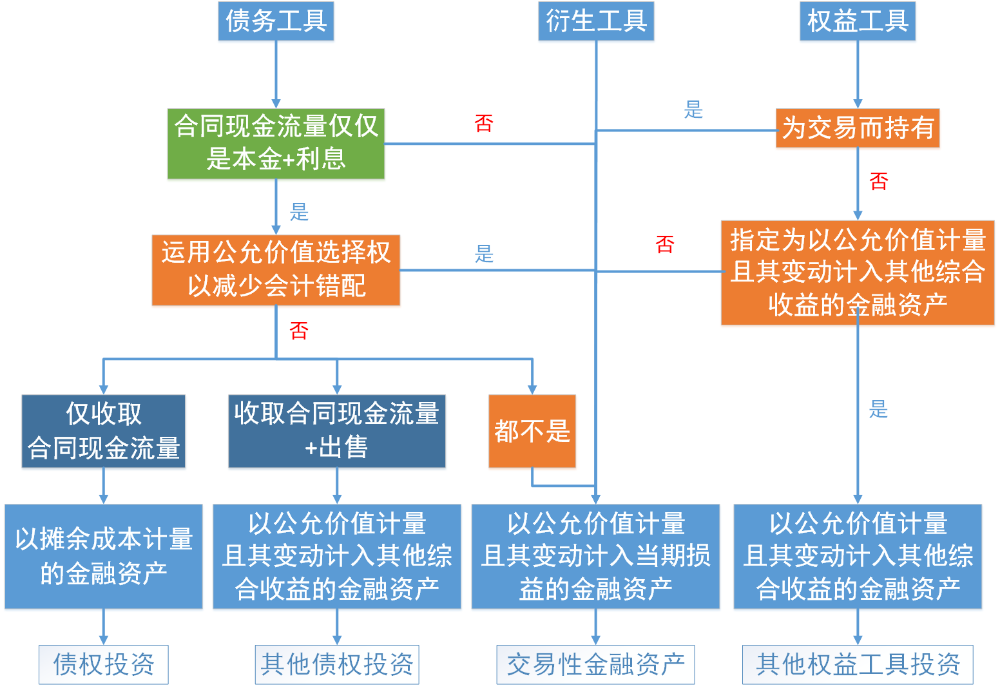

资产.金融工具

# 1. 金融工具概述

金融工具，是指形成［一方的`金融资产`+其他方的`金融负债`或`权益工具`］的`合同`。

`应交所得税`不符合金融工具的定义。

# 2. 金融资产

## 2.1. 内容

金融资产包括下列资产：{

①企业持有的`现金`；【现金】

②企业持有的其他方的`权益工具`；【股票】

③从其他方收取现金的`合同权利`；【债券】

④从其他方收取金融资产的`合同权利`；

⑤与其他方交换金融资产或金融负债的`合同权利`。例如，上市公司股票的看涨`期权`。【期权】

⑥将来须用或可用企业自身权益工具进行结算的`非衍生工具合同`，且企业根据该合同将收到`可变数量`的自身权益工具。【别人用你的股份来还欠你的钱】

⑦将来须用或可用企业自身权益工具进行结算的`衍生工具合同`，但以［固定数量的自身权益工具］交换［(固定金额的现金)或(固定金额的其他金融资产)］的衍生工具合同【不公允】除外。

}

注意事项：预付账款`不是`金融资产，因其产生的未来经济利益是商品或服务，不是收取现金或其他金融资产的权利。

## 2.2. 衍生工具

衍生工具，是指属于(金融工具准则)范围+`同时具备`下列特征的金融工具或其他合同：{

①在`未来某一日期`结算。

②`不要求`初始净投资，或者与(对市场因素变化预期有类似反应)的其他合同相比，要求较少的初始净投资。

③其价值`随`［特定利率、金融工具价格、商品价格、汇率、价格指数、费率指数、信用等级、信用指数、其他变量］的变动而`变动`。变量为非金融变量的，该变量不应与合同的任何一方存在特定关系。

}

常见的衍生工具包括［`期货`合同、`期权`合同、`远期`合同、`互换`合同］等。

“`衍生工具`”科目核算企业衍生工具的`公允价值及其变动`形成的衍生金融资产或衍生金融负债。作为`套期工具`的衍生工具`不在本科目`核算。

## 2.3. 金融资产.分类

企业应当根据［[其管理金融资产的业务模式](../../../../CPA6in1/CPA6in1/1会计/金融工具.企业管理金融资产的业务模式.docx)+[金融资产的合同现金流量特征](../../../../CPA6in1/CPA6in1/1会计/金融工具.金融资产的合同现金流量特征.md)］，将金融资产划分为以下三类：

①[以摊余成本计量的金融资产](../../../../CPA6in1/CPA6in1/1会计/金融工具.以摊余成本计量的金融资产.md)；【摊(债)】

②[以公允价值计量&&其变动计入其他综合收益的金融资产](../../../../CPA6in1/CPA6in1/1会计/金融工具.以公允价值计量且其变动计入其他综合收益的金融资产.md)；【综(债)】【综(股)】

③[以公允价值计量&&其变动计入当期损益的金融资产](../../../../CPA6in1/CPA6in1/1会计/金融工具.以公允价值计量且其变动计入当期损益的金融资产.md)。【损(股)】

金融资产的分类与计量如下图所示：



## 2.4. 公允价值选择权

在初始确认时，为了提供`更相关的会计信息`，企业可以将一项金融资产、一项金融负债、一组金融工具（金融资产、金融负债、金融资产及负债）`指定为`［以公允价值计量&&其变动计入当期`损`益］，但该指定应当满足`下列条件之一`：{

①该指定能够消除或显著减少`会计错配`。

②根据正式`书面文件`载明的企业风险管理或投资策略，以公允价值为基础对金融负债组合或金融资产和金融负债组合进行管理和业绩评价，并在企业内部以此为基础向关键管理人员报告。

}

# 3. 金融负债

## 3.5. 内容

金融负债，是指企业符合下列`条件之一`的负债：{

①向其他方`交付`现金或其他金融资产的合同义务，例如发行的承诺支付固定利息的公司债券。

②在`潜在不利条件`下，与其他方交换金融资产或金融负债的合同义务，例如签出的外汇期权。

③将来须用或可用企业自身权益工具进行结算的`非衍生工具合同`，且企业根据该合同将交付`可变数量`的自身权益工具。例如企业取得一项金融资产，并承诺两个月后向卖方交付本企业发行的普通股，交付的普通股数量根据交付时的股价确定，则该项承诺是一项金融负债。

④将来须用或可用企业自身权益工具进行结算的`衍生工具合同`，（以固定数量的自身权益工具交换固定金额的现金或其他金融资产的衍生工具合同除外），例如以普通股净额结算的股票期权。

}

企业对全部现有同类别非衍生自身权益工具的持有方（例如普通股股东）同比例发行配股权、期权或认股权证，使之有权按比例以固定金额的任何货币换取固定数量的该企业自身权益工具的，该类配股权、期权或认股权证应当分类为`权益工具`。其中，企业自身权益工具不包括应按照本章第三节分类为权益工具的金融工具，也不包括本身就要求在未来收取或交付企业自身权益工具的合同。

`合同负债`不是金融负债，因其导致的未来经济利益流出是`商品或服务`，不是支付现金或其他金融资产的合同义务。

## 3.6. 金融负债.分类

企业应当根据［自身业务的特点+风险管理要求］，对`金融负债`进行合理分类。

企业应当将金融负债分类为［以`摊`余成本计量］的金融负债，下列各项`除外`：{

①［以公允价值计量&&其变动计入当期`损`益］的金融负债，包括`交易性金融负债`（含属于金融负债的衍生工具）和`指定为`［以公允价值计量&&其变动计入当期`损`益］的金融负债。

②不符合`终止确认条件`或`继续涉入`被转移金融资产所形成的金融负债。对此类金融负债，企业应当按照本章第五节相关规定进行计量。

③部分`财务担保合同`、`不属于`［以公允价值计量&&其变动计入当期`损`益］的金融负债、以低于市场利率贷款的`贷款承诺`。

}

在非同一控制下的企业合并中，企业作为购买方确认的`或有对价`形成金融负债的，该金融负债应当按照［以公允价值计量&&其变动计入当期`损`益］的金融负债进行会计处理。

[金融负债和权益工具的区分](../../../../CPA6in1/CPA6in1/1会计/金融工具.金融负债和权益工具的区分.md)

## 3.7. 权益工具

权益工具，是指能证明拥有某个企业在扣除所有负债后的资产中的`剩余权益`的合同。在`同时满足`下列条件的情况下，企业应当将发行的金融工具分类为权益工具：{

①该金融工具应当`不包括`交付现金或其他金融资产给其他方，或在`潜在不利条件`下与其他方交换金融资产或金融负债的合同义务；

②将来须用或可用企业自身权益工具结算该金融工具。如为非衍生工具，该金融工具应当`不包括`交付`可变数量`的自身权益工具进行结算的合同义务；如为衍生工具，企业只能通过以`固定数量`的自身权益工具交换`固定金额`的现金或其他金融资产结算该金融工具。企业自身权益工具不包括应按照金融工具准则分类为权益工具的特殊金融工具，也不包括本身就要求在未来收取或交付企业自身权益工具的合同。

}

# 4. 金融工具.初始计量

［以公允价值计量&&其变动计入当期`损`益］的金融资产或金融负债，其初始成本为`公允价值`。其他类别的金融资产或金融负债，其初始成本为［公允价值+交易费用(资产)-交易费用(负债)］。

交易费用，是指可`直接`归属于购买、发行或处置金融工具的`增量费用`。增量费用是指企业没有发生购买、发行或处置相关金融工具的情形就不会发生的费用，包括［支付给代理机构、咨询公司、券商、证券交易所、政府有关部门等的手续费、佣金、相关税费以及其他必要支出］，`不包括`［债券溢价、折价、融资费用、内部管理成本和持有成本］等与交易不直接相关的费用。

公允价值通常为相关金融资产或金融负债的交易价格。金融资产或金融负债公允价值与交易价格存在差异的，企业应当区别下列情况进行处理：{

①初始确认时，金融资产或金融负债的公允价值依据相同资产或负债在`活跃市场`上的报价或者以仅使用可观察市场数据的估值技术确定的，企业应当将该公允价值与交易价格之间的差额确认为一项`利得或损失`。

②初始确认时，金融资产或金融负债的公允价值以其他方式确定的，企业应当将该公允价值与交易价格之间的差额`递延`，后续摊销计入利得或损失。初始确认后，企业应当根据`某一因素`在相应会计期间的变动程度将该递延差额确认为相应会计期间的利得或损失。该因素应当仅限于市场参与者对该金融工具定价时将予考虑的因素，包括时间等。

}

# 5. 金融工具.后续计量

[金融工具的减值](../../../../CPA6in1/CPA6in1/1会计/金融工具.金融工具的减值.md)

[金融资产的重分类](../../../../CPA6in1/CPA6in1/1会计/金融工具.金融资产的重分类.md)

企业对所有`金融负债`均`不得`进行重分类。

[金融资产的转移](../../../../CPA6in1/CPA6in1/1会计/金融工具.金融资产的转移.md)

## 5.8. 金融资产.后续计量.原则

金融资产的后续计量与金融资产的分类密切相关。企业应当对不同类别的金融资产，分别［以`摊`余成本］、［以公允价值计量&&其变动计入其他`综`合收益］或［以公允价值计量&&其变动计入当期`损`益］进行后续计量。

需要注意的是，企业在对金融资产进行后续计量时，如果一项金融工具以前被确认为一项金融资产并以公允价值计量，而现在它的公允价值`低于零`，企业应将其确认为一项`负债`。但对于主合同为资产的`混合合同`，即使整体公允价值可能低于零，企业应当始终将混合合同整体作为一项`金融资产`进行分类和计量。

| 类别             | 利息/股利 | 减值     | 汇兑         | 公允价值变动 | 终止确认            |
|------------------|-----------|----------|--------------|--------------|---------------------|
| 债权投资         | 当期损益  | 当期损益 | 当期损益     | NO           | 当期损益            |
| 其他债权投资     | 当期损益  | 当期损益 | 当期损益     | 其他综合收益 | 当期损益<br/>综转损益 |
| 其他权益工具投资 | 当期损益  | NO       | 其他综合收益 | 其他综合收益 | 综转权益            |
| 交易性金融资产   | 当期损益  | NO       | 当期损益     | 当期损益     | 当期损益            |

## 5.9. “债权投资”.会计处理【内向时期】

“`债权投资`”科目核算企业［以摊余成本计量］的债权投资的账面余额。【摊(债)】

### 5.9.1. 实际利率

实际利率法，是指计算金融资产或金融负债的`摊余成本`以及将利息收入或利息费用`分摊`计入各会计期间的方法。

实际利率，是指将金融资产或金融负债在预计存续期的估计未来现金流量，`折现`为该金融资产账面余额（不考虑减值）或该金融负债摊余成本所使用的利率。

经信用调整的实际利率，是指将`购入或源生的`已发生信用减值的金融资产在预计存续期的估计未来现金流量，折现为该金融资产摊余成本的利率。

### 5.9.2. 摊余成本

金融资产或金融负债的摊余成本，应当以该金融资产或金融负债的`初始确认金额`经下列调整确定：{

①扣除`已偿还的本金`。

②加上或减去采用实际利率法将该初始确认金额与到期日金额之间的差额进行摊销形成的`累计摊销额`。

③扣除计提累计信用`减值准备`（仅适用于金融资产）。

}

企业与交易对手方修改或重新议定合同，未导致金融资产终止确认，但导致合同现金流量发生变化的，或者企业修正了对合同现金流量的估计的，应当`重新计算`该金融资产的`账面余额`，并将相关利得或损失计入`当期损益`。重新计算的该金融资产的账面余额，应当根据将就新议定或修改的合同现金流量按金融资产的`原实际利率`（或者购买或源生的已发生信用减值的金融资产应按经信用调整的实际利率）折现的现值确定。对于修改或重新议定合同所产生的所有成本或费用，企业应当调整修改后的金融资产账面价值并在修改后金融资产的剩余期限内摊销。

以`摊`余成本计量且不属于任何套期关系的金融资产所产生的`利得或损失`，应当在终止确认、重分类、按照实际利率法摊销或确认减值时，计入`当期损益`。

### 5.9.3. 初始计量+后续计量+出售

:moneybag:【会计分录】债权投资【摊(债)】的初始计量

```
借：债权投资——成本 //面值
    债权投资——利息调整 //倒挤的差额
    应收利息 //实际支付的款项中包含的利息
  贷：银行存款等
```

:moneybag:【会计分录】债权投资【摊(债)】的后续计量

```
借：A.应收利息 //分期付息债券，按票面利率计算的利息
    B.债权投资——应计利息//到期一次还本付息债券，按票面利率计算的利息
  贷：投资收益 //摊余成本\*实际利率
      债权投资——利息调整 //倒挤的差额，利息调整的摊销额
```

“`债权投资减值准备`”科目核算“债权投资”的以`预期信用损失`为基础计提的损失准备。【摊(债).减值准备】

“信用减值损失”科目核算企业计提《金融工具确认和计量》准则要求的`各项金融工具`减值准备所形成的预期信用损失。

:moneybag:【会计分录】债权投资【综(债)】在资产负债表日计提减值准备

```
借：信用减值损失
  贷：债权投资减值准备
```

:moneybag:【会计分录】债权投资【摊(债)】的出售

```
借：银行存款等
    债权投资减值准备
  贷：债权投资——成本
      债权投资——利息调整
      债权投资——应计利息
      投资收益 //倒挤的差额
```

## 5.10. “其他债权投资”.会计处理【外向时期】

“`其他债权投资`”科目核算企业［分类为以公允价值计量&&其变动计入其他综合收益］的债权投资【综(债)】。

:moneybag:【会计分录】其他债权投资【综(债)】的取得

```
借：其他债权投资——成本 //面值
    其他债权投资——利息调整 //倒挤的差额
    A.应收利息//已到付息期但尚未领取的利息
    B.其他债权投资——应计利息
  贷：银行存款
```

该类金融资产采用实际利率法计算的`利息`应当计入`当期损益`。

:moneybag:【会计分录】其他债权投资【综(债)】期末计算利息

```
借：A.应收利息 //票面利率计算的利息
    B.其他债权投资——应计利息 //票面利率计算的利息
  贷：投资收益 //摊余成本\*实际利率
      其他债权投资——利息调整 //倒挤的差额
```

大部分利得或损失，应当计入`其他综合收益`，直至该金融资产终止确认或被重分类，除了［(减值损失或利得)和(汇兑损益)］之外。

:moneybag:【会计分录】其他债权投资【综(债)】期末公允价值变动

```
借：其他债权投资——公允价值变动
  贷：其他综合收益——其他债权投资公允价值变动
```

该类金融资产计入各期损益的金额应当与视同其一直接摊余成本计量而计入各期损益的金额相等。

“其他综合收益——信用减值准备”科目核算企业“其他债权投资”的以`预期信用损失`为基础计提的损失准备。【综(债).减值准备】

不应减少该“其他债权投资”在资产负债表中列示的账面价值。

:moneybag:【会计分录】其他债权投资【综(债)】在资产负债表日计提减值准备

```
借：信用减值损失
  贷：其他综合收益——信用减值准备
```

该类金融资产终止确认时，之前计入其他综合收益的累计利得或损失应当从其他综合收益中`转出`，计入`当期损益`。

:moneybag:【会计分录】其他债权投资【综(债)】的出售

```
借：银行存款
  贷：其他债权投资——成本
      其他债权投资——利息调整
      投资收益 //倒挤的差额
///前期暂存的价差，转入投资收益
借：其他综合收益——其他债权投资公允价值变动
  贷：投资收益
```

## 5.11. “其他权益工具投资”.会计处理【不纳税】

:moneybag:【会计分录】其他权益工具投资【综(股)】的取得

```
借：其他权益工具投资——成本 //公允价值+交易费用
    应收股利 //已宣告尚未发放的现金股利
  贷：银行存款
```

大部分的利得和损失（包括汇兑损益）均应当计入其他`综`合收益，且后续不得转入当期损益。

:moneybag:【会计分录】其他权益工具投资【综(股)】期末公允价值变动

```
借：其他权益工具投资——公允价值变动
  贷：其他综合收益
```

获得的股利（属于投资成本收回部分除外）计入当期损益。

:moneybag:【会计分录】其他权益工具投资【综(股)】持有期间宣告发放现金股利

```
借：应收股利
  贷：投资收益
```

当其终止确认时，之前计入其他综合收益的累计利得或损失应当`转出`，计入`留存收益`。

:moneybag:【会计分录】其他权益工具投资【综(股)】的出售

```
借：银行存款
  贷：其他权益工具投资 //账面价值
      盈余公积
      利润分配——未分配利润
///前期暂存的价差，转入留存收益
借：其他综合收益
  贷：盈余公积
      利润分配——未分配利润
```

## 5.12. “交易性金融资产”.会计处理【鬼灵精怪】

:moneybag:【会计分录】交易性金融资产【损(股)】的取得

```
借：交易性金融资产——成本 //公允价值
    投资收益 //交易费用
    应收股利 //已宣告但未发放的现金股利
    应收利息 //已到付息期但尚未领取的利息
  贷：银行存款
```

:moneybag:【会计分录】交易性金融资产【损(股)】持有期间的股利或利息

```
借：应收股利
    应收利息
  贷：投资收益
```

［以公允价值计量&&其变动计入当期`损`益］的金融资产【损(股)】的利得或损失，应当计入`当期损益`。

:moneybag:【会计分录】交易性金融资产【损(股)】期末公允价值变动

```
借：交易性金融资产——公允价值变动
  贷：公允价值变动损益
```

:moneybag:【会计分录】交易性金融资产【损(股)】的出售

```
借：银行存款 //净价=价款-手续费
  贷：交易性金融资产
      投资收益
```

## 5.13. 金融负债.后续计量.原则

企业应当按照以下原则对金融负债后续计量：{

①以公允价值计量&&其变动计入当期`损`益的金融负债，应当按照`公允价值`后续计量。

②`金融资产转移`不符合终止确认条件或继续涉入被转移金融资产所形成的金融负债。对此类金融负债，企业应当按照《企业会计准则第23号——金融资产转移》相关规定进行计量。

③不属于`指定为`［以公允价值计量&&其变动计入当期`损`益］的金融负债的财务担保合同or没有`指定为`［以公允价值计量&&其变动计入当期`损`益］并将以低于市场利率贷款的贷款承诺，企业作为此类金融负债`发行方`的，应当在初始确认后按照`损失准备金额`以及`初始确认金额扣除累计摊销额`后的余额孰高进行计量。

④上述金融负债以外的金融负债，应当按`摊`余成本后续计量。

}

## 5.14. 金融负债.会计处理

对于以公允价值进行后续计量的金融负债，其公允价值变动形成利得或损失，除与套期会计有关外，应当计入`当期损益`。

“交易性金融负债”科目核算企业承担的交易性金融负债。

企业持有的`指定为`［以公允价值计量&&其变动计入当期损益］的金融负债可在本科目下单设“`指定类`”明细科目核算。

:moneybag:【会计分录】“交易性金融负债”

```
///发行时
借：银行存款
  贷：交易性金融负债
///公允价值上升【赔了】
借：公允价值变动损益
  贷：交易性金融负债
///确认利息费用
借：财务费用
  贷：应付利息
///到期时
借：交易性金融负债
  贷：银行存款
      公允价值变动损益 //倒挤的差额
```

以`摊`余成本计量且不属于任何套期关系的一部分的金融负债所产生的利得或损失，应当在`终止确认时`计入当期损益或在按照实际利率法`摊销时`计入相关期间损益。

企业与交易对手方修改或重新议定合同，未导致金融负债终止确认，但导致合同现金流量发生变化的，应当`重新计算`该金融负债的`账面价值`，并将相关利得或损失计入当期损益。重新计算的该金融负债的账面价值，应当根据将重新议定或修改的合同现金流量按金融负债的`原实际利率`折现的现值确定。对于修改或重新议定合同所产生的所有`成本或费用`，企业应当调整修改后的金融负债`账面价值`，并在修改后金融负债的剩余期限内进行`摊销`。

# 6. 套期会计

## 6.15. 套期会计概述

套期，是指企业为管理`外汇`风险、`利率`风险、`价格`风险、`信用`风险等特定风险引起的`风险敞口`，指定`金融工具`为套期工具，以使套期工具的`公允价值`或`现金流量变动`，预期`抵销`被套期项目全部或部分公允价值或现金流量变动的`风险管理活动`。

对于满足一定条件的套期，企业可运用套期会计方法进行处理。套期会计方法，是指企业将`套期工具`和`被套期项目`产生的利得或损失在相同会计期间计入当期损益（或其他综合收益）以`反映风险管理活动影响`的方法。

在套期会计中，套期分为［[公允价值套期](../../../../CPA6in1/CPA6in1/1会计/金融工具.公允价值套期.docx)、[现金流量套期](金融工具.现金流量套期.docx)、[境外经营净投资套期](../../../../CPA6in1/CPA6in1/1会计/金融工具.境外经营净投资套期.md)］。

[套期工具](../../../../CPA6in1/CPA6in1/1会计/金融工具.套期工具.md)

[被套期项目](../../../../CPA6in1/CPA6in1/1会计/金融工具.被套期项目.md)

[套期关系评估](../../../../CPA6in1/CPA6in1/1会计/金融工具.套期关系评估.md)

## 6.16. 信用风险敞口的公允价值选择权

允许企业在一定程度上反映其`信用风险管理`活动，可以`选择`［以公允价值计量&&其变动计入当期`损`益］的方式计量`被套期风险敞口`的方法替代`套期会计`。

## 6.17. 套期会计.相关科目

“套期工具”科目核算企业开展套期业务（公允价值套期、现金流量套期、境外经营净投资套期）的`套期工具`及其`公允价值变动`形成的资产或负债。

“被套期项目”科目核算企业开展套期业务的(`被套期项目`)及其(`公允价值变动`)形成的资产或负债。

“套期损益”科目核算(套期工具)和(被套期项目)的(`价值变动`)形成的利得和损失。

“其他综合收益——套期储备”科目核算(现金流量套期)下(`套期工具`)的(`累计公允价值变动`)中的`套期有效`部分。

“其他综合收益——套期损益”科目核算(公允价值套期)下对“其他权益工具投资”科目进行`套期`时，(`套期工具`)和(`被套期项目`)的(`公允价值变动`)形成的利得和损失。

“净敞口套期损益”科目核算(净敞口套期)下(`被套期项目`)的(`累计公允价值变动`)转入当期损益的金额or(现金流量套期储备)转入当期损益的金额。

“其他综合收益——套期成本”科目核算企业将期权的时间价值、远期合同的远期要素、金融工具的外汇基差排除在套期工具之外时，期权的时间价值等产生的`公允价值变动`。

# 7. 金融工具的披露（略）

# 8. 总结

End。
