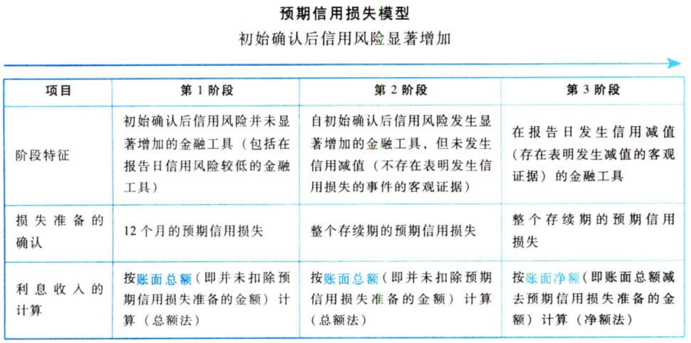
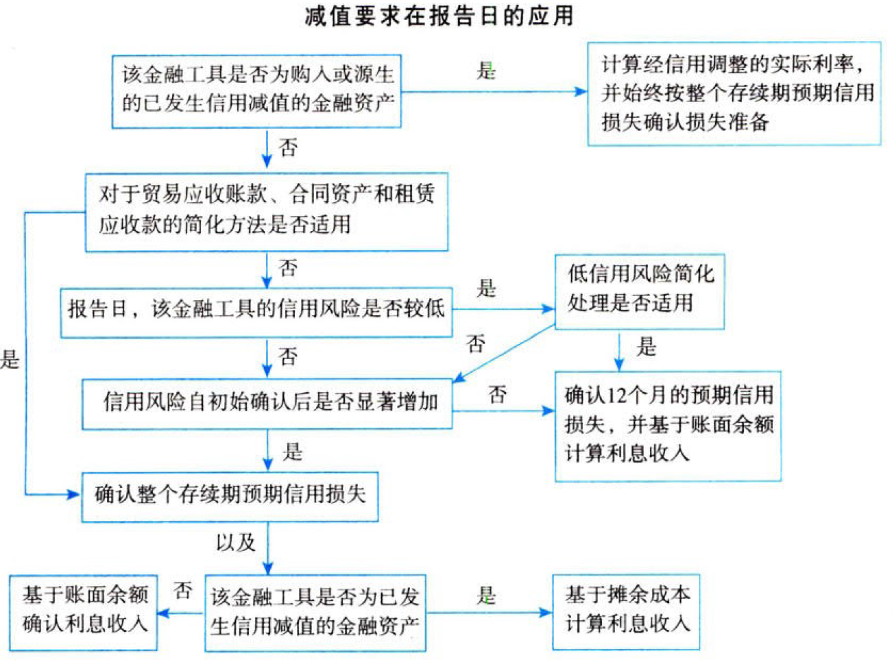

金融工具.金融工具的减值

## 0.1. 金融工具的减值

### 0.1.1. 金融工具减值概述

企业应当以`预期信用损失`为基础，对下列项目进行减值会计处理并确认损失准备：{

①分类为以`摊`余成本计量的金融资产。【摊(债)】

②分类为以公允价值计量&&其变动计入其他`综`合收益的金融资产。【综(债)】

③租赁应收款。

④合同资产。合同资产是指《企业会计准则第14号——收入》定义的合同资产。

⑤部分贷款承诺。

⑥部分财务担保合同。

}

注意事项：以公允价值计量&&其变动计入其他`综`合收益的金融资产（权益工具）【综(股)】`不计提`减值准备。

损失准备，是指针对按照以摊余成本计量的金融资产、租赁应收款和合同资产的`预期信用损失`计提的准备，按照以公允价值计量&&其变动计入其他综合收益的金融资产的`累计减值金额`以及针对贷款承诺和财务担保合同的`预期信用损失`计提的准备。

信用损失，是指企业按照`原实际利率`折现的、根据合同`应收的`所有合同现金流量与`预期`收取的所有现金流量之间的`差额`，即全部现金短缺的现值。其中，对于企业`购买或源生的`已发生信用减值的金融资产，应按照该金融资产`经信用调整的实际利率`折现。由于预期信用损失考虑付款的金额和时间分布，因此即使企业预计可以全额收款但收款时间晚于合同规定的到期期限，也会产生信用损失。

预期信用损失，是指以`发生违约的风险`为权重的金融工具信用损失的`加权平均值`。

### 0.1.2. 金融工具减值的三阶段

一般情况下，企业应当在每个`资产负债表日`评估相关金融工具的`信用风险`自初始确认后是否已`显著增加`，可以将金融工具发生信用减值的过程分为三个阶段，并按照下列情形分别计量其损失准备、确认预期信用损失及其变动：

第一阶段：信用风险自初始确认后`未显著增加`

对于处于该阶段的金融工具，企业应当按照`未来12个月`的预期信用损失计量损失准备，并按其`账面余额`（即未扣除减值准备）和`实际利率`计算利息收入（若该工具为金融资产，下同）。

第二阶段：信用风险自初始确认后已显著增加但`尚未发生信用减值`

对于处于该阶段的金融工具，企业应当按照该工具`整个存续期`的预期信用损失计量损失准备，并按其`账面余额`和`实际利率`计算利息收入。

第三阶段：初始确认后`发生信用减值`

对于处于该阶段的金融工具，企业应当按照该工具`整个存续期`的预期信用损失计量损失准备，但对利息收入的计算不同于处于前两阶段的金融资产。对于已发生信用减值的金融资产，企业应当按其`摊余成本`（账面余额减已计提减值准备）和`实际利率`计算利息收入。

上述三阶段的划分，适用于`购买或源生时`未发生信用减值的金融工具。对于购买或源生时已发生信用减值的金融资产，企业应当仅将初始确认后`整个存续期`内预期信用损失的变动确认为损失准备，并按其`摊余成本`和`经信用调整的实际利率`计算利息收入。

### 0.1.3. 特殊情形

在以下两类情形下，企业`无须`就金融工具初始确认时的信用风险与资产负债表日的信用风险进行比较分析。

#### 0.1.3.1. 较低信用风险

如果企业确定金融工具的违约风险`较低`，借款人在短期内履行其支付合同现金流量义务的能力`很强`，并且即使较长时期内经济形势和经营环境存在不利变化，也不一定会降低借款人履行其支付合同现金流量义务的能力，那么该金融工具可被视为具有较低的信用风险。对于在资产负债表日具有较低信用风险的金融工具，企业可以不用与其初始确认时的信用风险进行比较，而直接作出该工具的信用风险自初始确认后未显著增加的假定（企业对这种`简化处理`有选择权）。

#### 0.1.3.2. 应收款项、租赁应收款和合同资产

企业对于第十六章收入所规定的、不含重大融资成分（包括根据该章不考虑不跑过一年的合同中融资成分的情况）的应收款项和合同资产，应当始终按照`整个存续期`内预期信用损失的金额计量其损失准备（企业对这种简化处理没有选择权）。除此之外，准则还允许企业作出会计政策选择，对包含重大融资成分的应收款项、合同资产和租赁应收款（可分别对应收款项、合同资产、应收租赁款款作出不同的会计政策选择），始终按照相当于`整个存续期`内预期信用损失的金额计量其损失准备。

预期信用损失模型及减值要求在报告日的应用图示如下：

### 0.1.4. 预期信用损失的计量

企业计量金融工具预期信用损失的方法应当反映下列各项`要素`：

①通过评价一系列可能的结果而确定的无偏概率`加权平均`金额。

②货币`时间价值`。

③在资产负债表日无须付出不必要的额外成本或努力即可获得的有关过去事项、当前状况以及未来经济状况预测的`合理且有依据的信息`。

企业应当按照下列方法确定有关金融工具的信用损失：

①对于金融资产，信用损失应为企业应收取的合同现金流量与预期收取的现金流量之间`差额的现值`。

②对于租赁应收款项，信用损失应为企业应收取的合同现金流量与预期收取的现金流量之间`差额的现值`。其中，用于确定预期信用损失的现金流量，应与按照《企业会计准则第21号——租赁》用于计量租赁应收款项的现金流量保持一致。

③对于未提用的贷款承诺，信用损失应为在贷款承诺持有人提用相应贷款的情况下，企业应收取的合同现金流量与预期收取的现金流量之间差额的现值。企业对贷款承诺`预期信用损失`的估计，应当与其对该贷款承诺`提用情况的预期`保持一致。

④对于财务担保合同，信用损失应为企业就该合同持有人发生的信用损失向其作出赔付的`预计付款额`，减去企业预期向该合同持有人、债务人或任何其他方`收取的金额`之间`差额的现值`。

⑤对于资产负债表日已发生信用减值但并非购买或源生已发生信用减值的金融资产，信用损失应为该金融资产账面余额与按原实际利率折现的估计未来现金流量的现值之间的`差额`。

企业应当以`概率加权平均`为基础对预期信用损失进行计量。企业对预期信用损失的计量应当反映发生信用损失的各种可能性，但`不必`识别所有可能的情形。在计量预期信用损失时，企业需考虑的最长期限为企业面临信用风险的`最长合同期限`（包括考虑续约选择权），而不是更长期间，即使该期间与`业务实践`相一致。

### 0.1.5. 金融工具减值的账务处理

#### 0.1.5.3. 减值准备的计提和转回

企业应当在`资产负债表日`计算金融工具（或金融工具组合）预期信用损失。

如果该预期信用损失大于该工具（或组合）当前减值准备的账面余额，企业应当将其差额确认为减值损失，借记“信用减值损失”科目，根据金融工具的种类，贷记“贷款损失准备”“坏账准备”“合同资产减值准备”“租赁应收款减值准备”“预计负债”（用于贷款承诺及财务担保合同）等科目（上述贷记科目，以下统称“贷款损失准备”等科目）。

如果该预期信用损失小于该工具（或组合）当前减值准备的账面余额（例如，从按照整个存续期预期信用损失计量损失准备转为按照未来12个月预期信用损失计量损失准备时，可能出现这一情况），则应当做相反的会计分录。

#### 0.1.5.4. 已发生信用损失金融资产的核销

企业实际发生信用损失，认定相关金融资产无法收回，经批准予以`核销`的，应当根据批准的核销金额，借记“贷款损失准备”等科目，贷记相应的`资产科目`，如“贷款”“应收账款”“合同资产”等。若核销金额大于已计提的损失准备，还应按其差额借记“信用减值损失”科目。
