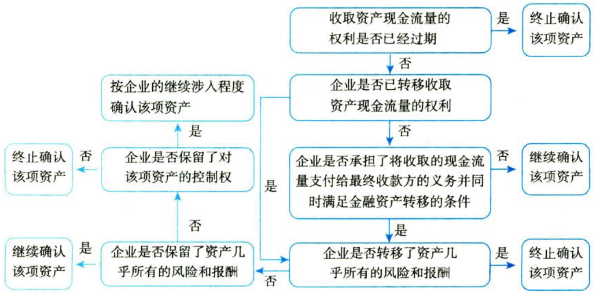
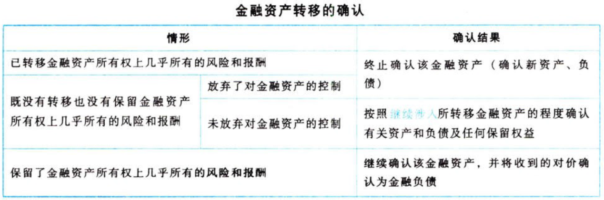

金融工具.金融资产的转移

# 1. 金融资产.转移

## 1.1. 金融资产.终止确认.一般原则

金融资产`终止确认`，是指企业将之前确认的金融资产从其资产负债表中予以转出。

金融资产满足下列`条件之一`的，应当终止确认：{

①收取该金融资产现金流量的合同权利`终止`。

②该金融资产`已转移`，且该转移满足本节关于终止确认的规定。

}

在第一个条件下，企业收取金融资产现金流量的合同权利终止，如因合同到期而使合同权利终止，金融资产不能再为企业带来经济利益，应当终止确认该金融资产。

在第二个条件下，企业收取一项金融资产现金流量的合同权利并未终止，但若企业转移了该项金融资产，同时该转移满足本节关于终止确认的规定，在这种安排下，企业也应当终止确认被转移的金融资产。

## 1.2. 金融资产.终止确认.判断流程

企业在判断金融资产是否应当终止确认以及在多大程度上终止确认时，应当遵循以下步骤：

### 1.2.1. 适用金融资产终止确认规定的报告主体层面

企业（转出方）对金融资产转入方具有`控制权`的，除在该企业`个别财务报表`基础上应用本节规定外，在编制合并财务报表时，还应当按照第二十七章合并财务报表的规定合并所有纳入合并范围的子公司（含结构化主体），并在`合并财务报表层面`应用本节规定。

### 1.2.2. 金融资产是部分还是整体适用终止确认原则

本节中的金融资产既可能指一项金融资产或其部分，也可能指一组类似金融资产或其部分。一组类似金融资产通常指金融资产的合同现金流量在金额和时间分布上相似并且具有相似的风险特征，如合同条款类似、到期期限接近的一组住房抵押贷款等。

当且仅当金融资产（或一组金融资产，下同）的一部分满足下列三个`条件之一`时，终止确认的相关规定适用于该金融资产部分，否则，适用于该金融资产整体：《

①该`金融资产部分`仅包括金融资产所产生的特定`可辨认`现金流量。

②该`金融资产部分`仅包括与该金融资产所产生的全部现金流量`完全成比例`的现金流量部分。

③该`金融资产部分`仅包括与该金融资产所产生的特定`可辨认`现金流量`完全成比例`的现金流量部分。

》

在除上述情况外的其他所有情况下，有关金融资产终止确认的相关规定适用于金融资产的`整体`。

例如，企业转移了公允价值为100万元人民币的一组类似的固定期限贷款组合，约定向转入方支付贷款组合预期所产生的现金流量的前90万元人民币，企业保留了取得剩余现金流量的次级权益。因为最初90万元人民币的现金流量既可能来自贷款本金也可能来自利息，且无法辨认来自贷款组合中的哪些贷款，所以不是特定可辨认的现金流量，也不是该金融资产所产生的全部或部分现金流量的完全成比例的份额。在这种情况下，企业不能将终止确认的相关规定适用于该金融资产90万元人民币的部分，而应当适用于该金融资产的整体。

又如，企业转移了一组应收款项产生的现金流量90%的权利，同时提供了一项担保以补偿转入方可能遭受的信用损失，最高担保额为应收款项本金金额8%。在这种情况下，由于存在担保，在发生信用损失的情况下，企业可能需要向转入方支付部分已经收到的企业自留的10%的现金流量，以补偿对方就90%现金流量所遭受的损失，导致该组应收款项下实际合同现金流量的分类并非按90%及10%完全成比例分配，因此终止确认的相关规定适用于该组金融资产的整体。

### 1.2.3. 收取金融资产现金流量的合同权利是否终止

企业在确定适用金融资产终止确认规定的`报告主体层面`（合并财务报表层面或个别财务报表层面）以及`对象`（金融资产整体或部分）后，即可开始判断`是否`对金融资产进行终止确认。

收取金融资产现金流量的合同权利已经终止的，企业应当终止确认该金融资产。

例如，一项应收账款的债务人在约定期限内支付了全部款项，或者在期权合同到期时期权持有人未行使期权权利，导致收取金融资产现金流量的合同权利终止，企业应终止确认金融资产。

若收取金融资产的现金流量的合同权利没有终止，企业应当判断`是否转移了`金融资产，并根据以下有关金融资产转移的相关判断标准确定是否应当终止确认被转移金融资产。

### 1.2.4. 企业是否已转移金融资产

企业在判断是否已转移金融资产时，应分以下`两种情形`作进一步的判断：

A.
企业将收取金融资产现金流量的合同权利`转移`给其他方。如实务中常见的票据背书转让、商业票据贴现等。

B.
企业`保留了`收取金融资产现金流量的合同权利，但`承担了`将收取的该现金流量支付给一个或多个最终收款方的合同义务。

这种金融资产转移的情形通常被称为“`过手安排`”。当且仅当`同时符合`以下三个条件时（不垫付、不挪用、不延误），转出方才能按照金融资产转移的情形进行后续分析及处理，否则，被转移金融资产应予以继续确认：{【确实只是过手】

①企业（转出方）只有从该金融资产收到对等的现金流量时，才有义务将其支付给最终收款方。在有的资产证券化等业务中，如发生由于被转移金融资产的实际收款日期与向最终收款方付款的日期不同而导致款项缺口的情况，转出方需要提供`短期垫付`款项。在这种情况下，当且仅当转出方有权全额收回该短期垫付款并按照市场利率就该垫款计收利息，方能`视同满足`这一条件。

②转让合同规定禁止企业（转出方）出售或抵押该金融资产，但企业可以将其作为向最终收款方支付现金流量义务的保证。企业不能出售该项金融资产，也不能以该项金融资产作为质押品对外进行担保，意味着转出方不再拥有出售或处置被转移金融资产的权利。但是，由于企业负有向最终收款方支付该项金融资产所产生的现金流量的义务，该项金融资产可以作为企业如期向最终收款方支付现金流量的保证。

③企业（转出方）有义务将代表最终收款方收取的所有现金流量`及时划转`给最终收款方，且无重大延误。企业无权将该现金流量进行再投资。但是，如果企业在收款日和最终收款方要求的划转日之间的短暂结算期内将代为收取的现金流量进行现金或现金等价物投资，并且按照合同约定将此类投资的收益支付给最终收款方，则`视同满足`本条件。

}

### 1.2.5. 所转移金融资产.风险和报酬转移情况

企业转移收取现金流量的合同权利或者通过符合条件的过手安排方式转移金融资产的，应根据规定进一步对被转移金融资产进行`风险和报酬`转移分析，以判断是否应终止确认被转移金融资产。

（1）企业转移了金融资产所有权上几乎所有风险和报酬的，应当`终止确认`该金融资产，并将转移中产生或保留的权利和义务`单独确认`为资产或负债。以下情形表明企业已将金融资产所有权上几乎所有的风险和报酬转移给了转入方：《

A.企业无条件`出售`金融资产。

B.企业出售金融资产，同时约定按回购日该金融资产的公允价值回购。

C.企业出售金融资产，同时与转入方签订看跌或看涨期权合约，且该看跌或看涨期权为`深度价外期权`（即到期日之前不大可能变为价内期权），此时可以认定企业已经转移了该项金融资产所有权上几乎所有的风险和报酬，应当终止确认该金融资产。

》

（2）企业保留了金融资产所有权上几乎所有风险和报酬的，应当继续确认该金融资产。以下情形通常表明企业`保留了`金融资产所有权上几乎所有的风险和报酬：《

A.企业出售金融资产并与转入方签订`回购协议`，协议规定企业将按照`固定价格`或是按照原售价加上合理的资金成本向转入方回购原被转移金融资产，或者与售出的金融资产相同或实质上相同的金融资产。

B.企业融出证券或进行证券`出借`。

C.企业出售金融资产并附有将市场风险敞口转回给企业的`总回报互换`。

D.企业出售短期应收款项或信贷资产，并且全额补偿转入方可能因被转移金融资产发生的信用损失。

E.企业出售金融资产，同时向转入方签订看跌或看涨期权合约，且该看跌期权或着涨期权为一项`价内期权`。

F.采用`附追索权`方式出售金融资产。

》

（3）企业既没有转移也没有保留金融资产所有权上几乎所有的风险和报酬的，应当判断真是否保留了对金融资产的`控制`，根据是否保留了控制分别进行处理。

### 1.2.6. 企业是否保留了控制

企业既没有转移也没有保留金融资产所有权上几乎所有的风险和报酬，企业应当判断企业是否保留了对该金融资产的控制。如果`没有保留`对该金融资产的控制的，应当`终止确认`该金融资产。

企业既没有转移也没有保留金融资产所有权上几乎所有的风险和报酬，且`未放弃`对该金融资产控制的，应当按照其`继续涉入`被转移金融资产的`程度`确认有关金融资产，并相应确认`有关负债`。

金融资产是否终止确认的判断流程如下图所示：

## 1.3. 金融资产转移.会计处理

### 1.3.7. 满足终止确认条件的金融资产转移.会计处理

对于满足终止确认条件的金融资产转移，企业应当按照被转移的金融资产是金融资产的`整体`还是金融资产的`一部分`，分别按照以下方式进行会计处理：

#### 1.3.7.1. 金融资产整体转移的会计处理

金融资产整体转移满足终止确认条件的，应当将下列两项金额的差额计入当期损益：

项目一：被转移金融资产在终止确认日的`账面价值`。

项目二：因转移金融资产而收到的`对价`，与原直接计入其他综合收益的`公允价值变动累计额`（涉及转移的金融资产为分类为［以公允价值计量&&其变动计入其他综合收益］的金融资产的情形）之和。

#### 1.3.7.2. 金融资产部分转移的会计处理

企业转移了金融资产的一部分，且该被转移部分满足终止确认条件的，应当将转移前金融资产整体的账面价值，在终止确认部分和继续确认部分（在此种情形下，所保留的服务资产应当视同继续确认金融资产的一部分）之间，按照转移日`各自的相对公允价值`进行分摊，并将下列两项金额的差额计入当期损益：

项目一：终止确认部分在终止确认日的`账面价值`。

项目二：终止确认部分收到的`对价`（包括获得的所有新资产减去承担的所有新负债），与原计入其他综合收益的`公允价值变动累计额`中对应终止确认部分的金额（涉及部分转移的金融资产为分类为［以公允价值计量&&其变动计入其他综合收益］的金融资产的情形）之和。

### 1.3.8. 继续确认被转移金融资产的会计处理

企业`保留了`被转移金融资产所有权上`几乎所有的风险和报酬`的，表明企业所转移的金融资产不满足终止确认的条件，`不应`当将其从企业的资产负债表中`转出`。

此时，企业应当继续确认所转移的金融资产整体，因资产转移而收到的`对价`，应当在收到时确认为一项`金融负债`。

需要注意的是，该金融负债与被转移金融资产应当分别确认和计量，`不得相互抵销`。在后续会计期间，企业应当继续确认该金融资产产生的收入或利得以及该金融负债产生的费用或损失。

### 1.3.9. 继续涉入被转移金融资产的会计处理

企业既没有转移也没有保留金融资产所有权上几乎所有风险和报酬，且保留了对该金融资产控制的，应当`按照`其继续涉入被转移金融资产的`程度`继续确认该被转移金融资产，并相应确认`相关负债`。

企业所确认的被转移的金融资产和相关负债，应当反映企业所保留的权利和承担的义务。

企业通过对被转移金融资产`提供担保`方式继续涉入的，应当在转移日按照金融资产的`账面价值`和`担保金额`两者之中的较低者，按继续涉入的程度继续确认被转移资产，同时按照(担保金额)和(担保合同的公允价值)之`和`确认相关负债。

### 1.3.10. 本节总结

当(`已转移`金融资产所有权上几乎所有的风险和报酬)时，应当(`终止确认`该金融资产（确认新资产、负债）)。

当(既没有转移也没有保留金融资产所有权上几乎所有的风险和报酬)时，若(`放弃了`对金融资产的控制)，应当(`终止确认`该金融资产（确认新资产、负债）)。

当(既没有转移也没有保留金融资产所有权上几乎所有的风险和报酬)时，若(`未放弃`对金融资产的控制)，应当(按照继续涉入所转移金融资产的`程度`确认有关资产和负债及任何保留权益)。

当(`保留了`金融资产所有权上几乎所有的风险和报酬)时，应当(`继续确认`该金融资产，并将收到的`对价`确认为`金融负债`)。

### 1.3.11. 金融资产转移.会计科目

“继续涉入资产”科目核算企业（转出方）由于对转出金融资产提供信用增级（如提供担保、持有次级权益）而继续涉入被转移金融资产时，企业所承担的`最大可能损失金额`（即企业继续涉入被转移金融资产的程度）。

“继续涉入负债”科目核算企业在(金融资产转移)中因继续涉入被转移资产而产生的`义务`。
