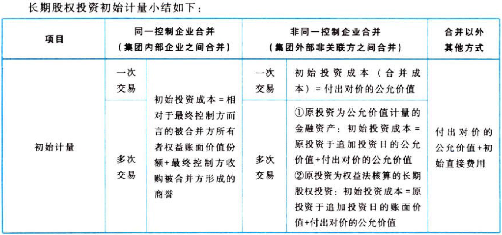
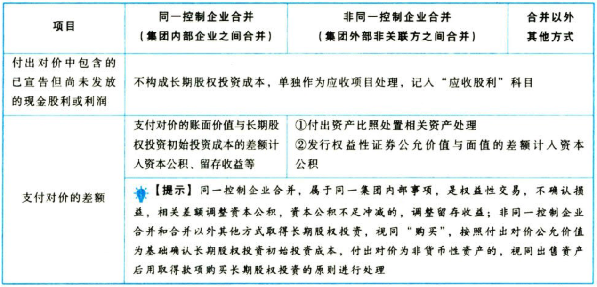
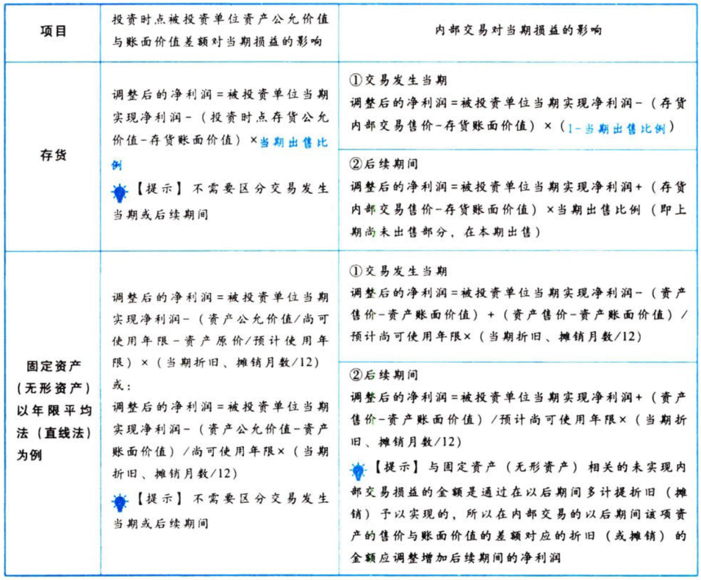
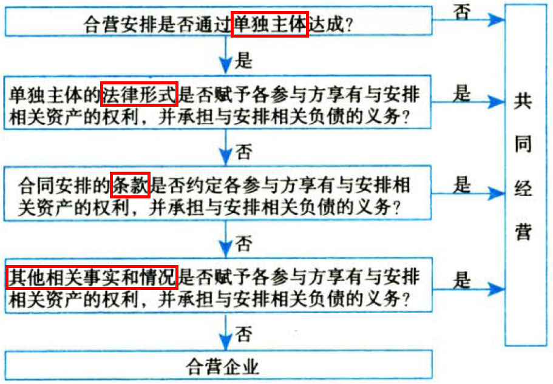

长期股权投资

# 1. 股权投资

`股权投资`包括长期股权投资和《企业会计准则第22号——金融工具确认和计量》准则规范的股权投资。【投资和散户】

长期股权投资，是指投资方对被投资单位实施`控制`（又称控股`合并`形成的长期股权投资、企业`合并`形成的长期股权投资、对`子公司`投资）、`重大影响`的权益性投资，以及对其`合营企业`的权益性投资。【大投资，小投资，中投资】

`共同控制的合营企业`执行“长期股权投资”准则。

`共同控制的共同经营`执行“合营安排”准则。

对被投资单位不具有控制、共同拉制或重大影响的权益性投资执行“`金融工具`确认和计量”准则。

## 1.1. 联营企业投资【小投资】

联营企业投资，是指投资方能够对被投资单位施加`重大影响`的股权投资。

重大影响是指投资方对被投资单位的财务和生产经营决策有`参与决策`的权力，但并不能控制或与其他方一起共同控制这些政策的制定。

比如：在被投资单位的`董事会`中派有代表；参与被投资单位财务和经营`决策制定`过程；与被投资单位之间发生`重要交易`；向被投资单位派出`管理人员`；向被投资单位提供`关键技术资料`。

在评估投资方对被投资单位是否具有重大影响时，应当考虑`潜在表决权`的影响（如发行的可转债、认股权证）。

［风险投资机构、共同基金、类似主体］持有的、在初始确认时按照《企业会计准则第22号——金融工具确认和计量》的规定划分为［以公允价值计量且其变动计入当期`损`益］的金融资产，无论以上主体是否对这部分投资具有重大影响，都应按照《企业会计准则第22号——金融工具确认和计量》的规定进行确认和计量。

投资方对联营企业的权益性投资，其中一部分通过［风险投资机构、共同基金、信托公司、包括投连险基金在内的类似主体］间接持有的，无论以上主体是否对这部分投资具有重大影响，投资方都可以按照《企业会计准则第22号——金融工具确认和计量》的有关规定，对间接持有的该部分投资选择［以公允价值计量且其变动计入当期`损`益］，并对其余部分采用`权益法`核算。【又当老板又当小散】

## 1.2. 合营企业投资【中投资】

合营企业投资，是指投资方与`其他合营方`对被投资单位实施`共同控制`且对被投资单位净资产享有权利的权益性投资。

## 1.3. 对子公司投资【大投资】

对子公司投资，是指投资方持有的能够对被投资单位施加`控制`的权益性投资。

# 2. 长期股权投资.确认

长期股权投资的确认，是指投资方能够在`自身账簿和报表`中确认对被投资单位股权投资的`时点`。

对子公司投资应当在企业合并的`合并日`（或`购买日`）确认。实务中，对于重大影响、合营企业等长期股权投资的持有，一般应比对子公司长期股权投资的确认条件进行。

合并日（或购买日）是购买方获得对被购买方`控制权`的日期。【实权在手】

`同时满足`以下条件时，一般可认为实现了`控制权的转移`，即形成合并日（或购买日）：

①已获股东大会等内部权力机构通过的企业合并`合同或协议`。

②按照规定，合并事项需要经过国家有关主管部门审批的，已获得`相关部门的批准`。

③参与合并各方已办理了必要的`财产权交接手续`。

④合并方或购买方`已支付`了购买价款的大部分（一般应超过50%），并且有能力、有计划支付剩余款项。

⑤合并方或购买方实际上已经控制了被购买方的`财务和经营决`策，享有相应的收益并承担相应的风险。

# 3. 对联营合营企业投资.初始计量

对联营企业、合营企业投资：`公允价值`＋`初始直接费用`。【类似购买存货、固定资产等】

①以支付现金取得的，初始投资成本为：实际支付的`购买价款`（包含购买过程中支付的手续费等）。

②以发行权益性证券取得的，初始投资成本为：权益性`证券的公允价值`。

③以债务重组、非货币性资产交换等方式取得的，初始投资成本：按《债务重组》《非货币性资产交换》等相关准则规定处理。

# 4. 同一控制下对子公司.初始计量

同一控制下的企业合并，是指参与合并的企业在合并前后均受`同一方或相同的多方`最终控制且该控制并非暂时性的。【内部倒手】

同一控制下，对子公司投资（企业合并），其初始计量值为：［(被合并方所有者权益)在`最终控制方`合并财务报表中的`账面价值`］.取得的份额+`最终控制方`收购被合并方时形成的`商誉`。【A%+B】

【A%+B】与［支付的合并对价账面价值or发行股份面值总额］的差额，应当调整“股本溢价/资本公积——资本溢价”；资本公积的余额不足的，应当依次冲减盈余公积和未分配利润。【内部倒手，在资本公积里记录差额，不影响损益】

注意事项：同一控制下企业合并中`不产生`新的资产和负债。【内部倒手，不增不减】

注意事项：原最终控制方取得被合并方时确认的商誉应作为合并方合并中取得的资产确认，但同一控制下企业合并过程中`不产生`新的商誉。【内部倒手，不增不减】

## 4.4. 权益结合法

同一控制下企业合并应用的是`权益结合法`原则。

权益结合法，亦称股权结合法、权益联营法，是企业合并业务会计处理方法之一。与购买法基于不同的假设，即视企业合并为参与合并的双方，通过股权的交换形成的所有者权益的联合，而非资产的交易。换言之，它是由两个或两个以上经营主体对一个联合后的企业或集团公司开展经营活动的资产贡献，即经济资源的联合。

在权益结合法中，原所有者权益继续存在，以前会计基础保持不变。参与合并的各企业的资产和负债继续按其`原来的账面价值`记录，合并后企业的利润包括合并日之前本年度已实现的利润，以前年度累积的留存利润也应予以合并。

注意事项：企业会计准则解释第6号

根据《企业会计准则第20号——企业合并》，在同一控制下的企业合并中，合并方在企业合并中取得的资产和负债，应当按照`合并日`在被合并方的账面价值计量。在被合并方是最终控制方以前年度`从第三方收购来`的情况下，合并方在编制财务报表时，应如何确定被合并方资产、负债的账面价值？

答：同一控制下的企业合并，是指参与合并的企业在合并前后均受同一方或相同的多方最终控制，且该控制不是暂时性的。从`最终控制方`的角度看，其在合并前后实际控制的经济资源并没有发生变化，因此有关交易事项`不应视为购买`。合并方编制财务报表时，在被合并方是最终控制方以前年度从第三方收购来的情况下，应`视同`合并后形成的报告主体自最终控制方开始实施控制时起，一直是一体化存续下来的，应以被合并方的资产、负债（包括最终控制方收购被合并方而形成的商誉）在`最终控制方`财务报表中的`账面价值`为基础，进行相关会计处理。

## 4.5. 一次交易形成同控合并

:moneybag:【会计分录】合并方以支付现金、转让非现金资产、承担债务方式作为合并对价

```
借：长期股权投资 // 【A%+B】
  贷：资产 // 投出资产的账面价值
      负债 // 承担负债的账面价值
      资本公积——资本溢价/股本溢价 // 倒挤的差额
借：管理费用 // 审计、法律服务、评估咨询等中介费+其他相关管理费用
  贷：银行存款
```

:moneybag:【会计分录】合并方以发行权益性证券作为合并对价

```
借：长期股权投资 // 【A%+B】
  贷：股本
      资本公积——股本溢价 // 倒挤的差额
借：资本公积——股本溢价 // 权益性证券发行费用
  贷：银行存款
```

注意事项：被合并方在合并日的净资产账面价值为`负数`的，长期股权投资初始投资成本按`零`确定，同时在备查簿中予以登记。【零+备查簿】

注意事项：企业合并前合并方与被合并方采用的会计政策不一致的，应基于`重要性`原则，统一合并方与被合并方的`会计政策`。在按照合并方的会计政策对被合并方净资产的账面价值进行调整的基础上，计算确定长期股权投资的初始投资成本。

注意事项：在商誉未发生减值的情况下，同一控制下企业合并中，不同母公司编制合并财务报表时，合并财务报表中反映的`商誉是相同的`。如：甲公司和乙公司属于同一集团，甲公司从本集团外部购入丁公司80%股权（属于非同一控制下企业合并）时，甲公司合并财务报表中确认商誉80万元。两年后，乙公司购入甲公司所持有的丁公司60%股权，乙公司编制合并财务报表时列示的商誉仍为80万元，而不是60万元。【商誉值不变】

注意事项：被合并方在最终控制方合并财务报表中的`净资产账面价值`，并非是指被合并方个别财务报表中体现的有关资产、负债的价值，而是从最终控制方的角度，被合并方自最终控制方`开始控制时`起，其所持有的资产、负债确定对于最终控制方的价值`持续计算`至合并日的账面价值。【最终控制方说了算】

## 4.6. 多次交易形成同控合并

合并日长期股权投资的初始投资`成本`＝合并日被合并方在最终控制方`合并财务报表`中的净资产账面价值`份额`＋最终控制方收购被合并方形成的`商誉`。【A%+B】

`新增`投资部分初始投资成本＝合并日长期股权投资的初始投资`成本`－`原`股权投资账面价值。【最终值=一次交易形成同控合并的结果】

新增投资部分初始投资成本与为取得新增投资部分所支付对价账面价值的差额，应当调整“股本溢价/资本公积——资本溢价”；资本公积的余额不足的，应当依次冲减盈余公积和未分配利润。

# 5. 非同一控制下对子公司.初始计量

非同一控制下的企业合并，是指参与合并各方在合并前后不受`同一方或相同的多方`最终控制的合并交易，即同一控制下企业合并以外的其他企业合并。

非同一控制下，对子公司投资（企业合并），其初始计量值通常情况下为`公允价值`。【值多少钱就是多少钱】

## 5.7. 购买法

非同一控制下企业合并处理的基本原则是`购买法`。即将企业合并视为购买企业以一定的价款购进被购买企业的机器设备、存货等资产项目，同时承担该企业所有负债的行为，从而按合并时的`公允价值`计量被购买企业的净资产，将合并成本超过享有`可辨认净资产公允价值`份额的差额确认为`商誉`的会计方法。【代价-公允价值.份额=商誉】

## 5.8. 一次交易实现的企业合并

购买方应当按照`确定的企业合并成本`作为长期股权投资的初始投资成本。

企业合并成本包括购买方为进行企业合并［支付的现金或非现金资产、发行或承担的债务、发行的权益性证券］等在购买日的`公允价值`。购买方在购买日对作为企业合并对价付出的资产、发生或承担的负债公允价值与账面价值的差额计入`当期损益`（或`留存收益`）。【视同出售资产后用钱买企业】

非同一控制下企业合并中发生的与企业合并相关的`费用`与同一控制下企业合并中发生的相关`费用`的会计处理`相同`。

形成非同一控制下的控股合并，作为对价投出的资产为`非货币性资产`时，投出资产公允价值与其账面价值的差额应分别不同资产进行会计处理（与`出售`资产影响损益的会计处理相同）：【视同出售后用钱买企业】

①投出资产为固定资产或无形资产，其差额计入`资产处置损益`；

②投出资产为存货，符合收入确认条件的，按其公允价值确认`主营业务收入`或`其他业务收入`，按其账面价值结转`主营业务成本`或`其他业务成本`，若存货计提`跌价准备`的，应将存货跌价准备`一并结转`；

③投出资产为“其他债权投资”，其公允价值与账面价值的差额计入`投资收益`，原持有期间因公允价值变动形成的“其他综合收益”应一并转入`投资收益`。

## 5.9. 多次交换交易形成非同一控制下企业合并

### 5.9.1. 原投资为权益法核算的长期股权投资

购买日长期股权投资初始投资成本＝购买日`原`投资账面价值＋`新增`投资公允价值。【权益法下的账面价值，实际上等于公允价值】

注意事项：购买日之前因权益法核算形成的“其他综合收益”或“资本公积——其他资本公积”`暂时不作处理`，待到`处置`该项投资时再按处置长期股权投资的规定进行处理。【视为升级，不视为处置】

### 5.9.2. 原投资为“其他权益工具投资”

购买日长期股权投资初始投资成本＝购买日`原`投资公允价值＋`新增`投资公允价值。【全是公允价值】

购买日之前持有的被购买方的股权涉及其他综合收益的，计入`留存收益`，不得转入当期损益。【综(股)本就这么做】

### 5.9.3. 原投资为“交易性金融资产”

购买日长期股权投资初始投资成本＝购买日`原`投资公允价值＋`新增`投资公允价值。【全是公允价值】

## 5.10. 投资成本中包含的已宣告但尚未发放的现金股利或利润的处理

取得投资时，对于支付的对价中包含的应享有被投资单位已经宣告但尚未发放的现金股利或利润，均应确认为`应收股利`。【正常红利】

## 5.11. 小结






## 5.12. 一项交易中同时涉及自最终控制方购买股权形成控制及自其他外部独立第三方购买股权的会计处理

某些股权交易中，合并方除自最终控制方取得集团内企业的股权外，还会涉及自外部独立第三方购买被合并方进一步的股权。

该类交易中，一般认为自集团内取得的股权能够形成控制的，相关股权投资成本的确定按照`同一控制`下企业合并的有关规定处理，而自外部独立第三方取得的股权则视为在取得对被投资单位的控制权，形成同一控制下企业合并后`少数股权的购买`，该部分少数股权的购买不管与形成同一控制下企业合并的交易是否同时进行，在与同一控制下企业合并`不构成一揽子交易`的情况下，有关股权投资成本即应按照`实际支付的购买价款`确定。该种情况下，在合并方最终持有对同一被投资单位的股权中，不同部分的计量基础会存在差异。【先内部倒手，再外部炒股，性质不同】

# 6. 长期股权投资.成本法.后续计量

“`长期股权投资`”科目反映取得时的`成本`。

:moneybag:【会计分录】被投资单位宣告发放现金股利或利润

```
借：应收股利
  贷：投资收益
```

处置长期股权投资，应将长期股权投资账面价值与实际取得价款的差额，计入`当期损益`（投资收益）。

# 7. 长期股权投资.权益法.后续计量

权益法，是指投资以`初始投资成本`计量后，在投资持有期间`根据`享有被投资单位`所有者权益份额的变动`对长期股权投资的账面价值进行`调整`的方法。

适用范围：对`联营企业`及`合营企业`投资。

长期股权投资——`投资成本`（投资时点）。

长期股权投资——`损益调整`（持有期间被投资单位`净损益`变动及`利润分配`）。【营业收支】

长期股权投资——`其他综合收益`（持有期间被投资单位`其他综合收益`变动）。【非营业收支】

长期股权投资——`其他权益变动`（持有期间被投资单位`其他`权益变动）。【资本运作】

在持有投资期间，被投资单位编制合并财务报表的，投资方应当以`合并财务报表`中［净利润、其他综合收益、其他权益变动］中归属于被投资单位的金额为基础进行会计处理。

权益法核算下，长期股权投资代表的是享有被投资单位`净资产的份额`，投资收益代表的是享有被投资单位`净损益`的份额。

## 7.13. 初始投资成本的调整【——投资成本】

长期股权投资的初始投资成本`大于`投资时应享有被投资单位可辨认净资产公允价值份额：`不调整`长期股权投资的初始投资成本。

$$商誉=初始投资成本-投资时享有被投资方`可辨认净资产`公允价值.份额$$

而商誉与整体相关，不能在个别报表中确认，只能体现在长期股权投资中。【活该你买的贵】

长期股权投资的初始投资成本`小于`投资时应享有被投资单位可辨认净资产公允价值份额：计入`营业外收入`。【占便宜了】

:moneybag:【会计分录】占便宜

```
借：长期股权投资——投资成本
  贷：营业外收入
```

## 7.14. 投资损益的确认【——损益调整】

投资企业取得长期股权投资后，应当按照应享有或应分担的被投资单位实现的`净损益`的份额，确认`投资损益`并调整长期股权投资的账面价值。

:moneybag:【会计分录】被投资单位实现净利润【净亏损则反转】

```
借：长期股权投资——损益调整
  贷：投资收益
```

采用权益法核算的长期股权投资，在确认应享有或应分担被投资单位的净利润或净亏损时，在`被投资单位账面净损益`的基础上，应考虑以下因素的影响进行适当`调整`：{

①被投资单位采用的`会计政策`及`会计期间`与投资方不一致的，应按投资方的会计政策及会计期间对被投资单位的财务报表进行调整。

②在评估投资方对被投资单位是否具有重大影响时，应当考虑潜在表决权的影响，但在确认应享有的被投资单位实现的净损益、其他综合收益和其他所有者权益变动的份额时，`潜在表决权`所对应的权益份额不应予以考虑。

③在确认应享有或应分担的被投资单位净损益时，法规或章程规定不属于投资方的净损益应当予以剔除后计算。例如，被投资单位发行了分类为权益的可累积优先股等类似权益工具，无论被投资单位是否宣告分配优先股股利，投资方计算应享有被投资单位的净利润时，均应将归属于其他投资方的`累积优先股股利`予以`扣除`。

④投资方在确认应享有被投资单位净损益的份额时，应当以`取得投资时`被投资单位可辨认净资产的`公允价值`为基础，对被投资单位的`净利润`进行`调整`后确认。【持续计算】

⑤对于［投资方或纳入投资方合并财务报表范围的子公司］与［其联营企业及合营企业］之间发生的`未实现内部交易损益`应予`抵销`。即，投资方与联营企业及合营企业之间发生的未实现内部交易损益，按照应享有的比例计算归属于投资方的部分予以抵销，在此基础上确认投资损益。【内部抵销】

}

### 7.14.4. 构成业务的资产买卖

投资方与联营、合营企业之间发生投出或出售资产的交易，该资产`构成业务`的，有关会计处理如下：【全额确认，不抵销】{

①联营、合营企业向投资方出售业务的，投资方应`全额确认`与交易相关的利得或损失。

②投资方向联营、合营企业投出业务，投资方因此取得长期股权投资但未取得控制权的，应以投出业务的`公允价值`作为`新增`长期股权投资的初始投资成本，初始投资成本与投出业务的账面价值之间的差额，全额计入`当期损益`。

③投资方向联营、合营企业出售业务取得的对价与所出售业务的账面价值之间的差额，全额计入`当期损益`。

}

投出或出售的资产不构成业务的，应当分别`顺流交易`和`逆流交易`进行会计处理。

### 7.14.5. 顺流交易

对于［投资企业］向［联营企业or合营企业］出售资产的顺流交易，在该交易存在`未实现内部交易损益`的情况下（即有关资产未对外部独立第三方出售或未被消耗），投资企业在采用权益法计算确认应享有联营企业或合营企业的投资损益时，应`抵销`该未实现内部交易损益的影响，同时调整对联营企业或合营企业长期股权投资的账面价值。

当［投资企业］向［联营企业or合营企业］出资或是将资产出售给联营企业或合营企业，同时有关资产由联营企业或合营企业持有时，投资企业对于投出或出售资产产生的损益确认`仅限于`归属于联营企业或合营企业`其他投资者`的部分。

即在顺流交易中，投资企业投出资产或出售资产给其联营企业或合营企业产生的损益中，按照持股比例计算确定`归属于本企业`的部分`不予确认`。【卖到外边的才算数】

### 7.14.6. 逆流交易

对于［联营企业或合营企业］向［投资企业］出售资产的逆流交易，在该交易存在`未实现内部交易损益`的情况下（即有关资产未对外部独立第三方出售或未被消耗），投资企业在采用权益法计算确认应享有联营企业或合营企业的投资损益时，应`抵销`该未实现内部交易损益的影响。即`不应确认`联营企业或合营企业因该交易产生的损益中`本企业`应享有的部分。

因逆流交易产生的未实现内部交易损益，在未对外部独立第三方出售或未耗用之前，体现在投资企业持有资产的账面价值中。投资企业对外编制合并财务报表的，应在`合并财务报表`中对长期股权投资及包含未实现内部交易损益的资产账面价值进行调整，`抵销`有关资产账面价值中包含的`未实现内部交易损益`，并相应`调整`对联营企业或合营企业的`长期股权投资`。【卖到外边的才算数】

### 7.14.7. 内部交易的减值损失

投资企业与其联营企业及合营企业之间发生的无论是顺流交易还是逆流交易产生的`未实现内部交易损失`，属于所转让资产发生`减值损失`的，有关的未实现内部交易损失不应予以抵销，应由减值资产`全额承担`。【损失就是损失，不能无视】

### 7.14.8. 持续计算

调整被投资单位净利润时，应考虑`投资时点`被投资单位资产公允价值和账面价值的`差额`及`内部交易`对当期损益的影响，如下表所示：【持续计算】



### 7.14.9. 被投资单位宣告分配现金股利或利润的处理

:moneybag:【会计分录】宣告分配现金股利【回本了】

```
借：应收股利
  贷：长期股权投资——损益调整
```

### 7.14.10. 超额亏损的确认

投资企业确认应分担被投资单位发生的净亏损，应当以长期股权投资的账面价值以及其他实质上构成对被投资单位净投资的长期权益减记至`零`为限，投资企业负有承担额外损失义务的除外。

其他实质上构成对被投资单位净投资的长期权益，通常是指`长期应收项目`。比如，企业对被投资单位的`长期债权`，该债权没有明确的清收计划、且在可预见的未来期间不准备收回的，实质上构成对被投资单位的净投资，但`不包括`投资企业与被投资单位之间因销售商品、提供劳务等`日常活动`所产生的长期债权。

在确认应分担被投资单位发生的净亏损时，应当按照以下顺序进行处理：冲减`长期股权投资`账面价值-\>冲减`长期应收款`-\>确认`预计负债`-\>备查`登记`。【亏亏亏亏个没完】

## 7.15. 其他综合收益的处理【——其他综合收益】

被投资单位`其他综合收益`发生变动的，投资方应当按照归属于本企业的部分，相应调整长期股权投资的账面价值，同时增加或减少其他综合收益。【同步运动】

:moneybag:【会计分录】相应调整其他综合收益

```
借：长期股权投资——其他综合收益
  贷：其他综合收益
```

## 7.16. 被投资单位所有者权益其他变动的处理【——其他权益变动】

被投资单位除`净损益`、`利润分配`、`其他综合收益`以外的所有者权益的其他变动的因素，主要包括被投资方接受其他股东的资本性投入、被投资方发行可转换公司债券中包含的权益成分、以权益结算的股份支付、其他股东对被投资单位增资导致`投资方持股比例`发生变动等。

投资方应按所持股权比例计算应享有的份额，调整长期股权投资的账面价值，同时计入“`资本公积——其他资本公积`”，并在`备查薄`中予以登记。

投资方在后续处置股权投资但对剩余股权仍采用权益法核算时，应按`处置比例`将这部分资本公积转入当期`投资收益`；对剩余股权终止采用权益法核算时，将这部分资本公积`全部`转入当期投资收益。

:moneybag:【会计分录】其他权益变动【同步运动】

```
借：长期股权投资——其他权益变动
  贷：资本公积——其他资本公积
```

## 7.17. 股票股利的处理

被投资单位分派股票股利的，投资企业`不作会计处理`，但应于除权日`注明`所增加的股数，以反映股份的变化情况。【没事】

# 8. 长期股权投资.减值

将长期股权投资的`账面价值`与`可收回金额`比较，发生减值时：

:moneybag:【会计分录】计提减值准备

```
借：资产减值损失
  贷：长期股权投资减值损失
```

注意事项：长期股权投资减值准备，一经计提，持有期间`不得转回`。【大块资产，不得转回】

# 9. 长期股权投资.处置

出售所得`价款`与处置长期股权投资`账面价值`之间的差额，应确认为`处置损益`。【卖东西】

投资方全部处置权益法核算的长期股权投资时，原权益法核算的相关其他综合收益应当在终止采用权益法核算时采用与`被投资单位`直接处置相关资产或负债相同的基础进行会计处理。【将暂存的收益处理掉】

因被投资方除［净损益、利润分配、其他综合收益］以外的`其他权益变动`而确认的“`资本公积——其他资本公积`”，应当在终止采用权益法核算时全部转入当期`投资收益`。【将暂存的收益处理掉】

投资方`部分处置`权益法核算的长期股权投资，若剩余股权仍采用`权益法`核算的，原权益法核算的相关其他综合收益应当采用与被投资单位直接处置相关资产或负债相同的基础处理，并`按比例结转`，因被投资方除［净损益、利润分配、其他综合收益］以外的其他权益变动而确认的“`资本公积——其他资本公积`”，应`按处置比例`转入当期`投资收益`；若剩余股权终止采用权益法核算，即作为`公允价值计量的金融资产`核算，原权益法核算的相关其他综合收益应当采用与被投资单位直接处置相关资产或负债相同的基础处理并全部结转，因被投资方除［净损益、利润分配、其他综合收益］以外的其他权益变动而确认的“`资本公积——其他资本公积`”，应当`全部`转入当期`投资收益`。【有剩余，按比例；剩渣渣，全处理】

# 10. 长期股权投资.核算方法的转换

## 10.18. 转换原理

转换日投资上升的，将原投资调整到`公允价值`（不包括形成同一控制下企业合并的情形），即将原投资于转换日按公允价值`出售再回购`，其中权益法转为成本法在`合并报表`中调整。【卖东西，拿到钱，去买货】

转换日投资下降的，将剩余投资调整到`公允价值`，即将原投资于转换日按公允价值全部`出售`再将剩余投资按公允价值`回购`，其中成本法转为权益法在`合并报表`中调整。【卖东西，拿到钱，去买货】

| 转换形式                        | 个别财务报表                           | 合并财务报表           |
|---------------------------------|----------------------------------------|------------------------|
| 公允价值计量-\>权益法           | 原投资调整到公允价值                   | \-                     |
| 权益法-\>成本法（非同控）       | 保持原投资账面价值                     | 原投资调整到公允价值   |
| 公允价值计量-\>成本法（非同控） | 原投资调整到公允价值                   | \-                     |
| 成本法-\>权益法                 | 剩余投资追溯调整为权益法核算的账面价值 | 剩余投资调整到公允价值 |
| 权益法-\>公允价值计量           | 剩余投资调整到公允价值                 | \-                     |
| 成本法-\>公允价值计量           | 剩余投资调整到公允价值                 | \-                     |

## 10.19. 成本法-\>权益法

### 10.19.11. 个别财务报表

关键点：剩余持股比例部分应`视同`取得投资时点即采用权益法核算，即对剩余持股比例投资`追溯调整`，将其调整到权益法核算的结果。【视同：本来就买了这点，从来就是权益法】

#### 10.19.11.1. 处置部分

:moneybag:【会计分录】处置部分

```
借：银行存款
  贷：长期股权投资
      投资收益 // 倒挤的差额
```

#### 10.19.11.2. 剩余部分.投资时点的追溯调整

剩余的长期股权投资初始投资成本`大于`按照剩余持股比例计算应享有`原投资时`被投资单位`可辨认净资产`公允价值份额的，属于投资作价中体现的商誉部分，不调整长期股权投资的账面价值；初始投资成本`小于`按照剩余持股比例计算应享有`原投资时`被投资单位`可辨认净资产`公允价值份额的，在调整长期股权投资成本的同时，通常应调整`留存收益`。【买贵了，呆着；买便宜了，那就是赚了】

#### 10.19.11.3. 剩余部分.投资后的追溯调整

:moneybag:【会计分录】投资后的追溯调整

```
借：长期股权投资
  贷：留存收益 // `原投资时`至处置投资当期`期初`被投资单位`留存收益`变动\*剩余持股比例【老利润】
      投资收益 // 处置投资当期`期初`至`处置日`被投资单位的`净损益`变动\*剩余持股比例【新利润】
      其他综合收益 // 被投资单位`其他综合收益`变动\*剩余持股比例【暂存的收入】
      资本公积——其他资本公积 // 其他原因导致被投资单位`其他`所有者权益变动\*剩余持股比例【资本运作】
```

调整留存收益和投资收益时，应自被投资方实现的`净损益`中扣除已发放或已宣告发放的`现金股利或利润`。

### 10.19.12. 合并财务报表

#### 10.19.12.4. 先全卖再买回一部分

母公司因处置部分股权投资或其他原因丧失了对`原有子公司`控制的，在合并财务报表中，对于剩余股权，应当按照`丧失控制权日`的公允价值进行重新计量。

①(处置股权取得的对价和剩余股权公允价值之和)【卖得的钱+剩下的奴】，减去(按原持股比例计算应享有原有子公司自`购买日`开始持续计算的`净资产`份额与`商誉`之和)【原来的奴】的差额，计入丧失控制权当期的“`投资收益`”。

②与原有子公司股权投资相关的其他综合收益（可转损益部分）、其他权益变动，应当在丧失控制权时一并转入“`投资收益`”。【非营业收入+资本运作】

合并财务报表中确认的投资收益=(处置股权取得的`对价`+`剩余股权`公允价值)－(按原持股比例计算应享有原有子公司自`购买日`开始持续计算的`净资产`份额+`商誉`)+与原有子公司股权投资相关的`其他综合收益`（可转损益的部分）、`其他权益变动`。

被投资单位［重新计量`设定受益计划`净负债或净资产变动］而产生的`其他综合收益`、被投资单位“其他权益工具投资”产生的其他综合收益，终止确认相关资产、负债时，其他综合收益在`所有者权益`内部结转，`不`转入损益。因此，投资方按权益法核算确认的其他综合收益`也不`转入损益。【人不动我不动】

关键点：因控制权发生改变（由控制转为不再控制），在合并财务报表中剩余股权投资要重新计量，即视为将投资`全部出售`（售价与账面价值之间的差额计入投资收益），再将剩余部分投资按出售日的公允价值`回购`。

#### 10.19.12.5. 丧失控制权日合并财务报表中的调整分录

①将剩余股权投资由个别财务报表中按权益法追溯调整后的`账面价值`在合并财务报表中调整到`丧失控制权日`的`公允价值`，其调整分录为借记“长期股权投资”科目，贷记“投资收益”科目，或作相反分录。【所谓调整，就是持续计算】

:moneybag:【会计分录】所谓调整，就是持续计算（或相反分录）

```
借：长期股权投资
  贷：投资收益
```

②对个别财务报表中确认的投资收益的`归属期间`进行调整。

:moneybag:【会计分录】调整归属期间（或相反分录）

```
借：投资收益
  贷：资本公积
      其他综合收益
      盈余公积
      利润分配——未分配利润
```

③将与原投资有关的其他综合收益（可转损益的部分）、其他权益变动转入`投资收益`。

:moneybag:【会计分录】所谓调整，就是持续计算（或相反分录）

```
借：其他综合收益
    资本公积——其他资本公积
  贷：投资收益
```

将与原投资相关的其他综合收益（可转留存收益的部分）转入`留存收益`。

:moneybag:【会计分录】所谓调整，就是持续计算（或相反分录）

```
借：其他综合收益
  贷：盈余公积
      利润分配——未分配利润
```

## 10.20. 公允价值计量或权益法-\>成本法（非同控）

### 10.20.13. 个别报表

#### 10.20.13.6. 原投资按公允价值计量的

追加投资日长期股权投资初始投资`成本`＝转换日`原`投资公允价值＋`新增`投资成本。

#### 10.20.13.7. 原投资采用权益法核算的

追加投资日长期股权投资初始投资`成本`＝转换日`原`投资账面价值＋`新增`投资成本。【权益法的账面价值约等于公允价值，因为权益法是持续计算的】

### 10.20.14. 合并报表

参见`合并财务报表`章节“通过多次交易分步实现非同一控制下的企业合并”的相关处理。

## 10.21. 公允价值计量-\>权益法

追加投资日长期股权投资初始投资`成本`＝转换日`原`投资公允价值＋`新增`投资的成本。

原持有的股权投资为“`其他权益工具投资`”的，其公允价值与账面价值之间的差额，以及原计入其他综合收益的累计公允价值变动应当计入`留存收益`。【正常操作】

## 10.22. 权益法-\>公允价值计量

### 10.22.15. 处置部分

:moneybag:【会计分录】处置部分

```
借：银行存款
  贷：长期股权投资
      投资收益 // 倒挤的差额
```

### 10.22.16. 剩余部分

:moneybag:【会计分录】视同`新买`金融资产【买东西】

```
借：交易性金融资产等 // 转换日公允价值
  贷：长期股权投资 // 剩余投资账面价值
      投资收益 // 倒挤的差额
```

### 10.22.17. 将原权益法核算时确认的全部其他综合收益转入投资收益或留存收益

:moneybag:【会计分录】视同`处置`权益法全部资产【非营业收入部分】

```
借：其他综合收益
  贷：投资收益 // 可转损益部分
      留存收益 // 不可转损益部分
```

### 10.22.18. 原权益法核算时确认的全部“资本公积——其他资本公积”转入投资收益

:moneybag:【会计分录】视同`处置`权益法全部资产【资本运作部分】

```
借：资本公积——其他资本公积
  贷：投资收益 // 可转损益部分
```

## 10.23. 成本法-\>公允价值计量

### 10.23.19. 确认有关股权投资的处置损益

:moneybag:【会计分录】`处置`部分【卖东西】

```
借：银行存款
  贷：长期股权投资 // 出售部分的账面价值
      投资收益 // 倒挤的差额
```

### 10.23.20. 剩余部分

:moneybag:【会计分录】视同`新买`金融资产【买东西】

```
借：交易性金融资产/其他权益工具投资 // 转换日公允价值
  贷：长期股权投资 // 剩余投资账面价值
      投资收益 // 倒挤的差额
```

# 11. 合营安排

## 11.24. 概念+合营安排的认定

### 11.24.21. 合营安排

合营安排是指一项由［两个或两个以上的参与方］`共同控制`的安排。

合营安排具有下列特征：【共同控制，服从命令】

①`各参与方`均受到该安排的约束；

②`两个或两个以上`的参与方对该安排实施`共同控制`。

### 11.24.22. 共同控制及其判断原则

共同控制，是指按照相关约定对某项安排所共有的控制，并且该安排的相关活动必须经过分享控制权的参与方`一致同意`后才能决策。【唯一一个`参与方组合`】

①集体控制【大圈】

如果［`所有参与方`或`一组参与方`］必须`一致行动`才能决定某项安排的相关活动，则称所有参与方或一组参与方`集体控制`该安排。

②相关活动的决策【小圈】

主体应当在确定是由`参与方组合`集体控制该安排，而不是某一参与方单独控制该安排后，再判断这些集体控制该安排的参与方是否`共同控制`该安排。当且仅当相关活动的决策要求集体控制该安排的参与方`一致同意`时，才存在共同控制。

如果存在`两个或两个以上`的`参与方组合`能够集体控制某项安排的，`不构成`共同控制。【唯一】

③争议解决机制【看本质】

相关约定条款的存在一般不会妨碍某项安排成为合营安排。但是，如果在各方未就相关活动的重大决策达成一致意见的情况下，其中一方具备“`一票通过权`”或者潜在表决权等特殊权力，则需要仔细分析，很可能具有特殊权力的一方`实质上`具有控制权，不构成合营安排。

④仅享有`保护性权利`的参与方不享有共同控制。

⑤一项安排的`不同活动`可能分别由`不同的`参与方或参与方组合主导。

⑥`综合评估`多项相关协议。

### 11.24.23. 合营安排中的不同参与方

只要两个或两个以上的参与方对该安排实施共同控制，一项安排就可以被认定为`合营安排`，并不要求所有参与方都对该安排享有共同控制。

对合营安排享有共同控制的参与方（分享控制权的参与方）被称为“`合营方`”。

对合营安排不享有共同控制的参与方被称为“`非合营方`”。

### 11.24.24. 合营安排的分类

合营安排分为［`共同经营`］和［`合营企业`］。

共同经营，是指合营方享有该安排`相关资产`且承担该安排`相关负债`的合营安排【团结起来】。合营企业，是指合营方仅对该安排的`净资产`享有权利的合营安排【融为一体】。

#### 11.24.24.8. 单独主体【必要条件】

单独主体，是指具有`单独可辨认的财务架构`的主体，包括［单独的法人主体］和［不具备法人主体资格但法律所认可的主体］。

单独主体并不一定要具备法人资格，但必须具有法律所认可的单独可辨认的财务架构，确认某主体是否属于单独主体必须考虑适用的法律法规。

#### 11.24.24.9. 合营安排未通过单独主体达成

当合营安排未通过单独主体达成时，该合营安排为`共同经营`。

#### 11.24.24.10. 合营安排通过单独主体达成

如果合营安排通过单独主体达成，该合营安排可能是共同经营也可能是合营企业。

合营安排分类的判断如下图所示：



注意事项：在考虑“其他事实和情况”
时，只有当该安排产生的负债的清偿持续依赖于合营方的支持时，该安排才为共同经营。即强调参与方实质上是该安排持续经营所需现金流的`唯一来源`。【不能独活，才是共同经营】

注意事项：相关事实和情况的变化有时可能导致`某一参与方`控制该安排，从而使该安排不再是合营安排。由于相关事实和情况发生变化，合营安排的分类可能发生变化，可能由合营企业转变为共同经营，或者由共同经营转变为合营企业。【可能变化】

## 11.25. 共同经营中合营方.会计处理

### 11.25.25. 一般会计处理原则

合营方应当确认其与共同经营中`利益份额`相关的下列项目，并按照相关企业会计准则的规定进行会计处理：

①确认`单独所持有`的资产和`单独所承担`的负债；【单独的，单独记】

②共同经营中的资产、负债、收入、费用`按比例`确定。【共同的，按比例】

### 11.25.26. 合营方向共同经营投出或者出售不构成业务的资产的会计处理

合营方向共同经营投出或出售资产等（该资产构成业务的除外），在共同经营将相关资产出售给第三方或消耗之前（即，未实现内部利润仍包括在共同经营持有的资产账面价值中时），应当`仅确认`归属于共同经营`其他参与方`的利得或损失。如果投出或出售的资产发生符合《企业会计准则第8号——资产减值》等规定的资产减值损失的，合营方应当`全额确认`该损失。【抵销内部交易，类似长投】

### 11.25.27. 合营方向共同经营购买不构成业务的资产的会计处理

合营方自共同经营购买资产等（该资产构成业务的除外），在将相关资产等出售给第三方之前（即，未实现内部利润仍包括在合营方持有的资产账面价值中时），`不应当确认`因该交易产生的损益中`该合营方应享有的部分`。即，此时应当`仅确认`因该交易产生的损益中归属于共同经营`其他参与方`的部分。【抵销内部交易，类似长投】

### 11.25.28. 合营方取得构成业务的共同经营的利益份额的会计处理

企业应当按照`企业合并准则`的相关规定判断该共同经营是否构成业务。

该处理原则不仅适用于收购现有的构成业务的共同经营中的利益份额，也适用于与其他参与方一起设立共同经营，且由于有其他参与方注入既存业务，使共同经营设立时即构成业务。

合营方增加其持有的一项构成业务的共同经营的利益份额时，如果合营方对该共同经营仍然是共同控制，则合营方之前持有的共同经营的利益份额`不应`按照新增投资日的公允价值`重新计量`。【类似权益法，账面价值约等于公允价值，无须重新计量？】

## 11.26. 共同经营中非合营方.会计处理原则

对共同经营不享有共同控制的`参与方`（非合营方），如果享有该共同经营相关资产且承担该共同经营相关负债的，`比照合营方`进行会计处理。否则，应当按照相关企业会计准则的规定对其利益份额进行会计处理。

例如，如果该参与方对于合营安排的净资产享有权利并且具有重大影响，则按照《企业会计准则第2号——长期股权投资》等相关规定进行会计处理；如果该参与方对于合营安排的净资产享有权利并且无重大影响，则按照《企业会计准则第22号——金融工具确认和计量》等相关规定进行会计处理；向共同经营投出构成业务的资产的，以及取得共同经营的利益份额的，则按照`合并财务报表`及`企业合并`等相关准则的规定进行会计处理。【借用其他类似会计准则】

# 12. 总结

End。
