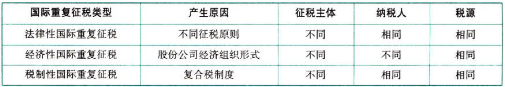

C01.税法总论

# 1. 税法概念

## 1.1. 税收与税法的概念:star: 

（1）税收是政府为了满足社会公共需要，凭借`政治权力`，强制、无偿地取得财政收入的一种形式。

税收是国家取得财政收入的一种重要工具，其本质是一种`分配`关系。

国家征税的依据是`政治权力`，它有别于按生产要素进行的分配。

国家课征税款的目的是满足社会`公共`需要。

（2）税法是国家制定的用以调整国家与纳税人之间在征纳税方面的权利及义务关系的法律规范的总称。税法体现为法律这一规范形式，是税收制度的核心内容。

（3）税法具有义务性法规和综合性法规的特点：

从法律性质上看，税法属于`义务`性法规，以规定纳税人的义务为主。

税法具有`综合性`，税法是由税收实体法、程序法等法律法规及行政规章制度组成的综合法律体系，其内容涉及课税的基本内容、征纳双方的权利和义务、税收管理规则、法律责任、解决税务争议的法律规范等。

## 1.2. 税收法律关系:star: :star: :star: 

### 1.2.1. 税收法律关系的构成

主体：一方是代表国家行使征税职责的国家各级`税务机关`、`海关`；另一方是履行纳税义务的`法人`、`自然人`和其他`组织`（按照属地兼属人的原则确定）。

客体：税收法律关系主体的权利、义务所共同指向的对象，即`征税对象`。

内容：是主体所享有的`权利`和所应承担的`义务`，是税收承担关系中最实质的东西，也是税法的灵魂。

### 1.2.2. 税收法律关系的产生、变更与消灭

由税收`法律事实`来决定。税收法律事实分为税收`法律事件`和税收`法律行为`。

### 1.2.3. 税收法律关系的保护

税收法律关系的保护对权利主体双方是`平等`的，同时对其享有权利的保护就是对其承担义务的制约。

## 1.3. 税法与其他法律的关系:star: 

（1）税法与宪法的关系：税法`依据`宪法的原则制定。

（2）税法与民法的关系：民法调整方法的主要特点是平等、等价、有偿；税法调整方法要采用命令、服从的方法。民法与税法不发生冲突时，税法不再另行规定；出现不一致时，一般按`税法`规定纳税。

（3）税法与刑法的关系：调整`范围`不同，违反了税法，并不一定就是刑事犯罪，但违反税法情节严重触及刑律者，将受刑事处罚。

（4）税法与行政法的关系：税法与行政法有着十分密切的联系，税法具有行政法的`一般`特性；但税法又与一般行政法有所不同——税法具有经济`分配`的性质，并且经济利益由纳税人向国家`无偿`单向转移，这是一般行政法所不具备的。

# 2. 税法原则

税法原则包括税法`基本原则`（四项）和税法`适用原则`（六项）。

## 2.4. 税法基本原则

税法基本原则是统领所有税收规范的根本准则，为包括税收立法、执法、司法在内的一切税收活动所必须遵守。

### 2.4.4. 税收法定原则

也称为税收法定主义，是指税法主体的权利义务必须由`法律`加以规定，税法的各类构成要素都必须且只能由法律予以明确。税收法定主义贯穿税收立法和执法的全部领域，其内容包括税收要件法定原则和税务合法性原则。

（1）税收`要件法定`原则

`税种`实施法定——国家对其开征的任何税种都必须由法律对其进行专门确定才能实施

`要素`变动法定——国家对任何税种征税要素的变动都应当按相关法律的规定进行

`征税`要素明确——征税的各个要素不仅应当法定，还应当尽量明确，避免歧义

（2）税务`合法性`原则

立`良`法——在立法的过程中要对法定征收程序加以明确规定，提高工作效率，节约社会成本，尊重并保护税收债务人的程序性权利，促使其提高纳税的意识

求`善`治——要求征税机关及其工作人员在征税过程中，必须按照税收程序法和税收实体法律的规定来行使自己的职权，履行自己的职责，充分尊重纳税人的各项权利

### 2.4.5. 税收公平原则

一般认为税收公平原则包括税收`横向`公平和`纵向`公平，即税收负担必须根据纳税人的负担能力分配，负组能力相等，税负相同；负担能力不等，税负不同。税收公平原则源于法律上的平等性原则。

### 2.4.6. 税收效率原则

税收效率原则包括两个方面：`经济`效率和`行政`效率。

### 2.4.7. 实质课税原则

是指应根据客观`事实`确定是否符合课税要件，并根据纳税人的其实负担能力决定纳税人的税负，而不能仅考虑相关外观和形式。

## 2.5. 税法适用原则

税法适用原则是指税务行政机关和司法机关运用税收法律规范解决`具体问题`所必须遵循的准则。与税法基本原则相比，税法适用原则含有更多的法律技术性准则，更为具体化。

### 2.5.8. 法律优位原则

其基本含义为法律的效力`高于`行政立法的效力，还可进一步推论为税收行政法规的效力优于税收行政规章的效力；效力低的税法与效力高的税法发生冲突时，效力低的税法是无效的。

### 2.5.9. 法律不溯及既往原则

新法实施后，对新法实施之前人们的行为不得适用新法，而只能`沿用`旧法。

### 2.5.10. 新法优于旧法原则

也称后法`优于`先法原则，即新旧法对同一事项有不同规定时，新法的效力优于旧法。

### 2.5.11. 特别法优于普通法原则

对同一事项两部法律分别订有一般和特别规定时，特别规定的效力`高于`一般规定的效力。本原则打破了税法效力等级的限制，居于特别法地位的级别比较低的税法，其效力可高于作为普通法的级别比较高的税法。

### 2.5.12. 实体从旧、程序从新原则

即实体性税法不具备溯及力，而`程序性`税法在特定条件下具备一定`溯及力`。

### 2.5.13. 程序优于实体原则

即在诉讼发生时，税收程序法`优于`税收实体法，以保证国家课税权的实现。

# 3. 税法要素

## 3.6. 总则

主要包括立法`依据`、立法`目的`、适用`原则`等。各章开篇均有立法目的，可作一般了解。

## 3.7. 纳税义务人:star: 

又称“纳税主体”，是税法规定的直接负有纳税义务的单位和个人。解决的是国家对谁征税的问题。

纳税人有两种基本形式：`自然人`和`法人`。

自然人可划分为居民个人和非居民个人；法人可划分为居民企业和非居民企业，还可按企业的不同所有制性质来进行分类等。

我国的法人主要有四种：`机关法人`、`事业法人`、`企业法人`和`社团法人`。

与纳税人紧密联系的两个概念是代扣代缴义务人和代收代缴义务人。

## 3.8. 征税对象:star: :star: :star: 

征税对象又叫课税对象、征税客体，指税法规定对`什么`征税，是征纳税双方权利义务共同指向的客体或标的物，是区别一种税与另一种税的重要标志。

税基又叫`计税依据`，是据以计算征税对象应纳税款的直接数量依据，它解决对征税对象课税的计算问题，是对课税对象的量的规定。

## 3.9. 税目:star: :star: 

税目是在税法中对征税对象分类规定的具体征税项目，反映具体的征税范围，是对课税对象质的界定。税目体现征税的`广度`。

## 3.10. 税率:star: :star: :star: 

指对征税对象的征收比例或征收程度。

税率是计算税额的尺度，也是衡量税负轻重与否的重要标志。税率体现征税的`深度`。我国现行的税率主要有：

| 税率类别     | 具体形式                                                                                                                                                   | 应用的税种                     |
|--------------|------------------------------------------------------------------------------------------------------------------------------------------------------------|--------------------------------|
| 比例税率     | (单一\\差别\\幅度)比例税率                                                                                                                                 | 增值税、城建税、企业所得税等   |
| 定额税率     | 按征税对象确定的计算单位，直接规定固定的税额                                                                                                               | 城镇土地使用税、车船税等       |
| 超额累进税率 | 把征税对象按数额大小分成若干等级，每一等级规定一个税率，税率依次提高，将纳税人的征税对象依所属等级同时适用几个税率分别计算，再将计算结果相加后得出应纳税款 | 个人所得税的综合所得、经营所得 |
| 超率累进税率 | 以征税对象数额的相对率划分若干级距，分别规定相应的差别税率，相对率每超过一个级距的，对越过的部分就按高一级的税率计算征税                                   | 土地增值税                     |
| 全额累进税率 | （我国目前没有采用）                                                                                                                                       | \-                             |
| 超倍累进税率 | （我国目前没有采用）                                                                                                                                       | \-                             |

## 3.11. 纳税环节

指税法规定的征税对象在从生产到消费的流转过程中应当缴纳税款的环节。要掌握`生产`、`批发`、`零售`、`进出口`等各个环节上的税种分布。

## 3.12. 纳税期限:star: :star: 

指税法规定的关于税款缴纳时间方面的限定。有三个相关概念：纳税义务`发生`时间、纳税`期限`、缴库`期限`。应掌握各税种纳税期限、结算缴款期限与`滞纳金`计算的关系。

## 3.13. 纳税地点

根据各个税种纳税对象的纳税环节和有利于对税款的`源泉控制`而规定的纳税人（包括代征、代扣、代缴义务人）的具体`申报缴纳`税收的地方。各税种纳税地点的规定都易出客观题。

## 3.14. 减税免税

指对某些纳税人和征税对象采取减少征税或免予征税的`特殊规定`。各章节的减税、免税规定往往存在大量考点。

## 3.15. 罚则

指对纳税人违反税法的行为采取的处罚措施。印花税、征管法等章节都有违章处罚措施的内容。

## 3.16. 附则

主要包括两项内容：一是规定税法的`解释权`，二是规定税法的`生效时间`。后续章节没有特别表述，可作一般了解。

# 4. 税收立法与我国税法体系

## 4.17. 税收立法原则

税收立法是指有权的机关依据一定的程序，遵循一定的原则，运用一定的技术，制定、公布、修改、补充和废止有关税收法律、法规、规章的活动。

［特别提示］税收立法不仅包括对税收法律、法规、规章的制定、公布、修改和补充，也包括对税收法律、法规、规章的`废止`。

税收立法原则：{

`从实际出发`的原则：`公平`原则；`民主`决策的原则；原则性与灵活性相`结合`的原则；法律的`稳定性`、连续性与废、改、立相结合的原则。

}

## 4.18. 税收立法权及其划分

关于税收立法权划分的三个要点：

（1）立法权可以授予某级政府，行政上的执行权给予另一级——我国的税收立法权的划分就属于这种模式。

（2）中央税、中央与地方共享税以及全国统一实行的地方税的立法权集中在`中央`。

（3）地区性地方税收的立法权应只限于`省级`立法机关或经省级立法机关授权同级政府，不能层层下放。

## 4.19. 税收立法机关

我国制定税收法律、法规和规章的机关不同，其法律级次也不同：

（1）`全国人大及常委会`制定的税收法律。

除《宪法》外，在税法体系中，税收法律具有最高的法律效力。例如：《企业所得税`法`》《个人所得税法》《车辆购置税法》《船舶吨税法》《税收征收管理法》《车船税法》《环境保护税法》《烟叶税法》《耕地占用税法》《资源税法》

（2）`全国人大及常委会授权国务院`制定的暂行规定或条例。

属于准法律。具有国家法律的性质和地位，其法律效力高于行政法规，为待条件成熟上升为法律做好准备。例如：《中华人民共和国增值税`暂行`条例》等。

（3）`国务院`制定的税收行政法规。

在中国法律形式中处于低于宪法、法律，高于地方法规、部门规章、地方规章的地位，在全国普遍适用。例如：《中华人民共和国企业所得税法`实施`条例》《中华人民共和国税收征收管理法`实施`细则》等。

（4）地方人大及常委会制定的税收地方性法规。

目前仅限于海南省、民族自治地区。

（5）国务院税务主管部门制定的税收部门规章。

国务院税务主管部门指财政部、国家税务总局和海关总署。该级次规章不得与宪法、税收法律、行政法规相抵触。例如：《增值税暂行条例`实施细则`》。

（6）地方政府制定的税收地方规章。

在税收法律、法规明确授权的前提下进行，不得与税收法律、行政法规相抵触。例如：城建税、房产税等地方性税种的实施细则等。

## 4.20. 税收立法程序

税收立法程序主要包括三个阶段：（1）`提议`阶段；（2）`审议`阶段；（3）`通过`和公布阶段。

## 4.21. 我国现行税法体系

税法体系就是通常所说的税收制度。一个国家的税收制度，可按构成方法和形式分为`简单型`税制及`复合型`税制。

税法体系中各税法按基本内容和效力、职能作用、征收对象、权限范围的不同，可分为不同类型。

按照税法的基本内容和效力的不同，可分为税收`基本法`和税收`普通法`。

按照税法的职能作用的不同，可分为税收`实体`法和税收`程序`法。其中，税收实体法按照税法相关税种征收对象的不同，可分为商品和劳务税税法，所得税税法，财产、行为税税法，资源税及环境保护税税法以及特定目的税税法。

按照主权国家行使`税收管辖权`的不同，可分为国内税法、国际税法。

# 5. 税收执法

税法的实施即税法的执行。它包括税收执法和守法两个方面：一方面，执法机关和人员要依法执法；另一方面，征纳双方都要守法。由于税法具有多层次的特点，在税收执法过程中，对其适用性或法律效力的判断，一般按以下原则掌握：

（1）层次高的法律优于层次低的法律；

（2）同一层次的法律中特别法优于普通法；

（3）国际法`优于`国内法；

（4）实体法从旧、程序法从新。

税收执法权具体包括税款征收管理权、税务稽查权、税务检查权、税务行政复议裁决权及其他税务管理权。

## 5.22. 税务机构设置与职能

2018年，根据我国经济和社会发展及推进国家治理体系和治理能力现代化的需要，对国税地税征管体制进行了改革。现行税务机构设置是`中央政府设立国家税务总局`（正部级），原有的省及省以下国税地税机构两个系统通过合并整合，统一设置为省、市、县三级`税务局`，实行以国家税务总局为主与省（自治区、直辖市）人民政府`双重领导`管理体制。

国家税务总局主要职能：

（1）具体`起草`税收法律法规草案及实施细则并提出税收政策建议，与财政部共同上报和下发，制订贯彻落实的措施。负责对税收法律法规执行过程中的征管和一般性税政问题进行解释，事后向财政部备案。

（2）承担组织实施税收及法律法规规定的`基金`（费）的征收管理责任，力争税款应收尽收。

（3）参与研究`宏观经济`政策、中央与地方的税权划分并提出完善分税制的建议，研究税负总水平并提出运用税收手段进行宏观调控的建议。

（4）负责组织实施税收`征收管理体制`改革，起草税收征收管理法律法规草案并制定实施细则，制定和监督执行税收业务、征收管理的规章制度，监督检查税收法律法规、政策的贯彻执行。

（5）负责规划和组织实施`纳税服务`体系建设，制定纳税服务管理制度，规范纳税服务行为，制定和监督执行纳税人权益保障制度，保护纳税人合法权益，履行提供便捷、优质、高效纳税服务的义务，组织实施税收宣传，拟订税务师管理政策并监督实施。

（6）组织实施对纳税人进行分类管理和`专业化`服务，组织实施对大型企业的纳税服务和税源管理。

（7）负责编报税收收入中长期`规划`和年度计划，开展税源调查，加强税收收入的分析预测，组织办理税收减免等具体事项。

（8）负责制定税收管理`信息化`制度，拟订税收管理信息化建设中长期规划，组织实施金税工程建设。

（9）开展税收领域的`国际交流`与合作，参加国家（地区）间税收关系谈判，草签和执行有关的协议、协定。

（10）办理`进出口`商品的税收及出口退税业务。

（11）对全国税务系统实行`垂直管理`，协同省级人民政府对省级税务局实行双重领导。

（12）承办国务院交办的`其他`事项。

党的十丸届三中全会审议通过的《中共中央关于深化党和国家机构改革的决定》《深化党和国家机构改革方案》和第十三届全国人民代表大会第一次会议批准的《国务院机构改革方案》明确“将省级和省级以下国税地税机构合并，具体承担所辖区域内的各项税收、非税收入征管等职责；将基本养老保险费、基本医疗保险费、失业保险费等各项社会保险费交由`税务部门`统一征收；国税地税机构合并后，实行以国家税务总局为主与省（区、市）人民政府双重领导管理体制”。目前国税地税征管体制改革正在稳步推进中，国家税务总局机构职能、组织机构有关信息待新“三定”规定明确后更新。

## 5.23. 税收征收管理范围划分

目前，我国的税收分别由税务、海关等系统负责征收管理。

| 征管主体                      | 负责征管的税种                                                                                                                                                       |
|-------------------------------|----------------------------------------------------------------------------------------------------------------------------------------------------------------------|
| 税务系统 （国家税务总局系统） | 增值税；消费税；车辆购置税；城市维护建设税；企业所得税；个人所得税；资源税；城镇土地使用税；耕地占用税；土地增值税；房产税；车船税；印花税：契税；烟叶税：环统保护税 |
| 海关                          | 关税；船舶吨税；代征进出口环节的增值税、消费税                                                                                                                       |

## 5.24. 税收收入划分

1.我国分税制财政管理体制将税收收入划分为中央政府固定收入、地方政府固定收入和中央政府与地方政府共享收入。全面“营改增”后，增值税收入（不含进口环节海关代征的部分）划分进行了试点调整，中央政府分享50%，地方政府分享50%。考生应把握税收收入的基本划分规则。

2.根据国发〔2017〕56号规定：在中华人民共和国领域和中华人民共和国管辖的其他海域，直接向环境排放应税污染物的企业事业单位和其他生产经营者为环境保护税的纳税人，应当依法缴纳环境保护税。为促进各地保护和改善环境、增加环境保护投入，国务院决定，环境保护税全部作为地方收入。

| 收入划分 | 税种                                                                                                       |
|----------|------------------------------------------------------------------------------------------------------------|
| 中央收入 | 车辆购置税；消费税；关税；进口环节海关代征的(消费税+增值税)；证券交易印花税；海洋石油企业资源税         |
| 央地共享 | 增值税；城市维护建设税；企业所得税；个人所得税（除储蓄存款利息所得的个人所得税外）                      |
| 地方收入 | 房产税；城镇土地使用税；耕地占用税；土地增值税；车船税；契税；烟叶税；环境保护税；其他印花税；其他资源税|

# 6. 税务权利与义务

## 6.25. 税务行政主体（税务机关和税务人员）

### 6.25.14. 权利

（1）负责税收`征收`管理工作

（2）税务机关依法执行`职务`，任何单位和个人不得阻挠

### 6.25.15. 义务

（1）税务机关应当广泛`宣传`税收法律、行政法规，普及纳税知识，无偿地为纳税人提供纳税`咨询`服务

（2）税务机关应当加强队伍建设，提高税务人员的政治`业务`素质

（3）税务机关、税务人员必须`秉公执法`、忠于职守、清正廉洁、礼貌待人、文明服务，尊重和保护纳税人、扣缴义务人的权利，依法`接受监督`

（4）税务人员不得`索贿受贿`、彻私舞弊、玩忽职守，不征或者少征应征税款；不得滥用职权多征税款或者故意刁难纳税人和扣缴义务人

（5）各级税务机关应当建立、健全内部`制约`和`监督`管理制度

（6）上级税务机关应当对下级税务机关的执法活动依法进行`监督`

（7）各级税务机关应当对其工作人员执行法律、行政法规和廉洁白律准则的情况进行`监督`检查

（8）税务机关负责征收、管理、稽查，行政复议人员的`职责`应当明确，并相互分离、相互制约

（9）税务机关应为检举人`保密`，并按照规定给予奖励

（10）税务人员在核定应纳税额、调整税收定额、进行税务检查、实施税务行政处罚、办理税务行政复议时，与纳税人、如缴义务人或者其法定代表人、直接责任人有下列关系之一的，应当`回避`：①夫妻关系；②直系血亲关系；③三代以内旁系血亲关系；④近姻亲关系；⑤可能影响公正执法的其他利益关系

## 6.26. 纳税人、扣缴义务人

### 6.26.16. 权利

（1）纳税人、扣缴义务人有权向税务机关`了解`国家税收法律、行政法规的规定以及与纳税程序有关的情况

（2）纳税人、扣缴义务人有权要求税务机关为纳税人、扣缴义务人的情况`保密`。税务机关应当为纳税人、扣缴义务人的情况保密。纳税人、拍缴义务人的税收违法行为不属于保密范围

（3）纳税人依法享有`申请`减税、免税、退税的权利

（4）纳税人、扣缴义务入对税务机关所作出的决定，享有陈述权、申辩权；依法享有申请行政复议、提起行政诉讼、请求国家赔偿等`权利`

（5）纳税人、扣缴义务人有权`控告`和`检举`税务机关、税务人员的违法违纪行为

### 6.26.17. 义务

（1）纳税人、扣缴义务人必须依照法律、行政法规的规定`缴纳税款`、代扣代缴、代收代缴税款

（2）纳税人、知缴义务人和其他有关单位应当按照国家有关规定如实向税务机关提供与纳税和代扣代缴、代收代缴税款有关的`信息`

（3）纳税人、扣缴义务人必须接受税务机关依法进行的`税务检查`

## 6.27. 地方各级人民政府、有关部门和单位

### 6.27.18. 权利

（1）地方各级人民政府应当依法加强对本行政区域内税收征收管理工作的`领导`或者`协调`，支持税务机关依法执行职务，依照法定税率计算税额，依法征收税款

（2）各有关部门和单位应当`支持`、协助税务机关依法执行职务

（3）任何单位和个人都有权`检举`违反税收法律、行政法规的行为

### 6.27.19. 义务

（1）任何机关、单位和个人不得`违反`法律、行政法规的规定，擅自作出税收开征、停征以及减税、免税、退税、补税和其他与税收法律、行政法规相抵触的决定

（2）收到违反税收法律、行政法规行为检举的机关和负资查处的机关应当为检举人`保密`

## 6.28. 发展涉税专业服务促进税法遵从

涉税专业服务是指涉税`专业机构`接受委托，利用专业知识和技能，就涉税事项向委托人提供的税务代理等服务。涉税专业服务机构是指税务师事务所和从事涉税专业服务的会计师事务所、律师事务所、代理记账机构、税务代理公司、财税类咨询公司等机构。

### 6.28.20. 涉税专业服务机构涉税业务内容

（1）纳税`申报`代理。对纳税人、扣缴义务人提供的资料进行归集和专业判断，代理纳税人、扣缴义务人进行纳税申报准备和签署纳税申报表、扣缴税款报告表以及相关文件。

（2）一般税务`咨询`。对纳税人、扣缴义务人的日常办税事项提供税务咨询服务。

（3）专业税务`顾问`。对纳税人、扣缴义务人的涉税事项提供长期的专业税务顾问服务。

（4）税收`策划`。对纳税人、扣缴义务人的经营和投资活动提供符合税收法律法规及相关规定的纳税计划、纳税方案。

（5）涉税`鉴证`。按照法律、法规以及依据法律、法规制定的相关规定要求，对涉税事项真实性和合法性出具鉴定和证明。

（6）纳税情况`审查`。接受行政机关、司法机关委托，依法对企业纳税情况进行审查，作出专业结论。

（7）`其他`税务事项代理。接受纳税人、扣缴义务人的委托，代理建账记账、发票领用、减免退税申请等税务事项。

（8）`其他`涉税服务。

### 6.28.21. 税务机关对涉税专业服务机构实施监管内容

（1）税务机关应当对税务师事务所实施行政`登记`管理。

（2）税务机关对涉税专业服务机构及其从事涉税服务人员进行`实名制`管理。

（3）税务机关应当建立业务`信息采集`制度，利用现有的信息化平台分类采集业务信息，加强内部信息共亭，提高分析利用水平。

（4）税务机关对涉税专业服务机构从事涉税专业服务的执业情况进行`检查`，根据举报、投诉情况进行调查。

（5）税务机关应当建立`信用评价`管理制度，对涉税专业服务机构从事涉税专业服务情况进行信用评价，对其从事涉税服务人员进行信用记录。

（6）税务机关应当加强对税务师行业协会的`监督指导`，与其他相关行业协会建立工作联系制度。

（7）税务机关应当在门户网站、电子税务局和办税服务场所`公告`纳入监管的涉税专业服务机构名单及其信用情况，同时公告未经行政登记的税务师事务所名单。

（8）税务机关应当为涉税专业服务机构提供便捷的`服务`，依托信息化平台为信用等级高的涉税专业服务机构开展批量纳税申报、信息报送等业务提供便利化服务。

# 7. 国际税收关系

## 7.29. 国际重复征税与国际税收协定

国际税收是指两个或两个以上的主权国家或地区，各自基于其课税主权，在对跨国纳税人进行分别课税而形成的征纳关系中，所发生的国家或地区之间的`税收分配`关系。

### 7.29.22. 税收管辖权

国际税收分配关系中的一系列矛盾的产生都与税收`管辖权`有关。税收管辖权属于国家主权在税收领域中的体现，是一个主权国家在征税方面的主权范围。税收管辖权划分原则有`属地`原则和`属人`原则两种。

### 7.29.23. 国际重复征税

#### 7.29.23.1. 国际重复征税的概念和类型

国际重复征税是指两个或两个以上国家对同一跨国纳税人的同一征税对象进行分别课税所形成的交叉重叠征税，又称为国际双重征税。

国际重复征税有狭义和广义之分。狭义的国际重复征税强调被重复征税的纳税主体与征税对象都具有同一性。广义的国际重复征税则在狭义基础上还包括纳税主体与征税对象具有非同一性时所发生的国际重复征税，以及因对同一笔所得或收入的确定标准和计算方法的不同所引起的国际重复征税。

国际重复征税一般包括`法律`性国际重复征税（A国征+B国征）、`经济性`国际重复征税（先A税后B税）、`税制`性国际重复征税（又A税又B税）。国际税收中所指的国际重复征税一般属于法律性国际重复征税。

#### 7.29.23.2. 产生国际重复征税的前提条件和根本原因

纳税人所得或收益的`国际化`和各国所得税制的`普遍化`是产生国际重复征税的前提条件。

各国行使的税收`管辖权`的重叠是国际重复征税的根本原因。

国际重复征税产生的形式：{

（1）`居民`（公民）管辖权同`地域`管辖权的重叠

（2）`居民`（公民）管辖权与`居民`（公民）管稽权的重叠

（3）`地域`管辖权与`地域`管辖权的重叠

}

### 7.29.24. 国际税收协定

国际税收协定是指两个或两个以上的主权`国家`为了协调相互间在处理跨国纳税人征税事务和其他有关方面的税收关系，本着对等原则，经由政府谈判所签订的一种书面协议或条约，也称为国际税收条约。

国际税收协定是以国内税法为基础的。在国际税收协定与其他国内税法的地位关系上，有两种模式：模式一是国际税收协定`优于`国内税法；模式二是国际税收协定与国内税法效力`等同`，在出现冲突时按照“新法优于旧法”和“特别法优于普通法”等处理法律冲突的一般性原则来协调。

国际双重征税的`免除`是签订国际税收协定的重要内容，也是国际税收协定的首要任务。缔约国各方对避免或免除国际双重征税所采取的方法和条件，以及同意给予饶让抵免的范围和程度，都必须要在协定中明确规定，而不论缔约国各方在其国内税法中有无免除重复征税方法的规定。一般常用的方法有免税法、抵免法等，使用哪种方法要在协定中明确，并保持双方协调一致。

## 7.30. 国际避税、反避税与国际税收合作

各国政府以及国际社会不仅要采取措施避免所得的国际重复征税，而且也要采取措施防范跨国纳税人的国际避税。

国际避税是指纳税人利用两个或两个以上国家的税法和国家间的税收协定的`漏洞`、特例和缺陷，规避或`减轻`其全球总纳税义务的行为。在国外，“避税”与“税务筹划”或“合法节税”基本上是一个概念，它们都是指纳税人利用税法的漏洞或不明之处，规避或减少纳税义务的一种不违法的行为。

2013年8月27日，中国签署《多边税收征管互助公约》，成为该公约的第56个签约方。

2015年12月16日，我国签署《金融账户涉税信息自动交换多边主管当局间协议》（以下简称《协议》），该协议依据经合组织于2014年发布，并经当年G20布里斯班峰会核准的《金融账户涉税信息自动交换标准》中的主管当局间协议范本。

2017年6月7日，我国与德英法印俄等全球66个国家或地区共同签署了《实施税收协定相关措施以防止税基侵蚀和利润转移（BEPS）的多边公约》（以下简称《BEPS公约》）。《BEPS公约》是全球首个对所得税税收协定进行多边协调的法律文件，为在经济全球化进一步走向深入的世界大环境下，以多边税收合作法律框架的形式增强国际社会相互合作，携手打击和防范跨境逃避税提供了基础设施条件。

# 8. 总结

End。
