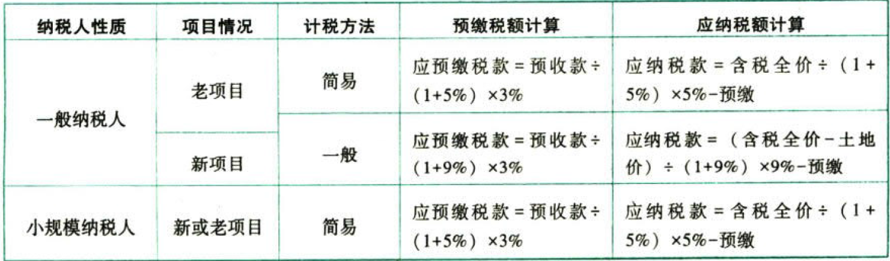

C02.增值税.(房地产开发企业)销售自行开发的(房地产项目)增值税征收管理暂行办法

## 0.1. [房地产开发企业]销售自行开发的[房地产项目]增值税征收管理暂行办法

自行开发，是指在依法取得土地使用权的土地上进行基础设施和房屋建设。

房地产开发企业以接盘等形式购入未完工的房地产项目继续开发后，以自己的名义立项销售的，属于销售自行开发的房地产项目。

### 0.1.1. 销售额的确定

房地产开发企业中的一般纳税人销售自行开发的房地产项目，适用一般计税方法计税，按照取得的全部价款和价外费用，扣除当期销售房地产项目对应的土地价款后的余额计算销售额。销售额的计算公式如下：

```
销售额＝(全部价款和价外费用－当期允许扣除的土地价款)/(1+9%)
当期允许扣除的土地价款＝(当期销售房地产项目建筑面积/房地产项目可供销售建筑面积）×支付的土地价款
```
当期销售房地产项目建筑面积，是指当期进行纳税申报的增值税销售额对应的建筑面积.

房地产项目可供销售建筑面积，是指房地产项目可以出售的总建筑面积，不包括销售房地产项同时未单独作价结算的配套公共设施的建筑面积。

支付的土地价款，是指向政府、土地管理部门或受政府委托收取土地价款的单位直接支付的土地价款。

向政府部门支付的土地价款，包括土地受让人向政府部门支付的征地和拆迁补偿费用，土地前期开发费用和土地出让收益等。

在计算销售额时从全部价款和价外费用中扣除土地价款，应当取得省级以上（含省级）财政部门监（印）制的财政票据。

一般纳税人应建立台账登记土地价款的扣除情况，扣除的土地价款不得超过纳税人实际支付的土地价款。

### 0.1.2. 房地产老项目

一般纳税人销售自行开发的房地产老项目，可以选择适用简易计税方法按照5%的征收率计税。一经选择简易计税方法计税的，36个月内不得变更为一般计税方法计税。

房地产老项目，是指：

（1）《建筑工程施工许可证》注明的合同开工日期在2016年4月30日前的房地产项目；

（2）《建筑工程施工许可证》未注明合同开工日期或者未取得《建筑工程施工许可证》，但建筑工程承包合同注明的开工日期在2016年4月30日前的建筑工程项目。

一般纳税人销售自行开发的房地产老项目适用简易计税方法计税的，以取得的全部价款和价外费用为销售额，不得扣除对应的土地价款。

### 0.1.3. 预缴税款

一般纳税人采取`预收款方式`销售自行开发的房地产项目，应在收到预收款时按照3%的预征率预缴增值税。

```
应预缴税额＝预收款/(1+适用税率或征收率)×3%
```
适用一般计税方法计税的，按照9%的税率计算；造用简易计税方法计税的，按照5%的征收率计算。

一般纳税人应在取得预收款的`次月纳税申报期`向主管税务机关预缴税款。

### 0.1.4. 进项税额

一般纳税人销售自行开发的房地产项目，兼有一般计税方法计税、简易计税方法计税、免征增值税的房地产项目而无法划分不得抵扣的进项税额的，应以《建筑工程施工许可证》注明的“建设规模”为依据进行划分。

```
不得抵扣的进项税额＝当期无法划分的全部进项税额×(简易计税、免税房地产项目建设规模/房地产项目总建设规模)
```
### 0.1.5. 纳税申报

一般纳税人销售自行开发的房地产项目适用一般计税方法计税的，应按照“营改增通知”第四十五条规定的纳税义务发生时间，以当期销售额和9%的适用税率计算当期应纳税额，抵减已预缴税款后，向主管税务机关申报纳税。未抵减完的预缴税款可以结转下期继续抵减。

一般纳税人销售自行开发的房地产项目适用简易计税方法计税的，应按照“营改增通知”第四十五条规定的纳税义务发生时间，以当期销售额和5%的征收率计算当期应纳税额，抵减已预缴税款后，向主管税务机关申报纳税。未抵减完的预缴税款可以结转下期继续抵减。

### 0.1.6. 发票开具

一般纳税人销售自行开发的房地产项目，`自行开具增值税发票`。

一般纳税人销售自行开发的房地产项目，其2016年4月30日前收取并已向主管税务机关申报缴纳营业税的预收款，未开具营业税发票的，可以开具增值税普通发票，不得开具增值税专用发票。

一般纳税人向其他个人销售自行开发的房地产项目，不得开具增值税专用发票。


