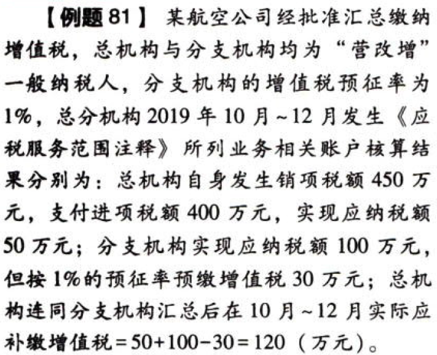

C02.增值税.(营改增)[汇总纳税]管理办法

## 0.1. “营改增”[汇总纳税]管理办法

经财政部和国家税务总局批准的`总机构试点纳税人`及其`分支机构`，按照《总分机构试点纳税人增值税计算缴纳暂行办法》的规定计算缴纳增值税。

### 0.1.1. 总机构汇总抵减

总机构应当`汇总计算`总机构及其分支机构发生“营改增”业务的应缴增值税，抵减分支机构发生“营改增”业务已缴纳的增值税税款（包括预缴和补缴的增值税税款）后，在`总机构所在地`解缴入库。

总机构销售货物、提供加工修理修配劳务，按照增值税暂行条例及相关规定`就地`申报缴纳增值税。

### 0.1.2. 相关项目的计算方法

（1）总机构汇总的应征增值税销售额，为总机构及其分支机构发生`《应税服务范围注释》`所列业务的应征增值税销售额的合计数。

（2）总机构汇总的销项税额，按照总机构汇总的应征增值税销售额合计数和增值税适用税率计算。

（3）总机构汇总的进项税额，为总机构及其分支机构因发生`《应税服务范围注释》`所列业务而购进货物或者接受加工修理修配劳务和应税服务，支付或者负担的增值税税额。即汇总的进项税额不包括总机构及其分支机构用于发生`《应税服务范围注释》`所列业务之外的进项税额。

（4）总机构汇总应缴纳的增值税＝汇总的销项税额－汇总的进项税额－分支机构发生《应税服务范围注释〉所列业务巳缴纳的增值税税款

### 0.1.3. 分支机构

分支机构发生《应税服务范围注释》所列业务，按照应征增值税销售额和`预征率`计算缴纳增值税。计算公式为：应预缴的增值税＝应征增值税销售额×预征率

具体“营改增”总分机构试点纳税人应预缴增值税的计算公式如下：

```
航空运输企业分支机构预缴的增值税＝销售额×预征率
邮政企业分支机构预徽的增值税＝（销售额+`预订款`）×预征率
铁路运输企业分支机构预缴的增值税＝（销售额－`铁路建设基金`）×预征率
```
### 0.1.4. 结转下期

分支机构发生`《应税服务范围注释》`所列业务当期已预缴的增值税税款，在总机构汇总的当期增值税应纳税额中抵减不完的，可以结转下期继续抵减。

### 0.1.5. 每年清算

每年的第一个`纳税申报期`结束后，对上一年度总分机构汇总纳税情况进行`清算`。总机构和分支机构年度清算应交增值税，按照`各自销售收入占比`和总机构汇总的上一年度应交增值税税额计算。分支机构预缴的增值税超过其年度清算应交增值税的，通过`暂停`以后纳税申报期`预缴`增值税的方式予以解决。分支机构预缴的增值税小于其年度清算应交增值税的，差额部分在以后纳税申报期由分支机构在预增值税时`一并就地补缴`入库。

按照`《总分机构试点纳税人增值税计算缴纳暂行办法》`要求，总分机构试点纳税人除了需要将应税服务与销售货物、提供加工修理修配劳务的销售额、销项税额、进项税额以及应纳税额、分支机构已纳（含预缴和补缴的）税额进行分别核算外，还应当将应税服务按适用的`不同税率`（增值税基本税率和两档低税率）分别核算，再由总机构汇总计算应税服务应缴纳的增值税税额。


