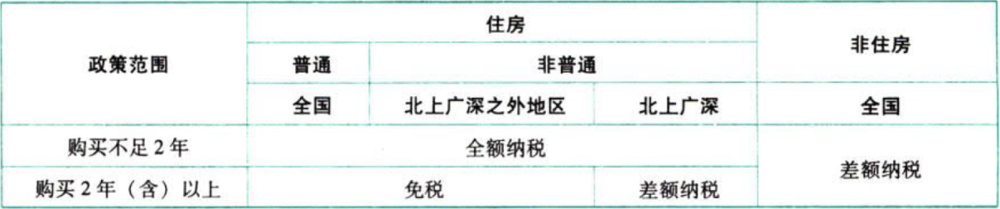

C02.增值税.(营改增通知)和有关部门规定的税收优惠政策

## 0.1. “营改增通知”+有关部门.规定的税收优惠政策:star: :star: 

### 0.1.1. 下列项目免征增值税

#### 0.1.1.1. 专项民生服务

（1）托儿所、幼儿园提供的保育和教育服务。

（2）养老机构提供的养老服务。

（3）残疾人福利机构提供的育养服务。

（4）婚姻介绍服务。

（5）殡葬服务。

（6）医疗机构提供的医疗服务。

医疗机构接受其他医疗机构委托，按照不高于地（市）级以上价格主管部门会同同级卫生主管部门及其他相关部门制定的医疗服务指导价格（包括政府指导价和按照规定由供需双方协商确定的价格等），提供《全国医疗服务价格项目规范》所列的各项服务，自2019年2月1日至2020年12月31日，免征增值税。

（7）家政服务企业由员工制家政服务员提供家政服务取得的收入。

#### 0.1.1.2. 符合规定的教育服务

（1）从事学历教育的学校提供的教育服务。

（2）政府举办的从事学历教育的高等、中等和初等学校（不含下属单位），举办进修班、培训班取得的全部归该学校所有的收入。

（3）政府举办的职业学校设立的主要为在校学生提供实习场所、并由学校出资自办、由学校负责经营管理、经营收入归学校所有的企业，从事《销售服务、无形资产或者不动产注释》中“现代服务”（不含融资租赁服务、广告服务和其他现代服务）、“生活服务”（不含文化体育服务、其他生活服务和桑拿、氧吧）业务活动取得的收入。

（4）境外教育机构与境内从事学历教育的学校开展中外合作办学，提供学历教育服务取得的收入免征增值税。

#### 0.1.1.3. 特殊群体提供的应税服务

（1）残疾人员本人为社会提供的服务。

（2）学生勤工俭学提供的服务。

#### 0.1.1.4. 农业

农业机耕、排灌、病虫害防治、植物保护、农牧保险以及相关技术培训业务，家禽、牲畜、水生动物的配种和疾病防治。

动物诊疗机构提供的动物疾病预防、诊断、治疗和动物绝育手术等动物诊疗服务，属于“家禽、牲畜、水生动物的配种和疾病防治”。（新增）

动物诊疗机构销售动物食品和用品，提供动物清洁、美容、代理看护等服务，应按照现行规定缴纳增值税。

#### 0.1.1.5. 文化和科普类服务

（1）纪念馆、博物馆、文化馆、文物保护单位管理机构、美术馆、展览馆、书画院、图书馆在自己的场所提供文化体育服务取得的第一道门票收入。

（2）寺院、宫观、清真寺和教堂举办文化、宗教活动的门票收入。

（3）个人转让著作权。

#### 0.1.1.6. 特殊运输相关的服务

（1）台湾航运公司、航空公司从事海峡两岸海上直航、空中直航业务在大陆取得的运输收入。

（2）纳税人提供的直接或者间接国际货物运输代理服务。

（3）青藏铁路公司提供的铁路运输服务。

#### 0.1.1.7. 以下利息收入

（1）国家助学贷款。

（2）国债、地方政府债。

（3）人民银行对金融机构的贷款。

（4）住房公积金管理中心用住房公积金在指定的委托银行发放的个人住房贷款。

（5）外汇管理部门在从事国家外汇储备经营过程中，委托金融机构发放的外汇贷款。

（6）统借统还业务中，企业集团或企业集团中的核心企业以及集团所属财务公司按不高于支付给金融机构的借款利率水平或者支付的债券票面利率水平，向企业集团或者集团内下属单位收取的利息。

统借方向资金使用单位收取的利息，高于支付给金融机构借款利率水平或者支付的债券票面利率水平的，应`全额`缴纳增值税。

（7）自2018年9月1日至2020年12月31日，对金融机构向小型企业、微型企业和个体工商户发放小额贷款取得的利息收入，免征增值税。

（8）自2018年11月7日起至2021年11月6日止，对境外机构投资境内债券市场取得的债券利息收入暂免征收增值税。

#### 0.1.1.8. 被撤销金融机构

被撤销金融机构以货物、不动产、无形资产、有价证券、票据等财产清偿债务。

#### 0.1.1.9. 保险公司

保险公司开办的一年期以上人身保险产品取得的保费收入。

#### 0.1.1.10. 下列金融商品转让收入

（1）合格境外投资者（QFII）委托境内公司在我国从事证券买卖业务。

（2）替港市场投资者（包括单位和个人）通过沪港通和深港通买卖上海证券交易所和深圳证券交易所上市A股；内地投资者（包括单位和个人）通过沪港通买卖香港联交所上市股票。

（3）对香港市场投资者（包括单位和个人）通过基金互认买卖内地基金份额。

（4）证券投资基金（封闭式证券投资基金，开放式证券投资基金）管理人运用基金买卖股票、债券。

（5）个人从事金融商品转让业务。

（6）社保基金会、社保基金投资管理人在运用社保基金投资过程中，提供贷款服务取得的全部利息及利息性质的收入和金融商品转让收入，免征增值税。

（7）个人投资者转让创新企业CDR取得的差价收入。（新增）

所称创新企业CDR，是指符合《国务院办公厅转发证监会关于开展创新企业境内发行股票或存托凭证试点若干意见的通知》（国办发〔2018〕21号）规定的试点企业，以境外股票为基础证券，由存托人签发并在中国境内发行，代表境外基础证券权益的证券。

#### 0.1.1.11. 金融同业往来利息收入

（1）金融机构与人民银行所发生的资金往来业务。包括人民银行对一般金融机构贷款，以及人民银行对商业银行的再贴现等。

（2）银行联行往来业务。是指同一银行系统内部不同行、处之间所发生的资金账务往来业务。

（3）金融机构间的资金往来业务。是指经人民银行批准，进入全国银行间同业拆借市场的金融机构之间通过全国统一的同业拆借网络进行的短期（一年以下含一年）无担保资金融通行为。

#### 0.1.1.12. 担保业务

符合规定条件的担保机构从事中小企业信用担保或者再担保业务取得的收入（不含信用评级、咨询、培训等收入）3年内免征增值税。

#### 0.1.1.13. 非经营性活动或非经营性收入

（1）各党派、共青团、工会、妇联、中科协、青联、台联、侨联收取党费、团费、会费以及政府间国际组织收取会费，属于非经营活动，不征收增值税。

（2）国家商品储备管理单位及其直属企业承担商品储备任务，从中央或者地方财政取得的利息补贴收入和价差补贴收入。

#### 0.1.1.14. 符合条件的合同能源管理服务。

#### 0.1.1.15. 福利影票、体育彩票的发行收入。

#### 0.1.1.16. 军队空余房产租赁

军队空余房产租赁收入（提示：总政治部、总后勤部、军委纪委在2015年进一步从严规范空余房地产租赁管理，根据要求，军以下作战单位今后将不能对空余房地产进行租赁）。

#### 0.1.1.17. 住房类

（1）个人销售自建自用住房。

（2）为了配合国家住房制度改革，企业、行政事业单位按房改成本价、标准价出售住房取得的收入。

#### 0.1.1.18. 土地使用权、自然资源使用权、房屋产权

（1）将土地使用权转让给农业生产者用于农业生产。

（2）土地所有者出让土地使用权和土地使用者将土地使用权归还给土地所有者。

（3）县级以上地方人民政府或自然资源行政主管部门出让、转让或收回自然资源使用权（不含土地使用权）。

（4）涉及家庭财产分割的个人无偿转让不动产、土地使用权。

家庭财产分割，包括下列情形：离婚财产分割；无偿赠与配偶、父母、子女、祖父母、外祖父母、孙子女、外孙子女、兄弟姐妹；无偿赠与对其承担直接抚养或者瞻养义务的抚养人或者赠养人；房屋产权所有人死亡，法定继承人、遗嘱继承人或者受遗赠人依法取得房尾产权。

#### 0.1.1.19. 就业类

（1）随军家属就业。

为安置随军家属就业而新开办的企业，自领取税务登记证之日起，其提供的应税服务3年内免征增值税。

从事个体经营的随军家属，自办理税务登记事项之日起，其提供的应税服务3年内免征增值税。

（2）军队转业干部就业。

从事个体经营的军队转业干部，白领取税务登记证之日起，其提供的应税服务3年内免征增值税。

为安置自主择业的军队转业干部就业而新开办的企业，凡安置自主择业的军队转业干部占企业总人数60%（含）以上的，自领取税务登记证之日起，其提供的应税服务3年内免征增值税。

### 0.1.2. 增值税即征即退

四项经营项目的增值税`实际税负`超过`3%`的部分实行增值税`即征即退`政策。

所称增值税实际税负，是指纳税人当期提供应税销售行为实际缴纳的增值税额占纳税人当期提供应税销售行为取得的不含增值税的全部价款和价外费用的比例。

#### 0.1.2.20. 软件产品

增值税一般纳税人销售其自行开发生产的软件产品，按照增值税基本税率征收增值税后，对其增值税实际税负超过3%的部分实行即征即退政策。

增值税一般纳税人将进口软件产品进行本地化改造后对外销售，其销售的软件产品可享受上述规定的增值税即征即退政策。本地化改造是指对进口软件产品进行重新设计、改进、转换等，单纯对进口软件产品进行汉字化处理不包括在内。

#### 0.1.2.21. 动漫软件

自2018年1月1日至2020年12月31日，对动漫企业增值税一般纳税人销售其自主开发生产的动漫软件，按照增值税基本税率征收增值税后，对其增值税实际税负超过3%的部分，实行即征即退政策。

#### 0.1.2.22. 管道运输服务

一般纳税人提供管道运输服务，对其增值税实际税负超过3%的部分实行增值税即征即退政策。

#### 0.1.2.23. 有形动产融资租赁

经人民银行、银监会或者商务部批准从事融资租赁业务的试点纳税人中的一般纳税人，提供有形动产融资租赁服务和有形动产融资性售后回租服务，对其增值税实际税负超过3%的部分实行增值税即征即退政策。

#### 0.1.2.24. 纳税人享受安置残疾人增值税即征即退优惠政策

纳税人，是指安置残疾人的单位和个体工商户。

纳税人本期应退增值税额按以下公式计算：

```
本期应退增值税额＝本期所含月份每月应退增值税额之和
月应退增值税额＝纳税人本月安置残疾人员人数×本月月最低工资标准的4倍
```
月最低工资标准，是指纳税人所在区县（含县级市、旗）适用的经省（含自治区、直辖市、计划单列市）人民政府批准的月最低工资标准。

纳税人新安置的残疾人从签订劳动合同并缴纳社会保险的次月起计算，其他职工从录用的次月起计算；安置的残疾人和其他职工减少的，从减少当月计算。

### 0.1.3. 扣减增值税规定

#### 0.1.3.25. 退役士兵创业就业

对自主就业退役士兵从事个体经营的，自办理个体工商户登记当月起，在3年（36个月，下同）内按每户每年12000元为限额依次扣减其当年实际应缴纳的增值税、城市维护建设税、教育费附加、地方教育附加和个人所得税。限额标准最高可上浮20%，各省、自治区、直辖市人民政府可根据本地区实际悄况在此幅度内确定具体限额标准。

企业招用自主就业退役士兵，与其签订1年以上期限劳动合同并依法缴纳社会保险费的，自签订劳动合同并缴纳社会保险当月起，在3年内按实际招用人数予以定额依次扣减增值税、城市维护建设税、教育费附加、地方教育附加和企业所得税优惠。定额标准为每人每年6000元，最高可上浮50%，各省、自治区、直辖市人民政府可根据本地区实际情况在此幅度内确定具体定额标准。

#### 0.1.3.26. 重点群体创业就业

建档立卡贫困人口、持《就业创业证》（注明“自主创业税收政策”或“毕业年度内自主创业税收政策”）或《就业失业登记证》（注明“自主创业税收政策”）的人员从事个体经营的，自办理个体工商户登记当月起，在3年（36个月）内按每户每年12000元为限额依次扣减其当年实际应缴纳的增值税、城市维护建设税、教育费附加、地方教育附加和个人所得税。限额标准最高可上浮20%，各省、自治区、直辖市人民政府可根据本地区实际情况在此幅度内确定具体限额标准。

### 0.1.4. 金融企业贷款

金融企业发放贷款后，自结息日起90天内发生的应收未收利息按现行规定缴纳增值税，自结息日起90天后发生的应收未收利息暂不缴纳增值税，待实际收到利息时按规定缴纳增值税。

上述所称金融企业，是指银行（包括国有、集体、股份制、合资、外资银行以及其他所有制形式的银行）、城市信用社、农村信用社、信托投资公司、财务公司。

### 0.1.5. 个人将购买的住房对外销售



if(非住房){差额纳税；}
elseif(购买不满2年){全额纳税；}
elseif(北上广深&&非普通){差额纳税；}
else/\*普通or非一线非普通\*/{免税；}
