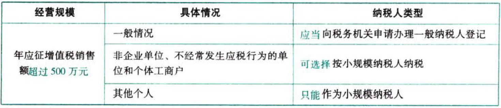
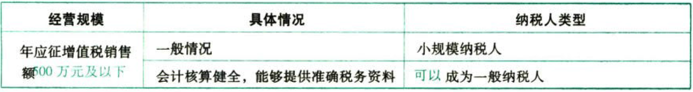

C02增值税.一般纳税人.登记

## 0.1. 一般纳税人+小规模纳税人.登记:star: :star: 

### 0.1.1. 一般纳税人和小规模纳税人.划分标准

#### 0.1.1.1. 基本资格登记标准——年应税销售额

增值税纳税人`年应税销售额`超过财政部、国家税务总局规定的小规模纳税人标准（以下简称“规定标准”）的，应当向其机构所在地主管税务机关办理一般纳税人登记。另有规定除外。

2018年5月1日起，年应税销售额`500万元`（含）以下的，为小规模纳税人。

年应税销售额是不含增值税的销售额。

销售服务、无形资产或者不动产有扣除项目的纳税人，其年应税销售额按`扣除之前`的销售额计算。

年应税销售额，是指纳税人自主续不超过`12个月或四个季度`的经营期内累计应征增值税销售额，包括纳税申报销售额、稽查查补销售额、纳税评估调整销售额。

“纳税申报销售额”是指纳税人自行申报的全部应征增值税销售额，其中包括免税销售额和税务机关代开发票销售额。

“稽查查补销售额”和“纳税评估调整销售额”计入查补税款申报当月（或当季）的销售额，不计入税款所属期销售额。

纳税人`偶然`发生的销售无形资产、转让不动产的销售额，`不计入`年应税销售额。

#### 0.1.1.2. 资格条件

年应税销售额不能达到规定标准但符合资格条件的，`也可`登记成为增值税一般纳税人。目前规定的资格条件：能够按照国家统一的会计制度规定设置账簿，根据合法、有效凭证核算，能够准确提供税务资料。

除国家税务总局另有规定外，一经登记为一般纳税人后，不得转为小规模纳税人。

小规模纳税人在条件达标的情况下应登记成为增值税一般纳税人，不能转为小规模纳税人。国家税务总局另有规定除外。

这里所说的国家税务总局另有规定是特殊规定，例如，2018年5月1日后小规模纳税人标准统一为年应税销售额500万元及以下，一些按照原标准登记的一般纳税人不再符合现行一般纳税人销售额标准的，可在2019年四31日前转登记为小规模纳税人。

#### 0.1.1.3. 例外规定

在增值税一般纳税人资格登记规则中，有一般规定之外的例外规定，包括选择登记、不能登记。

### 0.1.2. 一般纳税人的登记

登记事项由纳税人向其`机构所在地`主管税务机关办理。

#### 0.1.2.4. 登记程序

（1）纳税人向主管税务机关填报`《增值税一般纳税人登记表》`，如实填写固定生产经营场所等信息，并提供税务登记证件

（2）纳税人填报内容与税务登记信息一致的，主管税务机关当场登记

（3）纳税人填报内容与税务登记信息不一致，或者不符合填列要求的，税务机关应当场告知纳税人需要补正的内容

#### 0.1.2.5. 登记时限

纳税人在年应税销售额超过规定标准的月份（或季度）的所属`申报期`结束后`15日`内按照规定办理资格登记手续；未按规定时限办理的，主管税务机关应当在规定时限结束后`5日`内制作`《税务事项通知书》`，告知纳税人应当在`5日`内向主管税务机关办理相关手续。

逾期仍不办理的，次月起按销售额依照增值税税率计算应纳税额，不得抵扣进项税额，直至纳税人办理相关手续为止。

#### 0.1.2.6. 登记生效

登记生效之日，是指纳税人办理登记的`当月1日或次月1日`，由纳税人在办理登记手续时自行选择。

纳税人自一般纳税人生效之日起，按照增值税一般计税方法计算应纳税额。
