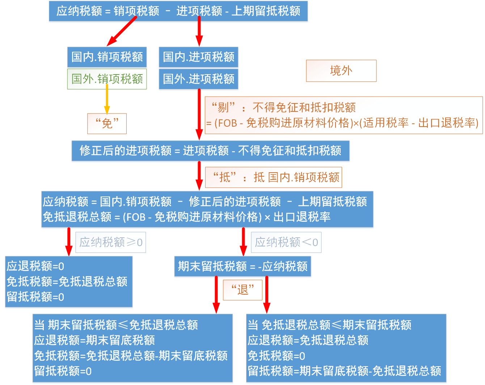
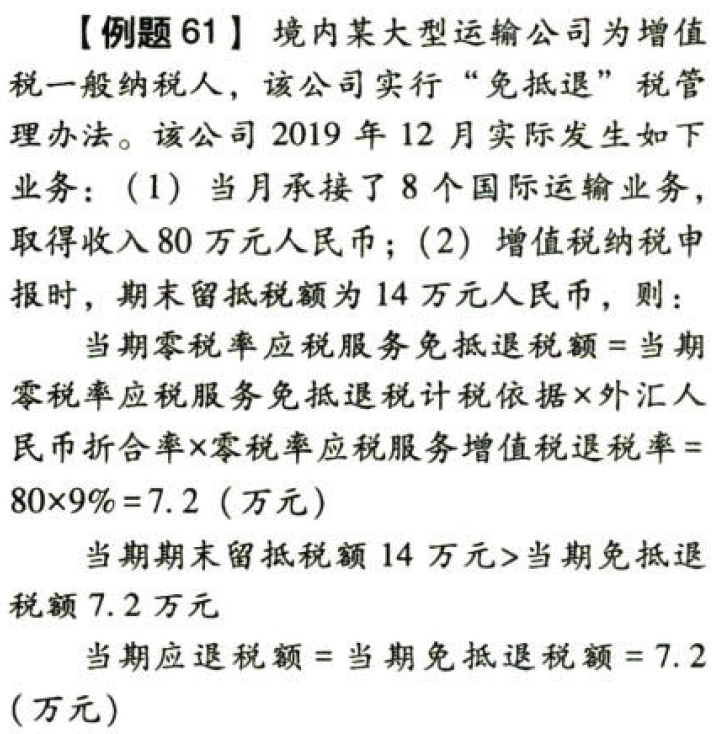
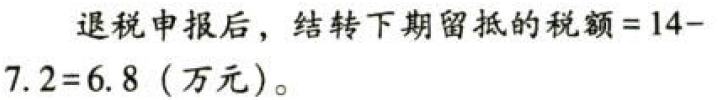

C02.增值税.增值税免抵退税和免退税的计算

### 0.0.1. 增值税免抵退税和免退税的计算

#### 0.0.1.1. 生产企业.出口货物、劳务.增值税免抵退税

“免”税是指生产企业出口的自产或视同自产货物，`免征`出口环节增值税。

“抵”税是指生产企业出口自产或视同自产货物所耗用的原材料、零部件、燃料、动力等所含应予退还的进项税额，`抵顶`内销货物的应纳税额。

“退”税是指生产企业出口自产或视同自产货物在当月内`应抵顶的进项税额`大于`应纳税额`肘，对未抵顶完的部分予以退税。

在计算免抵退税时，考虑`退税率`低于`征税率`，需要计算当期`不得免征和抵扣税额`，将其从进项税额中`剔除`出去，`转入`出口产品的销售`成本`中（与企业所得税一章衔接），因此，免抵退税计算实际上涉及免、剔、抵、退四个步骤。

`第一步：免`

免征出口环节增值税。出口货物不计销项税额。

`第二步：剔`

```
当期不得免征和抵扣税额＝当期出口货物离岸价格×外汇人民币折合率×（出口货物适用税率－出口货物退税率）－当期不得免征和抵扣税额抵减额
当期不得免征和抵扣税额抵减额＝当期免税购进原材料价格×（出口货物适用税率－出口货物退税率）
```
简化公式：

```
当期不得免征和抵扣税额＝（当期出口货物离岸价格×外汇人民币折合率－当期免税购进原材料价格）×（出口货物适用税率－出口货物退税率）
```
此步骤是为了剔除一部分进项税额，以体现退税率低于征税率的后果。还针对本环节使用免税购进原材料未计过进项税额，而不曾影响增值税进项税额的因素，对不得免征和抵如税额进行修正。

此步骤只存在于退税率`低于`征税率的情况之下，将计算出的差额部分的进项税计入出口货物劳务`成本`。

`第三步：抵`

```
当期应纳税额＝当期内销货物的销项税额－（当期全部进项税额－当期不得免征和抵如税额）－上期留抵税额
```
先用出口应退税额抵顶内销应纳税额，让企业用内销少缴税的方式得到出口退税的实惠。

计算结果如为正数，则是应纳税额，不涉及退税，但涉及免抵；如为负数，则进入下一步骤对比大小并计算应退税额。

`第四步：退`

（1）首先计算免抵退税总额【应退税总额】

```
当期免抵退税额＝当期出口货物离岸价格×外汇人民币折合率×出口货物退税率－当期免抵退税额抵减额
当期免抵退税额抵减额＝当期免税购进原材料价格×出口货物退税率
```
简化公式：

```
当期免抵退税额＝（当期出口货物离岸价格×外汇人民币折合率－当期免税购进原材料价格）×出口货物退税率
```
（2）其次确认出口退税，并确认退税之外的免抵税额

①当期期末留抵税额≤当期免抵退税额时：

```
当期应退税额＝当期期末留抵税额
当期免抵税额＝当期免抵退税额－当期应退税额
```
②当期期末留抵税额＞当期免抵退税额时

```
当期应退税额＝当期免抵退税额
当期免抵税额＝0
```
在计算当期应纳税额的结果＜0时，才会涉及出口退税。

［例题57.单选题］某自营出口的生产企业为增值税一般纳税人，出口货物的征税率为13%，退税率为6%。2019年6月购进原材料一批，取得的增值税专用发票注明金额500万元，税额65万元。6月内销货物取得不含税销售额150万元，出口货物取得销售额折令人民币200万元，上月增值税留抵税额10万元，该企业当期“免、抵、退”税不得免征和抵扣税额为（FOB×（征税率－退税率）=200×(13%－6%)=14）万元。

公式中的剔除和退的步骤中都出现了免税购进原材料价格的因素。为进一步规范生产企业进料加工贸易免抵退税管理，根据国家税务总局公告2013年第12号，自2013年7月1日起，生产企业进料加工免抵退税计算中，采用“实耗法”计算进料加工出口货物耗用的保税进口料件金额，即按照计划分配率和出口货物离岸价计算。

采用“实耗法”的，当期免税购进原材料价格包括当期国内购进的无进项税额且不计提进项税额的免税原材料的价格和当期进料加工保税进口料件的价格，其中当期进料加工保税进口料件的价格为进料加工出口货物耗用的保税进口料件金额，其计算公式为：

当期进料加工出口货物耗用的保税进口料件的金额＝当期进料加工出口货物离岸价×外汇人民币折合率×计划分配率

计划分配率＝计划进口总值/计划出口总值×100%

计算不得免征和抵扣税额时，应按当期全部出口货物的离岸价扣除当期全部进料加工出口货物耗用的保税进口料件金额后的余额乘以征退税率之差计算。

进料加工出口货物收齐有关凭证申报免抵退税时，以收齐凭证的进料加工出口货物人民币离岸价扣除其耗用的保税进口料件金额后的余额计算免抵退税额。

[例题58]某企业签订进料加工复出口货物合同，2019年12月进口料件到岸价格折合人民币300万元，当月将部分完工产品出口，FOB折合人民币400万元。该企业进料加工计划分配率为60%，完工产品适用的增值税枉税率为13%，退税率为6%，则：

进料加工出口货物耗用的保税进口料件金额＝400×60%=240（万元）

当期不得免征和抵扣税额抵减额＝240×(13%-6%)=16.8（万元）

当期不得免征和抵扣税额＝400×（13%-6%)-16.8=11.2（万元）。



免抵税额和留抵税额留要分清，前者是通过免抵退税政策享受到的优惠额（需要计算缴纳`城建税及附加`）；后者是内销进项税额过大导致的应纳增值税负数，留到下期继续抵扣。

出口退税计算时，对于计算出来的当期不得免征和抵扣税额，一方面要作进项税额转出；另一方面要增加出口货物的销售成本，影响损益和企业所得税的计算。

[例题59]2019年12月，A生产企业（增值税一般纳税人）进口货物，海关审定的关税完税价格为500万元人民币，关税税率为10%，海关代征了进口环节的增值税，取得海关进口增值税专用缴款书。从国内市场购进原材料支付的价欲为800万元，取得增值税专朋友票上注明的增值税额为104万元。外销货物的出口渴岸价为1000万元人民币；内销货物的不含税销售额为1100万元。该企业出口货物适用“免抵退”税的税收政策，上期留抵税额50万元。

要求：计算当期应维纳或应退的增值税税额及免抵税额。（假定上述货物均适用13%的增值税税率，出口退税率为9%）

[答案]

（1）计算当期可抵扣的进项税额

进口环节海关代征增值税＝500×(1+I0%)×13%=71.5（万元）

国内采购环节的进项税额为104万元。

出口货物当期不得免征和抵扣税额＝1000×（13%-9%)=40（万元）

上期留抵税额50万元。

当期允许抵扣的进项税额合计＝71.5+104-40+50=185.5（万元）

（2）计算当期销项税额

出口货物免税。

内销货物销项税额＝1100×13%=143（万元）

（3）当期应纳税额＝143-185.5=-42.5（万元）

（4）计算出口货物免抵退税的限额

当期免抵退税额＝1000×9%=90（万元）

由于期未留抵税额42.5万元＜当期免抵退税额90万元

当期应退税额＝42.5（万元）

当期免抵税额＝90-42.5＝47.5（万元）。

［例踵60］2019年12月，A生产企业（增值税一般纳税人）进口货物，海关审定的关税完税价格为500万元，关税税率为10%，海关代征了进口环节的增值税，取得海关进口增值税专用缴款书。进料加工具出口业务保税进口料件一批，到岸价格400万元，海关暂免征税予以放行。从国内市场购进原材料支付的价款为1400万元，取得增值税专用发票上注明的增值税额为182万元。进料加工复出口货物的出口离岸价为1000万元人民币。内销货物的销售额为1100万元（不含税）。该企业出口货物适用“免抵退”税的税收政策，上期留抵税额50万元。

要求：计算当期应缴纳或应退还的增值税税额、先抵税额及实际留到下期抵扣的税额。（该企业进料加工计划分配率为23%;假定上述货物均适用13%的增值税税率，出口退税率为9%）

[答案]

（1）计算当期允许抵扣的进项税额

进口环节海关代征增值税＝500×(1+10%)×13%=71.5（万元）

国内采购环节的进项税额为182万元。

进料加工保税进口料件由于没有缴纳过增值税，放计算不得免征和抵扣税额时不能与纳过税的情况一样对待，需要计算不得免征和抵扣税额抵减额。进料加工出口货物耗用的保税进口料件金额＝1000×23%=230（万元）

出口货物当期不得免征和抵扣税额＝（1000－230）×（13%-9%)=30.8（万元）

上期留抵税额50万元。

当期允许抵扣的进项税额合计＝71.5+182-30.8+50=272.7（万元）

（2）计算当期销项税额

出口货物免税。

内销货物销项税额＝1100×13%=143（万元）

（3）当期应纳税额＝143-272.7=-129.7（万元）

（4）由于进料加工保税进口料件享受了免税的优惠，计算出口货物免抵退税的限额时要扣减进料加工出口货物耗用的保税进口料件金额。当期免抵退税额（限度）＝（1000－230）×9%=69.3（万元）

由于期末留抵税额129.7万元＞当期免抵退税额69.3万元

当期应退税额＝69.3（万元）

当期免抵税额＝0

当期留抵税额＝129.7-69.3=60.4（万元）

#### 0.0.1.2. 零税率应税行为.增值税退（免）税的计算

`零税率`应税行为增值税免抵退税，依下列公式计算：

①当期免抵退税额的计算：

```
当期零税率应税行为免抵退税额＝当期零税率应税行为免抵退税计税依据×外汇人民币折合率×零税率应税行为增值税退税率
```
②当期应退税额和当期免抵税额的计算：

当期期末留抵税额≤当期免抵退税额时

```
当期应退税额＝当期期末留抵税额
当期免抵税额＝当期免抵退税额－当期应退税额
```
当期期末留抵税额＞当期免抵退税额时

```
当期应退税额＝当期免抵退税额
当期免抵税额＝0
```
“当期期末留抵税额”为当期《增值税纳税申报表》的“期末留抵税额”。

由于“营改增”应税行为出口的退税率等于征税率，放在计算出口退税时，没有“剔＂的步骤，只後照“免、抵、退”三个环节计算。所以应税行为出口退税的计算比较简单。





#### 0.0.1.3. 外贸企业.出口货物、劳务和应税行为.增值税免退税

实行免退税办法的退（免）税计税依据为购进业务的增值税专用发票或海关进口增值税专用缴款书上注明的金额。

实行退（免）税办法的服务和无形资产，如果主管税务机关认定出口价格偏高的，有权按照核定的出口价格计算退（免）税，核定的出口价格低于外贸企业购进价格的，低于部分对应的进项税额不予退税，转入成本。

#### 0.0.1.4. 融资租赁出口货物.退税的计算

融资租赁出口货物退税的计算方法与`没有生产能力的外贸企业`出口货物的免退税方法一致。

融资租赁出租方将融资租赁出口货物租赁给境外承租方、将融资租赁海洋工程结构物租赁给海上石油天然气开采企业，向融资租赁出租方退还其购进租赁货物所含增值税。其计算公式如下：

```
增值税应退税额＝购进融资租赁货物的增值税专用发票注明的金额或海关进口增值税专用缴款书注明的完税价格【买价】×融资租赁货物适用的增值税退税率【退税率】
```
融资租赁出口货物适用的精值税退税率，按照统一的出口货物适用退税率执行。从增值税一放纳税人购进的按简易办法征税的融资租赁货物和从小规模纳税人购进的融资租赁货物，其适用的增值税退税率，按照购进货物适用的征收率和退税率`孰低`的原则确定。

【注意】出口企业既有适用增值税免抵退项目，也有增值税即征即退、先征后退项目的，增值税即征即退和先征后退项目`不参与`出口项目免抵退税计算。出口企业应分别核算增值税免抵退项目和增值税即征即退、先征后退项目，并分别申请享受增值税即征即退、先征后退和免抵退税政策。

用于增值税即征即退或者先征后退项目的进项税额无法划分的，按照下列公式计算：

```
无法划分进项税额中用于增值税即征即退或者先征后退项目的部分＝当月无法划分的全部进项税额×当月增值税即征即退或者先征后退项目销售额/当月全部销售额合计
```
实行免抵退税办法的零税率应税行为提供者如同时有货物、劳务（指对外加工修理修配劳务，下同）出口且未分别计算的，可结合现行出口货物免抵退税计算公式一并计算。税务机关在审批时，按照出口货物、劳务、零税率应税行为免抵退税额比例划分出口货物、劳务、零税率应税行为的退税额和免抵税额。
