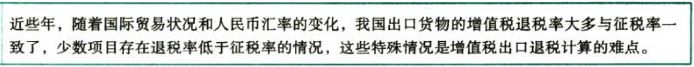

C02.增值税.增值税出口退税率

### 0.0.1. 增值税出口退税率

增值税出口退税在具体计算时分不同情况采用规定的退税率、适用税率、征收率。

#### 0.0.1.1. 一般规定——规定的退税率或适用税率

除财政部和国家税务总局根据国务院决定而明确的增值税出口退税率外，出口货物的退税率为其适用税率。

服务和无形资产的退税率为《增值税暂行条例》中规定的增值税适用税率。

#### 0.0.1.2. 特殊规定

（1）外贸企业购进按简易办法征税的出口货物、从小规模纳税人购进的出口货物，其退税率分别为简易办法实际执行的征收率、小规模纳税人征收率。

上述出口货物取得增值税专用发票的，退税率按照`增值税专用发票上的税率`和`出口货物退税率`【孰低】的原则确定。

（2）出口企业委托加工修理修配货物，其加工修理修配费用的退税率，为出口货物的退税率。

（3）中标机电产品、出口企业向海关报关进入特殊区域销售给特殊区域内生产企业生产耗用的列名原材料、输入特殊区域的水电气，其退税率为适用税率。如果国家调整列名原材料的退税率，列名原材料应当自调整之日起按调整后的退税率执行。

适用不同退税率的货物、劳务及跨境应税行为，应分开报关、核算并申报退（免）税，来分开报关、核算或划分不清的，从低适用退税率。

