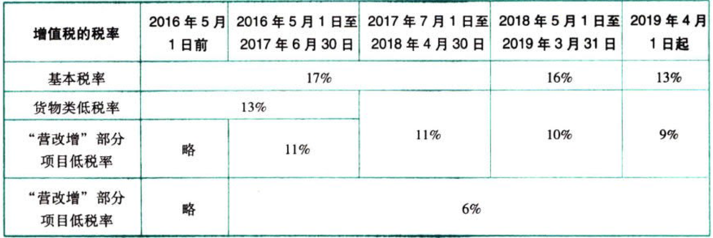

C02增值税.增值税税率变迁历史

# 1. 增值税.税率历史:star: :star: :star: 

按照我国现行增值税的规定，不同的业务范畴对应着不同档次的增值税税率。

### 1.0.1. 2016.5.1

所谓“试点前”，就是2016年4月30日前。

`2016年5月1日全面“营改增”`。

增值税征税范围包括：

（1）销售或者进口的货物(有形动产)；（2）销售劳务；

（3）销售不动产；

（4）销售服务；（5）销售无形资产。

增加了5%的征收率。

### 1.0.2. 2017.1.1

增值税一般纳税人取得2017年1月1日及以后开具的增值税专用发票、海关进口增值税专用缴款书、机动车销售统一发票、收费公路通行费增值税电子普通发票，取消认证确认、稽核比对、申报抵扣的期限。

### 1.0.3. 2018.1.1

为助力经济高质量发展，2018年对部分行业增值税期末留抵税额予以退还，

### 1.0.4. 2019.3.1

随着信息化程度提高和“放管服”的不断推进，全部一般纳税人都取消了增值税发票认证。

### 1.0.5. 2019.4.1

`2019年4月1日后，13%为增值税的基本税率`，应税劳务及绝大部分货物销售（或进口）、部分“营改增”服务适用此档税率。

9%为增值税的低税率，涉及部分货物和部分“营改增”服务。

6%为增值税的低税率，只涉及部分“营改增”的项目。

2019年4月1日起全面推行留抵退税制度。

### 1.0.6. 2019.6.1

2019年6月1日起，对部分先进制造业实施更宽松优惠的增值税期末留抵退税政策。

### 1.0.7. 小结

