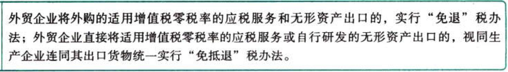

C02.增值税.增值税退（免）税办法

### 0.0.1. 增值税退（免）税办法

适用增值税退（免）税政策的出口货物、劳务及应税行为，按照规定实行增值税免抵退税或免退税办法。

增值税退（免）税办法具体规定如下：

【总结】生产者，免抵退；其他，免税+退税。

特殊纳税人的非自产货物出口可以视同出口自产货物享受“免抵退”税。视同出口自产货物的具体条件：

1.
持续经营以来从未发生骗取出口退税、虚开增值税专用发票或农产品收购发票、接受虚开增值税专用发票（善意取得虚开增值税专用发票除外）行为且同时符合下列条件的生产企业出口的外购货物，可视同自产货物适用增值税退（免）税政策：

（1）已取得增值税一般纳税人资格。

（2）已持续经营2年及2年以上。

（3）纳税信用等级A级。

（4）上一年度销售额5亿元以上。

（5）外购出口的货物与本企业自产货物同类型或具有相关性。

2.
持续经营以来从未发生骗取出口退税、虚开增值税专用发票或农产品收购发票、接受虚开增值税专用发票（善意取得虚开增值税专用发票除外）行为但不能同时符合第1条规定的条件的生产企业，出口的外购货物符合下列条件之一的，可视同自产货物申报适用增值税退（免）税政策：

（1）同时符合下列条件的外购货物：

①与本企业生产的货物名称、性能相同。

②使用本企业注册商标或境外单位或个人提供给本企业使用的商标。

③出口给进口本企业自产货物的境外单位或个人。

（2）与本企业所生产的货物属于配套出口，且出口给进口本企业自产货物的境外单位或个人的外购货物，符合下列条件之一的：

①用于维修本企业出口的自产货物的工具、零部件、配件。

②不经过本企业加工或组装，出口后能直接与本企业自产货物组合成成套设备的货物。

（3）经集团公司总部所在地的地级以上税务局认定的集团公司，其控股的生产企业之间收购的自产货物以及集团公司与其控股的生产企业之间收购的自产货物。

（4）同时符合下列条件的委托加工货物：

①与本企业生产的货物名称、性能相同，或者是用本企业生产的货物再委托深加工的货物。

②出口给进口本企业自产货物的境外单位或个人。

③委托方与受托方必须签订委托加工协议，且主要原材料必须由委托方提供，受托方不垫付资金，只收取加工费，开具加工费（含代垫的辅助材料）的增值税专用发票。

（5）用于本企业中标项目下的机电产品。

（6）用于对外承包工程项目下的货物。

（7）用于境外投资的货物。

（8）用于对外援助的货物。

（9）生产自产货物的外购设备和原材料（农产品除外）。
