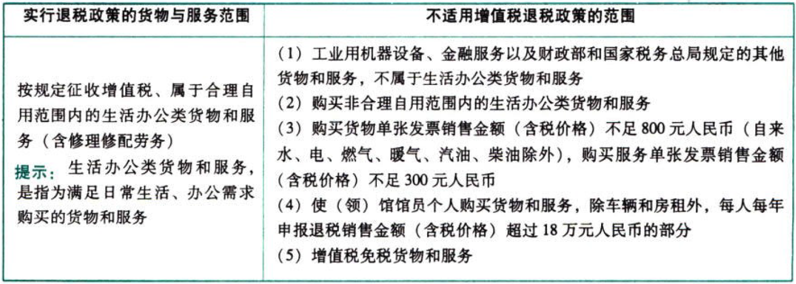

C02.增值税.外国驻华使（领）馆及其馆员在华购买货物和服务增值税退税管理办法

## 0.1. 外国驻华使（领）馆及其馆员在华购买货物和服务增值税退税管理办法

### 0.1.1. 适用范围

外国驻华使（领）馆及其馆员（以下称“享受退税的单位和人员”）在中华人民共和国境内购买货物和服务增值税退税适用本规定。

#### 0.1.1.1. 享受增值税退税的单位和人员范围

享受退税的单位和人员，包括外国驻华使（领）馆的外交代表（领事官员）及行政、技术人员，中国公民或者在中国永久居留的人员除外。

#### 0.1.1.2. 享受增值税退税的货物和服务范围



### 0.1.2. 退税的计算

申报退税的应退税额，为增值税发票上注明的税额。使（领）馆及其馆员购买电力、燃气、汽油、柴油，发票上未注明税额的，增值税应退税额按不含税销售额和相关产品增值税适用税率计算，计算公式：

```
增值税应退税额＝发票金额（含增值税）/(1+增值税适用税率）×增值税适用税率
```
### 0.1.3. 退税管理

1.享受退税的单位和人员，应按`季度`向`外交部礼宾司`报送退税凭证和资料申报退税，报送时间为每年的1月、4月、7月、10月；本年度购买的货物和服务（以发票开具日期为准），最迟申报不得迟于次年1月。逾期报送的，外交部礼宾司不予受理。

外交部礼宾司受理使（领）馆退税申报后，10个工作日内，对享受退税的单位和人员的范围进行确认，对申报时限及其他内容进行审核、签章，将各使（领）馆申报资料一并转送`北京市税务局`办理退税，并履行交接手续。

2.对享受退税的单位和人员申报的货物与服务是否属合理自用范围或者申报凭证真实性有疑问的，税务机关应`暂缓`办理退税，并通过外交部礼宾司对其进行`问询`。

3.税务机关如发现享受退税的单位和人员申报的退税凭证虚假或所列内容与实际交易不符的，不予退税，并通过外交部礼宾司向其`通报`；情况严重的，外交部礼宾司将`不再`受理其申报。

4.享受退税的单位和人员购买货物和服务办理退税后，如发生`退货`或转让所有权、使用权等情形，须经外交部礼宾司向北京市税务局办理`补税`手续。如转让需外交部礼宾司核准的货物，外交部礼宾司应在确认转让货物未办理退税或己办理补税手续后，办理核准转让手续。
