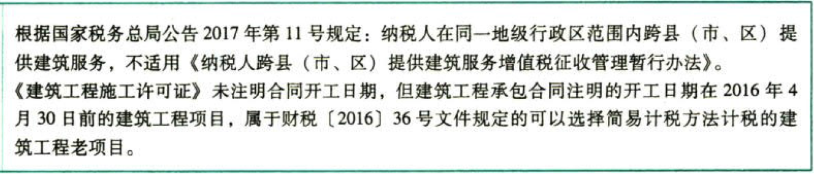
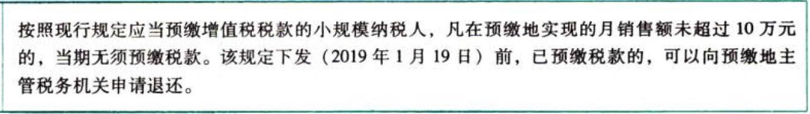
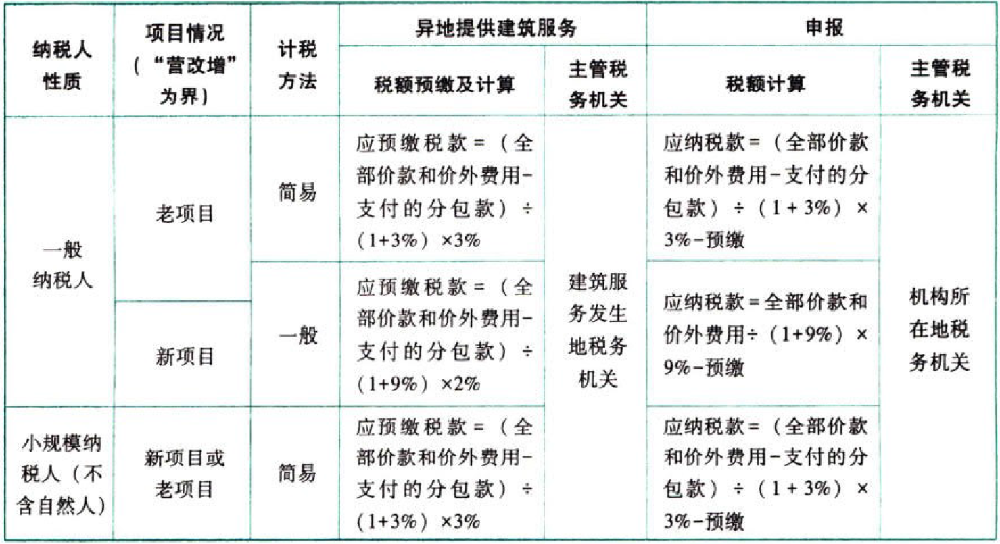

C02.增值税.纳税人跨县（市、区）提供建筑服务增值税征收管理暂行办法

## 0.1. 纳税人跨县（市、区）提供[建筑服务]增值税征收管理暂行办法

纳税人跨县（市、区）提供建筑服务，是指单位和个体工商户（以下简称“纳税人”）在其机构所在地以外的`县`（市、区）提供建筑服务。

纳税人跨县（市、区）提供建筑服务，应按照规定的纳税义务发生时间和计税方法，向`建筑服务发生地`主管税务机关`预缴`税款，向`机构所在地`主管税务机关`申报`纳税。

纳税人在同一直辖市、计划单列市范围内跨县（市、区）提供建筑服务的，由直辖市、计划单列市税务局决定是否适用以下规定。

其他个人跨县（市、区）提供建筑服务，不适用以下规定。



### 0.1.1. 预缴税款

#### 0.1.1.1. 小规模纳税人跨县（市、区）提供建筑服务

小规模纳税人跨县（市、区）提供建筑服务，以取得的全部价款和价外费用扣除支付的分包款后的余额，按照`3%征收率`计算应`预缴`税款。

应预缴税款＝(全部价款和价外费用－支付的分包款)/(1+3%)×3%



#### 0.1.1.2. 一般纳税人跨县（市、区）提供建筑服务

①一般纳税人跨县（市、区）提供建筑服务适用`一般计税方法`计税的，以取得的全部价款和价外费用扣除支付的分包款后的余额，按照`2%预征率`计算应预缴税款。

```
应预缴税款＝(全部价款和价外费用－支付的分包款)/(1+9%)×2%
```
［例题47］机构所在地在甲省B市的甲建筑企业是增值税一般纳税人，2019年12月在乙省A市取得含税建筑收入327000元4则甲企业在建筑服务发生地A市预级税款：

甲企业应在A市预缴税款＝327000/(1+9%)×2%=6000（元）。

②一般纳税人跨县（市、区）提供建筑服务，选择适用`简易计税方法`计税的，以取得的全部价款和价外费用扣除支付的分包款后的余额，按照`3%征收率`计算应预缴税款。

应预缴税款＝(全部价款和价外费用－支付的分包款)/(1+3%)×3%

#### 0.1.1.3. 小结



纳税人取得的全部价款和价外费用扣除支付的分包款后的余额为负数的，可结转下次预缴税款时继续扣除。

纳税人应按照工程项目分别计算应预缴税款，分别预缴。

### 0.1.2. 扣除凭证

纳税人按照上述规定从取得的全部价款和价外费用中扣除支付的分包款，应当取得符合法律、行政法规和国家税务总局规定的合法有效凭证，否则不得扣除。

上述凭证是指：

（1）从分包方取得的2016年4月30日前开具的`建筑业营业税发票`，前述建筑业营业税发票在2016年6月30日前可作为预缴税款的扣除凭证。

（2）从分包方取得的2016年5月1日后开具的，备注栏注明建筑服务发生地所在县（市、区）、项目名称的`增值税发票`。

（3）国家税务总局规定的`其他`凭证。

### 0.1.3. 其他问题

（1）预缴税款应出示的资料

纳税人跨县（市、区）提供建筑服务，在向建筑服务发生地主管税务机关预缴税款时，需填报`《增值税预缴税款表》`，并出示以下资料：

①与发包方签订的建筑`合同`复印件（加盖纳税人公章）；

②与分包方签订的分包`合同`复印件（加盖纳税人公章）；

③从分包方取得的`发票`复印件（加盖纳税人公章）。

（2）纳税人跨县（市、区）提供建筑服务，向建筑服务发生地主管税务机关预缴的增值税税款，可以在当期增值税应纳税额中抵减，抵减不完的，结转下期继续抵减。

纳税人以预缴税款抵减应纳税额，应以完税凭证作为合法有效凭证。

（3）建筑企业与发包方签订建筑合同后，以内部授权或者三方协议等方式，授权集团内其他纳税人（以下简称“第三方”）为发包方提供建筑服务，并由第三方直接与发包方结算工程款的，由`第三方`缴纳增值税并向发包方开具增值税发票，与发包方签订建筑合同的建筑企业不缴纳增值税。发包方可凭实际提供建筑服务的纳税人开具的`增值税专用发票`抵扣进项税额。
