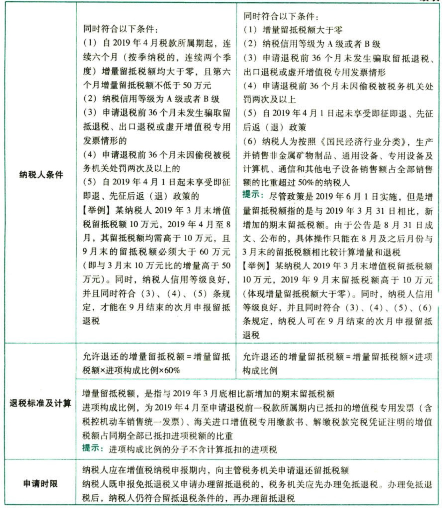
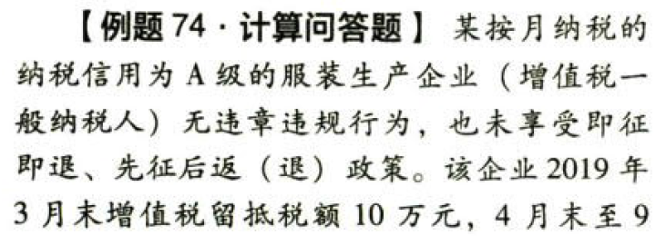
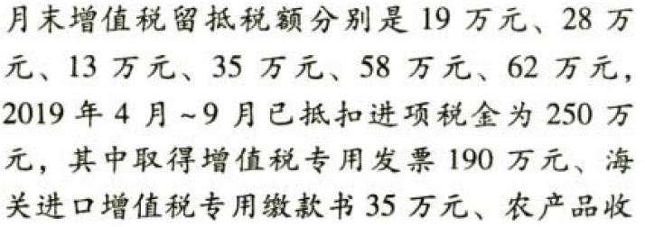
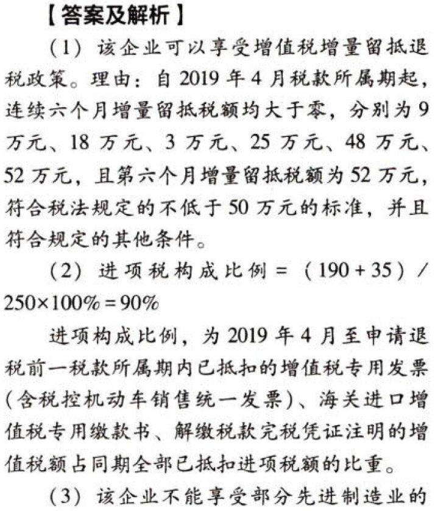
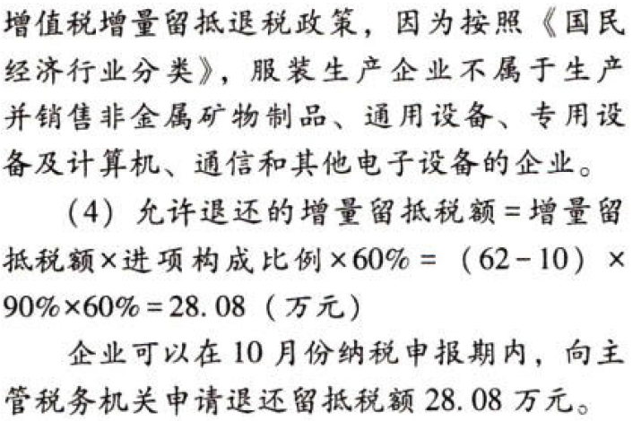

C02.增值税.财政部和国家税务总局规定的其他部分征免税项目

## 0.1. 财政部和国家税务总局规定的其他部分征免税项目:star: :star: 

### 0.1.1. 资源综合利用鼓励节能减排的优惠

根据`《资源综合利用产品和劳务增值税优惠目录》`的通知的规定，纳税人销售自产的资源综合利用产品和提供资源综合利用劳务，可享受增值税`即征即退`政策。目录中将资源综合利用类别分为“共、伴生矿产资源”“废渣、废水（液）、废气”“再生资源”“农林剩余物及其他”“资源综合利用劳务”五大类，每一类下列举了具体的综合利用的资源名称、综合利用产品和劳务名称、技术标准和相关条件、退税比例。退税比例有30%、50%、70%和100%四个档次。

纳税人从事所列的资源综合利用项目，享受规定的增值税即征即退政策时，应同时符合一些条件，如应属于增值税一般纳税人，销售综合利用产品和劳务不属于国家发展改革委员会发布的`《产业结构调整指导目录》`中的淘汰、限制类项目等。

可享受上述优惠的货物须为`自产货物`。

### 0.1.2. 出版物的先征后退

自2018年1月1日起至2020年12月31日，执行下列增值税`先征后退`政策。

1.对下列出版物在`出版环节`执行增值税`100%先征后退`的政策：

（1）中国共产党和各民主党派的各级组织的机关报纸和机关期刊，各级人大、政协、政府、工会、共青团、妇联、残联、科协的机关报纸和机关期刊，新华社的机关报纸和机关期刊，军事部门的机关报纸和机关期刊。

（2）上述各级组织不含其所属部门。机关报纸和机关期刊增值税先征后退范围掌握在一个单位一份报纸和一份期刊以内。

（3）专为少年儿童出版发行的报纸和期刊，中小学的学生课本。

（4）专为老年人出版发行的报纸和期刊。

（5）少数民族文字出版物。

（6）盲文图书和盲文期刊。

（7）经批准在内蒙古、广西、西藏、宁夏、新疆五个自治区内注册的出版单位出版的出版物。

（8）列入财税〔2018〕53号附件1的图书、报纸和期刊。

2.对下列出版物在`出版环节`执行增值税`先征后退50%`的政策：

（1）各类图书、期刊、音像制品、电子出版物，但上述规定执行增值税100%先征后退的出版物除外。

（2）列入财税〔2018〕53号附件2的报纸。

3.对下列`印刷、制作业务`执行增值税`100%先征后退`的政策：

（1）对`少数民族文字出版物`的印刷或制作业务。

（2）列入财税〔2018〕53号附件3的新疆维吾尔自治区印刷企业的印刷业务。

### 0.1.3. 免征蔬菜流通环节的增值税

对从事蔬菜批发、零售的纳税人销售的蔬菜免征增值税。

（1）享受免征增值税的对象，是指从事`蔬菜批发、零售`的纳税人。

（2）蔬菜是指可作副食的草本、木本植物，包括各种蔬菜、菌类植物和少数可作副食的木本植物。经挑选、清洗、切分、晾晒、包装、脱水、冷藏、冷冻等工序加工的蔬菜，也属于享受免征增值税税收优惠的蔬菜范围。

（3）蔬菜经处理、装罐、密封、杀菌或无菌包装而制成的各种`蔬菜罐头`不享受免征增值税的税收优惠。

（4）纳税人既销售蔬菜又销售其他增值税应税货物的，应`分别核算`蔬菜和其他增值税应税货物的销售额；未分别核算的，不得享受蔬菜的增值税免税政策。

### 0.1.4. 饲料、制种的优惠政策

（1）`豆粕`属于征收增值税的饲料产品，除豆粕以外的`其他粕类饲料`产品，均免征增值税。

（2）制种企业利用自有土地或承租土地，雇用农户或属工进行种子繁育，再经烘干、脱粒、风筛等深加工后销售种子，以及制种企业提供亲本种子委托农户繁育并从农户手中收回，再经烘干、脱粒、风筛等深加工后销售种子，都属于`农业生产者销售自产农业产品`，可免征增值税。

### 0.1.5. 边销茶

2019年1月1日起至2020年12月31日，对边销茶生产企业销售自产的边销茶及经销企业销售的边销茶免征增值税。（新增）

边销茶是指以黑毛茶、老青茶、红茶末、绿茶为主要原料，经过发酵、蒸制、加压或者压碎、炒制，专门销往边疆少数民族地区的紧压茶、方包茶（马茶）。

### 0.1.6. 有机肥产品免征增值税的政策

自2008年6月1日起，纳税人生产销售和批发、零售`有机肥产品`免征增值税。

并非所有的化肥都免征增值税，而是符合执行标准的有机肥产品才能享受增值税的免税。

### 0.1.7. 债转股

按`债转股企业`与`金融资产管理公司`签订的债转股协议，债转股原企业将`货物资产`作为投资提供给债转股新公司的，免征增值税。

### 0.1.8. 广播电视

2019年1月1日至2023年12月31日，对广播电视运营服务企业收取的`有线数字电视基本收视维护费`和`农村有线电视基本收视费`，免征增值税。

### 0.1.9. 小规模纳税人的税收优惠

小规模纳税人发生增值税应税销售行为，合计`月销售额`未超过`10万元`（以1个季度为1个纳税期的，季度销售额未超过30万元，下同）的，免征增值税。

小规模纳税人发生增值税应税销售行为，合计月销售额超过10万元，但扣除本期发生的销售`不动产`的销售额后来超过10万元的，其销售货物、劳务、服务、无形资产取得的销售额免征增值税。

适用增值税`差额征税政策`的小规模纳税人，以`差额后的销售额`确定是否可以享受上述规定的免征增值税政策。

自2019年1月1日起，以1个季度为纳税期限的增值税小规模纳税人，因在季度中间成立或注销而导致当期实际经营期不足1个季度，当期销售额未超过30万元的，免征增值税。（新增）

`其他个人`采取一次性收取租金形式出租不动产取得的租金收入，可在对应的租赁期内平均分摊，分摊后的`月租金`收入未超过`10万元`的，免征增值税。

### 0.1.10. 供热企业

自2019年1月1日至2020年供暖期结束，对供热企业向`居民个人`（以下统称“居民”）供热而取得的采暖费收入免征增值税。

向居民供热而取得的采暖费收入，包括供热企业直接向居民收取的、通过其他单位向居民收取的和由单位代居民缴纳的采暖费。

免征增值税的采暖费收入，应当按照规定`单独核算`。通过热力产品经营企业向居民供热的热力产品生产企业，应当根据热力产品经营企业实际从居民取得的采暖费收入占该经营企业采暖费总收入的比例确定免税收入比例。

所称供暖期，是指当年下半年供暖开始至次年上半年供暖结束的期间。

供热企业向居民以外的单位供热取得的采暖费收入自2019年4月1日起，按照`9%的税率`计算缴纳增值税。

### 0.1.11. 研发机构采购设备增值税政策

为了鼓励科学研究和技术开发，促进科技进步，对符合规定的内资研发机构和外资研发中心采购的`国产设备`，按规定实行`全额退还增值税`。

研发机构已退税的国产设备，自增值税发票开具之日起3年内，设备所有权转移或移作他用的，研发机构须按照下列计算公式，向主管税务机关补缴已退税款。

应补税款＝增值税发票上注明的金额×（设备折余价值/设备原值）×增值税适用税率

设备折余价值＝设备原值－累计己提折旧

设备原值和已提折旧按照`企业所得税法`的有关规定计算。

### 0.1.12. 水资源费试点

原对城镇公共供水用水户在基本水价（自来水价格）外征收水资源费的试点省份，在水资源费改税试点期间，按照不增加城镇公共供水企业负担的原则，城镇公共供水企业缴纳的水资源税所对应的水费收入，不计征增值税，按`“不征税自来水”`项目开具增值税普通发票。

### 0.1.13. 北京2022年冬奥会

对赞助企业及参与赞助的下属机构根据赞助协议及补充赞助协议向北京冬奥组委`免费`提供的，与北京2022年冬奥会、冬残奥会、测试赛有关的`服务`，免征增值税。

### 0.1.14. 增值税期末留抵税额的退还政策（新增）

为助力经济高质量发展，2018年对部分行业增值税期末`留抵税额`予以退还，2019年4月1日起全面推行`留抵退税`制度；2019年6月1日起，对`部分先进制造业`实施更宽松优惠的增值税期末留抵退税政策。

#### 0.1.14.1. 全面留抵退税

`起始时间：`2019年4月1日。

`纳税人须同时符合下列条件：`

（1）纳税信用等级为A级或者B级

（2）申请退税前36个月未发生骗取留抵退税、出口退税或虚开增值税专用发票情形

（3）申请退税前36个月未因偷税被税务机关处罚两次及以上

（4）自2019年4月1日起未享受即征即退、先征后返（退）政策

（5）自2019年4月税款所属期起，连续六个月（按季纳税的，连续两个季度）`增量留抵税额`均大于零，且第六个月增量留抵税额不低于50万元

［举例］某纳税人2019年3月末增值税留抵税额10万元，2019年4月至8月，其留抵税额均需高于10万元，且9月来的留抵税额必须大于60万元（即与3月末10万元比的增量高于50万元）。同时，纳税人信用等级良好，并且同时符合（2）、（3）、（4）条规定，才能在9月结束的次月申报留抵退税

`退税标准及计算：`

```
允许退还的增量留抵税额＝增量留抵税额×进项构成比例`×60%`
```
增量留抵税额，是指与2019年3月底相比新增加的期末留抵税额

`进项构成比例`，为2019年4月至申请退税前一税款所属期内已抵扣的增值税专用发票（含税控机动车销售统一发票）、海关进口增值税专用缴款书、解缴税款究税凭证注明的增值税额占同期全部已抵扣进项税额的比重。（进项构成比例的分子不含计算抵扣的进项税）

`申请时限：`

纳税人应在增值税纳税申报期内，向主管税务机关申请退还留抵税额。

纳税人既申报免抵退税又申请办理衙抵退税的，税务机关应先办理兔抵退税。办理兔\~li:ill税后，纳税人仍符合留抵退税条件的，再办理留抵退税。

#### 0.1.14.2. 部分先进制造业

`起始时间：`2019年6月1日。

`纳税人须同时符合下列条件：`

（1）纳税信用等级为A级或者B级

（2）申请退税前36个月未发生骗取留抵退税、出口退税或虚开增值税专用发票情形

（3）申请退税前36个月未因偷税被税务机关处罚两次及以上

（4）自2019年4月1日起未享受即征即退、先征后返（退）政策

（5）纳税人为按照《国民经济行业分类》生产并销售`非金属矿物制品`、`通用设备`、`专用设备`及`计算机、通信和其他电子设备`销售额占全部销售额的比重超过50%的纳税人

（6）增量留抵税额大于零

【提示】尽管政策是2019年6月1日实施，但是增量留抵税额指的是与2019年3月31日相比，新增加的期末留抵税额。由于公告是8月31日成文、公布的，具体操作只能在8月及之后月份与3月末的留抵税额相比较计算增量和退税

［举例］某纳税人2019年3月末增值税留抵税额10万元，2019年9月末留抵税额高于10万元（体现增量翻抵税额大于零）。同时，纳税人信用等级良好，并且同时符合（2）（3）（4）（5）条规定，纳税人可在9月结束的次月申报留抵退税

`退税标准及计算：`

```
允许退还的增量留抵税额＝增量留抵税额x`进项构成比例`
```
公式中`增量留抵税额`和`进项构成比例`含义同上一政策。

`申请时限：`同上一政策。












自2018年1月1日起至2023年12月31日止，对纳税人从事大型民用客机发动机、中大功率民用涡轴涡桨发动机研制项目而形成的增值税期末留抵税额予以退还。

自2019年1月1日起至2020年12月31日止，对纳税人生产销售新支线飞机暂`减按5%`征收增值税，并对其因生产销售新支线飞机而形成的增值税期末留抵税额予以退还；对纳税人从事大型客机研制项目而形成的增值税期末留抵税额予以退还。
