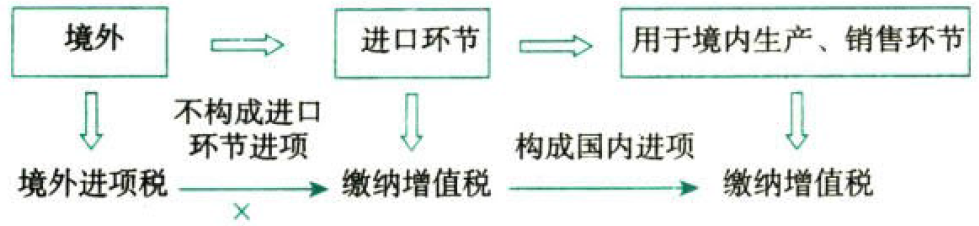

C02.增值税.进口环节增值税的征收

# 1. 进口环节增值税的征收:star: :star: :star: 

## 1.1. 进口环节增值税的征税范围和纳税人

### 1.1.1. 进口环节增值税征税范围

#### 1.1.1.1. 基本规定

根据《增值税暂行条例》的规定，申报`进入`中华人民共和国海关`境内`的货物，均应缴纳增值税。

#### 1.1.1.2. 特殊规定

从其他国家或地区进口`《跨境电子商务零售进口商品清单》`范围内的以下商品适用于跨境电子商务零售进口增值税税收政策：

（1）所有通过与海关联网的电子商务交易平台交易，能够实现交易、支付、物流电子信息“三单”比对的跨境电子商务零售进口商品；

（2）未通过与海关联网的电子商务交易平台交易，但快递、邮政企业能够统一提供交易、支付、物流等电子信息，并承诺承担相应法律责任进境的跨境电子商务零售进口商品。

不属于跨境电子商务零售进口的个人物品以及无法提供交易、支付、物流等电子信息的跨境电子商务零售进口商品，按现行规定执行（缴纳“行邮税”）。

### 1.1.2. 进口环节增值税的纳税人

进口货物增值税的纳税人是进口货物的`收货人`或办理报关手续的单位和个人。

跨境电子商务零售进口商品按照货物征收关税和进口环节增值税、消费税，`购买`跨境电子商务零售进口商品的个人作为纳税义务人。电子商务企业、电子商务交易平台企业或物流企业可作为代收代缴义务人。

## 1.2. 进口环节增值税的适用税率

进口环节增值税的适用税率与境内商品交易税率相同。

对进口`抗癌`药品，自2018年5月1日起，`减按3%`征收进口环节增值税。对进口`罕见病`药品，自2019年3月1日起，`减按3%`征收进口环节增值税。

【注意】除进口抗癌药品、罕见病药品和租用大飞机等特殊情况外，进口货物的增值税税率与境内销售同类货物的税率一致，为13%和9%，即便是小规模纳税人，进口环节计征增值税时也适用税率，不适用征收率。

## 1.3. 进口环节增值税的计算

（1）根据《增值税暂行条例》规定，进口货物使用`组成计税价格`计算应纳增值税，组价公式中包含关税完税价格、关税税额、消费税税额。进口货物应纳税额的计算公式如下：

组成计税价格＝关税完税价格+关税+消费税（非应税消费品不涉及此项）

应纳税额＝组成计税价格×税率

进口环节按组价公式和适用税率直接计算出的应纳税额，在进口环节不能抵扣任何境外税款。

（2）跨境电子商务零售进口商品按照货物征收关税和进口环节增值税、消费税，以实际交易价格（包括货物零售价格、运费和保险费）作为完税价格。

跨境电子商务零售进口商品的进口环节增值税、消费税取消免征税额，暂按法定应纳税额的`70%`征收。【小件，增值税消费税打七折】

完税价格超过`5000元`单次交易限值但低于26000元年度交易限值，且订单下仅一件商品时，可以自跨境电商零售渠道进口，按照货物税率全额征收关税和进口环节增值税、消费税，交易额计入年度交易总额，但年度交易总额超过年度交易限值的，应按一般贸易管理。【买个大件，全额增值税消费税】

2019年1月1日起，对单次交易限值为人民币5000元个人年度交易限值为人民币26000元以内进口的跨境电子商务零售进口商品，`关税`税率暂设为`0%`。
