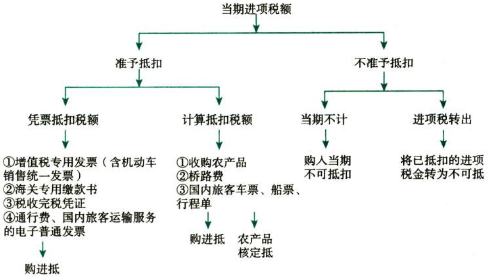
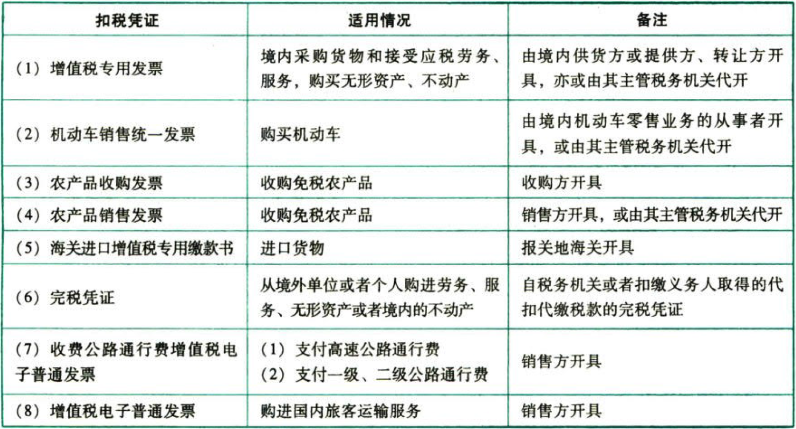
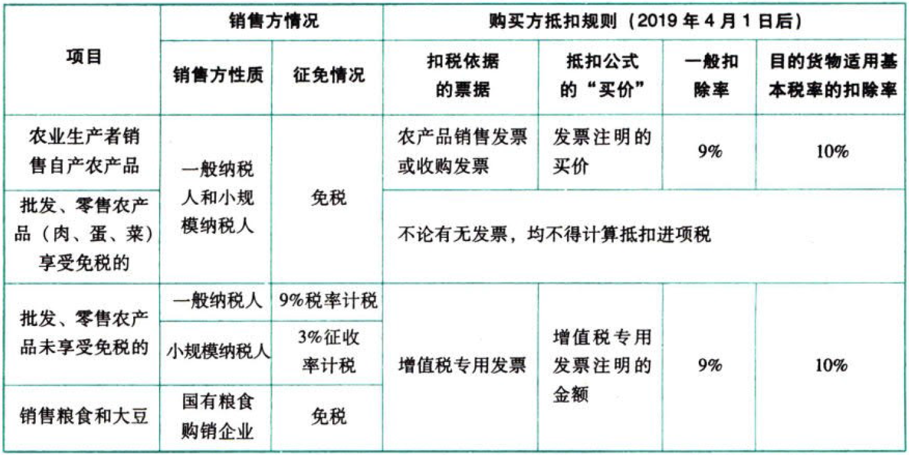
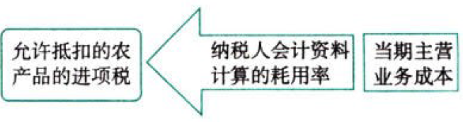
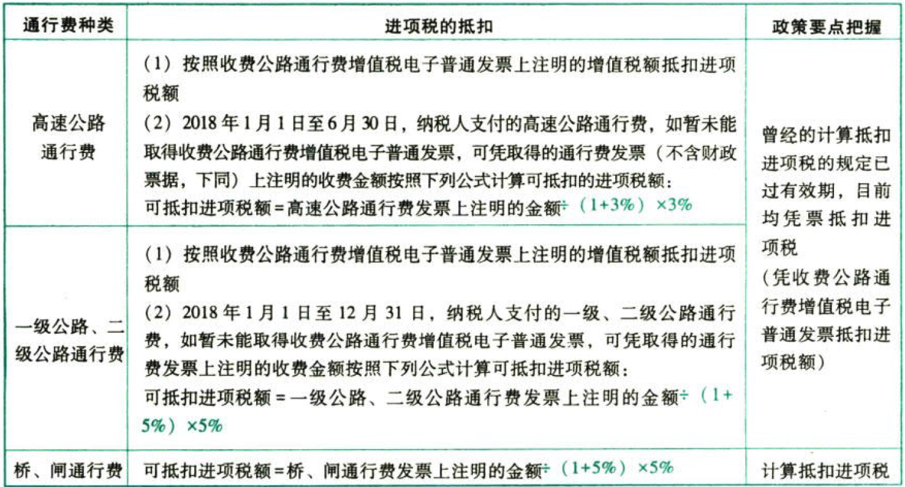
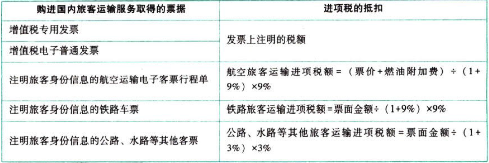
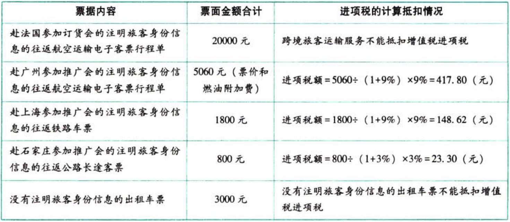
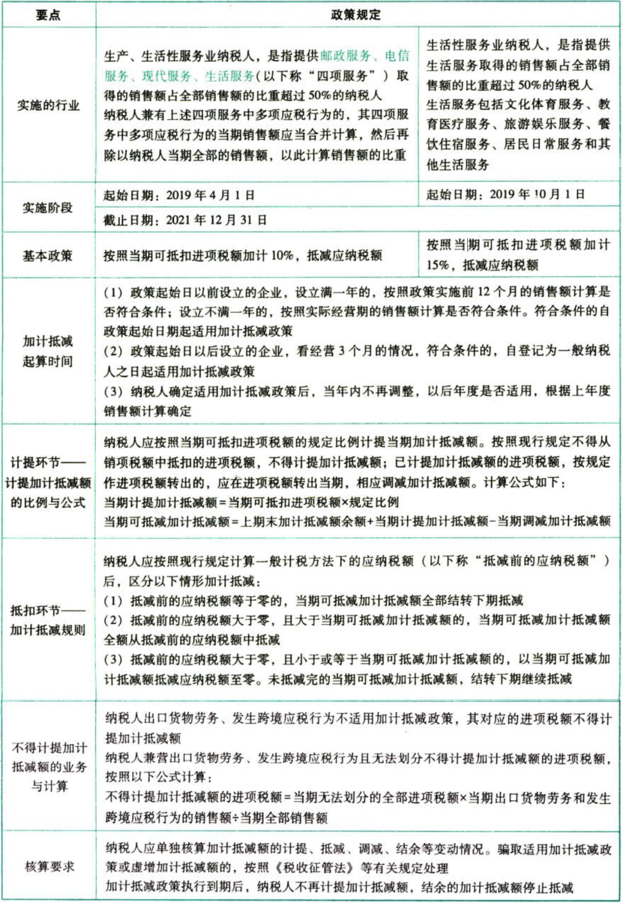
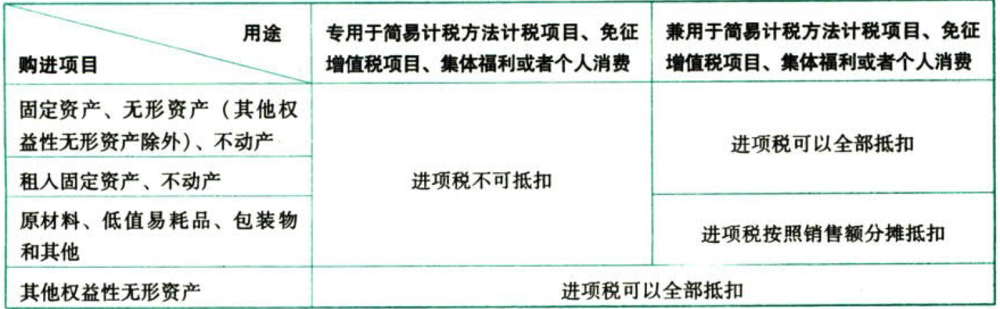
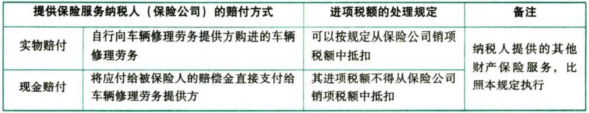

C02增值税.进项税额的确认和计算

# 1. 一般计税方法.进项税额的确认和计算:star: :star: :star: 

进项税额，是指纳税人`购进`货物、劳务、服务、无形资产或者不动产，`支付或者负担`的增值税税额。



## 1.1. 准予从销项税额中抵扣的进项税额

`凭票抵扣`是增值税管理的重要特点，但是在某些特殊情况下，允许纳税人按符合规定的非增值税专用发票（如农产品收购发票、农产品销售发票等）`自行计算`进项税额扣除。

### 1.1.1. 一般情况下——凭票抵扣

购进方的进项税额一般由销售方的销项税额对应构成。故进项税额在正常情况下：

（1）从销售方或提供方取得的`增值税专用发票（含税控机动牢销售统一发票，下同）`上注明的增值税税额；

（2）从海关取得的`海关进口增值税专用缴款书`上注明的增值税税额（海关缴款书上的企业名称与税务登记的企业名称一致，税务机关将进口货物取得的属于增值税抵扣范围的海关缴款书信息与海关采集的缴款信息稽核比对一致）；

（3）自境外单位或者个人购进劳务、服务、无形资产或者境内的不动产，从税务机关或者扣缴义务人取得的`代扣代缴税款的完税凭证`上注明的增值税额；

纳税人凭完税凭证抵扣进项税额的，应当具备书面合同、付款证明和境外单位的对账单或者发票。资料不全的，其进项税额不得从销项税额中抵扣。

（4）`收费公路通行费增值税电子普通发票`上注明的进项税额；

（5）`购进国内旅客运输服务取得的增值税电子普通发票`上注明的进项税额。



### 1.1.2. 特殊情况之一——计算抵扣

#### 1.1.2.1. 购进农产品.进项税额.一般规定——购进计算折扣

购进方没有取得增值税专用发票、海关进口增值税专用缴款书，但可以自行计算进项税额抵扣的情况——购进农产品，除取得增值税专用发票或者海关进口增值税专用缴款书外，按照农产品收购发票或者销售发票上`注明的农产品买价`和`规定的扣除率`计算进项税额抵扣。进项税额计算公式：

```
进项税额＝买价×扣除率
```
公式中的“买价”包括两个因素，一是包括纳税人购进农产品在农产品收购发票或者销售发票上注明的`价款`，二是包括按规定缴纳的`烟叶税`，即收购烟叶由收购方缴纳的烟叶税，计入计算抵扣进项税的买价之中。

公式中的“扣除率”自2019年4月1日起调整为9%。但购进后用于深加工适用基本税率的目的货物的，扣除率有不同的规定。

针对纳税人购进农产品用于生产或委托加工13%税率货物的，在9%扣除率的基础上加计1%扣除，实际扣除率为10%。



农业生产者销售自产农产品的，卖方免税，买方凭(`农产品购销发票`注明的买价)抵扣9%或10%。【优惠归农民】

超市批发零售农产品未享受免税的，卖方9%税率或3%征收率，买方凭`专票`注明的金额抵扣9%或10%。【优惠归国家】

超市批发零售农产品享受免税的，卖方免税，买方不得抵扣。【都没交税，别捣乱】

国有粮食购销企业销售粮食和大豆的，卖方免税，买方凭`专票`注明的金额抵扣9%或10%。【参与市场，但不以盈利为目的】

农产品中`收购烟叶`的进项税抵扣公式比较特殊。计税公式：

```
设c=实际支付的烟叶收购价款
准予抵扣的进项税额
＝（收购烟叶实际支付的价款总额(A)+烟叶税应纳税额）×扣除率
＝（(c+实际支付的价外补贴)+c×（1+10%）×20%）×扣除率
```
【注意】这里的`收购烟叶实际支付的价款总额(A)`与烟叶税计算公式中的`实际支付的价款总额(B)`不一定是同一个数字。

```
A＝c+实际支付的价外补贴。
B＝c+c×10%。
```
A里面的`价外补贴`是实际支付金额。

B里面的`价外补贴`是按照10%比例计算出来的，是烟叶税的`计税依据`，与实际支付的价外补贴可能存在金额差异。

#### 1.1.2.2. 购进农产品.进项税额.特殊规定——实耗核定抵扣

鉴于计算抵扣进项税容易产生舞弊和高征低扣的现象，自2012年7月1日起，在部分行业开展增值税进项税额`核定扣除试点`。这种方式在实际计算上体现出按照`销售实耗`核定扣除。

2012年7月1日起，以购进农产品为原料生产销售`液体乳及乳制品、酒及酒精、植物油`的增值税一般纳税人，纳入农产品增值税进项税额核定扣除试点范围，其购进农产品无论是否用于生产上述产品，增值税进项税额均按照《农产品增值税进项税额核定扣除试点实施办法》的规定抵扣。

除上述规定以外的纳税人，其购进农产品仍按现行增值税的有关规定抵扣农产品进项税额。

对部分液体乳及乳制品实行全国统一的扣除标准。

`购进农产品直接销售的——经销行为（2019年4月1日起）`

```
当期允许抵扣农产品增值税进项税额
＝当期销售农产品数量/(1－损耗率)×农产品平均购买单价/(1+9%)×9%
损耗率＝损耗数量／购进数量×100%
```
试行核定扣除企业的农产品经销行为采取销售数量控制法核定，纳税人根据每月农产品销售数量、农产品平均购进单价和农产品进项税额扣除率计算当期允许抵扣的农产品进项税额。

`生产企业.农产品进项税额核定扣除——生产销售行为`

`投入产出法`

侧重于农产品耗用数量的控制，税务机关依据国家标准、行业标准，核定销售`单位数量货物耗用外购农产品数量`。纳税人根据该单耗数量及当期销售货物的数量、农产品的平均购进单价、农产品进项税额扣除率计算当期允许抵扣的农产品进项税额。


```
当期农产品耗用数量＝当期销售货物数量×农产品单耗数量
当期允许抵扣农产品增值税进项税额
＝当期农产品耗用数量×农产品平均购买单价/(1+扣除率)×扣除率
```
平均购买单价是指购买农产品`期末平均买价`，不包括买价之外单独支付的运费和入库前的整理费用。

```
期末平均买价＝（期初库存农产品数量×期初平均买价+当期购进农产品数量×当期买价）／（期初库存农产品数量+当期购进农产品数量）
```
扣除率为销售货物的适用税率。即销售货物的税率是13%，扣除率就是13%；销售货物的税率是9%，扣除率就是9%。

`成本法`

侧重于农产品耗用金额的控制，税务机关依据纳税人会计核算资料，核定耗用农产品的购进金额占生产成本的比例，纳税人根据该比例及当期主营业务成本、农产品进项税额扣除率计算当期允许抵扣的农产品进项税额。



```
当期允许抵扣农产品增值税进项税额
＝当期主营业务成本×农产品耗用率/（1+扣除率）×扣除率
```
`参照法`

是对新办的纳税人或者纳税人新增产品，参照所属行业或者其他相同或者相近纳税人的扣除标准进行核定扣除并照章调整。

#### 1.1.2.3. 收费公路通行费的进项税的计算抵扣

通行费，是指有关单位依法或者依规设立并收取的过路、过桥和过闸费用。

增值税一般纳税人支付的通行费，按照增值税电子普通发票上注明的增值税额抵扣进项税额。不能取得通行费增值税电子普通发票的，在一定期限内，暂凭取得的通行费发票（不含财政票据，下同）上注明的收费金额计算可抵扣的进项税额。



#### 1.1.2.4. 购进国内旅客运输服务.进项税额（新增）

自2019年4月1日起，纳税人购进国内旅客运输服务，其进项税额允许从销项税额中抵扣。

所称“国内旅客运输服务”，限于与本单位签订了劳动合同的`员工`，以及本单位作为用工单位接受的劳务派遣员工发生的国内旅客运输服务。

纳税人购进国内旅客运输服务，以取得的`增值税电子普通发票`上注明的税额为进项税额的，增值税电子普通发票上注明的购买方“名称”“纳税人识别号”等信息，应当与实际抵扣税款的纳税人一致，否则不予抵扣。

纳税人允许抵扣的国内旅客运输服务进项税额，是指纳税人2019年4月1日及以后实际发生，并取得合法有效增值税扣税凭证注明的或依据其计算的增值税税额。以增值税专用发票或增值税电子普通发票为增值税扣税凭证的，为2019年4月1日及以后开具的增值税专用发票或增值税电子普通发票。



示例：



### 1.1.3. 特殊情况之二——进项税的按比例分次抵扣或折算抵扣

（1）分次抵扣进项税是针对不动产进项税额在某一阶段的特殊抵扣规定，2016年5月1日后取得并在会计制度上按固定资产核算的不动产或者2016年5月1日后取得的不动产在建工程，其进项税额自取得之日起分2年从销项税额中抵扣，第1年抵扣比例为60%，第2年抵扣比例为40%。本规定自2019年4月1日起不再执行。此前按照上述规定尚未抵扣完毕的待抵扣进项税额，可自2019年4月税款所属期起从销项税额中抵扣。

（2）不得抵扣进项税的不动产改变成可抵扣用途的，进项税有专门的计算方法。

按照规定不得抵扣进项税额的不动产，发生用途改变，用于允许抵扣进项税额项目的，按照下列公式在改变用途的次月计算可抵扣进项税额。

```
可抵扣进项税额
＝增值税扣税凭证注明或计算的进项税额×不动产净值率
```
### 1.1.4. 进项税额的加计抵减的税收优惠政策（新增）

进项税的加计抵减是针对`特定行业的阶段性税收优惠`政策，其实质不是增值税销项税额减进项税额的加计扣除，而是在计算增值税应纳税额时对应纳税额扣减的一个优惠举措，只不过扣减金额的计算基数与可抵扣进项税相关。因此，考生掌握这一政策时，要注意该加计抵减金额不是从销项税额中抵减，而是从`应纳税额`中抵减。



### 1.1.5. 其他有关可抵扣进项税的规定

（1）增值税一般纳税人在`资产重组`过程中，将`全部资产、负债和劳动力`一并转让给其他增值税一般纳税人，并按程序办理`注销`税务登记的，其在办理注销登记前尚未抵扣的进项税额可结转至新纳税人处继续抵扣。

（2）按照规定不得抵扣进项税额的不动产，发生用途改变，用于允许抵扣进项税额项目的，按照下列公式在`改变用途的次月`计算可抵扣进项税额：

可抵扣进项税额＝增值税扣税凭证注明或计算的进项税额×不动产净值率

另外，按照规定不得抵扣且未抵扣进项税额的固定资产、无形资产、不动产，发生用途改变，用于允许抵扣进项税额项目的，也可按照下列公式在`改变用途的次月`计算可抵扣进项税额：

```
可抵扣进项税额＝固定资产、无形资产、不动产净值/（1+适用税率）×适用税率
```
## 1.2. 不得从销项税额中抵扣的进项税额

按照《增值税暂行条例》和“营改增”进程中的相关政策规定，下列项目的进项税额不得从销项税额中抵扣：

### 1.2.6. 简、免、集、消

用于简易计税方法计税项目、免征增值税项目、集体福利或者个人消费的购进货物、加工修理修配劳务、服务、固定资产、无形资产、不动产。

其中涉及的固定资产、无形资产、不动产，仅指`专用`于上述项目的固定资产、无形资产（不包括其他权益性无形资产）、不动产。但是发生`兼用`于上述不允许抵扣项目情况的，该进项税额准予`全部抵扣`。【9成无赖】

纳税人购进`其他权益性无形资产`，无论是专用于简易计税方法计税项目、免征增值税项目、集体福利或者个人消费，还是兼用于上述不允许抵扣项目，`均可以抵扣`进项税额。【无赖啊】

【注意】纳税人的交际应酬消费属于个人消费，即交际应酬消费不属于生产经营中的生产投入和支出。

适用一般计税方法的纳税人，兼营简易计税方法计税项目、免征增值税项目而无法划分不得抵扣的进项税额，按照下列公式计算不得抵扣的进项税额：

不得抵扣的进项税额＝当期无法划分的全部进项税额×（当期简易计税方法计税项目销售额+免征增值税项目销售额）/当期全部销售额。

主管税务机关可以按照上述公式依据`年度数据`对不得抵扣的进项税额进行清算。

考生要注意辨析专用或兼用于简易计税方法讨税项目、免征增值税项目、集体福利或者个人消费的不同购进项目在进项税处理方面的不同。举例而言，假定某供热企业既有对居民收取的采暖费（免税收入），又有对居民以外的单位收取的采暖费（应税收入），则该企业提供热力构建的供热车间、机器设备的进项税全部都可以抵扣，但是为生产热力而购买燃气、煤炭的进项税只能按照应税收入和免税收入的比例分摊抵扣。用图表体现：



### 1.2.7. 非正常损失所对应的进项税额

具体包括：

（1）非正常损失的购进`货物`，以及相关的加工修理修配`劳务`和交通运输`服务`。

（2）非正常损失的`在产品、产成品`所耗用的购进货物（不包括固定资产）、加工修理修配劳务和交通运输服务。

（3）非正常损失的`不动产`，以及该不动产所耗用的购进货物、设计服务和建筑服务。

（4）非正常损失的`不动产在建工程`所耗用的购进货物、设计服务和建筑服务。纳税人新建、改建、扩建、修缮、装饰不动产，均属于不动产在建工程。

上述4项所说的非正常损失，是指因`管理不善`造成货物被盗、丢失、霉烂变质，以及因违反法律法规造成货物或者不动产被依法没收、销毁、拆除的情形。这些非正常损失是由纳税人自身原因造成导致征税对象实体的灭失，为保证税负公平，其损失不应由国家承担，因而纳税人无权要求抵扣进项税额。

上述（3）、（4）中的货物，是指构成不动产实体的材料和设备，包括建筑装饰材料和给排水、采暖、卫生、通风、照明、通讯、煤气、消防、中央空调、电梯、电气、智能化楼宇设备及配套设施。

已抵扣进项税额的不动产，发生非正常损失，或者改变用途，专用于简易计税方法计税项目、免征增值税项目、集体福利或者个人消费的，按照下列公式计算不得抵扣的进项税额，并从当期进项税额中扣减：

不得抵扣的进项税额＝己抵扣进项税额×不动产净值率

不动产净值率＝（不动产净值/不动产原值）×100%

### 1.2.8. 特殊政策规定不得抵扣的进项税

（1）购进的`贷款服务、餐饮服务、居民日常服务、娱乐服务`。

纳税人接受贷款服务向贷款方支付的与该笔贷款直接相关的投融资顾问费、手续费、咨询费等费用，其进项税额不得从销项税额中抵扣。

（2）保险公司支付赔付进项税的抵扣（新增）



## 1.3. 不得抵扣增值税进项税额的具体处理方法（重点和难点）

### 1.3.9. 购入时不予抵扣

［例题36］2019年11月，某企业（增值税一般纳税人）购入一批材料用于本企业职工食堂建设，取得增值税专用友票注明价款100000元，增值税13000元，则该企业不得抵扣增值税进项税额。在现实中，纳税人为了进免在金税，工程系统实施发票监控过程中出现疑点，纳税人应先将上述13000元计入增值税进项税，以体现发票记录的完整内容；再作进项税转出，将税金计入采购成本，以体现严格遵守了不得抵扣进项税的规则。会计处理后，该批材料采购成本为113000元。

### 1.3.10. 已抵扣进项税额后改变用途、发生非正常损失、出口不得免征和抵扣税额——作进项税额转出处理

进项税额转出有四种常见的转出方法，即直接计算转出法、还原计算转出法、比例计算转出法和净值折算转出法。

①直接计算进项税额转出的方法——适用于外购材料、不动产在建工程的非正常损失、改变用途等。

［例题37］2020年1月，某企业（增值税一般纳税人）将二个月前外购的一批已抵扣进项税额的生产用材料改变用途，用于集体福利，账面成本1000削元，则需要作进项税额转出＝1000×13%=1300（元）。

②还原计算进项税额转出的方法——适用于计算抵扣进项税额的农产品发生非正常损失、改变用途等。

［例题38］2019年12月，某方便面生产企业（增值税一般纳税人）因管理不善，导致一批2019年8月向农业生产者收购的小麦霉烂变质（已按10%计算抵扣进项税），账面成本13460元（含运费500元，支付运费时取得一般纳税人开具的增值税专用发票），其转出的进项税额＝(13460-500)/(1-10%)×10%+500×9%=1440+45=1485（元）。

③比例计算进项税额转出的方法——适用于半成品、产成品的非正常损失；兼营不得抵扣进项税的项目。

［例题39］某服装厂（增值税一般纳税人）产成品中外购原材料比例60%,2020年2月因管理不善丢失一批账面成本20000元的成衣，其需要转出进项税额＝20000×60%×13%=1560（元）。

④净值折算进项税额转出的方法——适用于已抵扣过进项税的固定资产、无形资产或不动产改变用途、发生非正常损失等。

```
不得抵扣的进项税额＝固定资产、无形资产或者不动产净值×适用税率
```
不动产不得抵扣的进项税额公式还可表述成：

```
不得抵扣的进项税额＝巳抵扣进项税额×不动产净值率
不动产净值率＝（不动产净值/不动产原值）×100%
```
### 1.3.11. 向供货方收取的返还收入——追加冲减进项税额处理

商业企业向供货方收取的凡与商品销售量、销售额挂钩（如以一定比例、金额、数量计算）的各种返还收入，均应按照平销返利行为的有关规定冲减当期增值税进项税额。

［例题41］某商场受托代销某服装厂服装，2020年2月销售代销服装取得零售额20万元，平价与服装厂结算，取得服装厂开具的增值税专用发票，并按合同向服装厂收取代销额20%的返还收入4万元，已知商场与服装厂均为增值税一般纳税人，则：

商场当期应冲减进项税额＝4/(1+13%)×13%=0.46（万元）。

【注意】商业企业向供货方收取的与商品销售量、销售额挂钩（如以一定比例、金额、数量计算）的各种返还收入，不是采取计算销项税额的方法，而是采取冲减进项税额的方法。商业企业向供货方收取的各种返还收入，一律不得开具增值税专用发票，可以自供货方开增值税红票。
