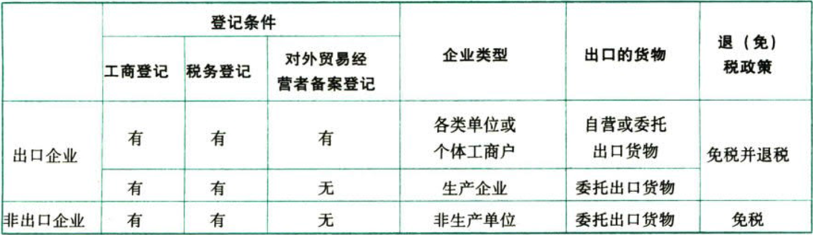

C02.增值税.适用增值税退（免）税政策的范围

### 0.0.1. 适用增值税退（免）税政策的范围

#### 0.0.1.1. 出口企业.出口货物

（1）出口企业的类型

实际生产者or备案的倒爷，免税+退税；野生的倒爷，仅免税。

（2）企业出口给外商的`新造集装箱`，交付到境内指定堆场，并取得出口货物报关单（出口退税专用），同时符合其他出口退（免）税规定的，准予按照现行规定办理出口退（免）税。

（3）融资租赁货物出口退税

对融资租赁出口货物`试行`退税政策。对融资租赁企业、金融租赁公司及其设立的项目子公司，以融资租赁方式租赁给境外承租人且租赁期限在5年（含）以上并向海关报关后实际离境的货物，试行增值税、消费税出口退税政策。

#### 0.0.1.2. 出口企业.对外提供加工修理修配劳务

对外提供加工修理修配劳务，是指对进境复出口货物或从事国际运输的运输工具进行的加工修理修配。

#### 0.0.1.3. 出口企业或其他单位.视同出口货物

除财政部和国家税务总局另有规定外，视同出口货物适用出口货物的各项规定。视同出口货物具体包括：

（1）出口企业对外`援助`、对外`承包`、境外`投资`的出口货物。

（2）出口企业经海关报关进入国家批准的出口加工区、保税物流园区、保税港区、综合保税区、珠澳跨境工业区（珠海园区）、中哈霍尔果斯国际边境合作中心（中方配套区域）、保税物流中心（B型）（以下统称`“特殊区域”`）并销售给特殊区域内单位或境外单位、个人的货物。

（3）`免税品`经营企业.销售的货物（国家规定不允许经营和限制出口的货物、卷烟和超出免税品经营企业《企业法人营业执照》中规定经营范围的货物除外）。

（4）出口企业或其他单位.销售给国际金融组织或外国政府贷款用于国际招标建设项目的`中标机电产品`。上述中标机电产品，包括外国企业中标再分包给出口企业或其他单位的机电产品。

（5）出口企业或其他单位.销售给国际运输企业用于国际运输工具上的货物。上述规定暂仅适用于外轮供应公司、远洋运输供应公司销售给`外轮`、`远洋`国轮的货物，国内航空供应公司生产销售给国内和国外航空公司`国际航班`的航空食品。

#### 0.0.1.4. 应税服务或无形资产

境内的单位和个人提供适用增值税零税率的应税服务或无形资产，如果属于适用增值税简易计税方法的，实行免征增值税办法。如果属于适用增值税一般计税方法的，生产企业实行“免抵退”税办法。

外贸企业外购研发服务和设计服务出口实行免退税办法。【倒爷不抵】

外贸企业直接将服务或自行研发的无形资产出口，视同生产企业连同其出口货物统一实行免抵退税办法。

实行退（免）税办法的研发服务和设计服务，如果主管税务机关认定出口价格偏高的，有权按照核定的出口价格计算退（免）税，核定的出口价格低于外贸企业购进价格的，低于部分对应的进项税额不予退税，转入成本。
