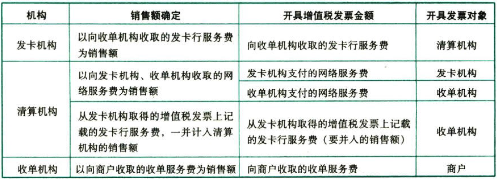
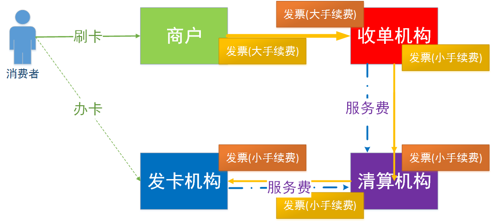
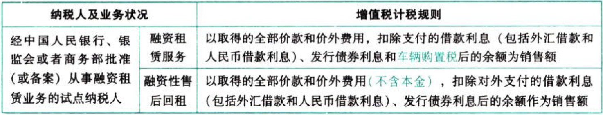

C02增值税.销项税额的计算

# 1. 一般计税方法.销项税额的计算:star: :star: :star: 

```
当期销项税额＝当期销售额（不含增值税）×适用税率
```
纳税人发生应税`销售`行为时，按照销售额与规定的税率计算并向购买方`收取`的增值税税额，为销项税额。

## 1.1. 一般销售方式下的销售额

销售额包括向购买方收取的`全部价款和价外费用`。与销售有因果连带关系的价外收费都应看作含税销售额，即向购买方收取的价外费用应视为含税收入，在征税时换算成不含税收入，再并入销售额计税。

所谓价外费用，包括价外向购买方收取的手续费、补贴、基金、集资费、返还利润、奖励费、违约金、滞纳金、延期付款利息、赔偿金、代收款项、代垫款项、包装费、优质费以及其他各种性质的价外收费。

销锵额以人民币计算，纳税人以人民币以外的货币结算销售额的，应当折合成人民币计算。折合率可以选择销售额发生的`当天或者当月1日`的人民币汇率中间价。纳税人应当在事先确定采用何种折合率，确定后`12个月`内不得变更。

## 1.2. 特殊销售方式下的销售额

### 1.2.1. 采取折扣方式

#### 1.2.1.1. 折扣销售（商业折扣）

销售额和折扣额在同一张发票的`“金额栏”`上分别注明的，可按`折扣后的余额`作为销售额计算销项税额。

仅在发票的`“备注栏”`注明折扣额的，折扣额`不得`从销售额中减除。

如果将折扣额`另开发票`，不论其在财务上如何处理，均`不得`从销售额中减除折扣额。

折扣销售仅限于应税销售行为`价格`的折扣。如将自产、委托加工或购买的货物用于实物折扣的，该实物款额不能从货物销售额中减除，且该实物应按“视同销售”中的赠送他人计算征收增值税。

#### 1.2.1.2. 销售折扣（现金折扣）

折扣额`不得`从销售额中减除。

#### 1.2.1.3. 销售折让

以折让后的货款为销售额。

纳税人销售货物并向购买方开具增值税专用发票后，由于购买方在一定时期内累计购买货物达到一定数量，或由于市场价格下降等原因，销货方绘予购货方相应的`价格优惠或补偿等折扣、折让`行为，销货方可按规定开具`红字增值税专用发票`。

### 1.2.2. 采取以旧换新方式

一般按新货同期销售价格确定销售额，`不得`减除旧货收购价格。

`金银首饰`以旧换新业务按销售方实际收到的不含增值税的全部价款征税。

### 1.2.3. 采取还本销售方式

销售额就是货物的销售价格，`不能`扣除还本支出。

### 1.2.4. 采取以物易物方式

双方以`各自`发出的应税销售行为核算销售额并计算销项税额。

双方是否能抵扣进项税额还要看能否取得相应的增值税专用发票或其他合法票据、是否用于可以抵扣进项税额的项目。

在`运输工具舱位互换`业务中，互换运输工具舱位的双方均以`各自`换出运输工具舱位确认的全部价款和价外费用为销售额，饺照“交通运输服务”缴纳增值税（新增）。

### 1.2.5. 包装物押金是否计入销售额

一年以内且未超过合同规定期限，单独核算者，不作销售处理。

一年以内但超过合同规定期限，单独核算者，作销售处理。

一年以上，一般作销售处理。

`酒类`包装物押金，收到就作销售处理（黄酒、啤酒除外）。

包装物押金属于含税金额，讨税时应先将其换算为不含税金额再并入销售额征税。

### 1.2.6. 直销

直销企业先将货物销售给直销员，直销员再将货物销售给消费者的，直销企业的销售额为其向直销员收取的全部价款和价外费用。直销员将货物销售给消费者时，应按照现行规定缴纳增值税。

直销企业通过直销员向消费者销售货物，直接向消费者收取货款，直销企业的销售额为其向消费者收取的全部价款和价外费用。

### 1.2.7. 贷款服务

贷款服务，以提供贷款服务取得的`全部利息及利息性质的收入`为销售额。

银行提供贷款服务按期计收利息的，结息日当日计收的全部利息收入，均应计入结息日所属期的销售额，按照现行规定计算缴纳增值税。

自2018年1月1日起，资管产品管理人运营`资管产品`提供的贷款服务以2018年1月1日起产生的利息及利息性质的收入为销售额。

### 1.2.8. 直接收费金融服务

以提供直接收费金融服务收取的手续费、佣金、酬金、管理费、服务费、经手费、开户费、过户费、结算费、转托管费等各类费用为销售额。

### 1.2.9. 银行卡跨机构资金清算服务



收单机构：向商户收大手续费，发票开给商户。

发卡机构：向收单机构收小手续费，发票统一开给清算结构。

清算机构：增记小手续费，发票开给收单机构。

清算机构：向双方收网络服务费，发票分别开给双方。



## 1.3. 按差额确定的销售额

虽然原营业税的征税范围全部纳入了增值税的征税范围，但是目前仍然有无法通过抵扣机制避免重复征税的情况存在，因此引入了差额征税的办法，解决纳税人税收负担增加问题。

以下项目属于按差额确定销售额：

### 1.3.10. 金融商品转让销售额

金融商品转让，按照(卖出价－买入价)的余额为销售额。

上市公司因实施`重大资产重组`形成的限售股，以及股票复牌首日至解禁日期间由上述股份滋生的送、转股，因重大资产重组停牌的，按照《国家税务总局关于营改增试点若干征管问题的公告》（国家税务总局公告2016年第53号）第五条第（三）项的规定确定买入价；在重大资产重组`前`已经暂停上市的，以上市公司完成资产重组后股票`恢复上市首日`的开盘价为买入价。

转让金融商品出现的正负差，按`盈亏相抵`后的余额为销售额。若相抵后出现负差，可结转下一纳税期与下期转让金融商品销售额相抵，但年来时仍出现负差的，`不得转入下一个会计年度`。如：纳税人2019年7月～9月转让金融商品出现的负差，可结转下一纳税期，与2019年10月～12月转让金融商品销售额相抵，但不得与2020年转让金融商品销售额相抵。

### 1.3.11. 经纪代理服务的销售额

经纪代理服务，以(取得的全部价款和价外费用－向委托方收取并代为支付的政府性基金或者行政事业性收费)的余额为销售额。

向委托方收取的政府性基金或者行政事业性收费，不得开具增值税专用发票。

### 1.3.12. 融资租赁和融资性售后回租业务的销售额



### 1.3.13. 其他应税服务差额计税的规定

#### 1.3.13.4. 航空运输企业的销售额

不包括`代收`的机场建设费和`代售`其他航空运输企业客累而代收转付的价款。

自2018年1月1日起，航空运输销售代理企业提供捷外航段机禀代理服务，以(取得的全部价款和价外费用－向客户收取并支付给其他单位或者个人的槐外航段机禀结算款和相关费用)的余额为销售额。

其中，支付给境内单位或者个人的款项，以`发票或行程单`为合法有效凭证；支付给境外单位或者个人的款项，以`签收单据`为合法有效凭证，税务机关对签收单据有疑义的，可以要求其提供境外公证机构的确认证明。

航空运输销售代理企业，提供境内机票代理服务，以(取得的全部价款和价外费用－向客户收取并支付给航空运输企业或其他航空运输销售代理企业的境内机票净结算款和相关费用)的余额为销售额。

其中，支付给航空运输企业的款项，以国际航空运输协会（IATA）开账与结算计划（BSP）`对账单`或航空运输企业的`签收单据`为合法有效凭证；支付给其他航空运输销售代理企业的款项，以代理企业间的`签收单据`为合法有效凭证。航空运输销售代理企业就取得的`全部价款和价外费用`，向购买方开具行程单，或开具增值税`普通发票`。

#### 1.3.13.5. 试点纳税人中的一般纳税人提供客运场站服务

以`(取得的全部价款和价外费用－支付给承运方运费)`的余额为销售额。

#### 1.3.13.6. 试点纳税人提供旅游服务

可以`选择`以`取得的全部价款和价外费用－向旅游服务购买方收取并支付给其他单位或者个人的住宿费、餐饮费、交通费、签证费、门票费和支付给其他接团旅游企业的旅游费用`的余额为销售额。

选择上述办法计算销售额的试点纳税人，向旅游服务购买方收取并支付的上述费用，不得开具增值税专用发票，可以开具`普通发票`。

#### 1.3.13.7. 试点纳税人提供建筑服务适用简易计税方法的

以`取得的全部价款和价外费用－支付的分包款`的余额为销售额，按照3%的征收率计算应纳税额。

### 1.3.14. 房地产开发企业中的一般纳税人

房地产开发企业中的一般纳税人销售其开发的房地产项目（选择简易计税方法的房地产老项目除外），以`取得的全部价款和价外费用－受让土地时向政府部门支付的土地价款`的余额为销售额。

“向政府部门支付的土地价款”，包括土地受让人向政府部门支付的征地和拆迁补偿费用、土地前期开发费用和土地出让收益等。

房地产老项目，是指《建筑工程施工许可证》注明的合同开工日期在2016年4月30日前的房地产项目。

房地产开发企业中的一般纳税人销售其开发的房地产项目（选择简易计税方法的房地产老项目除外），在取得土地时向其他单位或个人支付的拆迁补偿费用也允许在计算销售额时扣除。纳税人按上述规定扣除拆迁补偿费用时，应提供拆迁协议、拆迁双方支付和取得拆迁补偿费用凭证等能够证明拆迁补偿费用真实性的材料。

### 1.3.15. 纳税人转让不动产缴纳增值税差额扣除的有关规定

（1）纳税人转让不动产，按照有关规定差额缴纳增值税的，如因丢失等原因无法提供取得不动产时的发票，可向税务机关提供其他能证明契税计税金额的完税凭证等资料，进行差额扣除。

（2）纳税人以契税计税金额进行差额扣除的，按照下列公式计算增值税应纳税额：

①2016年4月30日及以前缴纳契税的：

```
增值税应纳税额
＝［全部交易价格（含增值税）－契税计税金额（含营业税）］/(1+5%)×5%
```
②2016年5月1日及以后缴纳契税的：

```
增值税应纳税额
＝［全部交易价格（含增值税）/（1+5%）－契税计税金额（不含增值税）]×5%
```
（3）纳税人同时保留取得不动产时的发票和其他能证明契税计税金额的完税凭证等资料的，应当凭发票进行差额扣除。

### 1.3.16. 按照差额确定销售额的扣除凭证

试点纳税人按照上述2-6项规定从全部价款和价外费用中扣除的价款，应当取得符合法律、行政法规和国家税务总局规定的有效凭证。否则，不得扣除。上述凭证是指：

（1）支付给境内单位或者个人的款项，以`发票`为合法有效凭证。

（2）支付给境外单位或者个人的款项，以该单位或者个人的`签收单据`为合法有效凭证，税务机关对签收单据有疑义的，可以要求其提供境外公证机构的确认证明。

（3）缴纳的税款，以`完税凭证`为合法有效凭证。

（4）扣除的政府性基金、行政事业性收费或者向政府支付的土地价款，以省级以上（含省级）财政部门监（印）制的`财政票据`为合法有效凭证。

（5）国家税务总局规定的`其他凭证`。

## 1.4. 视同发生应税销售行为的销售额

纳税人发生应税销售行为的价格明显偏低并无正当理由的，或者发生应税销售行为而无销售额的，在计算增值税时，销售额要按照如下规定的顺序来确定，不能随意跨越次序：

（1）按照纳税人最近时期发生`同类`应税销售行为的`平均`销售价格确定；

（2）按照`其他`纳税人最近时期发生同类应税销售行为的平均销售价格确定；

（3）按照`组成计税价格`确定。

组价公式一：

```
组成计税价格＝成本×（1+成本利润率）
```
公式中的成本：销售自产货物的，为实际生产成本；销售外购货物的，为实际采购成本。用这个公式组价的货物不涉及消费税，公式里的成本利润率由国家税务总局确定。

组价公式二：

```
组成计税价格＝成本×（1+成本利润率）+消费税税额
```
用这个公式组价的货物属于应征消费税的货物，其组成计税价格中应包括消费税税额，这里的消费税税额包括从价计算、从量计算、复合计算的`全部消费税税额`。公式中的成本利润率要按照消费税一章国家税务总局规定的成本利润率确定，考试时一般会给出。
