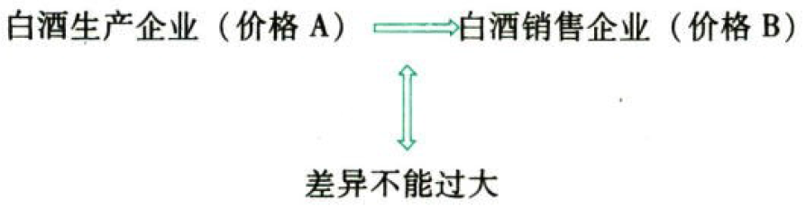
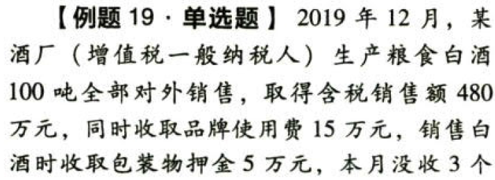
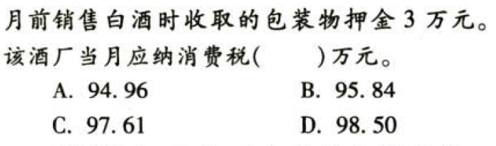

C03.消费税

# 1. 概况

在中华人民共和国境内生产、委托加工和进口`应税消费品`的单位和个人，以及国务院确定的销售`《消费税暂行条例》`规定的应税消费品的其他单位和个人，为消费税的纳税义务人。

所谓的“在中华人民共和国境内”，是指生产、委托加工和进口属于应当缴纳消费税的消费品（简称“应税消费品”）的起运地或所在地在境内。

税目体现了征税的广度，目前征收消费税的只有15个税目，有的税目还下设若干子税目。

消费税税率、计税公式概览表：

| 项目               | 计税形式             | 计税公式                                     |
|--------------------|----------------------|----------------------------------------------|
| 卷烟、白酒         | 复合计税             | 应纳税额=销售数量×单位税额+销售额×消费税税率 |
| 啤酒、黄酒、成品油 | 定额税率（从量计征） | 应纳税额=销售数量×单位税额                   |
| 其他应税消费品     | 比例税率（从价计征） | 应纳税额=销售额×消费税税率                   |

缴纳消费税的纳税人一般也是缴纳增值税的纳税人。

销售额要剔除增值税。

自产自用，没有销售额和销售数量的：

```
销售额=同类消费品售价or组成计税价格
销售数量=移送使用数量
```
符合条件的，在计算出的当期应纳消费税税款中，按生产领用量抵扣(外购、进口或委托加工收回的)应税消费品的已纳消费税税额。

# 2. 税目

## 2.1. 烟

本税目设置了三个子目：（1）卷烟；（2）雪茄烟；（3）烟丝。

| 子税目                         | 备注                | 税率             |
|--------------------------------|---------------------|------------------|
| 卷烟.生产/进口/委托加工.甲类   | 调拨价≥70元/标准条  | 56%+0.6元/标准条 |
| 卷烟.生产/进口/委托加工.乙类   | 调拨价＜70元/标准条 | 36%+0.6元/标准条 |
| 卷烟.批发环节(批发商-\>零售商) | 2015年5月10日起     | 11%+1.0元/标准条 |
| 雪茄烟                         |                     | 36%              |
| 烟丝                           |                     | 30%              |

### 2.1.1. 卷烟相关数据

卷烟采用`复合计税`的方法。

卷烟的各单位下的数量：

```
1标准箱＝250标准条；1标准条＝200支。
0.003元/支＝0.6元/标准条＝150元/标准箱
0.005元/支＝1.0元/标准条＝250元/标准箱
```
卷烟`批发环节`纳税有2个要点：

（1）环节内不征收：批发商之间销售卷烟不缴纳消费税；

（2）不能抵扣以前生产环节的消费税。

### 2.1.2. 卷烟最低计税价格的核定

自2012年1月1日起，卷烟消费税最低计税价格核定范围为卷烟生产企业在`生产环节`销售的所有牌号、规格的卷烟。

计税价格由国家税务总局按照卷烟`批发环节`销售价格扣除卷烟批发环节批发毛利核定并发布。计税价格的核定公式为：

```
某牌号、规格卷烟计税价格＝批发环节销售价格×(1－适用批发毛利率)
```
卷烟批发环节销售价格，按照税务机关采集的所有卷烟批发企业在价格采集期内销售的该牌号、规格卷烟的数量、销售额进行加权平均计算。计算公式为：

```
批发环节销售价格＝∑该牌号规格卷烟各采集点的销售额÷∑该牌号规格卷烟各采集点的销售数量
```
已经国家税务总局核定计税价格的卷烟，生产企业实际销售价格高于计税价格的，接实际销售价格确定适用税率，计算应纳税款并申报纳税；实际销售价格低于计税价格的，按计税价格确定适用税率，计算应纳税款并申报纳税。

## 2.2. 酒

本税目设置了四个子目：（1）白酒；（2）黄酒；（3）啤酒：（4）其他酒。

| 子税目    | 备注                                                                                                                                       | 税率       |
|-----------|--------------------------------------------------------------------------------------------------------------------------------------------|------------|
| 白酒      | 含配制酒                                                                                                                                   | 20%+1元/kg |
| 啤酒      | 果啤                                                                                                                                       |            |
| 啤酒.甲类 | 出厂价(含包装物和包装物押金)≥3000元/吨                                                                                                     | 250元/吨   |
| 啤酒.乙类 | 出厂价(含包装物和包装物押金)＜3000元/吨                                                                                                    | 220元/吨   |
| 黄酒      |                                                                                                                                            |            |
| 其他酒    | 葡萄酒<br/>以发酵酒为酒基，酒精度低于20度（含）的配制酒<br/>以蒸馏酒或食用酒精为酒基，具有国食健字或卫食健字文号且酒精度低于38度（含）的配制酒 | 10%        |

白酒采用`复合计税`的方法。

啤酒包装物押金`不包括`重复使用的`塑料周转箱`的押金。

葡萄酒是指以葡萄为原料，经破碎（压榨）、发酵而成的酒精度在1度（含）以上的葡萄原酒和成品酒，不含以葡萄为原料的蒸馏酒。

### 2.2.3. 白酒最低计税价格的核定

#### 2.2.3.1. 原理



如果A＜70%×B，则A为不正常价格，需要核定最低计税价格。

如果A≥70%×B，则A、B差价小，A为正常价格，不需要核定最低计税价格。

酒类产品消费税有最低计税价格的规定，增值税没有最低计税价格的规定。

白酒最低计税价格核定管理办法主要内容：

#### 2.2.3.2. 适用范围

白酒生产企业销售给销售单位的白酒，生产企业消费税计税价格＜销售单位对外销售价格（不含增值税）70%的，税务机关应核定消费税最低计税价格。

自2015年6月1日起，纳税人将(委托加工收回的白酒)销售给销售单位，消费税计税价格＜销售单位对外销售价格（不含增值税）70%的，税务机关应核定消费税最低计税价格。

白酒生产企业销售给销售单位的白酒，生产企业消费税计税价格≥销售单位对外销售价格（不含增值税）70%的，税务机关`暂不`核定消费税最低计税价格。

#### 2.2.3.3. 基本程序

白酒消费税最低计税价格由`白酒生产企业`自行申报，税务机关核定。

#### 2.2.3.4. 核定主体

主管税务机关应将白酒生产企业申报的销售给销售单位的消费税计税价格＜销售单位对外销售价格70%、年销售额`1000万元`以上的各种白酒，按照《白酒消费税最低计税价格核定申请表》规定的式样及要求，在规定的时限内逐级上报至国家税务总局。国家税务总局选择其中部分白酒核定消费税最低计税价格。

除国家税务总局已核定消费税最低计税价格的白酒外，其他需要核定消费税最低计税价格的白酒，消费税最低计税价格由各省、自治区、直辖市和计划单列市税务局核定。

#### 2.2.3.5. 核定标准

消费税最低计税价格由税务机关根据生产规模、白酒品牌、利润水平等情况在销售单位对外销售价格50%至70%范围内自行核定。其中生产规模较大，利润水平较高的企业生产的需要核定消费税最低计税价格的白酒，税务机关核价幅度原则上应选择在销售单位对外销售价时60%至70%范围内。

#### 2.2.3.6. 标准的运用

已核定最低计税价格的白酒，生产企业实际销售价格高于消费税最低计税价格的，按实际销售价格申报纳税；实际销售价格低于消费税最低计税价格的，按最低计税价格申报纳税。

#### 2.2.3.7. 标准的重新核定

已核定最低计税价格的白酒，销售单位对外销售价格持续上涨或下降时间达到3个月以上、累计上涨或下降幅度在20%（含）以上的白酒，税务机关重新核定最低计税价格。

## 2.3. 贵重首饰和珠宝玉石

本税目征收范围包括：各种`金银珠宝首饰`和经采掘、打磨、加工的各种`珠宝玉石`。

| 子税目                  | 备注                                                                                         | 税率 |
|-------------------------|----------------------------------------------------------------------------------------------|------|
| 其他.生产/进口/委托加工 | 与金、银和金基、银基、钻石、铂金无关的                                                       | 10%  |
| 金银铂钻.零售           | 金银首饰（金基、银基合金首饰，金、银和金基、银基合金的镶嵌首饰）<br/>铂金首饰<br/>钻石及钻石饰品 | 5%   |

经国务院批准，自1995年1月1日起，金银首饰消费税由生产销售环节征收`改为`零售环节征收。改在零售环节征收消费税的金银首饰仅限于（金基、银基合金首饰，金、银和金基、银基合金的镶嵌首饰）。零售环节适用税率为5%，在纳税人`零售`（金银首饰、铂金首饰、钻石及钻石饰品）时征收。其计税依据是不含增值税的销售额。

不属于上述范围的应征消费税的首饰，如镀金（银）、包金（银）首饰，以及镀金（银）、包金（银）的镶嵌首饰（简称“非金银首饰”），仍在`生产`销售环节征收消费税。

### 2.3.4. 金银首饰销售额的确定

对既销售金银首饰，又销售非金银首饰的生产、经营单位，应将两类商品划分清楚，`分别核算`销售额。凡划分不清或不能分别核算的，在生产环节销售的，一律`从高适用税率`征收消费税；在零售环节销售的，一律`按金银首饰`征收消费税。

金银首饰与其他产品组成成套消费品销售的，应按`销售额全额`征收消费税。

带料加工的金银首饰，应按`受托方`销售`同类`金银首饰的销售价格确定计税依据征收消费税。没有同类金银首饰销售价格，按照`组成计税价格`计算纳税。

纳税人采用`以旧换新（含翻新改制）方式`销售的金银首饰，应按`实际收取的`不含增值税的全部价款确定计税依据征收消费税。

## 2.4. 成品油

成品油设置了七个子目：（1）汽油；（2）柴油；（3）石脑油；（4）溶剂油；（5）润滑油；（6）航空煤油；（7）燃料油。

| 子税目   | 备注                                                                                                     | 税率 |
|----------|----------------------------------------------------------------------------------------------------------|------|
| 汽油     | 无铅汽油<br/>不含车用含铅汽油                                                                              |      |
| 柴油     | 不含符合条件的纯生物柴油                                                                                 |      |
| 润滑油   | 用原油或其他加工生产的用于内燃机、机械加工过程的润滑产品<br/>润滑脂<br/>不含变压器油、导热类油等绝缘油类产品 |      |
| 航空煤油 | 暂缓征收消费税                                                                                           |      |
| 燃料油   |                                                                                                          |      |
| 石脑油   |                                                                                                          |      |
| 溶剂油   |                                                                                                          |      |

（5）经国务院批准，从2009年1月1日起，对同时符合下列条件的`纯生物柴油`免征消费税：①生产原料中废弃的动物油和植物油用量所占比重不低于70%②生产的纯生物柴油符合国家《柴油机燃料调合生物柴油（BD100）》标准。

（6）纳税人利用`废矿物油为原料`生产的润滑油基础油、汽油、柴油等`工业油料`免征消费税政策延长至2023年10月31日。要求同时符合下列条件：①纳税人必须取得省级以上（含省级）环填保护部门颁发的《危险废物（综合）经营许可证》，且该证件上核准生产经营范例应包括“利用”或“综合经营”字样。②生产原料中废矿物油重量必须占到90%以上。产成品中必须包括润滑油基础油，且每吨废矿物油生产的润滑油基础油应不少于0.65吨。③利用废矿物油生产的产品与利用其他原料生产的产品应分别核算。（新增）

## 2.5. 小汽车

本税目设置了三个子目：（1）乘用车（不超过9座）;（2）中轻型商用客车（10-23座）；（3）超豪华小汽车。

| 子税目                   | 备注                                                   | 税率   |
|--------------------------|--------------------------------------------------------|--------|
| 乘用车.生产/进口         | 不超过9座                                              | 1%-40% |
| 中轻型商用客车.生产/进口 | 10-23座                                                | 5%     |
| 超豪华小汽车.零售        | 零售价格≥130万元（不含增值税）的乘用车和中轻型商用客车 | 10%    |

额定载客为区间值的（如8-10人），按其`区间值下限`人数确定。

电动汽车以及沙滩车、雪地车、卡丁车、高尔夫车等均不属于本税目征税范围，不征消费税。

2016年12月1日起，“小汽车”税目下增设“超豪华小汽车”子税目。

对超豪华小汽车，在生产（进口）环节按现行税率征收消费税基础上，在零售环节加征消费税，税率为10%。

一般情况下，生产超豪华小汽车的企业在出厂销售环节缴纳生产环节消费税，销售给消费者的汽车销售中心缴纳零售环节的消费税，但如果是国内汽车生产企业直接销售给消费者的超豪华小汽车，消费税税率按照生产环节税率和零售环节税率加总计算。消费税应纳税额计算公式：

```
应纳税额＝销售额×（生产环节税率＋零售环节税率）
```
## 2.6. 其他

### 2.6.5. 高档化妆品

征收范围包括高档美容、修饰类化妆品、高档护肤类化妆品和成套化妆品。

`高档`美容、修饰类化妆品和高档护肤类化妆品是指生产（进口）环节销售（完税）价格（不含增值税）在`10元／毫升（克）`或`15元／片（张）`及以上的美容、修饰类化妆品和护肤类化妆品。

不含舞台、戏剧、影视演员化妆用的上妆油、卸妆油、油影。

### 2.6.6. 木制一次性筷子

包括未经打磨、倒角的木制一次性筷子。

### 2.6.7. 实木地板

含各类规格的实木地板、实木指接地板、实木复合地板及用于装饰墙壁、天棚的侧端面为榫、槽的实木装饰板，以及未经涂饰的素板。

### 2.6.8. 鞭炮、焰火

不含体育上用的发令纸，鞭炮药引线。

### 2.6.9. 电池

范围包括：原电池、蓄电池、燃料电池、太阳能电池和其他电池。

自2015年2月1日起对电池（铅蓄电池除外）征收消费税。

电池中的免税规定：对无汞原电池、金属氢化物镍蓄电池（又称“氢镍蓄电池”或“镍氢蓄电池”）、锂原电池、锂离子蓄电池、太阳能电池、燃料电池和全钒液流电池免征消费税。

电池中的缓税规定：铅蓄电池在2015年12月31日前缓征消费税，自2016年1月1日起按4%税率征收消费锐。

### 2.6.10. 涂料

涂料是指涂于物体表面能形成具有保护、装饰或特殊性能的固态涂膜的一类液体或固体材料之总称。向2015年2月1日起对涂料征收消费税，施工状态下挥发性有机物（VolatileOrganicCompounds,VOC）含量低于420克／到（含）的涂料免征消费税。

### 2.6.11. 摩托车

取消气缸容量250毫升（不含）以下的小排量摩托车消费税。

### 2.6.12. 高尔夫球及球具

包括高尔夫球，高尔夫球忏，高尔夫球包（袋），高尔夫球杆的忏头、杆身和握把。

### 2.6.13. 高档手表

指不含增值税售价每只在10000元（含）以上的手表。

### 2.6.14. 游艇

本税目只涉及符合长度、用途等标准的机动艇。

# 3. 计税依据

## 3.7. 从价计征:star: :star: :star: 

### 3.7.15. 含增值税销售额的换算

计算消费税的销售额中如含有增值税税金时，应换算为不含增值税的销售额。换算公式为：

```
应税消费品的销售额＝含增值税的销售额（含价外费用）/(1＋增值税税率或征收率)
```
一般情况下，(从价计征消费税的销售额)与(计算增值税销项税额的销售额)是同一个数字。

### 3.7.16. 销售额的确定

#### 3.7.16.8. 销售额的基本内容

销售额是纳税人销售应税消费品向购买方收取的全部价款和价外费用，包括消费税但不包括增值税。

价外费用是指价外向购买方收取的基金、集资费、返还利润、补贴、违约金、延期付款利息、手续费、包装费、优质费、代收款项、代垫款项以及其他各种性质的价外收费。但符合特定条件的代垫运费和代为收取的政府性基金或行政事业性收费不包括在销售额内。

关联方交易要符合独立企业之间业务往来的作价原则；白酒生产企业向商业销售单位收取的“品牌使用费”应属于白酒销售价款的组成部分。

#### 3.7.16.9. 包装物的计税问题

包装物计税规则见下表：

应税消费品`连同包装物`销售的，无聊包装物是否单独计价，无论会计上如何核算，均应直接并入应税消费品的销售额中，征收消费税。

(逾期未收回的包装物不再退还or已收取一年以上)的包装物押金，应并入应税消费品的销售额中，按应税消费品的适用税率，征收消费税。

未到期且收取时间不超过一年的包装物押金，不计税。白酒、其他酒除外。

酒类生产企业销售白酒、其他酒（即啤酒、黄酒除外）收取的包装物押金，无论押金是否返还，无论会计上如何核算，均应直接并入销售额中，征收消费税。

啤酒、黄酒、成品油从量计征消费税，包装物押金只影响啤酒类别和税率的适用状况，不直接影响消费税的计算。

## 3.8. 从量计征:star: :star: :star: 

销售数量的确定：

销售应税消费品的，为应税消费品的`销售`数量。

自产自用应税消费品的，为应税消费品的`移送使用`数量。

自产自用包括纳税人将自产应税消费品用于生产非应税消费品、在建工程、管理部门、非生产机构、提供劳务、馈赠、赞助、集资、广告、样品、职工福利、奖励等方面。

委托加工应税消费品的，为纳税人`收回`的应税消费品数量。

进口应税消费品的，为海关`核定`的应税消费品进口征税数量。

黄酒、啤酒以`吨`为单位规定单位税额；成品油以`升`为单位规定单位税额；卷烟的从量计税部分是以`支`为单位规定单位税额；白酒从量计税部分是以`500克或500毫升`为单位规定单位税额。在确定计税数量时注意使用的数据单位要与固定税额的计量单位口径一致，不一致的要换算成一致的口径。

## 3.9. 计税依据的特殊规定:star: :star: :star: 

### 3.9.17. 特殊销售额/数量

（1）纳税人通过自设非独立核算门市部销售的自产应税消费品，应按门市部`对外`销售额或者销售数量征收消费税。

（2）纳税人用于(`换`取生产资料、消费资料、`抵`偿债务、`投`资人股)等方面的应税消费品，以纳税人同类应税消费品的`最高销售价格`作为计税依据计算消费税。

### 3.9.18. 消费税销售额vs增值税销售额

通常情况下，从价定率和复合计税中，用于计算从价部分消费税的销售额，与计算增值税的销售额是一致的，但有如下微妙差异：

| 情景                                                                                     | 消费税.计税依据                                | 增值税.计税依据                                                                              |
|------------------------------------------------------------------------------------------|------------------------------------------------|----------------------------------------------------------------------------------------------|
| 纳税人用于(`换`取生产资料和消费资料、`抵`偿债务、`投`资入股)等方面的自产应税消费品 | 纳税人同类应税消费品的`最高销售价格`         | 平均销售价格                                                                                 |
| 啤酒、黄酒、成品油                                                                       | 计算每吨啤酒出广价格时，应当`包括`包装物押金 | 啤酒、黄酒的包装物押金只在到期未退或收取12个月以上时并入销售额（与非酒类产品包装物押金相同） |

# 4. 应纳税额的计算

## 4.10. 生产销售环节应纳消费税的计算:star: :star: :star: 

### 4.10.19. 直接对外销售应纳消费税的计算





(480+15+5)/1.13\*0.2+100\*1000\*1/10000=98.4955752212

### 4.10.20. 自产自用应纳消费税的计算

自产自用通常指的是纳税人生产应税消费品后，不是直接用于对外销售，而是用于`连续生产`应税消费品或用于其他方面(生产非应税消费品、在建工程、管理部门、非生产机构、提供劳务、馈赠、赞助、集资、职工福利、奖励等)。

用于连续生产应税消费品的，不纳税。用于其他方面的，应当纳税。

应当纳税时，具体分以下两种情况：

第一种情况，有`同类`消费品的销售价格的，按照纳税人生产的同类消费品的不含增值税的销售价格计算纳税。

实行从价定率办法计算纳税的：

```
应纳税额＝同类消费品不含增值税的销售单价×自产自用数量×适用消费税税率
```
这里所说的“同类消费品销售价格”，是指纳税人`当月销售的同类消费品`的销售价格，如果当月同类消费品各期销售价格高低不同，应按销售数量`加权平均`计算。如果当月无销售或者当月未完结，应按照同类消费品`上月或最近月份`的销售价格计算纳税。

第二种情况，没有同类消费品销售价格的，按照`组成计税价格`计算纳税。

```
组成计税价格＝(成本＋利润＋自产自用数量×定额税率)/(1－比例税率)
＝(成本×(1＋成本利润率)＋自产自用数量×定额税率)/(1－比例税率)
```
公式中的“成本”，是指应税消费品的产品生产成本。

公式中的“利润”，是指根据应税消费品的全国平均成本利润率计算的利润。应税消费品的全国平均成本利润率由`国家税务总局`确定。

将自产应税消费品用于连续生产应税消费品以外的其他方面的消费税视同销售的规定，有一些与增值税视同销售的规定一致，如用于馈赠、赞助、集资、职工福利、奖励等，这些情况下，消费税与增值税同时作视同销售处理。

但是如果将自产应税消费品用于连续生产非应税消费品、用于非生产机构、用于不动产在建工程，这一环节需要作消费税视同销售处理，但不一定作增值税视同销售处理。例如，化妆品厂将自产高档香水精用于连续生产普通护肤品应在移送环节缴纳高档香水精的消费税，但在这一移送环节不用缴纳增值税。

## 4.11. 委托加工环节应纳消费税的计算:star: :star: :star: 

### 4.11.21. 委托加工

委托加工生产方式是指委托方提供原料和主要材料，受托方只收取加工费和代垫部分辅料的生产方式。

由受托方提供原材料or受托方先将原材料卖给委托方然后再接受加工or由受托方以委托方名义购进原材料生产的应税消费品，不论纳税人在财务上是否作销售处理，都`不得`作为委托加工应税消费品，而应当按照销售自制应税消费品缴纳消费税。

### 4.11.22. 代收代缴

为了避免应缴税款的流失，对委托加工应税消费品应纳的消费税，采取了源泉控制的管理办法。委托加工的应税消费品，由`受托方`在向委托方`交货`时代收代缴税款。但受托方为`个人`的，一律由委托方收回后在`委托方所在地`缴纳消费税。

受托方没有履行代收代缴义务的，税务机关应向委托方补征税款，对受托方处以`应代收代缴税款×[50%,
300%]`的罚款。

受托方应即时解缴税款，否则按《征管法》规定惩处。

委托加工应税消费品的消费税纳税人是委托方，不是受托方，受托方只是承担代收代缴的义务（受托方为个人的除外）。

### 4.11.23. 委托加工的应税消费品，委托方收回后

委托方以不高于受托方的`计税价格`直接出售的，不再缴纳消费税。

委托方以高于受托方的`计税价格`出售的，在计税时准予扣除受托方已代收代缴的消费税。

委托方用于`连续生产`应税消费品后销售的，在出厂环节缴纳消费税。符合抵税条件的，可按生产领用量计算抵扣已纳消费税。

### 4.11.24. 受托方代收代缴消费税的计算

委托加工的应税消费品，按照`受托方的同类消费品的销售价格`计算纳税；没有同类消费品销售价格的，按照`组成计税价格`计算纳税。

```
组成计税价格＝（材料成本＋加工费＋委托加工数量x定额税率）÷（1－比例税率）
```
这里的`组成计税价格`是要组成不含增值税但含消费税的价格。

“材料成本”是指委托方所提供加工材料的不含增值税的实际成本。如果加工合同上未如实注明材料成本的，受托方所在地主管税务机关有权核定其材料成本。

“加工费”是指受托方加工应税消费品向委托方所收取的全部费用（包括代垫辅助材料的实际成本），但不包括随加工费收取的增值税税额。

如果委托加工的应税消费品提货时受托方没有按规定代收代缴消费税，委托方要补缴税款。委托方补缴税款的依据：收回的应税消费品已经直接销售的，按不含增值税销售额（或销售量）计税；收回的应税消费品尚未销售或不能直接销售的，按`组成计税价格`计税补缴。

## 4.12. 进口应税消费品应纳税额的计算:star: :star: :star: 

进口的应税消费品，于`报关进口时`由海关代征进口环节的消费税。由进口人或其代理人向报关地海关申报纳税，自海关填发`海关进口消费税专用缴款书`之日起`15日`内缴纳税款。

```
组成计税价格＝(关税完税价格＋关税＋进口数量×消费税定额税率)/(1－消费税比例税率)
应纳税额＝组成计税价格×消费税比例税率＋进口数量×消费税定额税率
```
公式中的`关税完税价格`是指海关`核定`的关税计税价格。

`工业企业`进口环节被海关征收过消费税的应税消费品，如果用于`连续生产`应税消费品，符合抵税条件的，可按生产领用数量`抵扣`已纳的进口环节消费税。

## 4.13. 已纳消费税扣除的计算:star: :star: :star: 

### 4.13.25. 外购应税消费品已纳税额的扣除

消费税制度中设计了避免生产环节重复征收消费税的规则。

如果用外购已税消费品，连续生产应税消费品，就会出现重复征税问题。为了平衡生产环节消费税的税收负担，税法规定用外购已税消费品连续生产应税消费品，符合规定的，在对这些生产出来的应税消费品计算征税时，可以按当期生产领用数量计算准予扣除外购应税消费品已纳的消费税税款。

#### 4.13.25.10. 允许抵税的项目

（1）外购己税烟丝生产的`卷烟`

（2）从葡萄酒生产企业购进、进口葡萄酒连续生产应税葡萄酒

（3）外购已税珠宝玉石生产的（贵重首饰及珠宝玉石）

（4）以外购已税汽油、柴油、石脑油、燃料油、润滑油用于连续生产应税成品油

（5）外购已税高档化妆品生产的高档化妆品

（6）外购己税木制一次性筷子为原料生产的木制一次性筷子

（7）外购已税实木地板为原料生产的实木地板

（8）外购已税鞭炮焰火生产的鞭炮焰火

（9）外购己税杆头、抨身和握把为原料生产的高尔夫球杆

#### 4.13.25.11. 理解

（1）允许扣税的一般只涉及同一大类税目中的购入应税消费品的连续加工，不能跨税目抵扣

（2）按生产领用量抵扣，不同于增值税的购进扣税

（3）需自行计算抵扣。允许扣税的应税消费品一般是从工业企业购进的和进口的应税消费品；但从商业企业购进应税消费品连续生产应税消费品，符合抵扣条件的，也准予扣除外购应税消费品已纳消费税税款

（4）纳税人以进口、委托加工收回应税油品连续生产应税成品油，分别依据《海关进口消费税专用缴款书》《税收缴款书（代扣代收专用）》，按照现行政策规定计算扣除应税油品已纳消费税税款

（5）纳税人外购应税油品连续生产应税成品油，根据其取得的外购应税油品`增值税专用发票`开具时间来确定具体扣除金额

（6）在零售环节纳税的（金银首饰、铂金首饰、钻石及钻石饰品）不得抵扣外购珠宝玉石的已纳税款；批发环节的卷烟不得抵扣其生产环节缴纳的消费税；零售环节的超豪华小汽车不得抵扣其生产环节缴纳的消费税

#### 4.13.25.12. 抵税计算公式

```
当期准予扣除的外购应税消费品已纳税款＝当期准予扣除的外购应税消费品（当期生产领用数量）买价×外购应税消费品适用税率
当期准予扣除的外购应税消费品买价＝期初库存的外购应税消费品买价＋当期购进的应税消费品买价－期末库存的外购应税消费品的买价
```
买价是指购货发票上的销售额，不包括增值税税额，也`不包括`运费发票的费用金额。

扣税计算公式中“当期准予扣除的外购应税消费品买价”的计算目的是算出当期生产`领用量`，计算方法用的是类似会计“实地盘存制”的倒轧的方法。

#### 4.13.25.13. 关于运费

| 情形                             | 运费表现                       | 运费的消费税处理                   |
|----------------------------------|--------------------------------|------------------------------------|
| 生产销售应税消费品               | 构成价外费用的运费             | 计入计税价格计税                   |
| 生产销售应税消费品               | 代垫费用or不构成价外费用的运费 | 不计入计税价格                     |
| 委托加工应税消费品无同类销售价格 | 在委托加工合同中列明的材料运费 | 包含在组成计税价格的材料成本中计税 |
| 外购已税消费品连续生产           | 购进消费品运费发票列明的运费   | 不计入扣税的买价                   |

#### 4.13.25.14. 葡萄酒

根据《葡萄酒消费税管理办法（试行）》的规定，自2015年5月1日起，从葡萄酒生产企业购进、进口葡萄酒连续生产应税葡萄酒的，准予从葡萄酒消费税应纳税额中扣除所耗用应税葡萄酒已纳消费税税款。如本期消费税应纳税额不足抵扣的，余额留待下期抵扣。

#### 4.13.25.15. 珊珊珠

某首饰厂外购1000颗经过其他首饰厂加工的珊珊珠之后的业务如下：

| 情形                                           | 出厂销售   | 生产领用     |
|------------------------------------------------|------------|--------------|
| 生产领用600颗制作珊瑚项链                      | 10%消费税  | 可抵消费税   |
| 100颗转卖给其他首饰厂                          | 10%消费税  | 可抵消费税   |
| 生产领用300颗制作18K金镶嵌项链坠，销售给零售店 | 不纳消费税 | 不得抵消费税 |

### 4.13.26. 委托加工收回的应税消费品已纳税款的扣除

委托加工属于特殊生产环节，委托方在提取货物时已由受托方（受托方为个人的除外）代收代缴了消费税，委托方收回后用于`连续生产`成另一种应税消费品的，销售时应按新的应税消费品纳税。为了避免消费税生产环节的重复征税，税法规定部分项目已纳税款准予扣除，扣除税额按当期生产`领用量`计算。计算公式为：

```
当期准予扣除的委托加工应税消费品已纳税款＝期初库存的委托加工应税消费品已纳税款＋当期收回的委托加工应税消费品已纳税款－期末库存的委托加工应税消费品已纳税款
```
可抵税的项目，与外购应税消费品的抵扣范围基本相同。

【注意】这里注意与`外购`己税消费品继续生产应税消费品的税务处理原则联系起来复习。两种情况下都有己纳税款的抵扣，与外购应税消费品的抵扣范围相比，委托加工收回消费品连续加工的多了`摩托车`的抵扣项目，少了`葡萄酒`的抵扣项目。计算抵税时，无论外购还是委托加工收回的已税消费品，都是按当期生产领用数量计算，都用倒轧的公式计算。同样，在`零售环节`缴纳消费税的金银首饰、铂金首饰、钻石及钻石饰品也不适用抵税政策。

纳税人以外购、进口、委托加工收回的应税消费品（以下简称“外购应税消费品”）为原料`连续生产`应税消费品，准予按现行政策规定抵扣外购应税消费品已纳消费税税款。经主管税务机关核实上述外购应税消费品`未缴纳`消费税的，纳税人应将已抵扣的消费税税款，从核实当月允许抵扣的消费税中`冲减`。

## 4.14. 消费税出口退税的计算

消费税出口退税规则与增值税出口退税的规则有许多差异，基本差异如下表：

| 项目                                | 增值税出口退税     | 消费税出口退税     |
|-------------------------------------|--------------------|--------------------|
| 总政策                              | 零税率             | 免税               |
| 退税比率                            | 使用退税率计算退税 | 使用征税率计算退税 |
| 有出口经营权的生产企业.出口自产货物 | 免抵退税政策       | 免税不退税         |
| 外贸企业购进货物出口                | 免退税政策         | 免税并退税         |

纳税人直接出口的应税消费品办理免税后发生退关或国外退货复进口时已予以免税的，可暂不办理补税，待其`转为国内销售的当月`申报缴纳消费税。

### 4.14.27. 消费税退税的计税依据

出口货物的消费税应退税额的计税依据，按购进出口货物的消费税专用缴款书和海关进口消费税专用缴款书确定。

属于从价定率计征消费税的，为已征且未在内销应税消费品应纳税额中抵扣的购进出口货物金额。

属于从量定额计征消费税的，为已征且未在内销应税消费品应纳税额中抵扣的购进出口货物数量。

属于复合计征消费税的，按从价定率和从量定额的计税依据分别确定。

```
消费税应退税额＝从价定率计征消费税的退税计税依据×比例税率＋从量定额计征消费税的退税计税依据×定额税率
```
# 5. 征收管理

纳税人兼营不同税率的应税消费品，即生产销售两种或两种以上税率的应税消费品时，应当`分别核算`不同税率应税消费品的销售额或销售数量，未分别核算的，按`最高税率`征税。

纳税人将不同税率的应税消费品、应税消费品与非应税消费品组成`成套消费品`销售的，按其中`最高税率`征税。

工业企业以外的单位和个人的下列行为视为应税消费品的生产行为，按规定征收消费税：

（1）将外购的消费税作应税产品以消费税应税产品对外销售的；【倒卖】

（2）将外购的消费税低税率应税产品以高税率应税产品对外销售的。【低买高卖】

## 5.15. 纳税义务发生时间:star: 

除委托加工应税消费品的纳税义务发生时间是消费税的特有规定之外，消费税的纳税义务发生时间与增值税基本一致。

### 5.15.28. 销售

纳税人销售应税消费品，其纳税义务发生时间为：

（1）纳税人采取`赊销和分期收款`结算方式的，其纳税义务的发生时间为`书面合同约定`的收款日期的当天。书面合同没有约定收款日期或者无书面合同的，为`发出`应税消费品的当天。

（2）纳税人采取`预收货款`结算方式的，其纳税义务的发生时间为`发出`应税消费品的当天。

（3）纳税人采取`托收承付和委托银行收款`方式销售的应税消费品，其纳税义务的发生时间为`发出应税消费品并办妥托收手续`的当天。

（4）纳税人采取其他结算方式的，其纳税义务的发生时间为`收迄销售款`或者取得索取销售款凭据的当天。

### 5.15.29. 自产自用

纳税人自产自用的应税消费品，其纳税义务的发生时间为`移送使用`的当天。

### 5.15.30. 委托加工

纳税人委托加工的应税消费品，其纳税义务的发生时间为纳税人`提货`的当天。

### 5.15.31. 进口

纳税人进口的应税消费品，其纳税义务的发生时间为`报关进口`的当天。

## 5.16. 纳税期限

消费税纳税期限的有关规定与增值税的相关规定一致。

消费税的纳税期限分别为1日、3日、5日、10日、15日、1个月或者1个季度。纳税人的具体纳税期限，由主管税务机关根据纳税人应纳税额的大小分别核定；不能按照固定期限纳税的，可以按次纳税。

纳税人以1个月或者1个季度为1个纳税期的，自期满之日起`15日`内申报纳税；以1日、3日、5日、10日或者15日为1个纳税期的，自期满之日起`5日`内`预缴`税款，于次月1日起`15日`内申报纳税并结清上月应纳税款。

纳税人进口应税消费品，应当自海关填发`海关进口消费税专用缴款书`之日起`15日`内缴纳税款。

## 5.17. 纳税地点:star: :star: :star: 

纳税人`销售`的应税消费品，以及自产自用的应税消费品，除国务院财政、税务主管部门另有规定外，应当向`纳税人机构所在地或者居住地`的主管税务机关申报纳税。

纳税人到`外县（市）`销售或委托外县（市）代销自产应税消费品的，于应税消费品销售后，向`机构所在地或者居住地`主管税务机关审报纳税。

纳税人的`总、分支机构`不在同一县（市）的，应在`各自机构所在地`主管税务机关申报缴纳消费税；纳税人的总机构与分支机构不在同一县（市），但在同一省（自治区、直辖市）范围内，经省（自治区、直辖市）财政厅（局）、税务局`审批同意`，可以由总机构`汇总`向总机构所在地的主管税务机关申报纳税。

进口的应税消费品，由`进口人或者其代理人`向报关地海关申报纳税。

`卷烟批发企业`的纳税地点比彼特殊，总机构与分支机构不在同一地区的，由`总机构`申报纳税。

`委托加工`的应税消费品，除受托方为个人外，由`受托方向机构所在地或居住地`主管税务机关解缴消费税税款。

纳税人销售的应税消费品，如因质量等原因发生`退货`的，其已缴纳的消费税税款可予以`退还`。纳税人办理退税手续时，应将开具的`红字增值税发票`、`退税证明`等资料报主管税务机关`备案`。主管税务机关`核对`无误后办理退税。

# 6. 总结

End。
