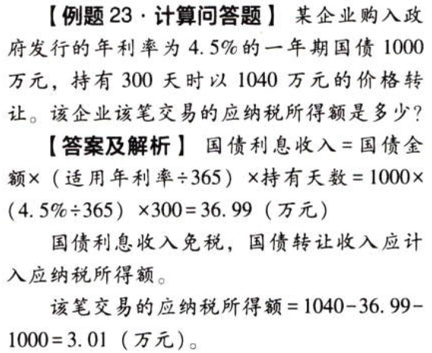

C04.企业所得税法.不征税收入和免税收入:star: :star: :star: 

## 0.1. 不征税收入和免税收入:star: :star: :star: 

### 0.1.1. 不征税收入

（1）`财政`拨款

（2）依法收取并纳入财政管理的`行政`事业性收费、政府性基金

（3）国务院规定的其他不征税收入（规定专项用途并经批准的`财政性`资金）

按照相关性原则，企业的不征税收入用于支出所形成的费用或形成的资产计算的折旧、摊销，`不得`在计算应纳税所得额时`扣除`。

### 0.1.2. 免税收入

（1）`国债和利息收入`

（2）符合条件的`居民企业之间`的股息、红利等权益性投资收益

（3）在中国境内设立`机构、场所`的非居民企业从居民企业取得与该机构、场所有`实际联系`【心属于我】的股息、红利等权益性投资收益

（2）、（3）两项所称的权益性投资收益`不包括`连续持有居民企业公开发行并`上市`流通的股票

（4）符合条件的非营利组织的收入——`非营利`组织的`非营利`收入

符合条件的非营利组织的下列收入为免税收入：

①`接受`其他单位或者个人`捐赠`的收入；

②除《中华人民共和国企业所得税法》第七条规定的财政拨款以外的`其他政府补助`收入，但不包括因政府购买服务取得的收入；

③按照`省`级以上民政、财政部门规定收取的`会费`；

④不征税，收入和免税收入孳生的银行存款利息收入：⑤财政部、国家税务总局规定的其他收入

（5）企业取得的2009年及以后年度发行的`地方政府债券`利息所得

企业取得的各项免税收入用于支出所形成的各项成本费用，`可以`在计算企业应纳税所得额时`扣除`。另有规定的除外。

### 0.1.3. 专项用途财政性资金的规定

（1）企业从`县`级以上各级人民政府财政部门及其他部门取得的应计入收入总额的`财政性`资金，凡同时符合以下条件的，可以作为`不征税收入`，在计算应纳税所得额时从收入总额中减除：

①企业能够提供规定资金专项用途的资金拨付`文件`；

②财政部门或其他拨付资金的政府部门对该资金有`专门`的资金管理办法或具体管理要求；

③企业对该资金以及以该资金发生的支出`单独`进行核算。

（2）企业将符合上述规定条件的财政性资金作不征税收入处理后，在`5年（60个月）`内未发生支出且未缴回财政部门或其他拨付资金的政府部门的部分，应计入取得该资金第六年的`应税收入总额`；计入应税收入总额的财政性资金发生的支出，`允许`在计算应纳税所得额时`扣除`。

### 0.1.4. 关于国债利息收入税务处理问题

核心规则：国债利息收入免税；国债转让收入征税。

企业到期前转让国债或者从非发行者投资购买的国债，其持有期间尚未兑付的国债利息收入，按以下公式计算确定：

```
国债利息收入＝国债金额×(适用年利率/365)×持有天数
```
| 国债                | 收入确认时间                                                               |
|---------------------|----------------------------------------------------------------------------|
| 利息收入.投资持有   | 应以国债发行时`约定`应付利息的日期，确认利息收入的实现                   |
| 利息收入.转让时     | 应在国债`转让`收入确认时确认利息收入的实现                               |
| 转让收入.未到期转让 | 应在转让国债合同、协议`生效`的日期，或者国债`移交`时确认转让收入的实现 |
| 转让收入.到期兑付   | 应在国债发行时`约定`的应付利息的时期，确认国债转让收入的实现             |


