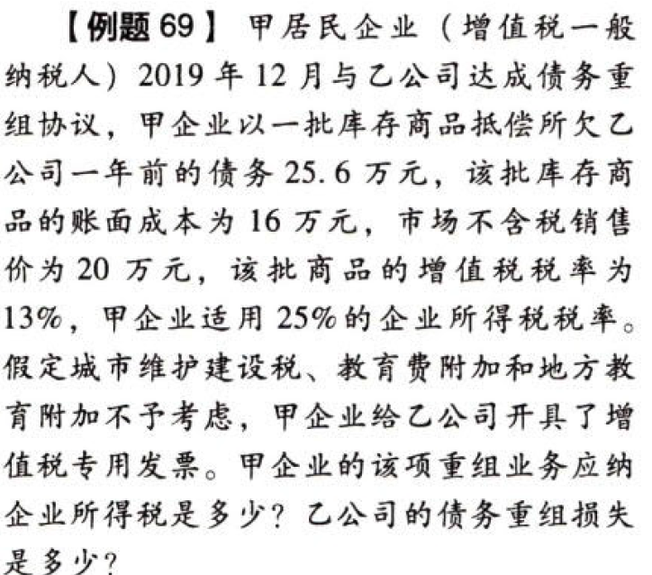
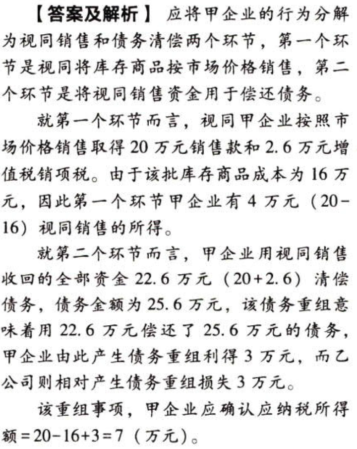
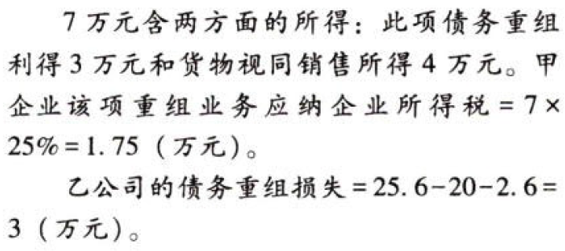
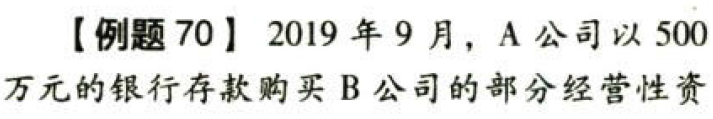
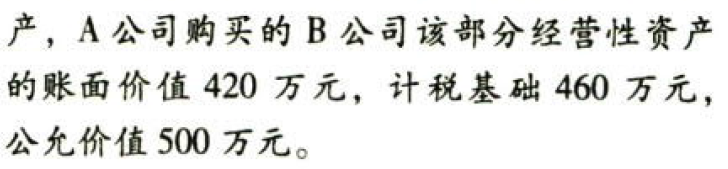
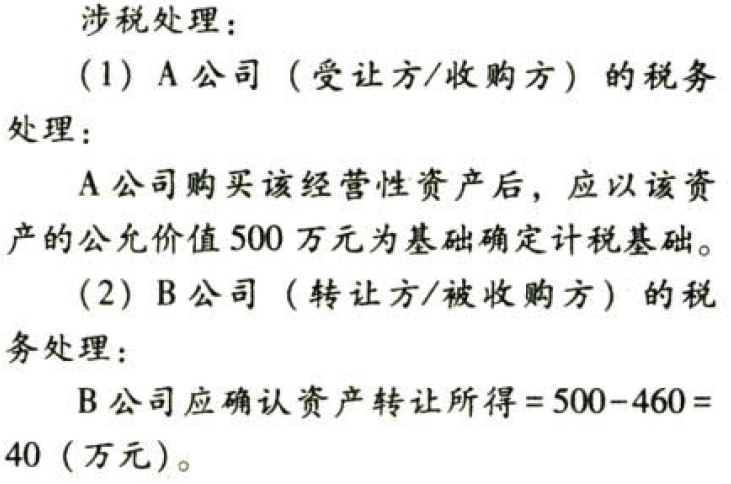

C04.企业所得税法.企业重组的一般性税务处理方法

## 0.1. 企业重组的一般性税务处理方法:star: :star: 

### 0.1.1. 清算、分配

企业由法人转变为个人独资企业、合伙企业等非法人组织，或将登记注册地转移至中华人民共和国境外（包括港澳台地区），应`视同企业进行清算、分配`，股东重新投资成立新企业。企业的全部资产以及股东投资的计税基础均应以`公允价值`为基础确定。

企业发生其他法律形式简单改变的，可直接变更税务登记，除另有规定外，有关企业所得税纳税事项（包括亏损结转、税收优惠等权益和义务）由变更后企业承继，但因住所发生变化而不符合税收优惠条件的除外。

### 0.1.2. 企业债务重组，相关交易应按以下规定处理：

以`非货币性资产`清偿债务，应当分解为`转让`相关非货币性资产、按非货币性资产公允价值`清偿`债务两项业务，确认相关资产的所得或损失。

发生`债权转股权`的，应当分解为债务`清偿`和股权`投资`两项业务，确认有关债务清偿所得或损失。

债务人应当按照支付的债务清偿额低于债务计税基础的`差额`，确认债务重组`所得`；债权人应当按照收到的债务清偿额低于债权计税基础的`差额`，确认债务重组`损失`。

债务人的相关所得税纳税事项原则上保持不变。

【解释】债务重组的方式主要包括以资产清偿债务、将债务转为资本、修改其他债务条件以及以上三种方式的组合等。

### 0.1.3. 企业股权收购、资产收购重组交易，相关交易应按以下规定处理：

被收购方应确认股权、资产转让`所得或损失`。

收购方取得股权或资产的计税基础应以`公允价值`为基础确定。

被收购企业的相关所得税事项原则上保持不变。

【提示】账面价值体现会计口径，计税基础体现税法口径。公允价值是重组交易中双方认可的符合市场交易条件的价值。企业重组的税法规定中，不提及会计口径，而使用税法口径的计税基础，按照计税基础与公允价值之间的差异是否得到认可为原则，处理重组各方的收益与成本。

### 0.1.4. 企业合并，当事各方应按下列规定处理：

合并企业应按`公允价值`确定接受被合并企业各项资产和负债的`计税基础`。

被合并企业及其股东都应按`清算`进行所得税处理。

被合并企业的亏损`不得`在合并企业结转弥补。

### 0.1.5. 企业分立，当事各方应按下列规定处理：

被分立企业对分立出去资产应按`公允价值`确认资产转让所得或损失。

分立企业应按`公允价值`确认接受资产的计税基础。

被分立企业继续存在时，其股东取得的对价应`视同`被分立企业`分配`进行处理。

被分立企业不再继续存在时，被分立企业及其股东都应按`清算`进行所得税处理。

企业分立相关企业的亏损`不得`相互结转弥补。

【归纳】企业重组的所得税处理规则强调了`计税基础`的税收责任。重组交易中的增加价值在缴纳过企业所得税后才具有计税基础的地位。企业重组的一般性税务处理规定的核心，体现出重组交易中的`增加值一定要缴纳企业所得税`。不论这个交易采用何种支付方式（股权支付或非股权支付），都要对公允价值中大于原计税基础的所得进行确认，承担税收责任，重组后企业的资产才可以按照公允价值作为新的计税基础。
