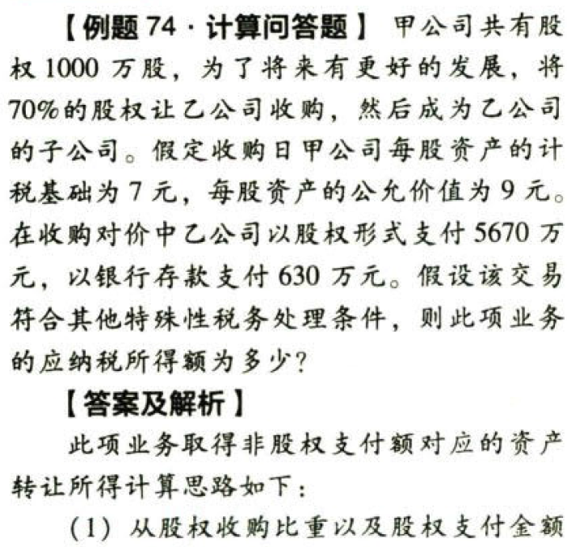
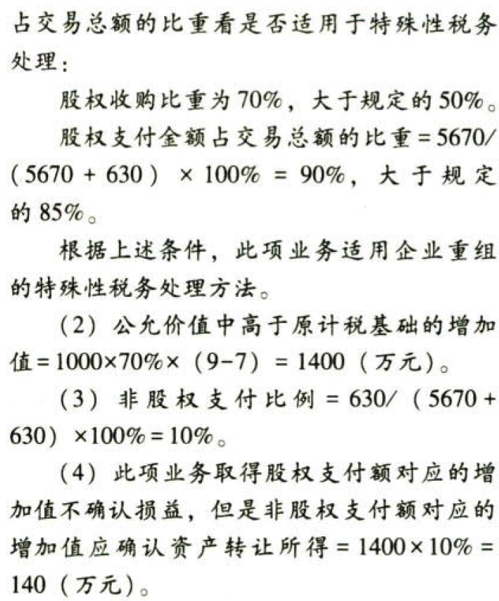

C04.企业所得税法.企业重组的特殊性税务处理方法

## 0.1. 企业重组的特殊性税务处理方法:star: :star: :star: 

### 0.1.1. 5个前提条件

企业重组`同时符合`下列条件的，适用特殊性税务处理规定：

（1）具有合理的`商业目的`，且不以减少、免除或者推迟缴纳税款为主要目的。

（2）企业重组后的连续12个月内不改变重组资产原来的实质性`经营活动`。

（3）企业重组中取得股权支付的原主要股东，在重组后连续12个月内，`不得转让`所取得的股权。

（4）被收购、合并或分立部分的资产或股权比例符合`规定的比例`。

（5）重组交易对价中涉及股权支付金额符合`规定的比例`。

企业重组符合上述5个条件的，交易各方对其交易中的`股权支付`部分，可以按以下规定进行特殊性税务处理：

### 0.1.2. 税收递延

企业债务重组确认的应纳税所得额占该企业当年应纳税所得额`50%`以上，可以在`5个纳税年度`的期间内，均匀计入各年度的应纳税所得额。

企业发生`债权转股权业`务，对债务清偿和股权投资两项业务`暂不确认`有关债务清偿所得或损失，股权投资的计税基础以`原债权`的计税基础确定。企业的其他相关所得税事项保持不变。

【解释】由于债务重组确认的损益很少形成货币资金的流入或流出，所以税法针对债务重组产生的所得，比重较大的，运用税收递延的方式，分5年计入应纳税所得额。

### 0.1.3. 股权收购

股权收购，收购企业购买的股权不低于被收购企业全部股权的`50%`，且收购企业在该股权收购发生时的股权支付金额不低于其交易支付总额的`85%`，可以选择按以下规定处理：

（1）被收购企业的股东取得收购企业股权的计税基础，以被收购股权的`原有计税基础`确定

（2）收购企业取得被收购企业股权的计税基础，以被收购股权的`原有计税基础`确定

（3）收购企业、被收购企业的原有各项资产和负债的计税基础和其他相关所得税事项保持不变

【提示】企业重组特殊性税务处理所指重组交易各方`暂不确认`股权支付部分有关资产的转让所得或损失，而`非股权支付部分`仍应在交易当期确认相应的资产转让所得或损失，并调整相应资产的计税基础。

【总结】

（1）企业重组的特殊性税务处理，依然强调了`计税基础`的税收责任。对于符合“一个目的（合理的商业目的）”，“两个比例(50%、85%）”“两个持续（12个月）”特定条件的企业重组，将其对价的股权支付部分和非股权支付部分区别处理，其股权支付部分可以暂不确认所得或损失，但非股权支付部分应确认所得或损失。

（2）重组中大于原计税基础的所得确认依然还是新的计税基础得以确认的前提条件，对于公允价值大于原计税基础的差额中，得到暂不确认为所得的交易额，亦不能成为新的计税基础的组成部分。

### 0.1.4. 资产收购

资产收购，受让企业收购的资产不低于转让企业全部资产的`50%`，且受让企业在该资产收购发生时的股权支付金额不低于其交易支付总额的`85%`，可以选择按以下规定处理：

（1）转让企业取得受让企业股权的计税基础，以被转让资产的`原有计税基础`确定

（2）受让企业取得转让企业资产的计税基础，以被转让资产的`原有计税基础`确定

### 0.1.5. 企业合并

企业合并，企业股东在该企业合并发生时取得的股权支付金额不低于其交易支付总额的`85%`，以及`同一控制`下且不需要支付对价的企业合并，可以选择按以下规定处理：

（1）合并企业接受被合并企业资产和负债的计税基础，以被合并企业的`原有计税基础`确定

（2）被合并企业合并前的相关所得税事项由合并企业`承继`

（3）可由合并企业`弥补`的被合并企业亏损的`限额`＝被合并企业`净资产`公允价值×截至合并业务发生当年年末国家发行的最长期限的`国债利率`

（4）被合并企业股东取得合并企业股权的计税基础，以其`原持有的`被合并企业股权的计税基础确定

### 0.1.6. 企业分立

企业分立，被分立企业所有股东按原持股比例取得分立企业的股权，分立企业和被分立企业均不改变原来的`实质经营活动`，且被分立企业股东在该企业分立发生时取得的股权支付金额不低于其交易支付总额的`85%`，可以选择按以下4条规定处理：

（1）分立企业接受被分立企业资产和负债的计税基础，以被分立企业的`原有计税基础`确定

（2）被分立企业已分立出去资产相应的所得税事项由分立企业`承继`

（3）被分立企业未超过法定弥补期限的亏损额可按分立资产占全部资产的`比例`进行分配，由分立企业继续弥补

（4）被分立企业的股东取得分立企业的股权（以下简称“新股”），如需部分或全部放弃原持有的被分立企业的股权（以下简称“旧股”），“新股”的计税基础应以放弃“旧股”的计税基础确定。如不需放弃“旧股”，则其取得“新股”的计税基础可从以下两种方法中选择确定：直接将“新股”的计税基础确定为`零`；或者以被分立企业分立出去的净资产占被分立企业全部净资产的`比例`先`调减`原持有的“旧股”的计税基础，再将调减的计税基础平均`分配`到“新股”上。

### 0.1.7. 确认.非股权支付.对应的所得或损失

重组交易各方按上述5项规定对交易中`股权支付`暂不确认有关资产的转让所得或损失的，其`非股权支付`仍应在交易当期确认相应的资产转让所得或损失，并调整相应资产的计税基础。

非股权支付对应的资产转让所得或损失＝（被转让资产的公允价值－被转让资产的计税基础）×（非股权支付金额÷被转让资产的公允价值）

### 0.1.8. 100%直接控制

对100%直接控制的`居民企业`之间，以及受同一或相同多家居民企业100%直接控制的居民企业之间按`账面净值`划转股权或资产，凡具有合理`商业目的`、不以减少、免除或者推迟缴纳税款为主要目的，股权或资产划转后`连续12个月`内不改变被划转股权或资产原来`实质性经营活动`，且划出方企业和划入方企业均`未在会计上确认损益`的，可以选择按以下规定进行特殊性税务处理：

（1）划出方企业和划入方企业均`不确认所得`

（2）划入方企业取得被划转股权或资产的计税基础，以被划转股权或资产的`原账面净值`确定

（3）划入方企业取得的被划转资产，应按其`原账面净值`计算折旧扣除

上述所称“对100%直接控制的居民企业之间，以及受同一或相同多家居民企业100%直接控制的居民企业之间”是指：

①100%直接控制的母子公司之间，母公司向子公司按账面净值划转其持有的股权或资产，母公司获得子公司`100%的股权支付`。母公司按增加`长期股权投资`处理，子公司按`接受投资`（包括资本公积，下同）处理。母公司获得子公司股权的计税基础以划转股权或资产的`原计税基础`确定。

②100%直接控制的母子公司之间，母公司向子公司按账面净值划转其持有的股权或资产，母公司`没有获得`任何股权或非股权支付。母公司按`冲减`实收资本（包括资本公积，下同）处理，子公司按`接受投资`处理。

③100%直接控制的母子公司之间，子公司向母公司按账面净值划转其持有的股权或资产，子公司`没有获得`任何股权或非股权支付。母公司按`收回`投资处理，或按`接受投资`处理，子公司按`冲减`实收资本处理。母公司应按被划转股权或资产的`原计税基础`，相应调减持有子公司股权的计税基础。

④受同一或相同多家母公司100%直接控制的子公司之间，在母公司主导下，一家子公司向另一家子公司按`账面净值`划转其持有的股权或资产，划出方`没有获得`任何股权或非股权支付。划出方接`冲减`所有者权益处理，划入方接`接受投资`处理。

| 100%直接控制的母子公司(居民企业)之间划转股权或资产 | 税务处理                               |
|----------------------------------------------------|----------------------------------------|
| 母转子.获股权支付                                  | 母.增加长期股权投资；子.接受投资       |
| 母转子.未获支付                                    | 母.减少实收资本；子.接受投资           |
| 子转母.未获支付                                    | 母.收回投资or接受投资；子.冲减实收资本 |
| 子转子.未获支付                                    | 划出方.冲减所有者权益；划入方.接受投资 |

### 0.1.9. 涉外交易

企业发生涉及中国境内与境外之间（包括港澳台地区）的股权和资产收购交易，除应符合上述5个前提条件外，还应`同时符合`下列条件，才可选择适用特殊性税务处理规定：

（1）居民企业以其拥有的资产或股权向其100%直接控股的非居民企业进行投资。

（2）非居民企业向与其具有100%直接控股关系的居民企业转让其拥有的另一居民企业股权。

（3）非居民企业向其100%直接控股的另一非居民企业转让其拥有的居民企业股权，没有因此造成以后该项股权转让所得预提税负变化，且转让方非居民企业向主管税务机关书面承诺在`3年`（含3年）内不转让其拥有受让方非居民企业的股权。

（4）财政部、国家税务总局核准的其他情形。

### 0.1.10. 继承优惠

在企业吸收合并中，合并后的存续企业性质及适用税收优惠的条件未发生改变的，可以继续享受合并前该企业剩余期限的税收优惠，其优惠金额按存续企业`合并前一年的应纳税所得额`（亏损计为零）计算。

在企业存续分立中，分立后的存续企业性质及适用税收优惠的条件未发生改变的，可以继续享受分立前该企业剩余期限的税收优惠，其优惠金额按该企业`分立前一年的应纳税所得额`（亏损计为零）×分立后存续企业资产占分立前该企业全部资产的比例计算。

### 0.1.11. 分步交易

企业在重组发生前后连续12个月内分步对其资产、股权进行交易，应根据实质重于形式原则将上述交易作为一项企业重组交易进行处理。

### 0.1.12. 书面备案

企业发生符合上述规定的特殊性重组条件并选择特殊性税务处理的，当事各方应在该重组业务完成当年企业所得税年度申报时，向主管税务机关提交书面备案资料，证明其符合各类特殊性重组规定的条件。企业未按规定书面备案的，一律不得按特殊重组业务进行税务处理。
