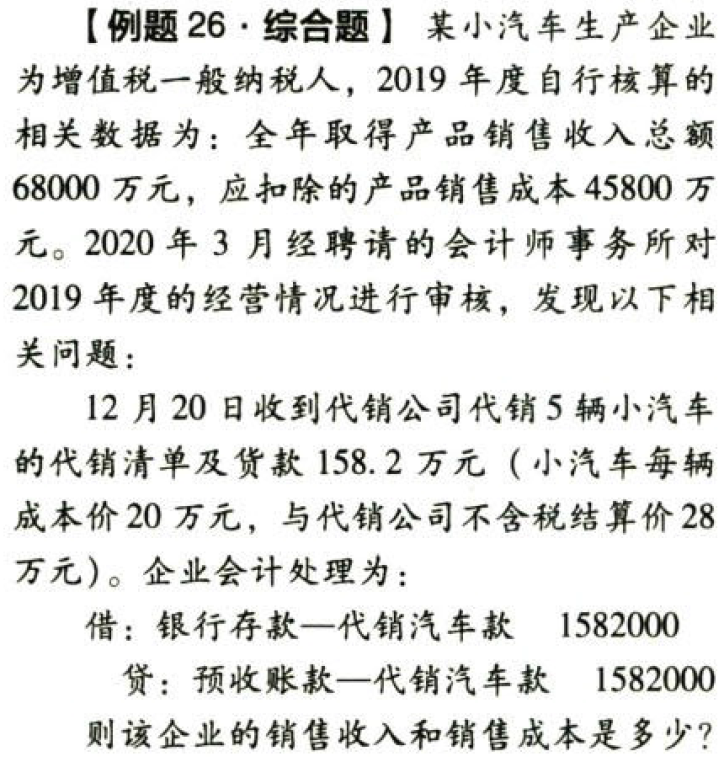
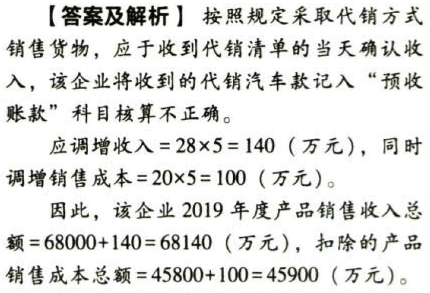

C04.企业所得税法.各项扣除.扣除项目范围

## 0.1. 税前扣除原则和范围

### 0.1.1. 扣除项目范围:star: :star: :star: 

企业实际发生的与`取得收入`有关的、合理的支出，包括成本、费用、税金、损失和其他支出，准予在计算应纳现所得额时扣除。

企业实际发生的与取得收入有关的支出，是指从性质和根源上与取得应税收入相关的支出。所谓合理的支出，是指符合生产经营活动常规，应计入资产成本或当期损益的必要与正常的支出。

企业发生的支出应区分为收益性支出和资本性支出。资本性支出不得在发生当期直接扣除，应按税收法律、行政法规的规定分期在税前扣除或计入有关资产成本。

#### 0.1.1.1. 成本

是指企业销售商品（产品、材料、下脚料、废料、废旧物资等）、提供劳务、转让固定资产、无形资产（包括技术转让）的成本。

第一个问题，销售成本要与销售收入相`匹配`。

第二个问题，与出口退税结合掌握，企业外销货物的成本要`包括`不予免征和抵扣的增值税。

#### 0.1.1.2. 费用

是指企业每一个纳税年度在生产、经营商品及提供劳务等过程中发生的销售费用、管理费用和财务费用，已计入成本的有关费用除外。

| 费用     | 重点问题                                                                                  |
|----------|-------------------------------------------------------------------------------------------|
| 销售费用 | 广告费和业务宣传费是否`超支` 销售`佣金`是否符合对象、方式、比例等`规定`           |
| 管理费用 | 业务招待费是否`超支` 保险费是否符合`标准`                                           |
| 财务费用 | 利息费用是否超过`标准`（金融机构同期间类贷款利率等） 借款费用资本化与费用化的`区分` |

#### 0.1.1.3. 税金

是指企业发生的除企业所得税和允许抵扣的增值税以外的企业实际缴纳的税金及附加。

根据财政部关于印发《增值税会计处理规定》的通知（财会〔2016〕22号）的规定，全面试行营业税改征增值税后，“营业税金及附加”科目名称调整为`“税金及附加”`科目，该科目核算企业经营活动发生的`消费税`、`城市维护建设税`、`资源税`、`教育费附加`及`房产税`、`城镇土地使用税`、`车船税`、`印花税`等相关税费；利润表中的“营业税金及附加”项目调整为`“税金及附加”`项目。

企业所得税前可扣除的税金如下表：

| 准予扣除税金的方式                               | 可扣除税金举例                                                                                                                                       |
|--------------------------------------------------|------------------------------------------------------------------------------------------------------------------------------------------------------|
| 在发生当期扣除                                   | 消费税、城市维护建设税、出口关税、资源税、土地增值税（房地产开发企业）、房产税、车船税、城镇土地使用税、印花税、环境保护税，教育费附加利地方教育附加 |
| 在发生当期计入相关资产的成本，在以后各期分摊扣除 | 车辆购置税、契税、耕地占用税、进口关税、按规定不得抵扣的增值税                                                                                       |

取得国务院、财政部、国家税务总局`没有指定专项用途`的增值税、消费税、城市维护建设税、教育费附加及地方教育附加的`返还`，应增加应纳税所得额。

增值税是价外税，其缴纳不直接影响企业所得税，但增值税（不含出口退税）返还如未指明专项用途就应增加应纳税所得额。

增值税`出口退税`不影响所得，`不增加`应纳税所得额。

#### 0.1.1.4. 损失

是指企业在生产经营活动中发生的固定资产和存货的盘亏、毁损、报废损失，转让财产损失，呆账损失，坏账损失，自然灾害等不可抗力因素造成的损失以及其他损失。

`企业发生的损失－责任人赔偿和保险赔款`后的余额，依照国务院财政、税务主管部门的规定`扣除`。

企业已经作为损失处理的资产，在以后纳税年度又全部收回或者部分收回时，应当计入当期收入。

#### 0.1.1.5. 其他支出

是指除成本、费用、税金、损失外，企业在生产经营活动中发生的与生产经营活动有关的、合理的支出。
