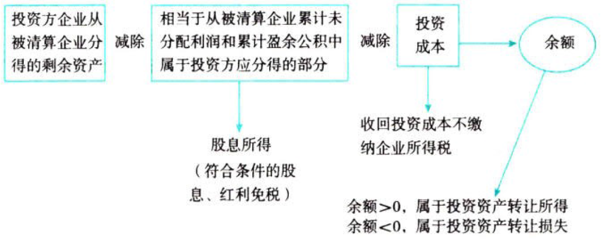

C04.企业所得税法.投资企业取得被投资企业清算所得的税务处理

## 0.1. 投资企业取得被投资企业清算所得的税务处理

投资方企业从被清算企业分得的剩余资产，“两步减除”：

投资持有收益与投资转让收益的归纳：

| 企业行为                          | 税务处理规定                             |
|-----------------------------------|------------------------------------------|
| 转让股权                          | 全部确认为转让收益，不确认权益性投资收益 |
| 撤回或减少投资 清算分得剩余资产 | 区分确认权益性投资收益和转让收益         |
