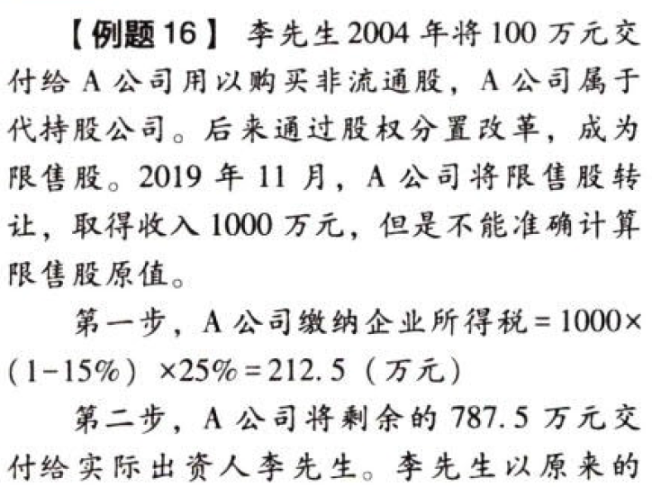
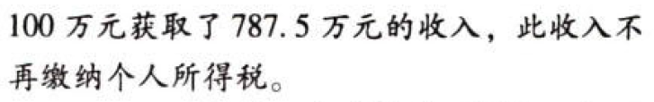
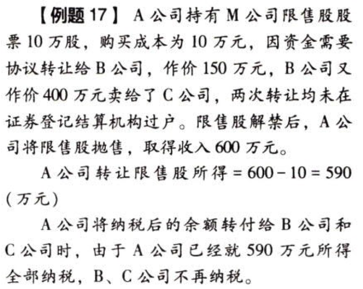

C04.企业所得税法.收入总额.企业转让上市公司限售股有关所得税处理:star: :star: :star: 

### 0.0.1. 企业转让上市公司限售股有关所得税处理:star: :star: :star: 

转让`限售股`取得收入的企业（包括事业单位、社会团体、民办非企业单位等），为企业所得税的纳税义务人。

#### 0.0.1.1. 企业转让代个人持有的限售股征税问题

因`股权分置改革`造成原由个人出资而由企业`代持有`的限售股，企业在转让时按以下规定处理：

（1）企业转让上述限售股取得的收入，应作为企业`应税收入`计算纳税。

`上述限售股转让收入－限售股原值和合理税费`后的余额为该限售股转让所得。企业未能提供完整、真实的限售股原值凭证，不能准确计算该限售股原值的，主管税务机关一律按该限售股`转让收入×15%`，核定为该限售股原值和合理税费。

依照规定完成纳税义务后的限售股转让收入余额转付给实际所有人时不再纳税。

（2）依法院判决、裁定等原因，通过证券登记结算公司，企业将其代持的个人限售股直接变更到实际所有人名下的，`不视同`转让限售股。

关于限售股：在2005年之前，中国股市处于股权分置状态，上市公司股票分为流通股和非流通股，非流通股不允许上市交易，但是可以协议转让。2005年4月，中同证监会正式启动股权分置改革试点，即通过非流通股股东向流通股股东支付对价的方式，购买“流通权”，非流通股就变为了流通股，这些非流通股转化的流通股均有一定的`限售期`，称之为股权分置改革限售股（简称“股改限售股”）。

关于代持股：股权分置改革前，由于监管限制，一些个人投资者往往通过法人企业代持的方式购买非流通股，形成“代持股”现象。

本条政策将范围限定在“股权分置改革造成的限售股”的代持股问题。如果不是因为股权分置改革原因形成的限售股，不适用该政策条款。

无法提供原值的限售股，参照`个人转让限售股政策`将限售股原值和合理税费核定为收入的15%。

对于实质是个人出资的代持股，本政策仍然将纳税人定为法律意义上的持股人，以企业作为纳税人，注重了法律形式，但同时也考虑了“代持股”的业务本质，对转付额不再征收个人所得税。

#### 0.0.1.2. 企业在限售股解禁前转让限售股征税问题

企业在限售股解禁前将其持有的限售股转让给其他企业或个人（以下简称“受让方”），其企业所得税问题按以下规定处理：

（1）企业应按减持在证券登记结算机构登记的限售股取得的全部收入，计入企业当年度应税收入计算纳税。

（2）企业持有的限售股在解禁前已签订协议转让给受让方，但未变更股权登记、仍由企业持有的，企业实际减持该限售股取得的收入，计入企业当年度应税收入计算纳税后，其余额转付给受让方的，受让方不再纳税。

解释：税法不承认没有办理法律过户的限售股交易，而是严棉按照法律形式纳税。企业在限售股解禁前多次协议转让持有的限售股股票，但是股票不在证券登记结算机构过户，按照“法律形式重于经济实质”便于征管的原则，税法只认可法律意义上的限售股转让。

