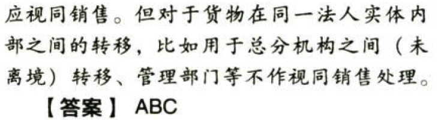

C04.企业所得税法.收入总额.特殊收入的确认:star: :star: :star: 

### 0.0.1. 特殊收入的确认:star: :star: :star: 

#### 0.0.1.1. 以分期收款方式销售货物

按照`合同约定`的收款日期确认收入的实现

#### 0.0.1.2. 采用售后回购方式销售商品

销售的商品按`售价`确认收入，回购的商品作为`购进商品`处理。有证据表明不符合销售收入确认条件的，如以销售商品方式进行融资，收到的款项应确认为`负债`，回购价格大于原售价的，`差额`应在回购期间确认为`利息费用`

#### 0.0.1.3. 以旧换新方式销售商品

销售商品应当按照`销售商品收入`确认条件确认收入，回收的商品作为`购进商品`处理

#### 0.0.1.4. 商业折扣条件销售

企业为促进商品销售而在商品价格上给予的价格扣除属于商业折扣，商品销售涉及商业折扣的，应当按照扣除商业折扣`后`的金额确定销售商品收入金额

#### 0.0.1.5. 现金折扣条件销售

债权人为鼓励债务人在烧定的期限内付款而向债务人提供的债务扣除属于现金忻扣，销售商品涉及现金折扣的，应当按扣除现金折扣`前`的金额确定销售商品收入金额，现金折扣在实际发生时作为财务费用扣除

#### 0.0.1.6. 折让方式销售

企业因售出商品的质量不合格等原因而`在售价上给予的减让`属于销售折让；企业因售出商品质量、品种不符合要求等原因而发生的`退货`属于销售退回。企业已经确认销售收入的售出商品发生销售折让和销售退回，应当在发生当期`冲减`当期销售商品`收入`

#### 0.0.1.7. 买一赠一等方式组合销售

企业以买一赠一等方式组合销售本企业商品的，不属于捐赠，应将总的销售金额按各项商品的公允价值的比例来`分摊`确认各项的销售收入

#### 0.0.1.8. 持续时间超过12个月的劳务

企业受托加工制造大型机械设备、船舶、飞机，以及从事建筑、安装、装配工程业务或者提供其他劳务等，待续时间超过`12个月`的，按照纳税年度内`完工进度`或完成的工作量确认收入的实现

#### 0.0.1.9. 采取产品分成方式取得收入

按照企业`分得产品`的日期确认收入的实现，其收入额按照产品的`公允价值`确定

#### 0.0.1.10. 非货币性资产交换以及货物、财产、劳务流出企业

企业发生非货币性资产交换，以及将货物、财产、劳务用于捐赠、偿债、赞助、集资、职工福利或利润分配等用途的，应当`视同销售`货物、转让财产和提供劳务。另有规定的除外

所得税与增值税、消费税等商品和劳务税的视同销售规则是存在差别的。将自产货物用于企业内部的行为，比如不在同一县（市）的货物移送用于销售的，增值税作视同销售处理，但是所得税不视同销售。

#### 0.0.1.11. 辨析实物捐赠过程中的收入确认问题

关于实物捐赠过程中的收入确认问题有两类：

一是受赠——接受捐赠，属于一般收入中的接受捐赠收入，是企业收入总额的一类。

二是赠出——将货物用于对外捐赠，资产移送他人，应分解为`视同销售`货物和`对外捐赠`两项行为，属于特殊收入。例如，企业通过公益性社会组织将自产的账面成本80万元，公允价值100万元（不含税）的货物捐赠给灾区，在所得税申报表上，首先要调增视同销售收入和视同销售成本，得出视同销售所得20万元。相关其他调整将在后续内容中讲述。
