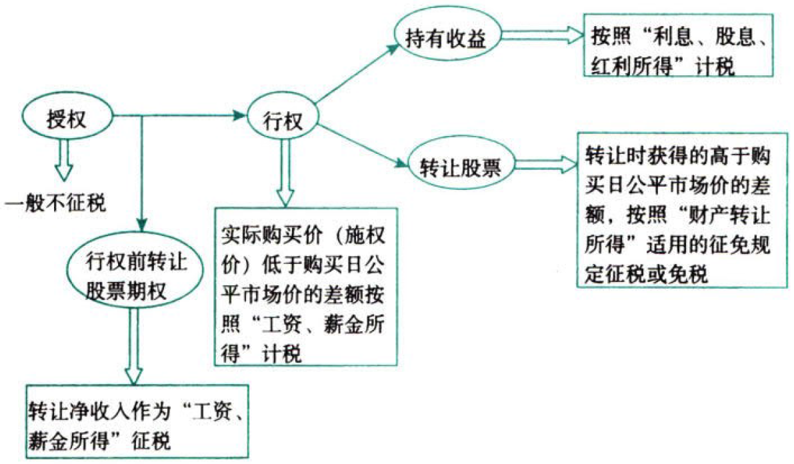
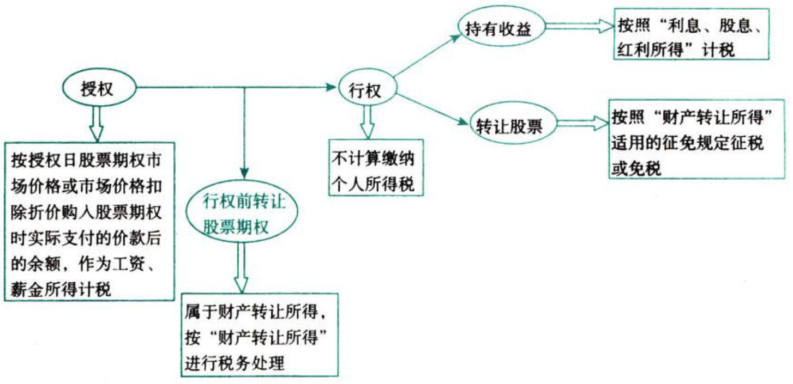

C05.个人所得税法.个人股票期权所得个人所得税的征税方法

## 0.1. 与工资薪金相关的几个重要问题的处理:star: :star: :star: 

### 0.1.1. 个人股票期权所得个人所得税的征税方法

实施股票期权计划的企业授予该企业员工的股票期权所得，应按《个人所得税法》及其实施条例有关规定征收个人所得税。

企业员工股票期权（以下简称“股票期权”）是指`上市公司`按照规定的程序授予本公司及其控股企业员工的一项权利，该权利允许被授权员工在未来时间内以某一特定价格购买本公司一定数量的股票。

【解释】

（1）股票期权的计税规则——在2021年12月31日前不计入综合所得，`全额单独`适用综合所得税率表，计算纳税。

```
应纳税额＝股权激励收入×适用税率－速算扣除数
```
居民个人`一个纳税年度`内取得两次以上（含两次）股权激励的，应合并按上述规定公式计算纳税。

（2）股权激励个人所得税有递延纳税的规定。上市公司授予个人的股票期权、限制性股票和股权奖励，经向主管税务机关`备案`，个人可自股票期权`行权`、限制性股票`解禁`或取得股权`奖励`之日起，在不超过`12个月`的期限内缴纳个人所得税。

（3）为了方便考生理解，对于股票期权的涉税情况图示如下：

第一种情况，如果取得不可公开交易的股票期权。



第二种情况，如果取得可公开交易的股票期权。


