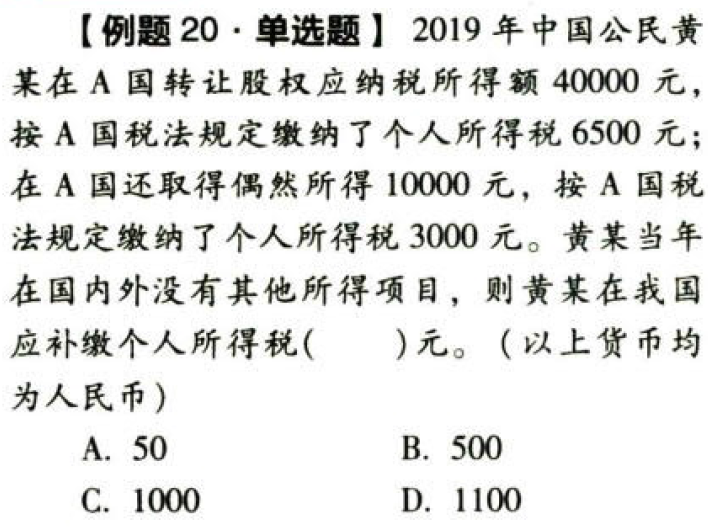
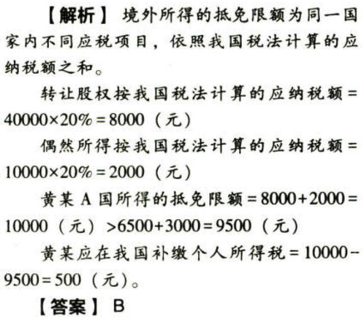

C05.个人所得税法.居民个人境外所得的税额扣除

# 1. 境外所得的税额扣除:star: :star: :star: 

税法规定，居民个人从中国境外取得的所得，准予其在应纳税额中抵免已在境外缴纳的个人所得税税额。但抵免额不得超过该纳税人`境外所得`依照`我国税法`规定计算的应纳税额。

居民个人在一个纳税年度内来源于中国境外的所得，依照所得来源国家（地区）税收法律规定在中国境外已缴纳的所得税税额允许在`抵免限额`内从其该纳税年度应纳税额中抵免。

居民个人来源于一国（地区）的综合所得、经营所得以及其他分类所得项目的应纳税额为其抵免限额。【really？】

## 1.1. 境外所得抵免限额的计算

### 1.1.1. 第一步

来源于境外的`综合所得`，与境内综合所得`合并`计算应纳税额。

来源于境外的`经营所得`，与境内经营所得`合并`计算应纳税额。

其他`分类所得`（利息股息红利所得，财产租赁所得，财产转让所得和偶然所得）不与境内所得合并，应当`分别单独`计算应纳税额。

### 1.1.2. 第二步

```
来源于一国（地区）综合所得的抵免限额＝来源于该国（地区）的综合所得收入额×中国境内和境外综合所得依照第一步计算的综合所得应纳税额÷中国境内和境外综合所得收入额合计。
来源于一国（地区）经营所得的抵免限额＝来源于该国（地区）的经营所得应纳税所得额×中国境内和境外经营所得依照第一步计算的经营所得应纳税额÷中国境内和境外经营所得应纳税所得额合计。
来源于一国（地区）其他分类所得的抵免限额＝该国（地区）的其他分类所得依照第一步计算的应纳税额。
```
### 1.1.3. 第三步

```
来源于一国（地区）所得的抵免限额＝来源于该国（地区）综合所得抵免限额＋来源于该国（地区）经营所得抵免限额＋来源于该国（地区）其他分类所得抵免限额
```
这里避免国际间重复征税的原理与企业所得税相同，但计算境外税款抵免限额的方法采用的是`分国分项计算`、`分国加总`的方法，不同于企业所得税的境外税款抵免限额可选择分国法和综合法的计算方法。




