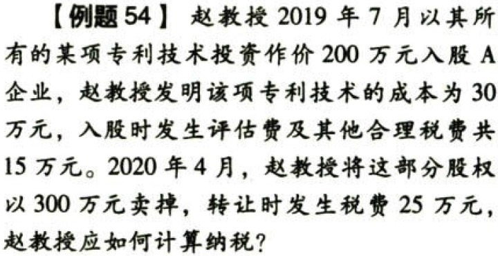
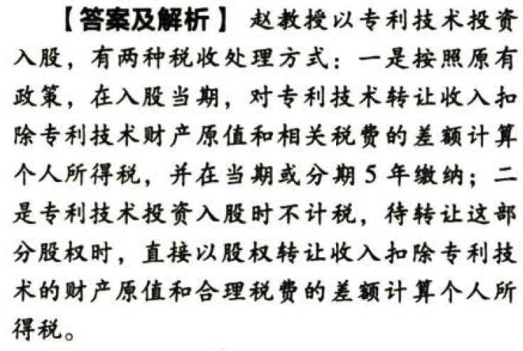
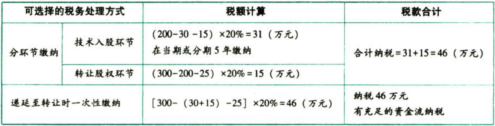

C05.个人所得税法.符合条件的非上市公司股票期权、股权期权、限制性股票和股权奖励实行递延纳税政策

## 0.1. 与投资相关的几个特殊问题的处理:star: :star: :star: 

### 0.1.1. 符合条件的非上市公司股票期权、股权期权、限制性股票和股权奖励实行递延纳税政策

非上市公司授予本公司员工的股票期权、股权期权、限制性股票和股权奖励，符合规定条件的，经向主管税务机关`备案`，可实行`递延纳税`政策，即员工在取得股权激励时可暂不纳税，递延至`转让该股权时`纳税；股权转让时，按照股权转让收入减除股权取得成本以及合理税费后的差额，适用“财产转让所得”项目，按照20%的税率计算缴纳个人所得税。

股权转让时，股票（权）期权取得成本按行权价确定，限制性股票取得成本按实际出资额确定，股权奖励取得成本为零。

企业或个人以技术成果投资入股到境内居民企业，被投资企业支付的对价全部为股票（权）的，企业或个人可选择继续按现行有关税收政策执行，也可`选择`适用`递延纳税`优惠政策。

选择技术成果投资入股递延纳税政策的，经向主管税务机关备案，投资人股当期可暂不纳税，允许递延至转让股权时，按股权转让收入减去技术成果原值和合理税费后的差额计算缴纳所得税。

