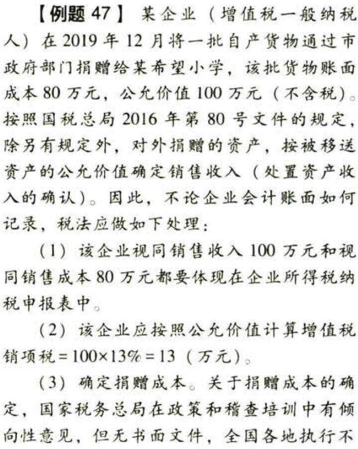
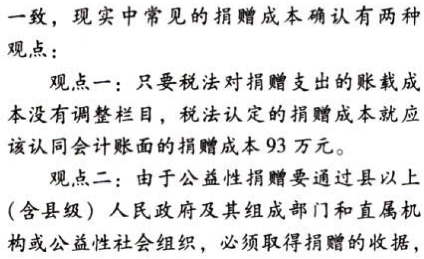
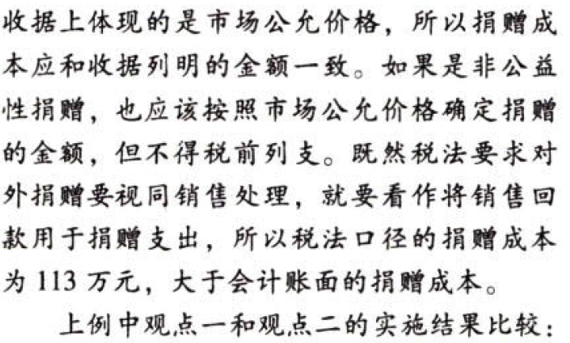
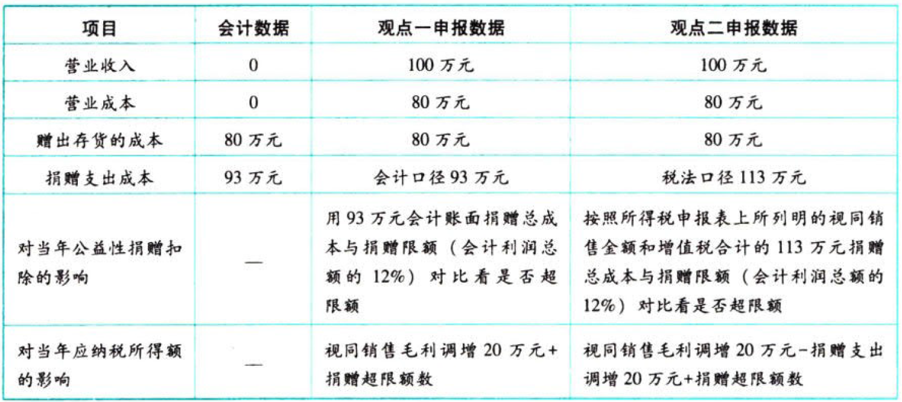

关于捐赠成本的争议：企业将货物用于捐赠，一方面要确认视同销售收入和视同销售成本；另一方面按规定衡量该捐赠是公益性捐赠还是非公益性捐赠，如果是公益性捐赠，则要考虑是否超过了规定的捐赠税前扣除限额，如果是非公益性捐赠，不得在税前扣除。这里考虑视同销售收入和视同销售成本及同时考虑捐赠税前扣除限额的思路要在做综合题的时候特别注意。

观点二与观点一计算出的视同销售毛利（20万元）是一致的，但是捐赠成本存在20万元的差异，这正是税法口径的捐赠成本与会计口径的捐赠成本之间的差异，这是因为企业所得税要求该企业视同销售收入100万元和视同销售成本80万元都要体现在企业所得税纳税申报表中，视同销售造成税法口径的捐赠成本为113万元。按照观点二，上述会计处理与税务处理不一致的地方，在年终所得税汇算清缴填申报表时应该作纳税调整处理，其中税收捐赠成本与会计捐赠成本的差异，列入申报表“其他”项目。从应纳税所得额调整结果看，观点二比观点一多调增了捐赠成本，在捐赠不超支时所计算出来的应纳税所得额，观点二低于观点一。但在捐赠均超支的前提下，采用观点二比观点一会产生多调增超支捐赠增加所得的后果。

由于上述两类方法没有文件约束，2013年CPA税法考试综合题答案用的就是观点一。但国家税务总局稽查培训对稽查人员的政策把握要求及税务师涉税服务实务考试使用的是观点二。
