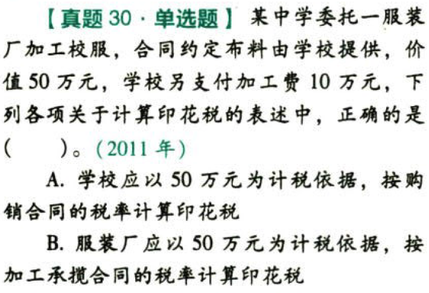
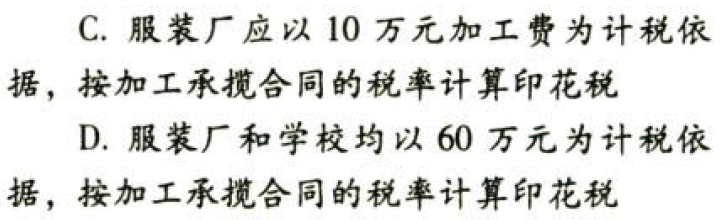
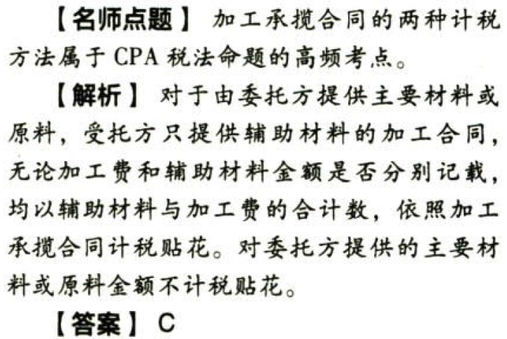
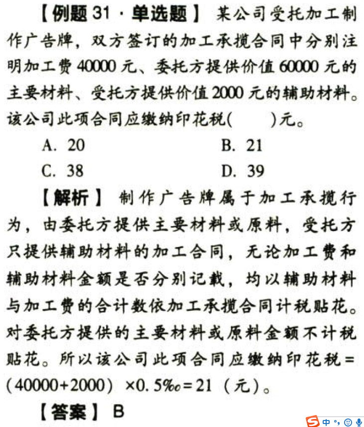
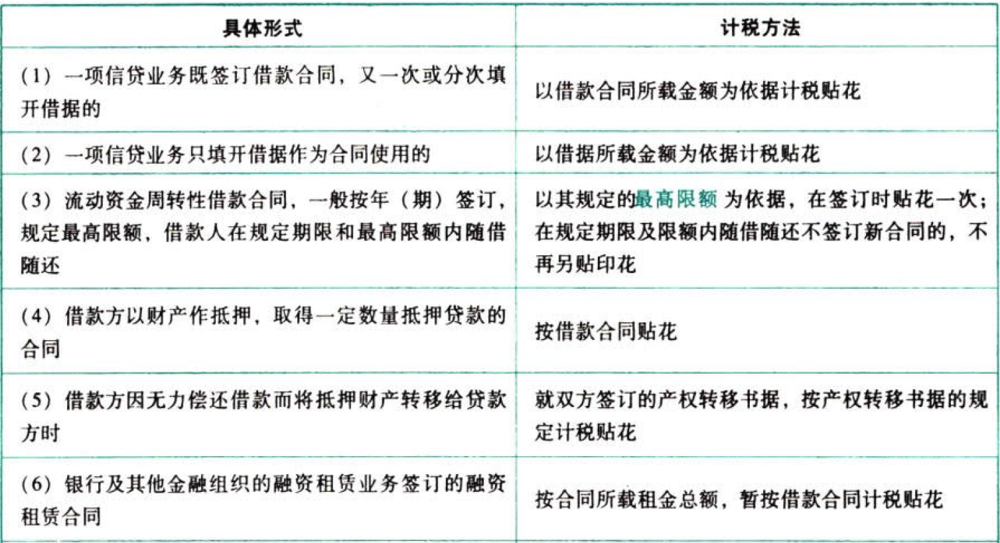
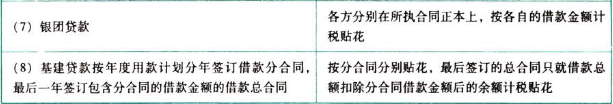

印花税

印花税是以经济活动和经济交往中，书立、领受`应税凭证`的行为为征税对象征收的一种税。

# 1. 印花税的纳税人:star: 

印花税纳税人是指在中国境内书立、使用、领受印花税法所列举的`凭证`，并应依法履行纳税义务的单位和个人。分为：立合同人、立据人、立账簿人、领受人、使用人和各类电子应税凭证的签订人。

| 纳税人   | 具体情况                                                                                                                                                                    |
|----------|-----------------------------------------------------------------------------------------------------------------------------------------------------------------------------|
| 立合同人 | 指各类合同的`当事人`，即对凭证有直接权利义务关系的单位和个人，但不包括合同的担保人、证人、鉴定人<br/>当事人的代理人有代理纳税的义务，他与纳税人负有同等的税收法律义务和责任 |
| 立据人   | 订立产权转移书据的单位和个人                                                                                                                                                |
| 立账簿人 | 设立并使用营业账簿的单位和个人                                                                                                                                              |
| 领受人   | 领取或接受并持有权利、许可证照的单位和个人                                                                                                                                  |
| 使用人   | 在国外书立、领受，在国内使用应税凭证的单位和个人                                                                                                                            |

凡由两方或两方以上当事人共同书立的应税凭证，其当事人`各方`都是印花税的纳税人，应各就其所持凭证的计税金额履行纳税义务。

纳税人以电子形式签订的各类原始凭证应按规定征收印花税。

# 2. 征税项目的具体规定:star: :star: :star: 

印花税共13个税目，包括的10类经济合同是购销合同、加工承揽合同、建设工程勘察设计合同、建筑安装工程承包合同、财产租赁合同、货物运输合同、仓储保管合同、借款合同、财产保险合同、技术合同。除合同之外的征税项目还包括产权转移书据，营业账簿，权利、许可证照。

这里所说的合同不仅指具有正规格式的合同，也包括具有合同性质的单据、凭证。这里还要注意不同合同、凭证的项目范围的差异：

（1）`出版`单位与`发行`单位之间订立的图书、报纸、期刊和音像制品的应税凭证，如订购单、订数单等属于`购销`合同。

（2）`电网`与`用户`之间签订的供用电合同不属于印花税列举征税的凭证，`不征收`印花税。

（3）印刷、广告合同属于加工承揽合同。

（4）银行及其他金融组织签订的融资租赁合同属于借款合同，不属于财产租赁合同。

（5）一般的法律、会计、审计等方面的咨询不属于技术咨询，其所立合同不贴印花。

（6）权利、许可证照仅包括“四证一照”：政府部门发给的`房屋产权证`、`工商营业执照`、`商标注册证`、`专利证`、`土地使用证`。

（7）财产所有权和版权、商标专用权、专利权、专有技术使用权等转移书据和专利实施许可合同、土地使用权出让合同、土地使用权转让合同、商品房销售合同都按照产权转移书据征收印花税。


# 3. 税率:star: 

印花税税率分比例税率和定额税率两类。除权利、许可证照及营业账簿中的其他账簿适用定额税率（按件贴花5元）之外，其他征税项目适用比例税率。最高比例税率为千分之一，最低比例税率为万分之零点五（借款合同）。最高比例税率是最低比例税率的`20倍`。

从2008年9月19日起，对证券交易印花税政策进行调整，由双边征收改为单边征收，即只对`卖出方`（或继承、赠与A股、B股股权的出让方）征收证券（股票）交易印花税，对买入方（受让方）不再征税。税率仍保持`1‰`。目前的具体规定是：在上海证券交易所、深圳证券交易所、全国中小企业股份转让系统买卖、继承、赠与优先股所书立的股权转让书据，均依书立时实际成交金额，由出让方按`1‰`的税率计算缴纳证券（股票）交易印花税。

香港市场投资者通过沪港通买卖、继承、赠与上交所上市A股，按照内地现行税制规定缴纳证券（股票）交易印花税。内地投资者通过沪港通买卖、继承、赠与联交所上市股票，按照香港特别行政区现行税法规定缴纳印花税。

按照万分之五的税率计税贴花的资金账簿不是指记载货币资金的账簿，而是指记载“实收资本”和“资本公积”资本金数额增减变化的账簿。

车间、门市部、仓库设置的不属于会计核算范围或虽属会计核算范围，但不记载金额的登记簿、统计簿、台账等，不贴印花。

# 4. 税额计算、计税金额的规定

```
应纳税额＝应税凭证计税金额（或应税凭证件数）×适用税率
```
## 4.1. 一般规定:star: :star: :star: 

| 合同/凭证            | 计税依据                                                                                                                                                                                                                                                                                                                                                                                          | 税率  |
|----------------------|---------------------------------------------------------------------------------------------------------------------------------------------------------------------------------------------------------------------------------------------------------------------------------------------------------------------------------------------------------------------------------------------------|-------|
| 借款合同             | 借款金额                                                                                                                                                                                                                                                                                                                                                                                          | 0.05‰ |
| 购销合同             | 购销金额                                                                                                                                                                                                                                                                                                                                                                                          | 0.3‰  |
| 建筑安装工程承包合同 | 承包金额                                                                                                                                                                                                                                                                                                                                                                                          | 0.3‰  |
| 技术合同             | 价款/报酬/使用费                                                                                                                                                                                                                                                                                                                                                                                  | 0.3‰  |
| 加工承揽合同         | 受托方提供原材料的加工、定做合同，凡在合同中分别记载原材料金额和加工费金额的，原材料金额和加工费金额分别按照购销合同和加工承揽合同计税贴花，未分别记载的，应就全部金额依照加工承揽合同计税贴花<br/>委托方提供原料或主要材料，受托方只提供辅助材料的加工承揽合同，核照合同中规定的受托方收取的加工费收入和提供的辅助材料金额之和依照加工承揽合同计税贴花；对委托方提供的主要材料或原料金额不计税贴花 | 0.5‰  |
| 建设工程勘察设计合同 | 收取的费用                                                                                                                                                                                                                                                                                                                                                                                        | 0.5‰  |
| 货物运输合同         | 运输费金额，但不包括所运货物的金额、装卸费用和保险费用                                                                                                                                                                                                                                                                                                                                            | 0.5‰  |
| 产权转移书据         | 所载金额                                                                                                                                                                                                                                                                                                                                                                                          | 0.5‰  |
| 财产租赁合同         | 租赁金额，如果经计算，税额越过1角不足1元的，按1元贴花                                                                                                                                                                                                                                                                                                                                             | 1‰    |
| 仓储保管合同         | 收取的仓储保管费用                                                                                                                                                                                                                                                                                                                                                                                | 1‰    |
| 财产保险合同         | 保险费金额，不包括所保财产的金额                                                                                                                                                                                                                                                                                                                                                                  | 1‰    |
| 营业账簿.记载资金    | “实收资本”与“资本公积”两项合计金额                                                                                                                                                                                                                                                                                                                                                                | 0.5‰  |
| 营业账簿.其他        | 按件计税                                                                                                                                                                                                                                                                                                                                                                                          | 5元   |
| 权利、许可证照       | 按件计税                                                                                                                                                                                                                                                                                                                                                                                          | 5元   |

### 4.1.1. 加工承揽合同的两种计税方法

视原材料、主要材料的提供方式的不同，加工承揽合同有着两种不同的印花税计税方法。这几乎是每年必考的内容。









### 4.1.2. 借款合同的计税依据

借款合同的计税依据为借款金额，针对实际借贷活动中的不同借贷形式，税法规定了不同的计税方法，这里将详细规则列表如下：





## 4.2. 特殊规定:star: :star: :star: 

（1）同一凭证记载两个或两个以上适用不同税目税率的经济事项，分别记载金额的，应分别计算税额加总贴花；未分别记载金额的，按税率高的计税贴花。

（2）未标明金额的按金额比例贴花的应税凭证，按凭证所载数量及国家牌价（无国家牌价的按市场价格）计算金额，然后按规定税率计税贴花。

（3）外币折算人民币金额的，汇率采用凭证书立当日国家外汇管理局公布的外汇牌价。

（4）应纳税额不足1角的，免纳印花税；1角以上的，分位四舍五入。

（5）签订时无法确定计税金额的合同先定额贴花5元，待结算时再按实际金额计税，补贴印花税票。

如：某单位签订技术转让合同，以受让方得到技术后3年内总的销售额的1%收取技术转让费。由于无法知晓以后3年销售额的情况，所以在签订时先定额贴花5元，待结算时再按实际金额计税，补贴印花税票。

（6）订立的合同不论是否兑现或是否按期兑现均应贴花。

（7）对有经营收入的事业单位视其预算管理方式确定贴花账簿范围。由国家财政拨付事业经费，实行差额预算管理的事业单位，其记载经营业务的账簿，按其他账簿定额贴花，不记载经营业务的账簿不贴花；经费来源实行自收自支的单位，其营业账簿，应对记载资金的账簿和其他账簿分别计税贴花。

跨区域经营的分支机构与上级单位对记载资金的账簿不必重复贴花。

（8）商品购销活动中的以货易货，交易双方既购又销，均应按其购、销合计金额计税贴花。

（9）施工单位将自己承包的建设项目分包给其他施工单位的，所签订的分包合同还要计税贴花。

（10）国内货物联运，因结算单据（合同）所列运费的结算方式不同而计税依据也不同，即起运地统一结算全程运费的，以全程运费为计税依据；分程结算运费的，应以分程运费为计税依据。

国际货运，托运方按全程运费计税。承运方为我国运输企业的按本程运费计算贴花，承运方为外国运输企业的免纳印花税。

# 5. 税收优惠:star: :star: 

（1）应税凭证的正本贴花之后，副本、抄本不再贴花（以剧本、抄本视同正本使用的除外）。

（2）无息、贴息贷款合同免税。

（3）房地产管理部门与个人签订的用于生活居住的租赁合同免税。

（4）农牧业保险合同免税。

（5）对公租房经营管理单位建造管理公租房涉及的印花税予以免征。

在其他住房项目中配套建设公租房，根据政府部门提供的相关材料，可以按照公租房建筑面积占总建筑面积的比例免征建造、管理公租房涉及的印花税。

（6）对改造安置住房经营管理单位、开发商与改造安置住房相关的印花税及购买安置住房的个人涉及的印花税自2013年7月4日起予以免征。

在商品住房等开发项目中配套建造安置住房的，依据政府部门出具的相关材料、房屋征收（拆迁）补偿协议或棚户区改造合同（协议），按改造安置住房建筑面积占总建筑面积的比例免征印花税。

（7）为减轻企业负担，鼓励投资创业，自2018年5月1日起，对按万分之五税率贴花的资金账簿`减半`征收印花税，对按件贴花五元的其他账簿`免征`印花税。

（8）对社保基金会、社保基金投资管理人管理的社保基金转让`非上市公司股权`，`免征`社保基金会、社保基金投资管理人应缴纳的印花税。

# 6. 征收管理

## 6.3. 印花税的缴纳办法:star: :star: 

印花税的缴纳办法有三种：自行贴花办法、汇贴或汇缴办法、委托代征办法。

| 缴纳办法 | 具体规定                                               |
|----------|--------------------------------------------------------|
| 自行贴花 | “三自”纳税办法，即纳税人自算、自购、自贴销的办法       |
| 汇贴     | 一份凭证应纳税额越过500元的，用缴款书或完税证代替贴花  |
| 汇缴     | 同－类凭证频繁贴花的，可按`1个月`的期限汇总缴纳      |
| 委托代征 | 税务机关委托发放或办理应税凭证的单位代为征收印花税税款 |

## 6.4. 纳税环节与纳税地点

印花税应当在书立或领受时贴花。具体是指，在合同签订时、账簿启用时和证照领受时贴花。如果合同是在国外签订，并且不便在国外贴花的，应在将合同带入境时办理贴花纳税手续。

印花税一般实行`就地纳税`。对于全国性商品物资订货会（包括展销会、交易会等）上所签订合同应纳的印花税，由纳税人回其所在地后即时办理贴花完税手续；对地方主办、不涉及省际关系的订货会、展销会上所签合同的印花税，其纳税地点由各`省`、自治区、直辖市税务局自行`确定`。

## 6.5. 违章处理的特殊规定

（1）在应纳税凭证上未贴或者少贴印花税票的或者已粘贴在应税凭证上的印花税票未注销或者未画销的，由税务机关追缴其不缴或者少缴的税款、滞纳金，并处不缴或者少缴的税款`50%以上5倍以下`的罚款。

（2）已贴用的印花税票揭下重用造成未缴或少缴印花税的，由税务机关追缴其不缴或者少缴的税款、滞纳金，并处不缴或者少缴的税款`50%以上5倍以下`的罚款；构成犯罪的，依法追究刑事责任。

（3）`伪造`印花税票的，由税务机关责令改正，处`2000元以上1万元以下`的罚款；情节严重的，处`1万元以上5万元以下`的罚款；构成犯罪的，依法追究`刑事责任`。

（4）按期汇总缴纳印花税的纳税人，超过税务机关核定的纳税期限，未缴或少缴印花税款的，由税务机关追缴其不缴或者少缴的税款、滞纳金，并处不缴或者少缴的税款`50%以上5倍以下`的罚款；情节严重的，同时`撤销`其汇缴许可证；构成犯罪的，依法追究`刑事责任`。

（5）纳税人违反以下规定的，由税务机关责令限期改正，可处以`2000元以下`的罚款；情节严重的，处`2000元以上1万元以下`的罚款：

①凡汇总缴纳印花税的凭证，应加注税务机关指定的`汇缴戳记`，编号并装订成册后，将已贴印花或者缴款书的一联粘附册后，盖章注销，保存备查

②纳税人对纳税凭证应妥善保存。凭证的保存期限，凡国家已有明确规定的，按规定办理；没有明确规定的其余凭证均应在履行完毕后保存`1年`

# 7. 总结

End。
