国际税收税务管理实务.一般反避税

## 0.1. 一般反避税:star: :star: 

### 0.1.1. 一般反避税

#### 0.1.1.1. 一般反避税概述

为规范一般反避税管理，根据税法的有关规定，国家税务总局制定《一般反避税管理办法（试行）》（以下简称《办法》），该《办法》自2015年2月1日起施行。

现阶段一般反避税办法仅针对`跨境交易或支付`，而不涉及境内交易。

（1）《企业所得税法》规定，企业实施其他不具有合理商业目的的安排而减少其应纳税收入或者所得额的，税务机关有权按照合理的方法`调整`。

下列情况不适用《办法》：

①与跨境交易或者支付无关的安排；

②涉嫌逃避缴纳税款、逃避追缴欠税、骗税、抗税以及虚开发票等税收违法行为。

（2）税收利益是指`减少`、`免除`或者`推迟`缴纳企业所得税应纳税额。

（3）避税安排具有以下特征：

①以获取税收利益为`唯一目的或者主要目的`，

②以形式符合税法规定，但与其`经济实质`不符的方式获取税收利益。

（4）税务机关应当以具有合理商业目的和经济实质的类似安排为基准，按照`实质重于形式`的原则实施特别纳税调整。调整方法包括（易出多选）：

①对安排的全部或者部分交易`重新定性`。

②在税收上`否定`交易方的存在，或者将该交易方与其他交易方`视为`同一实体。

③对相关所得、扣除、税收优惠、境外税收抵免等`重新定性`或者在交易各方间`重新分配`。

④其他合理方法。

（5）企业的安排属于转让定价、成本分摊、受控外国企业、资本弱化等其他特别纳税调整范围的，应当首先适用`其他特别纳税调整`相关规定。

《一般反避税管理办法（试行）》（GAAR）的定位是作为其他特别反避税条款的一个`兜底措施`。只有当一项避税安排不能够适用任何一项具体反避税条款时才会启用一般反避税条款。也就是说，一放反避税条款是穷尽所有其他的反避税措施后的最后手段。

#### 0.1.1.2. 一般反避税调查

（1）主管税务机关实施一般反避税调查时，应当向被调查企业送达`《税务检查通知书》`。

（2）被调查企业认为其安排不属于《一般反避税管理办法（试行）》所称避税安排的，应当自收到《税务检查通知书》之日起`60日`内提供相关资料（7项）。

（3）企业拒绝提供资料的，主管税务机关可以按照`《税收征管法》`的有关规定进行`核定`。

（4）一般反避税调查涉及向筹划方、关联方以及与关联业务调查有关的其他企业调查取证的，主管税务机关应当送达`《税务事项通知书》`。

#### 0.1.1.3. 一般反避税争议处理

（1）被调查企业对主管税务机关作出的一般反避税调整决定不服的，可以按照有关法律法规的规定申请`法律救济`。

（2）被调查企业认为我国税务机关作出的一般反避税调整，导致国际双重征税或者不符合税收协定规定征税的，可以按照税收协定及其相关规定申请启动`相互协商程序`。

### 0.1.2. 间接转让财产

国家税务总局在2015年2月3日出台`《关于非居民企业间接转让财产企业所得税若干问题的公告》`（国家税务总局公告2015年第7号），这一公告的制定和出台是一般反避税规则在`间接转让中国应税财产`交易方面的具体应用。该公告适用于`不具有合理商业目的`、`规避中国企业所得税纳税义务`的间接转让中国应税财产交易，适用于被转让的境外企业在华拥有`特定应税财产`（在华设立机构场所、在华拥有不动产或不动产公司、在华拥有权益性投资资产）的情况，不适用于`股权转让所得`与股权转让方在中国境内所设`机构、场所有实际联系`的情况。

（1）非居民企业通过实施不具有合理商业目的的安排，间接转让中国居民企业股权等财产，规避企业所得税纳税义务的，应按照`《企业所得税法》`的有关规定，`重新定性`该间接转让交易，确认为直接转让中国居民企业股权等财产。

如果一项间接转让中国应税财产交易因不具有合理商业目的被调整定性为直接转让中国应税财产交易，则按照《企业所得税法》及其实施条例和《公告》规定可以就间接转让中国应税财产所得征收企业所得税。但如果被转让境外企业股权价值来源包括中国应税财产因素和非中国应税财产因素，则需按照合理方法将转让境外企业股权所得划分为归属于中国应税财产所得和归属于非中国应税财产所得，只需就`归属于中国应税财产所得`按照《公告》调整征税。

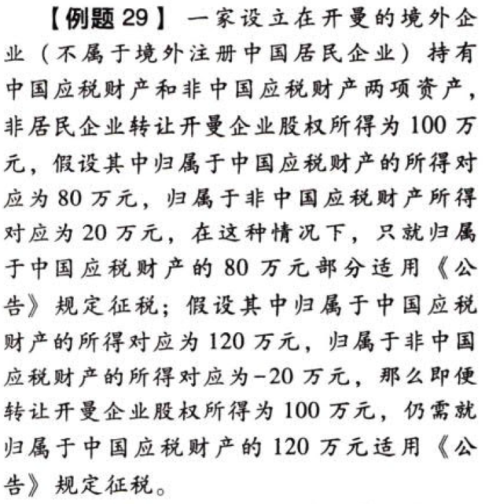

（2）判断合理商业目的，应`整体考虑`与间接转让中国应税财产交易相关的`所有安排`，结合实际情况`综合分析`。

（3）除与间接转让中国应税财产相关的整体安排符合规定情形和间接转让中国应税财产具有合理商业目的等规定情形外，与间接转让中国应税财产相关的整体安排`同时符合`以下情形的，应直接认定为`不具有合理商业目的`（4项）：

①境外企业股权`75%以上价值`直接或间接来自于中国应税财产。

②间接转让中国应税财产交易发生`前一年`内任一时点，境外企业`资产总额（不含现金）的90%`以上直接或间接由在中国境内的投资构成，或间接转让中国应税财产交易发生`前一年`内，境外企业取得`收入的90%`以上直接或间接来源于中国境内。

①②两项从被转让的境外企业股权`价值来源`以及境外企业`资产和收入构成`判断间接转让交易的主要标的为中国应税财产。

③境外企业及直接或间接持有中国应税财产的下属企业虽在所在国家（地区）登记注册，以满足法律所要求的组织形式，但实际履行的功能及承担的风险有限，`不足以`证实其具有`经济实质`。

④间接转让中国应税财产交易在境外应缴所得税`税负低于`直接转让中国应税财产交易在中国的可能税负。【存在跨国税收利益。】

（4）间接转让中国应税财产`同时符合`以下条件的，应认定为`具有合理商业目的`。

A。交易双方的股权关系具有下列情形之一：【彼此控股或同一控制】

①股权转让方直接或间接拥有股权受让方80%以上的股权；

②股权受让方直接或间接拥有股权转让方80%以上的股权；

③股权转让方和股权受让方被同一方直接或间接拥有80%以上的股权。

特殊规定：境外企业股权50%以上（不含50%）价值直接或间接来自于中国境内`不动产`的，上述第①、②、③项的持股比例应为100%。

上述间接拥有的股权按照持股链中各企业的持股比例乘积计算。

B。本次间接转让交易后可能再次发生的间接转让交易相比在未发生本次间接转让交易情况下的相同或类似间接转让交易，其中国所得税负担不会减少。【不存在跨国税收利益。】

C。股权受让方全部以本企业或与其具有控股关系的企业的`股权（不含上市企业股权）支付`股权交易对价。

（5）间接转让机构、场所财产所得按照《公告》规定应缴纳企业所得税的，应计入纳税义务发生之日所属纳税年度该机构、场所的所得，按照有关规定申报缴纳企业所得税。

当间接转让被重新定性为直接转让，则“神仙交易，小鬼纳税”。

（6）间接转让不动产所得或间接转让股权所得按照《公告》规定应缴纳企业所得税的，依照有关法律规定或者合同约定对股权转让方直接负有`支付相关款项义务`的单位或者个人为`扣缴义务人`。

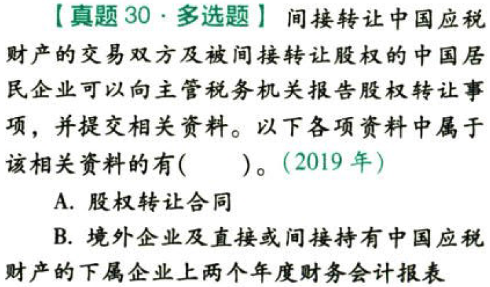

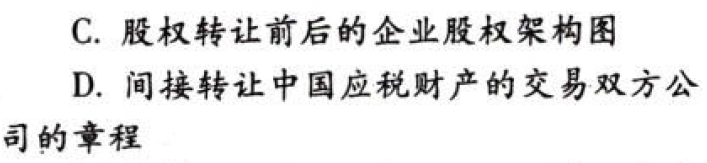

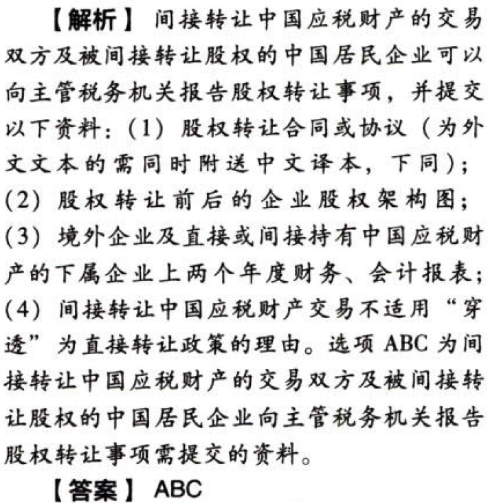

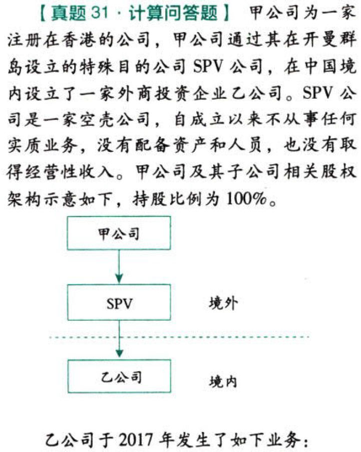

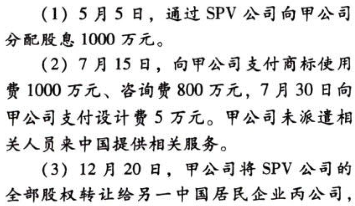

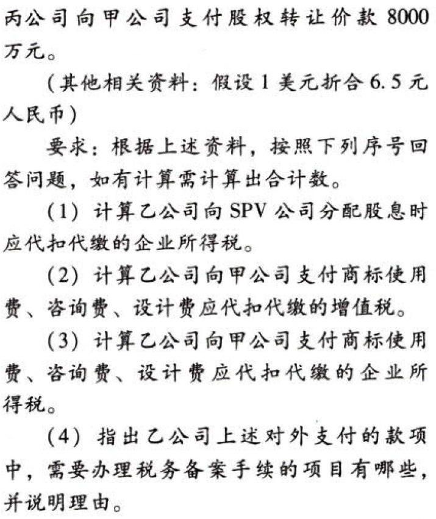

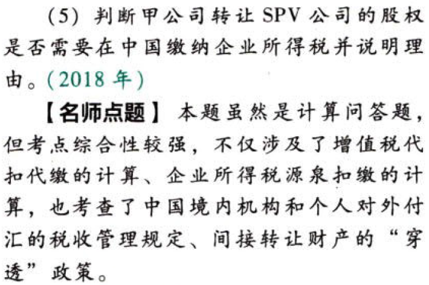

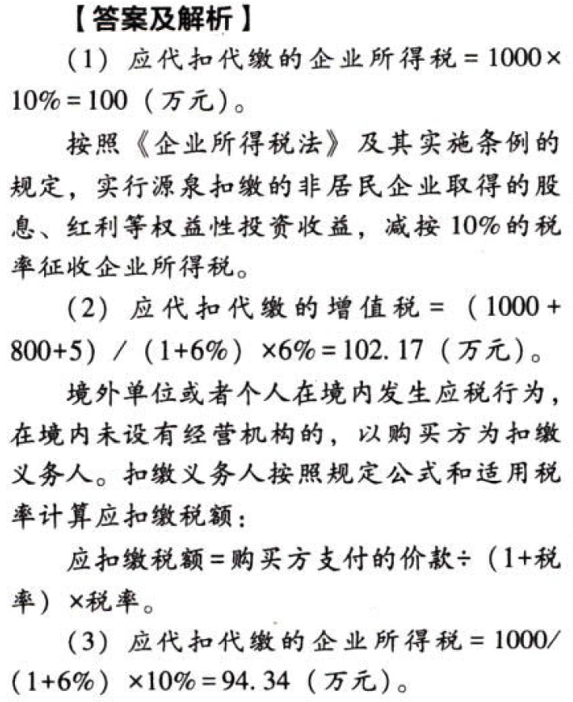

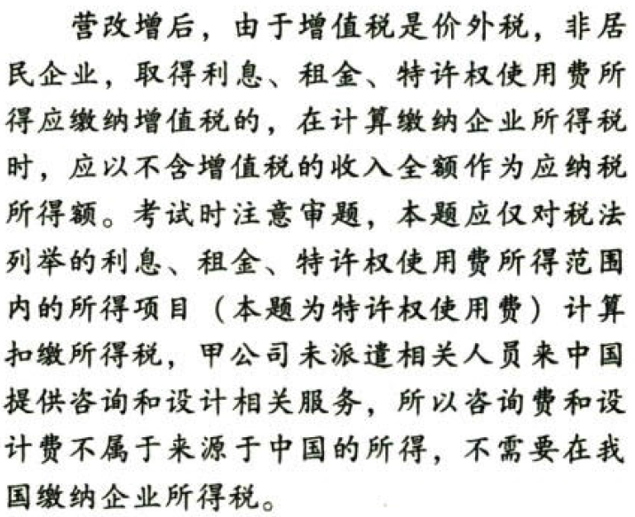

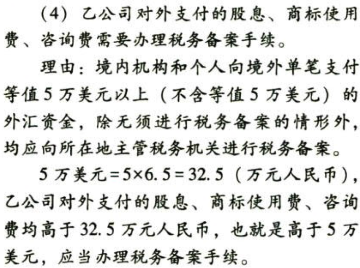

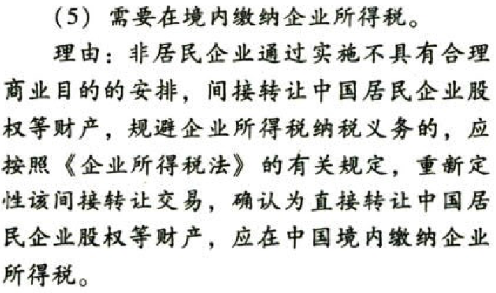
