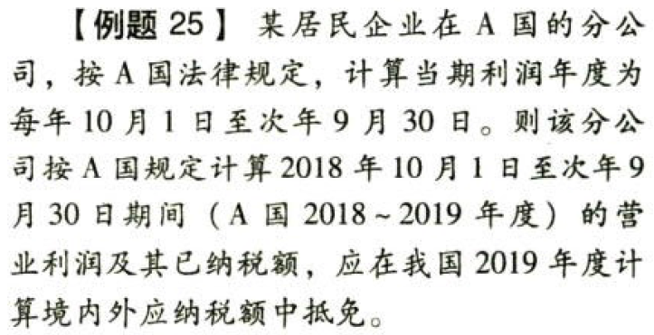
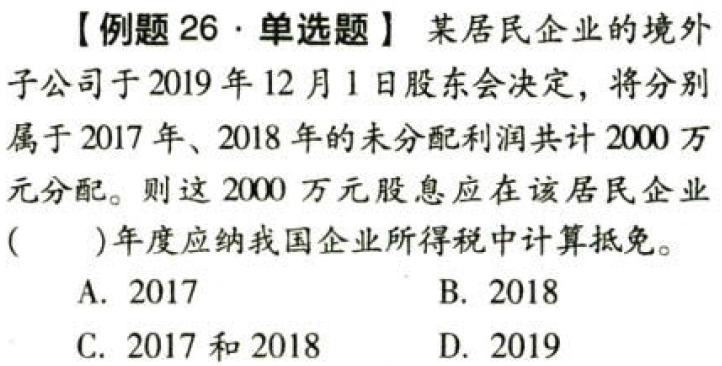
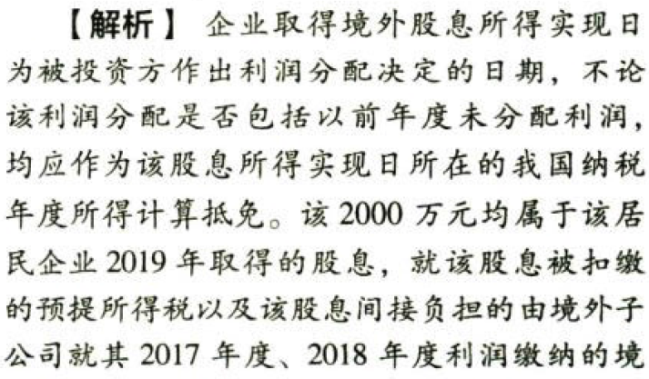

国际税收税务管理实务.境外分支机构与我国对应纳税年度的确定

## 0.1. 境外分支机构与我国对应纳税年度的确定:star: 

企业在境外投资设立不具有独立纳税地位的分支机构，其计算生产、经营所得的纳税年度与我国规定的纳税年度不一致的，与我国纳税年度当年度相对应的境外纳税年度，应为在我国有关纳税年度中任何一日结束的境外纳税年度。

企业取得境外股息所得实现日为被投资方作出利润分配决定的日期，不论该利润分配是否包括以前年度未分配利润，均应作为该股息所得实现日所在的我国纳税年度所得计算抵免。

