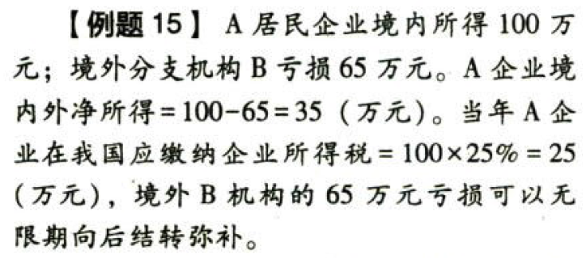
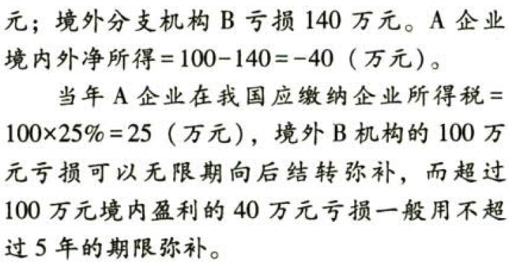
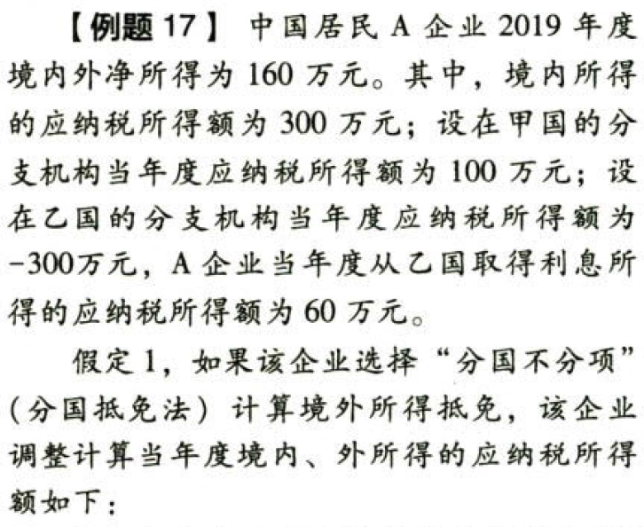
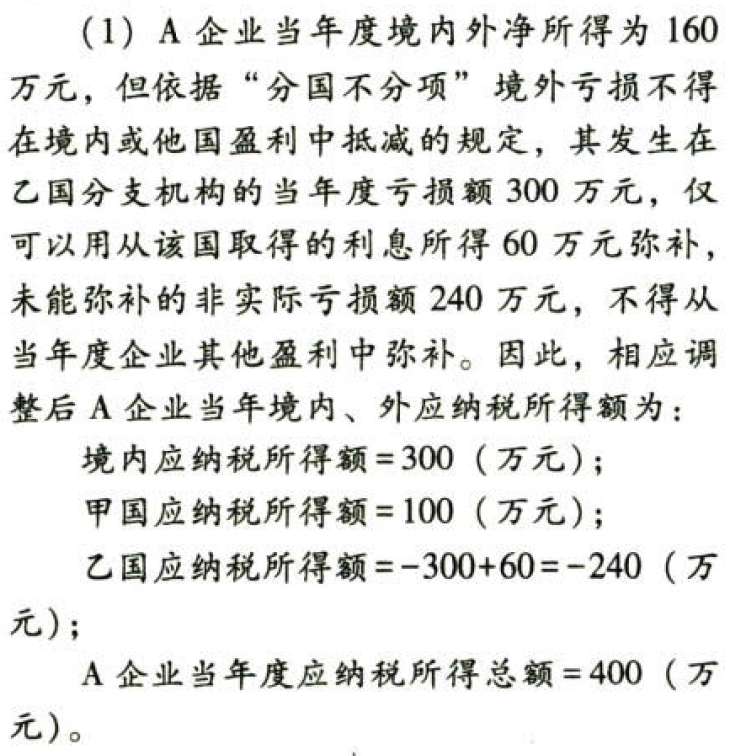
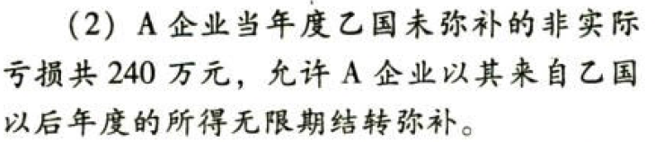
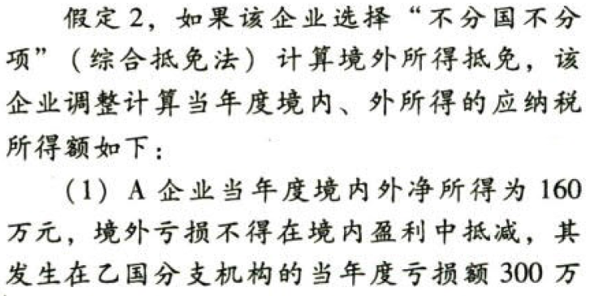
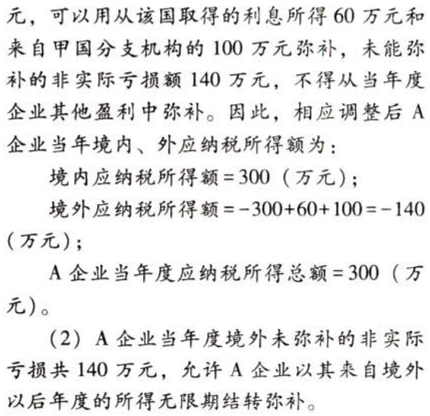

国际税收税务管理实务.境外应纳税所得额的计算

# 1. 境外所得税收管理

## 1.1. 境外应纳税所得额的计算:star: :star: 

### 1.1.1. 基本要求1

应将企业取得的来源于境外的税后净所得还原为税前所得（含税所得），按我国税法规定计算应纳税所得额。还原步骤：

（1）

```
来自境外的税后净所得=\>境外税前所得
```
或者

```
境外所得税额=\>境外税前所得
```
（2）

```
境外税前所得=\>符合我国税法规定的应纳税所得额
```
应再就计算企业应纳税所得总额时已按税法规定扣除的有关成本费用中与境外所得有关的部分进行对应调整扣除后，计算为`境外应纳税所得额`。

### 1.1.2. 基本要求2【该减的成本要减】

由于分支机构不具有分配利润职能，居民企业在境外设立不具有独立纳税地位的分支机构取得的各项境外所得，无论是否汇回中国境内，均应以`境外收入总额`扣除`与取得境外收入有关的各项合理支出`后的余额，`计入`该企业所属纳税年度的`境外应纳税所得额`。

### 1.1.3. 基本要求3

确认收入实现的时间以及对应调整费用扣除——发生时间确认及所得额完整性的确认。

#### 1.1.3.1. 收入确认的时间

一般情形同企业所得税

#### 1.1.3.2. 境外应纳税所得额的计算确定【该减的成本要减】

从境外收到的股息、红利、利息等境外投资性所得一般表现为毛所得，应对在计算企业总所得额时已做统一扣除的成本费用中与境外所得有关的部分，在该境外所得中对应调整扣除后，才能作为计算`境外税额抵免限额`的`境外应纳税所得额`。在就境外所得计算对应调整扣除的有关成本费用时，应对如下成本费用（但不限于）予以特别注意：

| 境外所得项目     | 应对应调整扣除xxx                                |
|------------------|--------------------------------------------------|
| 股息、红利       | 与境外投资业务有关的项目研究、融资成本、管理费用 |
| 利息             | 为取得该项利息而发生的相应的融资成本和相关费用   |
| 租金（融资租赁） | 融资成本                                         |
| 租金（经营租赁） | 租赁物的折旧或折耗                               |
| 特许权使用费     | 提供特许使用的资产的研发、摊销等费用             |
| 财产转让         | 被转让财产的成本净值和相关费用                   |

涉及上述所得应纳税所得额中应包含的已间接负担的税额的具体还原计算将在本节第五点进行说明。

### 1.1.4. 基本要求4确认境外所得的所属年度

企业应当根据税法的有关规定确认境外所得的实现年度及其税额抵免年度——确认境外所得的所属年度（易出客观题）。

（1）企业来源于境外的股息、红利等权益性投资收益所得，若实际收到所得的日期与境外被投资方作出利润分配决定的日期不在同一纳税年度的，应按`被投资方作出利润分配决定日`所在的纳税年度确认境外所得。

（2）企业来源于境外的利息、租金、特许权使用费、转让财产收入，若未能在合同约定的付款日期当年收到上述所得，仍应按`合同约定`付款日期所属的纳税年度确认境外所得。

（3）企业收到某一纳税年度的境外所得已纳税凭证时，凡是迟于`次年5月31日`汇算清缴终止日的，可以对该所得境外税额抵免`追溯计算`。

### 1.1.5. 基本要求5【该减的成本要减】

共同支出的合理分摊。

在计算境外所得应纳税所得额时，企业为取得境内、境外所得而在境内、境外发生的共同支出，与取得境外应税所得有关的、合理的部分，应在境内、境外［分国（地区）别，下同］应税所得之间，按照合理比例进行分摊后扣除。

可按下列一种或几种比例的综合比例分摊扣除（多选）：

（1）资产比例；（2）收入比例；（3）员工工资支出比例；（4）其他合理比例。

### 1.1.6. 基本要求6【避免资产流失】

企业的境外分支机构亏损不得由该企业境内所得弥补，也不得由该企业来源于其他国家分支机构的所得弥补——境外亏损`不得`跨国弥补（此项规定基于分国不分项原则）。

在汇总计算境外应纳税所得额时，企业在境外同一国家（地区）设立不具有独立纳税地位的分支机构，按照《企业所得税法》及实施条例的有关规定计算的亏损，不得抵减其境内或他国（地区）的应纳税所得额，但可以用同一国家（地区）其他项目或以后年度的所得按规定弥补（此项规定基于分国不分项原则）。

在企业所得税法一章规定，企业发生的亏损可用下一年度的所得弥补，下一年度的所得不足以弥补的，可以逐年延续弥补，但最长弥补期限一般企业不得超过5年；自2018年1月1日起，当年具备高新技术企业或件技型中小企业资格的企业，最长结转年限由5年延长至10年。该抵扣期限的规定适用于企业的实际亏损额，不适用于非实际亏损额。由于分国不分项下，企业境外分支机构亏损不得跨国弥补，会出现分支机构的亏损对整个企业而言属于“`非实际亏损`”的现象。

考生要注意理解非实际亏损额的概念。企业在同一纳税年度的境内外所得加总为正数的，其境外分支机构发生的亏损，由于上述结转弥补的限制而发生的未予弥补的部分（以下称为“非实际亏损额”），今后在该分支机构结转弥补时`不受期限限制`。

（1）如果企业当期境内外所得盈利额与亏损额加总后和为零或正数，则其当年度境外分支机构的非实际亏损额可无限期向后结转弥补。



（2）如果企业当期境内外所得盈利额与亏损额加总后和为负数，则以境外分支机构的亏损额超过企业盈利额部分的实际亏损额，按规定的期限进行亏损弥补，未超过企业盈利额部分的非实际亏损额仍可无限期向后结转弥补。













